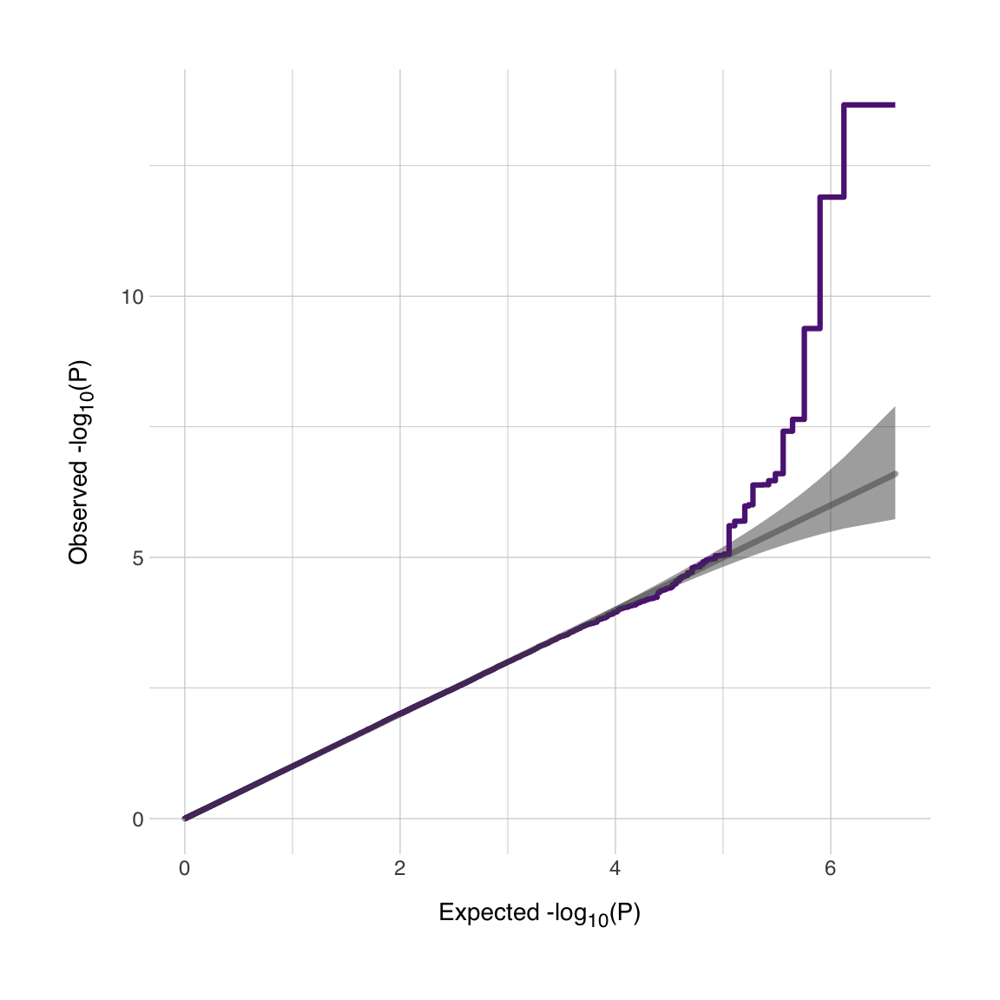

### Introduction

Whenever I show my colleagues in the genetics group my results, the first things they say are "*can you show me the Manhattan plots?*" and "*can you show me the QQ plots?*". I covered how to make Manhattan plots in ggplot before (click [here](https://danielroelfs.com/blog/how-i-create-manhattan-plots-using-ggplot/) for a link. But now I want to go through how I make QQ plots. I'm aware that there's a number of packages available that offer this funcionality, but I feel they're for the most part a bit limiting compared to making the plot yourself using the `{ggplot2}` package. Another advantage I found of creating QQ plots myself, is that I got a better understanding of how GWAS summary statistics are projected on the QQ plot, and thus I got a better understanding of QQ plots. For this process, I'll use the `{tidyverse}` package (which includes `{ggplot2}`) for all operations, and the `{normentR}` package to simulate some summary statistics and get some of my preferred color palettes. The code to calculate the confidence interval is based on code from Kamil Slowikowski (click [here](https://gist.github.com/slowkow/9041570) to go to the Gist).

``` r
library(tidyverse)
library(normentR)
```

### Import data into R

First we'll simulate some summary statistics data. We can do this using the `simulateGWAS()` function in the `{normentR}` package for now. If you have summary statistics ready, you can load it in and use that instead.

``` r
set.seed(1994)

sumstats.data <- simulateGWAS(nSNPs = 1e6, nSigCols = 1)
```

    GENERATING SIMULATED GWAS DATASET
    1. Generating random rs IDs
    2. Generate list of N per SNP
    3. Generating BETA
    4. Generating SE
    5. Generating R^2
    6. Generating T-values
    7. Generating P-values
    8. Adding significant column in chromosome 8
    DONE!

Now we have a data frame called `sumstats.data` that contains a simulated GWAS summary statistic dataset. Note that I only generated a small number of SNPs. The QQ plot can take quite a while to generate if there's a lot of SNPs in the file. QQ plots require only the p-values, but we'll keep the entire data frame because you might need this data frame at some point later on.

### Preparing the data

First I'll specify two variables, just to make the code later somehwat cleaner. I'll want to plot an area indicating the confidence interval, so we specify the confidence interval (e.g. 95%) and the number of SNPs (which is just the length of your `sumstats.data` data frame)

``` r
ci <- 0.95
nSNPs <- nrow(sumstats.data)
```

Next, we'll create a data frame that has all the data we need for the plot. We'll call that data frame `plotdata`. We initiate a data frame with four columns. The first column is the observed p-values, sorted in decreasing order, and then -log<sub>10</sub> transformed. So then the SNPs with the lowest p-values will have the highest value. These SNPs will end up on the right side of the figure later. Based on this sorted vector, we can also generate the expected vector of log transformed p-values. We could do this manually, but I much prefer to use one of the (somewhat obscure but very useful) base functions in R called `ppoints()`. This generates the sequence of probabilities based on the input vector. In this case, we'll input just the number of SNPs.
Since we also want to plot the confidence interval, we'll have to calculate the upper and lower limits of the confidence interval at each point. For this we'll use another base function called `qbeta()`. This generates the `$\beta$` distribution for a given probabily value or range of values. For the lower half of the confidence interval, we'll take 1 (i.e. the null line) minus the confidence interval (`0.95`), and since this is only half of the interval, we'll divide that value by 2. We'll do the same for the upper half of the confidence interval, except not it's 1 plus the confidence interval. For both the upper and lower interval, we'll supply a vector from 1 to the number of SNPs in your data frame and then also the reverse. These two vectors will be the parameters of the `$\beta$` distribution. The output from all the functions below are the same length as the number of SNPs in your original data frame.

``` r
plotdata <- data.frame(
  observed = -log10(sort(sumstats.data$P)),
  expected = -log10(ppoints(nSNPs)),
  clower   = -log10(qbeta(p = (1 - ci) / 2, shape1 = seq(nSNPs), shape2 = rev(seq(nSNPs)))),
  cupper   = -log10(qbeta(p = (1 + ci) / 2, shape1 = seq(nSNPs), shape2 = rev(seq(nSNPs))))
)
```

Now we have a data frame that contains all the information we need for plotting. We have the log-tranformed observed p-values, the expected values, and the lower and upper bounds for the 95% confidence interval. Before we move on to plotting, we can do another step that makes our lives later a bit easier.

Since the majority of SNPs have a p-value that's between 1 and 0.01, plotting all these individual SNPs is unnecessary. Similar to what one would do in a Manhattan plot, we're going to filter out a large number of SNPs that have a p-value higher than 0.01. Recall that the -log<sub>10</sub> of 0.01 is equal to 2, so we're going to take a subset of all expected values equal to or lower than 2. If this step causes some issue due to inflation etc., it will be easily visible in the plot later.

``` r
plotdata_sub <- plotdata |>
  filter(expected <= 2) |>
  sample_frac(0.01)

plotdata_sup <- plotdata |>
  filter(expected > 2)

plotdata_small <- rbind(plotdata_sub, plotdata_sup)
```

Now we have a much smaller data frame, which should make plotting a lot faster!

### Plotting the data

Let's make a plot! We want the expected values on the x-axis, and the observed values on the y-axis. Then I'll make a `geom_ribbon()` layer with the upper and lower bounds of the confidence interval. Now, there's a few options. Some people prefer to see individual points (with `geom_point()`), but if you have a million SNPs, I don't think this always makes much sense. You can also use `geom_line()`, but I especially prefer `geom_step()`. This function creates a line between the dots in a stepwise manner, so strictly speaking there are no diagonal lines (but with many points in a region, it may look like a diagonal line). There's two options for the direction of the `geom_step()` function, to go from a point to the next first in vertical direction and then horizontal direction is `"vh"`, the other way around is denoted by `"hv"`. What is most suitable for your plot depends on what you want to look at. I'd recommend to be conservative, so if you're trying to assess inflation, go for `"vh"`, which will visually bias the curve upwards. If you're looking only at the quality of genetic signal in your GWAS, then go for `"hv"`, since that will visually bias the curve to be closer to the null line. If you're not sure, then just go for `geom_line()`.

When there is no signal in your GWAS, the expected and observed p-values should overlap perfectly. In that case there'll be a correlation of exactly 1. This is our reference value. In order to indicate this null-line, we can add a line with an intersect at 0 and a slope of 1 with the `geom_abline()` function. This `geom_abline()` will plot a line that exceeds the observed values. I prefer to use a `geom_segment()` so that I can specify the range of the line. I select the largest expected x- and y-value and plot a line from (0,0) to that point, which will perfectly correspond to a line with a slope of 1. Your line with observed p-values should never go below this null line. If it does, it means that the p-values that you measured are higher than could reasonably be expected under a null distrbution.

We'll also add some labels (with the `expression()` and `paste()` functions). You may just copy paste this. I'll add my preferred theme (`theme_norment()`) and I added an empty `theme()` layer. I haven't added anything there yet, but perhaps if there's some unwanted behavior in the theme, you can fix it there.

``` r
qqplot <- ggplot(plotdata_small, aes(x = expected, y = observed)) +
  geom_ribbon(aes(ymax = cupper, ymin = clower), fill = "grey30", alpha = 0.5) +
  geom_step(color = norment_colors[["purple"]], size = 1.1, direction = "vh") +
  geom_segment(data = . %>% filter(expected == max(expected)), 
               aes(x = 0, xend = expected, y = 0, yend = expected),
               size = 1.25, alpha = 0.5, color = "grey30", lineend = "round") +
  labs(x = expression(paste("Expected -log"[10],"(", plain(P),")")),
       y = expression(paste("Observed -log"[10],"(", plain(P),")"))) +
  theme_norment() +
  theme()
```

    Warning: Using `size` aesthetic for lines was deprecated in ggplot2 3.4.0.
    ℹ Please use `linewidth` instead.

I must issue a small warning now, since these GWAS files can be quite large, plotting all these values can take quite some time, so if you're working on an older MacBook Air (like I am) you may have to be a little patient. Let's see what the plot looks like.

``` r
print(qqplot)
```



Now we have our QQ plot. We see that our (simulated) GWAS dataset has a very nice signal! I'd be dissapointed if it didn't since I coded it to be this way. It is possible to annotate this plot further or to add multiple lines depending on thresholds (I'm thinking about conditional/conjunctional FDR thresholds for instance). Good luck!

The code above was adapted from a script by Kamil Slowikowski (click [here](https://gist.github.com/slowkow/9041570) to go to the Gist). See also the `{qqplotr}` package for extended functionality around QQ plots in ggplot (click [here](https://github.com/aloy/qqplotr) to go to the repository).
