This is just a very quick blog post outlining some of the commonalities and differences between factor analysis (FA), principal component analysis (PCA), and independent component analysis (ICA). I was inspired to write some of this down through some confusion caused in the lab by SPSS' apparent dual usage of the term "factor analysis" and "principal components". A few of my colleagues who use SPSS showed me the following screen:

<p align="center">
  
</p>

This screen shows up when you click `Analyze` -> `Dimension Reduction` -> `Factor`, which then opens a window called "Factor Analysis: Extraction" which lets you pick "Principal components" as a method. To put the (apparent) PCA method as a sub-section of factor analysis is misleading at best, and straight-up erronious at worst. The other options for the method here is "Principal axis factoring" (which is closer to traditional factor analysis) and "Maximum likelihood" ([source for screenshot and SPSS interface](https://stats.idre.ucla.edu/spss/seminars/efa-spss/)). If you're wondering if you're the first one to be confused by SPSS' choice to present this in such a way, you're not ([link](https://stats.stackexchange.com/questions/1576/what-are-the-differences-between-factor-analysis-and-principal-component-analysi), [link](https://stats.stackexchange.com/questions/24781/interpreting-discrepancies-between-r-and-spss-with-exploratory-factor-analysis)). 

Standard disclaimer: I'm not a statistician, and I'm definitely not confident enough to go in-depth into the mathematics of the different algorithms. Instead, I'll just run three common latent variable modeling/clustering methods, and show the difference in results when applied to the same data. Where-ever I feel confident, I will also elaborate on the underlying mathematical principles and concepts. It's a short post, and I'm sure there's levels of nuance and complexity I've missed. Please let me know if you think I've committed a major oversight.

To show the methods I'll use a small dataset on cervical cancer risk factors with only 72 entries and 20 variables. This dataset I downloaded from the [UCI Machine Learning Repository](https://archive.ics.uci.edu/ml/datasets/Cervical+Cancer+Behavior+Risk#) and was based on [this paper](https://doi.org/10.1166/asl.2016.7980) by Sobar _et al_. The dataset consists of 19 risk factors for cervical cancer, and 1 outcome variable (binary outcome variable with yes/no cervical cancer).

We'll load a few packages first, `{tidyverse}` for data wrangling and visualization, `{fastICA}` to get access to an ICA algorithm, and `{patchwork}` to combine different plots into one.


```r
library(tidyverse)
library(fastICA)
library(patchwork)
```

We'll load the data into R, clean up the variable names, convert the outcome variable (`ca_cervix`) to a factor. We'll have a look at the dataset using some functions from `{skimr}`. This function will give us summary statistics and basic histograms of the different variables.


```r
data <- read_csv("sobar-72.csv") %>% 
  janitor::clean_names() %>% 
  mutate(ca_cervix = as_factor(ca_cervix))

skim_summ <- skimr::skim_with(base = skimr::sfl())
skim_summ(data)
```


Table: Data summary

|                         |     |
|:------------------------|:----|
|Name                     |data |
|Number of rows           |72   |
|Number of columns        |20   |
|_______________________  |     |
|Column type frequency:   |     |
|factor                   |1    |
|numeric                  |19   |
|________________________ |     |
|Group variables          |None |


**Variable type: factor**

|skim_variable |ordered | n_unique|top_counts   |
|:-------------|:-------|--------:|:------------|
|ca_cervix     |FALSE   |        2|0: 51, 1: 21 |


**Variable type: numeric**

|skim_variable               |  mean|   sd| p0|   p25|  p50|   p75| p100|hist  |
|:---------------------------|-----:|----:|--:|-----:|----:|-----:|----:|:-----|
|behavior_sexual_risk        |  9.67| 1.19|  2| 10.00| 10.0| 10.00|   10|▁▁▁▁▇ |
|behavior_eating             | 12.79| 2.36|  3| 11.00| 13.0| 15.00|   15|▁▁▂▅▇ |
|behavior_personal_hygine    | 11.08| 3.03|  3|  9.00| 11.0| 14.00|   15|▁▂▆▆▇ |
|intention_aggregation       |  7.90| 2.74|  2|  6.00| 10.0| 10.00|   10|▂▁▂▁▇ |
|intention_commitment        | 13.35| 2.37|  6| 11.00| 15.0| 15.00|   15|▁▁▂▁▇ |
|attitude_consistency        |  7.18| 1.52|  2|  6.00|  7.0|  8.00|   10|▁▁▃▇▂ |
|attitude_spontaneity        |  8.61| 1.52|  4|  8.00|  9.0| 10.00|   10|▁▂▁▅▇ |
|norm_significant_person     |  3.12| 1.85|  1|  1.00|  3.0|  5.00|    5|▇▁▂▁▇ |
|norm_fulfillment            |  8.49| 4.91|  3|  3.00|  7.0| 14.00|   15|▇▁▁▂▆ |
|perception_vulnerability    |  8.51| 4.28|  3|  5.00|  8.0| 13.00|   15|▇▅▅▂▇ |
|perception_severity         |  5.39| 3.40|  2|  2.00|  4.0|  9.00|   10|▇▂▁▂▅ |
|motivation_strength         | 12.65| 3.21|  3| 11.00| 14.0| 15.00|   15|▁▁▁▂▇ |
|motivation_willingness      |  9.69| 4.13|  3|  7.00| 11.0| 13.00|   15|▅▃▃▃▇ |
|social_support_emotionality |  8.10| 4.24|  3|  3.00|  9.0| 11.25|   15|▇▂▃▃▅ |
|social_support_appreciation |  6.17| 2.90|  2|  3.75|  6.5|  9.00|   10|▇▃▅▇▇ |
|social_support_instrumental | 10.38| 4.32|  3|  6.75| 12.0| 14.25|   15|▅▂▂▃▇ |
|empowerment_knowledge       | 10.54| 4.37|  3|  7.00| 12.0| 15.00|   15|▃▁▂▂▇ |
|empowerment_abilities       |  9.32| 4.18|  3|  5.00| 10.0| 13.00|   15|▇▃▅▃▇ |
|empowerment_desires         | 10.28| 4.48|  3|  6.75| 11.0| 15.00|   15|▅▁▃▃▇ |

Now let's only select the variables containing the risk factors (called features from here on). We'll also scale all the features to have a mean of 0 and a standard deviation of 1 using the `scale()` function. We can check what the new variable looks like using the `summary()` function.


```r
data_features <- data %>% 
  select(-ca_cervix) %>% 
  mutate(across(everything(), ~ scale(.x)))

summary(data_features$attitude_consistency)
```

```
##        V1         
##  Min.   :-3.4019  
##  1st Qu.:-0.7752  
##  Median :-0.1186  
##  Mean   : 0.0000  
##  3rd Qu.: 0.5381  
##  Max.   : 1.8514
```

So now we have a data frame with 72 entries and 19 normalized columns, each representing a feature that may or may not predict cervical cancer. We can create a correlation matrix to visualize the degree of correlation between the different features. For this we simply run `cor()` on the data frame with the features, transform the output to a data frame in long format and then visualize it using `ggplot()` and `geom_tile()`.


```r
cor(data_features) %>% 
  as_tibble() %>% 
  mutate(feature_y = names(.)) %>% 
  pivot_longer(cols = -feature_y, names_to = "feature_x", values_to = "correlation") %>% 
  mutate(feature_y = fct_rev(feature_y)) %>% 
  ggplot(aes(x = feature_x, y = feature_y, fill = correlation)) + 
  geom_tile() + 
  labs(x = NULL,
       y = NULL) +
  scico::scale_fill_scico(palette = "berlin", limits = c(-1,1)) + 
  coord_fixed() + 
  theme(axis.text.x = element_text(hjust = 1, angle = 30))
```

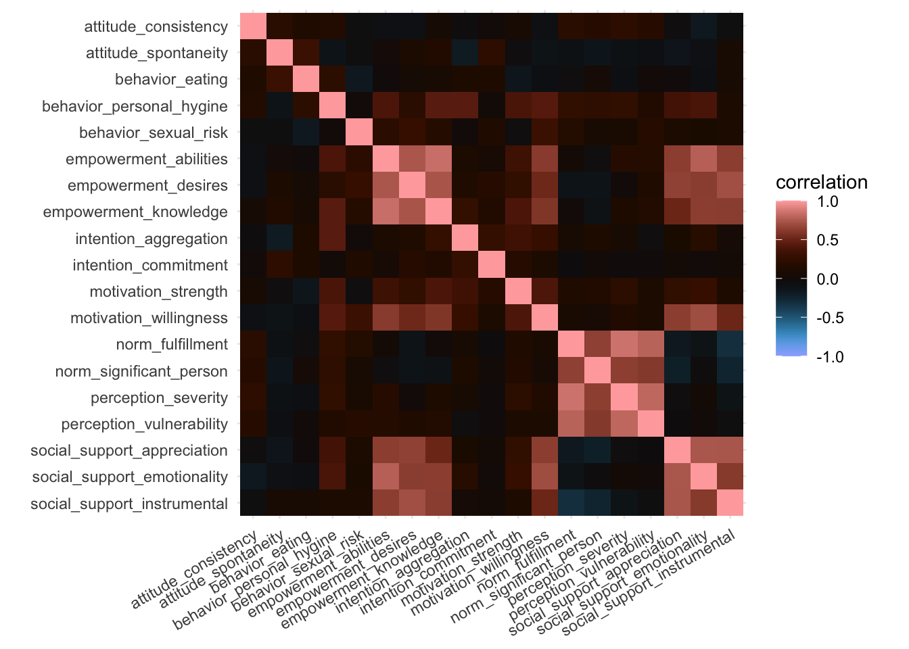

What we're looking for here are little blocks along the diagonal. This would indicate variables that correlate with each other. We can easily spot three blocks, and we can quietly expect these variables to cluster together later, although perhaps not necessarily in the three blocks visible here.

What we showed here was the correlation matrix, if we replaced the `cor()` function with the `cov()` function we'd get the covariance matrix, which would look basically identical in this case.

Let's now dive into the approaches we'll use. We'll discuss three here, and if there's space, I might add a fourth one briefly. We'll definitely discuss factor analysis, PCA, and ICA, and we'll start with the former.

## Selecting the number of components

For factor analysis and ICA we need to provide the number of factors we want to extract. We'll use the same number of factors/components throughout this tutorial (also for PCA). Selection of the optimal number of factors/components is a fairly arbitrary process which I won't go into now. In short, before writing this I ran PCA and a tool called [icasso](https://research.ics.aalto.fi/ica/icasso/). _Icasso_ runs an ICA algorithm a number of times and provides a number of parameters on the stability of the clusters at different thresholds, this approach is very data-driven. A more common and easier way to get some data-driven insight into the optimal number of clusters is using the "elbow"-method using PCA, eigenvalues of the components, and the cumulative variance explained by the components (we'll show those later). However, in the end, you should also look at the weight matrix of the different cluster thresholds and it becomes a fairly arbitrary process. In this case, the _icasso_ showed that 7 components was good (but not the best), the weight matrix looked okay, and 7 components explained more than 80% of the variance in the PCA. I went for 7 components in the end also because it served the purpose of this blogpost quite well, but I think different thresholds are valid and you could make a case for different ones based on the data, based on the interpretation of the weight matrix, etc. This process is a bit of an art and a science combined.


```r
n_comps <- 7
```


## Factor Analysis

So, let's run the factor analysis. Technically speaking, factor analysis isn't a clustering method but rather a latent variable modeling method [source](https://stats.stackexchange.com/questions/241726/understanding-exploratory-factor-analysis-some-points-for-clarification). The primary aim of a factor analysis is the reconstruction of correlations/covariances between variables. Maximizing explained variance of the factors is only a secondary aim and we'll get to why that is relevant in the PCA section.

We've established we want 7 factors. The factor analysis method is implemented in R through the `factanal()` function (see [here](https://www.rdocumentation.org/packages/stats/versions/3.6.2/topics/factanal for the documentation). This function applies a common factor model using the maximum likelihood method.  We'll simply provide it with our data frame, the number of factors we want to extract, and we'll ask to provide Bartlett's weighted least-squares scores as well. We can apply a "rotation" to the factors to make them reduce the complexity of the factor loadings and make them easier to interpret, here we'll use the `varimax` option. Varimax maximizes the sum of the variances of the squared loadings. Then we'll print the model to see the results (and sort so the loadings are ordered). The output may be a bit long.


```r
fa_model <- factanal(data_features, factors = n_comps, scores = "Bartlett", rotation = "varimax")
print(fa_model, sort = TRUE)
```

```
## 
## Call:
## factanal(x = data_features, factors = n_comps, scores = "Bartlett",     rotation = "varimax")
## 
## Uniquenesses:
##        behavior_sexual_risk             behavior_eating 
##                       0.749                       0.005 
##    behavior_personal_hygine       intention_aggregation 
##                       0.287                       0.504 
##        intention_commitment        attitude_consistency 
##                       0.797                       0.805 
##        attitude_spontaneity     norm_significant_person 
##                       0.758                       0.392 
##            norm_fulfillment    perception_vulnerability 
##                       0.129                       0.170 
##         perception_severity         motivation_strength 
##                       0.143                       0.643 
##      motivation_willingness social_support_emotionality 
##                       0.354                       0.005 
## social_support_appreciation social_support_instrumental 
##                       0.005                       0.251 
##       empowerment_knowledge       empowerment_abilities 
##                       0.005                       0.166 
##         empowerment_desires 
##                       0.207 
## 
## Loadings:
##                             Factor1 Factor2 Factor3 Factor4 Factor5 Factor6
## motivation_willingness       0.655           0.387           0.115  -0.135 
## social_support_emotionality  0.843           0.258          -0.196         
## social_support_appreciation  0.849  -0.138                          -0.487 
## social_support_instrumental  0.816  -0.211                   0.140         
## empowerment_knowledge        0.798           0.347           0.141   0.433 
## empowerment_abilities        0.861   0.118   0.188                   0.201 
## empowerment_desires          0.814                           0.345         
## norm_significant_person     -0.167   0.724   0.169                         
## norm_fulfillment                     0.904   0.122                         
## perception_vulnerability     0.124   0.879                   0.116         
## perception_severity                  0.903                                 
## behavior_personal_hygine     0.289   0.196   0.714   0.147  -0.154  -0.102 
## intention_aggregation                        0.664           0.208         
## behavior_eating                                      0.987                 
## behavior_sexual_risk         0.159   0.135          -0.150   0.427         
## intention_commitment                         0.174   0.111   0.394         
## attitude_consistency                 0.181                  -0.103         
## attitude_spontaneity                        -0.149   0.302           0.335 
## motivation_strength          0.244   0.111   0.477  -0.195   0.101         
##                             Factor7
## motivation_willingness      -0.135 
## social_support_emotionality -0.413 
## social_support_appreciation        
## social_support_instrumental        
## empowerment_knowledge        0.172 
## empowerment_abilities              
## empowerment_desires                
## norm_significant_person     -0.146 
## norm_fulfillment             0.153 
## perception_vulnerability     0.136 
## perception_severity          0.153 
## behavior_personal_hygine     0.162 
## intention_aggregation              
## behavior_eating                    
## behavior_sexual_risk               
## intention_commitment               
## attitude_consistency         0.371 
## attitude_spontaneity               
## motivation_strength                
## 
##                Factor1 Factor2 Factor3 Factor4 Factor5 Factor6 Factor7
## SS loadings      4.798   3.128   1.689   1.208   0.652   0.631   0.520
## Proportion Var   0.253   0.165   0.089   0.064   0.034   0.033   0.027
## Cumulative Var   0.253   0.417   0.506   0.570   0.604   0.637   0.665
## 
## Test of the hypothesis that 7 factors are sufficient.
## The chi square statistic is 62.23 on 59 degrees of freedom.
## The p-value is 0.362
```

We may be tempted to immediately look at the _p_-value at the end of the output. This _p_-value denotes whether the assumption of perfect fit can be rejected. If this _p_-value is below 0.05 or 0.01 we can reject the hypothesis of perfect fit, meaning that we could probably try a different method or try a different number of factors. In this case, the _p_-value is larger than 0.05 so we cannot reject the hypothesis of perfect fit.

The "Loadings" section of the results show a make-shift weight matrix, but in order to further interpret these results, let's create a plot showing the weight matrix. We'll get the results from the factor analysis model we created earlier using the `tidy()` function from `{broom}` and convert it to long format. We'll then create a weight matrix much in the same way we did earlier.


```r
fa_weight_matrix <- broom::tidy(fa_model) %>% 
  pivot_longer(starts_with("fl"), names_to = "factor", values_to = "loading")

fa_loading_plot <- ggplot(fa_weight_matrix, aes(x = factor, y = variable, fill = loading)) + 
  geom_tile() + 
  labs(title = "FA loadings",
       x = NULL,
       y = NULL) + 
  scico::scale_fill_scico(palette = "cork", limits = c(-1,1)) + 
  coord_fixed(ratio = 1/2)

print(fa_loading_plot)
```

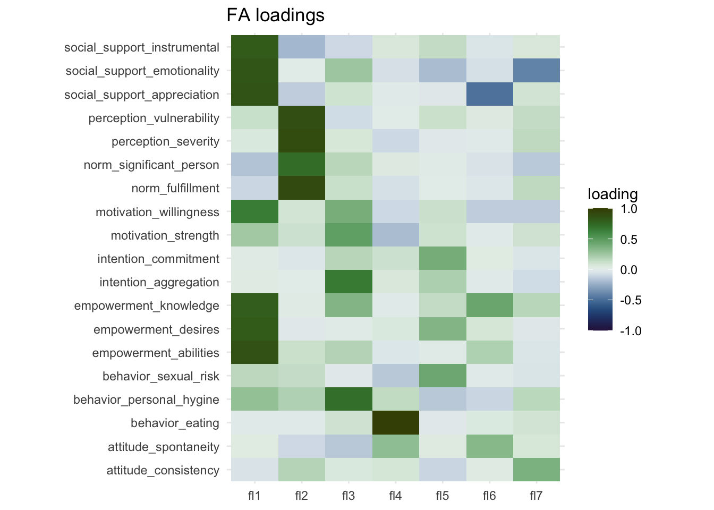

Here we can more easily see that there's two strong clusters in Factor 1 and Factor 2. Factor 3 captures three or 4 variables to a lesser degree and Factor 4 captures just one variable (`"behavior_eating"`). Interpretation of these factors is subjective, so it is perhaps best done in collaboration with others.

Lastly, I think it would be interesting to see how the different factors relate to each other. We'll take the Bartlett's scores and correlate them with each other much like before and create a correlation matrix like before.


```r
fa_model$scores %>% 
  cor() %>% 
  data.frame() %>% 
  rownames_to_column("factor_x") %>% 
  pivot_longer(cols = -factor_x, names_to = "factor_y", values_to = "correlation") %>% 
  ggplot(aes(x = factor_x, y = factor_y, fill = correlation)) + 
  geom_tile() +
  geom_text(aes(label = round(correlation,4)), color = "white") +
  labs(title = "Correlation between FA scores",
       x = NULL,
       y = NULL) +
  scico::scale_fill_scico(palette = "berlin", limits = c(-1,1)) + 
  coord_equal()
```

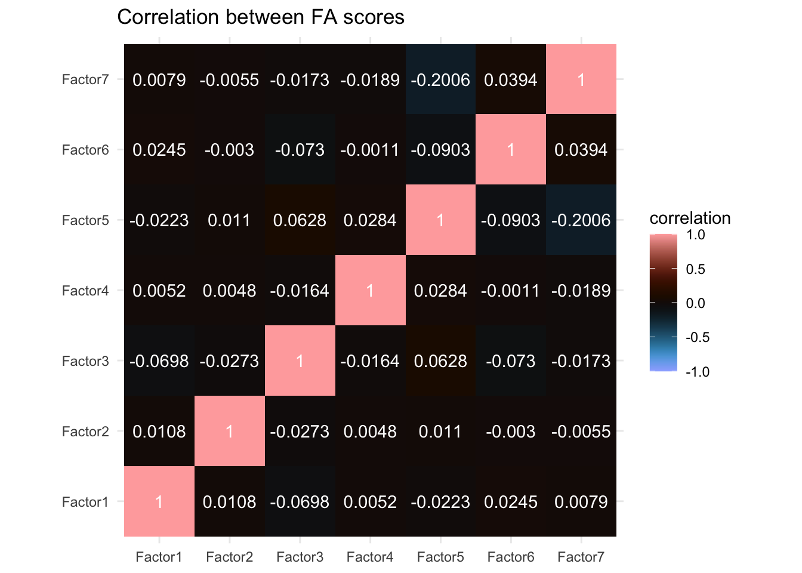

We can see little correlation but certainly a few non-zero correlations also. In particular Factor 5 and Factor 7 seem to correlate to some extent at least and there are a few others with some minor correlations, e.g. Factor 1 and Factor 3, as well as Factor 3 and Factor 6. We'll compare this later with the other algorithms.


## Principal Component Analysis

Principal component analysis can reliably be classfied as a clustering method (as opposed to factor analysis) and it is a very common dimensionality reduction approach. The primary aim of PCA is to maximize variance captured while creating uncorrelated (orthogonal) components. Some methods associated with PCA have been borrowed from factor analysis (e.g. scree plot, _Kaiser's rule_, [source](https://doi.org/10.1002/0470013192.bsa501)). A [paper](https://doi.org/10.1002/0470013192.bsa501) from professor of Mathematics at the University of Essex Ian Jolliffe published in _Encyclopedia of Statistics in Behavioral Science_ uses fairly strong terms to make the distinction clear:

> This is partially caused by a number of widely used software packages treating PCA as a special case of factor analysis, which it most certainly is not. There are several technical differences between PCA and factor analysis, but the most fundamental difference is that factor analysis explicitly specifies a model relating the observed variables to a smaller set of underlying unobservable factors. Although some authors express PCA in the framework of a model, its main application is as a descriptive, exploratory technique, with no thought of an underlying model. [[source](https://doi.org/10.1002/0470013192.bsa501)]

I can recommend this paper as a great primer to PCA methods. It goes over a few concepts very relevant for PCA methods as well as clustering methods in general.

Now, let's run the PCA. In R there's two functions built-in to run a principal component analysis, here we'll use the `prcomp()`function (the other being `princomp()`, but `prcomp()` is preferred for reasons beyond the scope of this post). The `prcomp()` function contains a few options we can play with, but in my experience it works fine out of the box if you've normalized the data beforehand ([link to documentation](https://www.rdocumentation.org/packages/stats/versions/3.6.2/topics/prcomp)). So we'll simply provide the data frame with the features. In addition, we'll also calculate the variance explained by each component. We do that by simply taking the standard deviation calculated by the PCA and squaring it, we'll save it in a new field called `variance`.


```r
pc_model <- prcomp(data_features)

pc_model$variance <- pc_model$sdev^2
```

Next we can make a simple scree plot using the variance we calculate above. We'll create a plot with the principal components on the x-axis and the eigenvalue on the y-axis. The scree plot is a very popular plot to visualize features of a PCA. In this plot the elbow is quite clearly at principal component 3, but as discussed, the scree plot is not the best nor the only way to determine the optimal number of components. In the code below I also added a calculation for the cumulative variance (`cum_variance`) which showed that a little more than 80% of the variance is captured in the first 7 components, while the first 3 components combined capture only 56%.


```r
pc_model$variance %>% 
  as_tibble() %>%
  rename(eigenvalue = value) %>% 
  rownames_to_column("comp") %>% 
  mutate(comp = parse_number(comp),
         cum_variance = cumsum(eigenvalue)/sum(eigenvalue)) %>% 
  ggplot(aes(x = comp, y = eigenvalue)) + 
  geom_hline(yintercept = 1) +
  geom_line(size = 1) + 
  geom_point(size = 3)
```

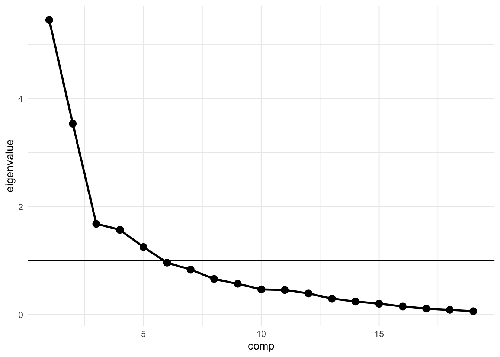

We'll also create a weight matrix again, based on the rotation from the PCA. We'll create the weight matrix much in the same way as before. A PCA by its very nature returns an equal number of components as the number of variables put in, however, we're interested in just the first 7 components, so we'll select just those using the `filter()` function.


```r
pc_weight_matrix <- pc_model$rotation %>% 
  data.frame() %>% 
  rownames_to_column("variable") %>% 
  pivot_longer(starts_with("PC"), names_to = "prin_comp", values_to = "loading")

pca_loading_plot <- pc_weight_matrix %>% 
  filter(parse_number(prin_comp) <= n_comps) %>% 
  ggplot(aes(x = reorder(prin_comp, parse_number(prin_comp)), y = variable, fill = loading)) +
  geom_tile() + 
  labs(title = "PCA loadings",
       x = NULL,
       y = NULL) +
  scico::scale_fill_scico(palette = "cork", limits = c(-1,1)) + 
  coord_fixed(ratio = 1/2)

print(pca_loading_plot)
```

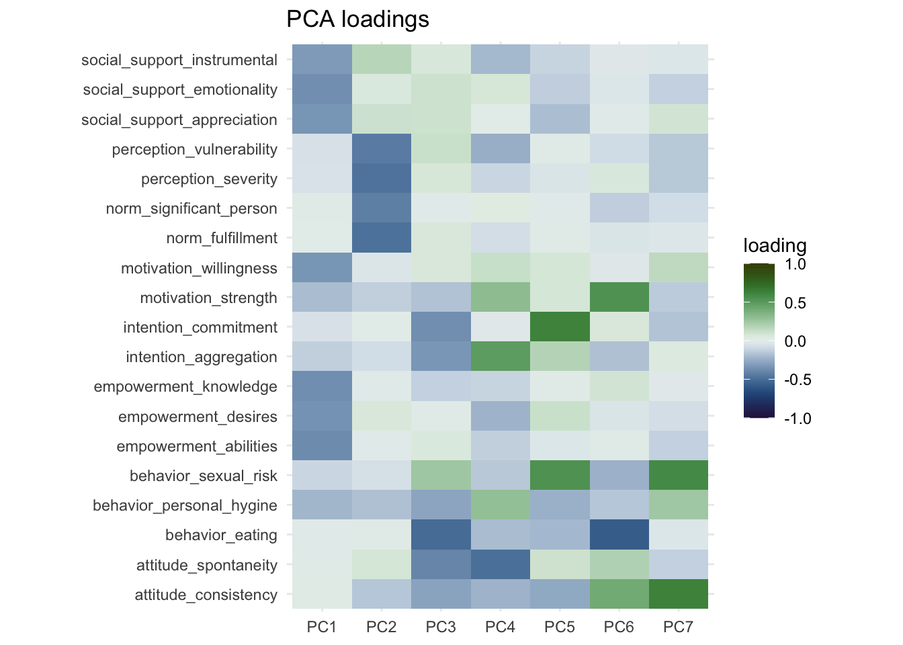

One thing that immediately jumps out is that PC1 and PC2 are nearly identical to Factor 1 and Factor 2 from the factor analysis. The direction of the sign might be reversed, but we can fix this visually by multiplying the loadings by `-1`. The more important part though is the other components, which look nothing like the factors from the factor analysis. With some effort you could see some overlap between Factor 3 and PC4 as well as Factor 5 and PC 5, but both factor analysis and PCA had different ideas about how to group the variables together other than the first two factors/components.

We can also make a correlation matrix for the different principal components. We'll use the `x` field  and otherwise create the correlation matrix the same way as before:


```r
pc_model$x %>% 
  cor() %>% 
  data.frame() %>% 
  rownames_to_column("comp_x") %>% 
  pivot_longer(cols = starts_with("PC"), names_to = "comp_y", values_to = "correlation") %>% 
  filter(parse_number(comp_x) <= n_comps,
         parse_number(comp_y) <= n_comps) %>% 
  ggplot(aes(x = comp_x, y = comp_y, fill = correlation)) + 
  geom_tile() +
  geom_text(aes(label = round(correlation,4)), color = "white") +
  labs(title = "Correlation between PCs",
       x = NULL,
       y = NULL) +
  scico::scale_fill_scico(palette = "berlin", limits = c(-1,1)) + 
  coord_equal()
```

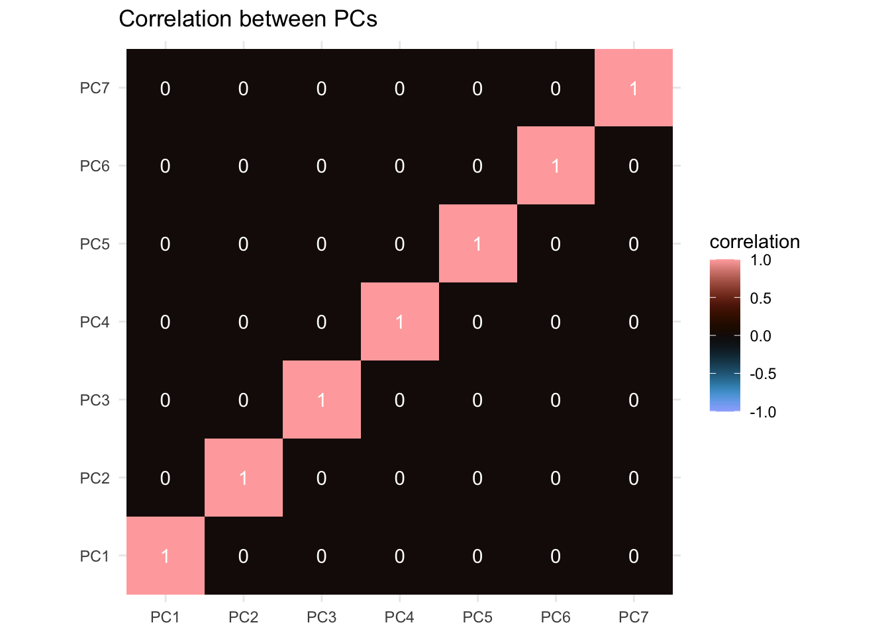

What jumps out here is the apparent absence of correlation. By its design the principal components are orthogonal to each other. The PCA works by finding a direction (a vector) that maximizes correlation of the features (capturing maximum variance). When it's done that, it moves to the next direction, orthogonal to the previous and maximizes correlation across that direction, and so on. Since the degree of correlation reduces as you account for more and more of the correlations in your data, the amount of correlation still unaccounted for reduces as you move along the components. Now you can replace the word "correlation" in these past few sentences with "covariance" and it would still hold up to a large degree apart from the diagonal (again, caveats apply).

Next, we can also visualize the PCA using a plot called a "biplot". It visualizes the loading of the first two components (e.g. PC1 on the x-axis and PC2 on the y-axis) and also visualizes the direction across which correlation was maximized. It's simply the `biplot()` function implemented already in R.


```r
biplot(pc_model)
```

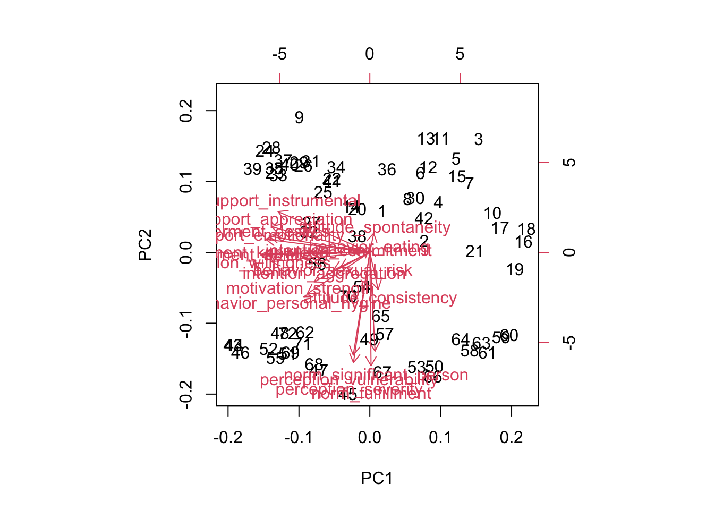

It isn't very pretty, but we can roughly see the directions across the first two components, one pointing straight down and one pointing to the left.

A nice feature of PCA is that the underlying principles are rather simple, and you could calculate the eigenvectors and eigenvalues using just two functions: `cov()` and `eigen()`, which calculate the covariance matrix and the eigenvalues and -vectors of the covariance matrix respectively. If the terms "matrix manipulations", eigenvectors, and dot product sound scary to you, you can skip to the [ICA](#independent-component-analysis) section. We can then calculate the individual loadings (stored in the `prcomp()` model in the `x` field) by calculating the dot product of the data features and the eigenvector. Dot product in this case means multiplying every element of a column with the corresponding element in the eigenvector.


```r
cov_matrix <- cov(data_features)

eigen_model <- eigen(cov_matrix)
eigenvalues <- eigen_model$values
eigenvector <- eigen_model$vectors

pc_manual <- as.matrix(data_features) %*% eigenvector
```

Let's look at the scree plot:


```r
tibble(eigenvalues) %>% 
  ggplot(aes(x = seq_along(eigenvalues),  y = eigenvalues)) + 
  geom_hline(yintercept = 1) +
  geom_line(size = 1) + 
  geom_point(size = 3)
```

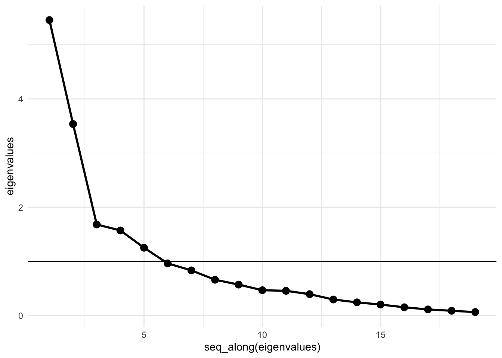

Looks identical to the previous one. Let's also look at the correlation matrix between the principal components.


```r
data.frame(pc_manual) %>% 
  cor() %>% 
  round(., 4)
```

```
##     X1 X2 X3 X4 X5 X6 X7 X8 X9 X10 X11 X12 X13 X14 X15 X16 X17 X18 X19
## X1   1  0  0  0  0  0  0  0  0   0   0   0   0   0   0   0   0   0   0
## X2   0  1  0  0  0  0  0  0  0   0   0   0   0   0   0   0   0   0   0
## X3   0  0  1  0  0  0  0  0  0   0   0   0   0   0   0   0   0   0   0
## X4   0  0  0  1  0  0  0  0  0   0   0   0   0   0   0   0   0   0   0
## X5   0  0  0  0  1  0  0  0  0   0   0   0   0   0   0   0   0   0   0
## X6   0  0  0  0  0  1  0  0  0   0   0   0   0   0   0   0   0   0   0
## X7   0  0  0  0  0  0  1  0  0   0   0   0   0   0   0   0   0   0   0
## X8   0  0  0  0  0  0  0  1  0   0   0   0   0   0   0   0   0   0   0
## X9   0  0  0  0  0  0  0  0  1   0   0   0   0   0   0   0   0   0   0
## X10  0  0  0  0  0  0  0  0  0   1   0   0   0   0   0   0   0   0   0
## X11  0  0  0  0  0  0  0  0  0   0   1   0   0   0   0   0   0   0   0
## X12  0  0  0  0  0  0  0  0  0   0   0   1   0   0   0   0   0   0   0
## X13  0  0  0  0  0  0  0  0  0   0   0   0   1   0   0   0   0   0   0
## X14  0  0  0  0  0  0  0  0  0   0   0   0   0   1   0   0   0   0   0
## X15  0  0  0  0  0  0  0  0  0   0   0   0   0   0   1   0   0   0   0
## X16  0  0  0  0  0  0  0  0  0   0   0   0   0   0   0   1   0   0   0
## X17  0  0  0  0  0  0  0  0  0   0   0   0   0   0   0   0   1   0   0
## X18  0  0  0  0  0  0  0  0  0   0   0   0   0   0   0   0   0   1   0
## X19  0  0  0  0  0  0  0  0  0   0   0   0   0   0   0   0   0   0   1
```

Yup, also still 0 across the board. Calculating a PCA by just using matrix manipulations isn't too complicated, and it's a fun exercise, but I'd recommend just sticking to the `prcomp()` function, since it's a lot simpler and offer better functionality. Now, let's move on to the independent component analysis.


## Independent Component Analysis

While PCA attempts to find components explaining the maximum degree of covariance or correlation, an ICA attemps to find components with maximum statistical independence. There's very complicated nuance here where PCA components are orthogonal and uncorrelated to each other and ICA components are merely statistically independent, which is a very subtle nuance. In practice, it'll mean that ICA components also have a practically zero correlation. The main difference is in how the components are obtained. Like with factor analysis, most ICA algorithms require you to provide a number of components up front. The FastICA algorithm we'll use here is a version of an ICA implementation. There's also InfoMax and JADE to name two other implementations. I couldn't tell you the difference between these ICA algorithms. The FastICA is implemented in R through the `fastICA()` function and the eponymous `{fastICA}` package ([link to documentation](https://www.rdocumentation.org/packages/fastICA/versions/1.2-2/topics/fastICA)).


```r
ica_model <- fastICA(data_features, n.comp = n_comps)
```

Let's create a weight matrix again. The output from the `fastICA()` doesn't provide useful names, but the [documentation](https://www.rdocumentation.org/packages/fastICA/versions/1.2-2/topics/fastICA) provides sufficient information. To create the weight matrix we take the `A` field, transpose it, get the right names to the right places and then create the plot like we've done several times now.


```r
ica_weight_matrix <- data.frame(t(ica_model$A)) %>% 
  rename_with(~ str_glue("IC{seq(.)}")) %>%
  mutate(variable = names(data_features)) %>%
  pivot_longer(cols = starts_with("IC"), names_to = "ic", values_to = "loading")

ica_loading_plot <- ggplot(ica_weight_matrix, aes(x = ic, y = variable, fill = loading)) +
  geom_tile() + 
  labs(title = "ICA loadings",
       x = NULL,
       y = NULL) + 
  scico::scale_fill_scico(palette = "cork", limits = c(-1,1)) + 
  coord_fixed(ratio = 1/2)

print(ica_loading_plot)
```

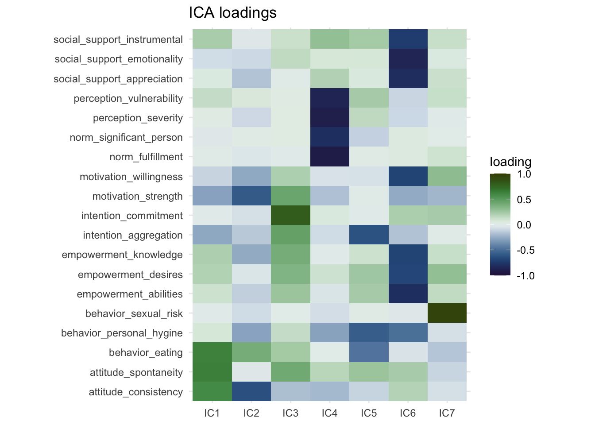

The FastICA method doesn't rank the components based on variance like factor analysis and PCA. Degree of variance explained is not a part of the FastICA algorithm. The ordering of the clusters is not meaningful, we could label IC1 as IC6 and vice versa and the result would not be less valid. So with that in mind, we can see that two of the components (IC6 and IC4) are again very similar to the first two components we saw in the factor analysis and the PCA. These appear to be very robust components and will cluster together regardless of the method we use. The direction of the components is also arbitrary, we could multiply the loadings by -1 and they would not be less valid. One of the main advantages of ICA in my opinion is that due to the statistical independence, the components are easier to interpret and (often) have clearer constructs than for instance principal components. For instance IC7 consists of just a single item ("behavior sexual risk"), which the algorithm determined was statistically independent from the other variables. Interestingly, if we look back at the output from the factor analysis, it says that "behavior sexual risk" scores highest for "uniqueness" there as well. Also IC3 is most strongly powered by the "intention commitment" variable, while also including some other variables about intention and empowerment. This makes labeling independent components (in my experience) a bit easier than principal components.

Again, we can also visualize the correlation between the different components.  


```r
ica_model$S %>% 
  cor() %>% 
  data.frame() %>% 
  rownames_to_column("comp_x") %>% 
  pivot_longer(cols = starts_with("X"), names_to = "comp_y", values_to = "correlation") %>% 
  ggplot(aes(x = comp_x, y = comp_y, fill = correlation)) + 
  geom_tile() +
  geom_text(aes(label = round(correlation,4)), color = "white") +
  labs(title = "Correlation between ICs",
       x = NULL,
       y = NULL) +
  scico::scale_fill_scico(palette = "berlin", limits = c(-1,1)) + 
  coord_equal()
```


Again, the correlations between the components here are zero throughout, which would fit with the statistical independence. While independent components aren't forced to be uncorrelated, this is a feature of the statistical independence. If the correlation matrix isn't zero throughout, this would be a sign that you'd need to adapt your ICA method.

Okay, let's now compare the three approaches and put the loading matrices side by side so we can look at the differences are bit more closely. We'll take the three weight matrices from factor analysis, PCA, and ICA, and bind them together. We'll then create a plot much in the same way as before and we'll add a facet to show the weight matrices side by side, separated by the method we used so it's easier to compare.


```r
all_weight_matrices <- bind_rows(
  fa_weight_matrix %>% 
    rename(comp = factor) %>% 
    mutate(alg = "FA"),
  pc_weight_matrix %>% 
    rename(comp = prin_comp) %>% 
    mutate(alg = "PCA"), 
  ica_weight_matrix %>% 
    rename(comp = ic) %>% 
    mutate(alg = "ICA")
)

all_weight_matrices %>% 
  filter(parse_number(comp) <= n_comps) %>% 
  mutate(alg = str_glue("{alg} loadings"),
         alg = as_factor(alg)) %>% 
  ggplot(aes(x = comp, y = variable, fill = loading)) +
  geom_tile() + 
  labs(x = NULL,
       y = NULL) + 
  scico::scale_fill_scico(palette = "cork", limits = c(-1,1)) + 
  facet_wrap(~ alg, scales = "free_x")
```

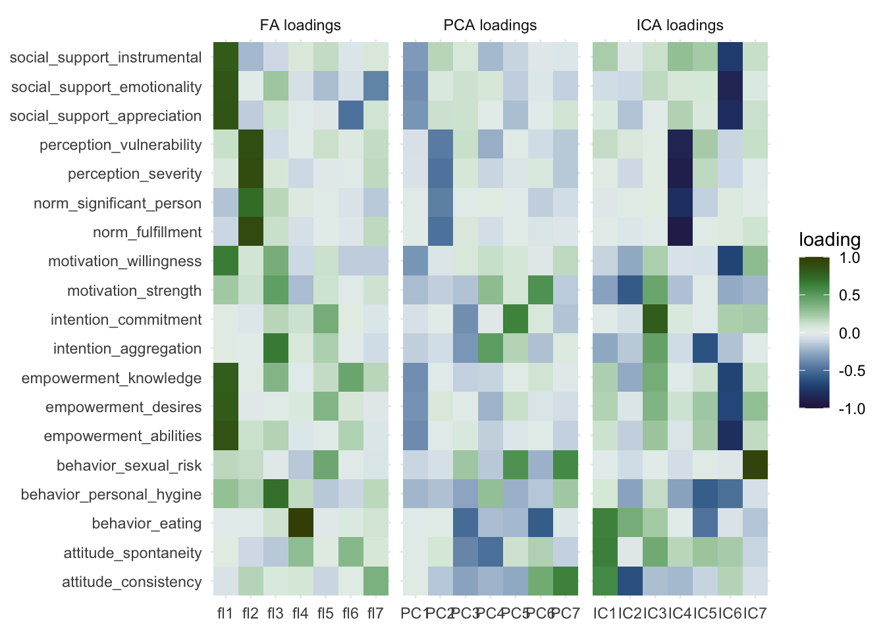

Here we can most clearly see the overlap between the three methods, Factor 1, PC1, and IC 6 capture essentially the same information. The same goes for Factor 2, PC2, and IC 4. Other than that we can see that the other components vary quite markedly. I wouldn't be comfortable calling any of the other components "fairly similar" to another. You could see how some variables load together with multiple methods, but then the components those are captured in also have other information or miss information. We already discussed IC7 consisting mostly of a single variable, and a similar thing happens with Factor 4, but for a different variable. 

### BONUS: Hierarchical clustering

I'll quickly go over hierarchical clustering too, it's simple and easy to interpret. Hierarchical clustering works by taking your variables and clustering them first into two groups, then three, then four, and so on. It looks at similarity and a concept called "Euclidian distance" (other methods are available) between the variables and determines how to separate. Essentially, hierarchical clustering works by iteratively separating variables into groups until every variable is on its own. It does so rather aggressively, with the previous methods it's possible for a variable to be part of two clusters, with hierarchical clustering it's part of a single cluster only. This approach makes it an easy way to see how variables cluster together at different thresholds.

First we convert our data frame with the features to a matrix, then we transpose it. If we don't transpose, we'd be clustering participants together, and we're interested here in clustering of variables. Clustering of individuals can be interesting but this post is already long enough. Next we create a distance matrix using the `dist()` function, this is a matrix containing the relative distance between the variables to each other. You can think of the distance matrix as a sort of weighted adjacency matrix. Then we can supply this distance matrix to the hierarchical clustering function (`hclust()`, [documentation](https://www.rdocumentation.org/packages/stats/versions/3.6.2/topics/hclust)). We don't need to supply the number of clusters at this stage.


```r
dist_data_features <- dist(t(as.matrix(data_features)))

hclust_model <- hclust(dist_data_features)
```

We can visualize the hierarchical clustering with a dendrogram simply by supplying the `hclust_model` to the `plot()` function (like `plot(hclust_model)`), but in this case I'd prefer to use the `ggdendrogram()` function from the `{ggdendro}` package


```r
ggdendro::ggdendrogram(hclust_model)
```

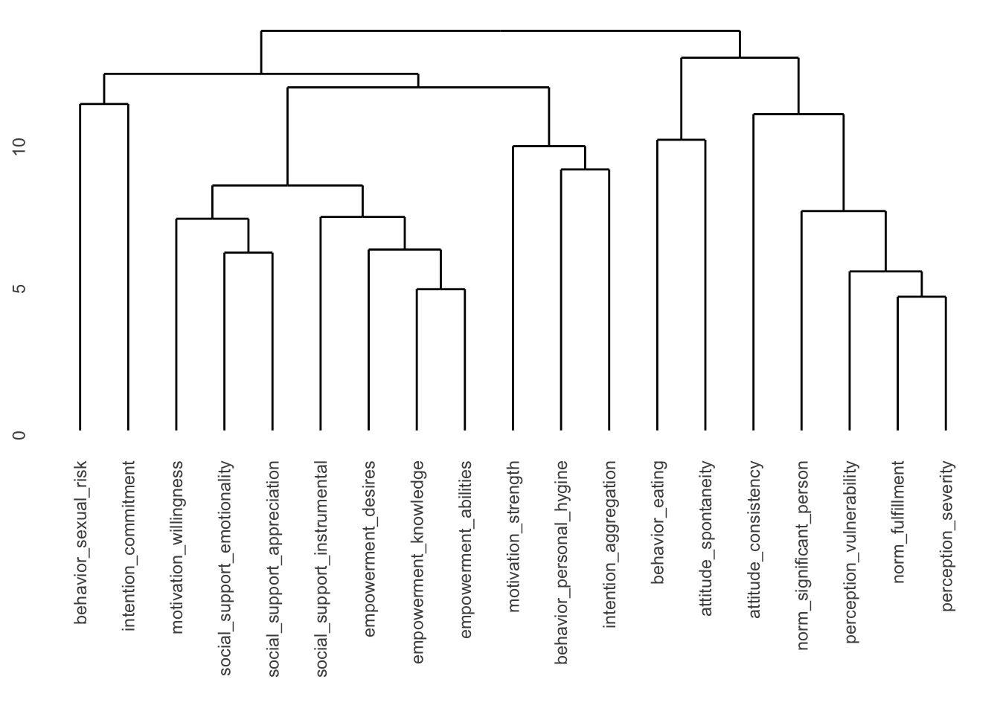

Here we can see the different "branches" of the tree. You can see that for instance "empowerment knowledge" and "empowerment abilities" are very close to each other, but it's a long way from "perception severity" to "motivation willingness" for instance. You may also notice the values along the y-axis. You could for instance "cut" the tree at `y = 13` and you'd separate the tree into 2 "branches". You could cut it at e.g. `y = 8`, and then you would get 11 clusters. Since we already determined that we wanted 7 clusters, we can ask another function to determine where to cut the tree to get the components we would like. This is implemented in the `cutree()` function.


```r
hclust_weight_matrix <- cutree(hclust_model, k = n_comps)
```

The `cutree()` function assigns a cluster to each of the variables. It looks at the tree and determines where to cut the tree to get the desired number of branches and then tells you the composition of the branches. We can recreate this ourselves by simply adding a `geom_hline()` to the dendrogram. With some trial and error, it seems like cutting the tree at `y = 10.5` will give us 7 clusters.


```r
ggdendro::ggdendrogram(hclust_model) + 
  geom_hline(yintercept = 10.5, color = "firebrick")
```

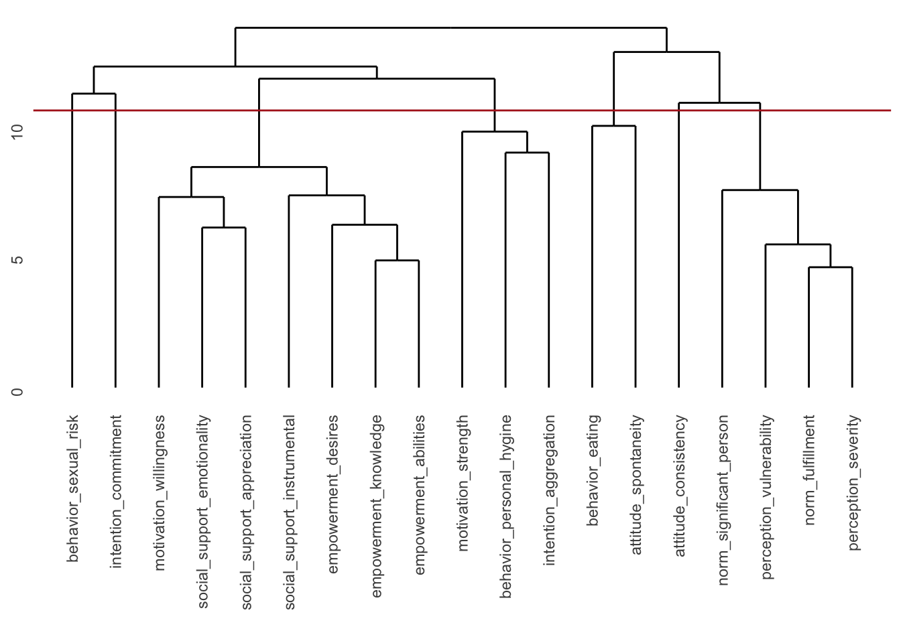

Let's look at how the clusters are made up according to the hierarchical clustering model. This isn't really a weight matrix, but rather a definition of the clusters. The "loadings" here are not numerical, but rather 1 or 0.


```r
hclust_weight_matrix %>% 
  data.frame() %>% 
  janitor::clean_names() %>% 
  rename(cluster = x) %>% 
  rownames_to_column("variable") %>% 
  ggplot(aes(x = as_factor(cluster), y = variable, fill = as_factor(cluster))) +
  geom_tile() + 
  labs(x = NULL,
       y = NULL,
       fill = "cluster") + 
  scico::scale_fill_scico_d(palette = "batlow")
```

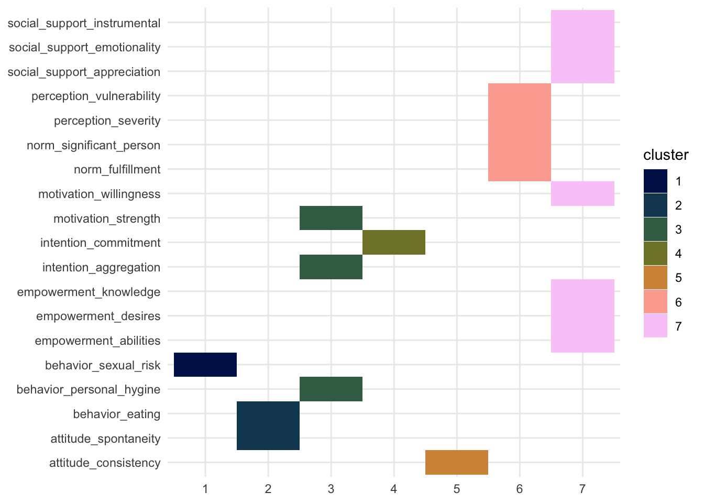

We can again see that the same two clusters show up. Cluster 6 and 7 resemble those of Factor 2 and Factor 1, PC2 and PC1, and IC4 and IC6 respectively. If you want to learn more about what you can do with the `hlcust()` and associated functions, you can check out [this webpage](https://uc-r.github.io/hc_clustering).

Okay I'd like to leave it at that. This blogpost is long enough. Again, I had to simplify and take some shortcuts, if you think I made mistakes in that effort, please let me know and I'll fix it as well as I can!


