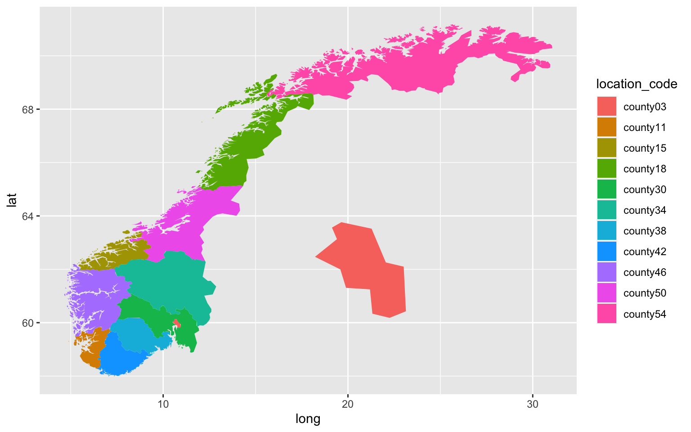
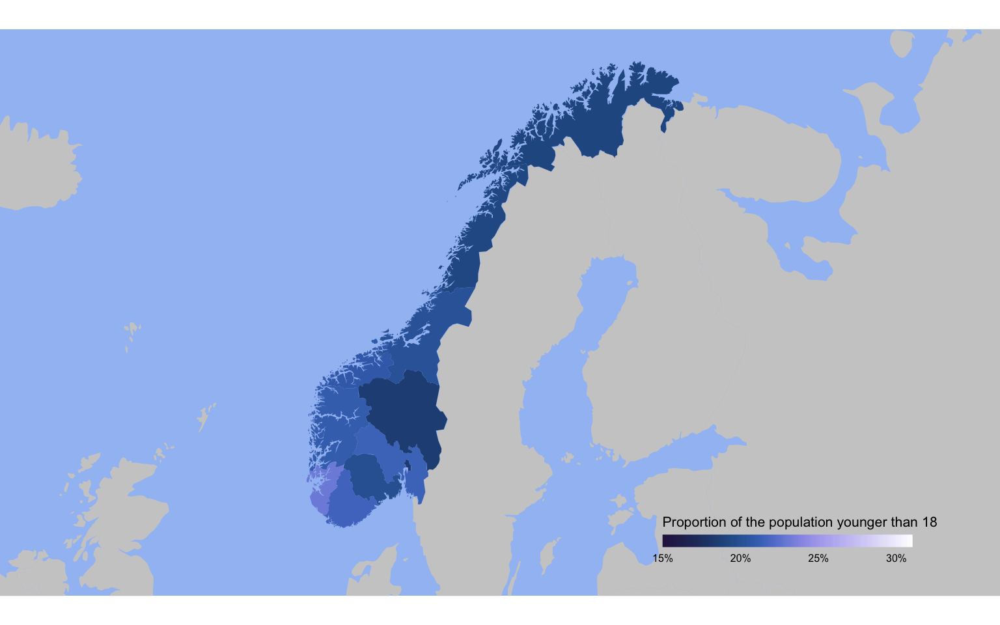
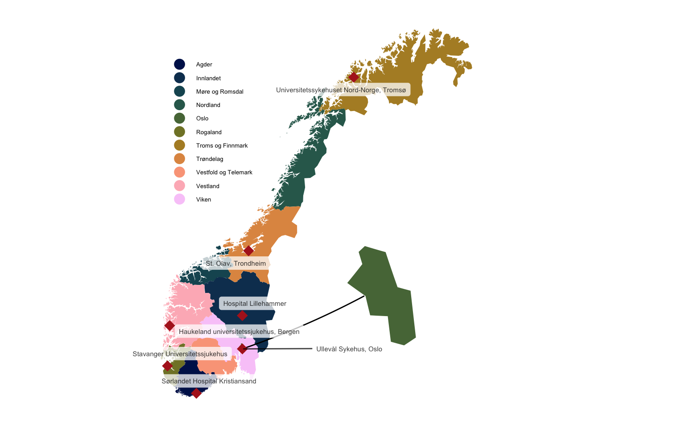

<style type="text/css">
p.announcement {
  border-radius: 5px; 
  background-color: #acc8d4; 
  padding: 1em;
}

p.announcement code {
  background-color: #93b8c8;
}
</style>
<p class="announcement">
As of March 2023 <code>{fhimaps}</code> and <code>{splmaps}</code> are no longer supported due to budget cuts at the institution supporting them. The amazing developers (led by <a href="https://www.rwhite.no">Richard Aubrey White</a> and <a href="https://andreaczhang.github.io">Chi Zhang</a>) have moved the data and functionality to a new package called <code>{csmaps}</code>. The code below is updated to reflect the changes.
</p>

<link rel="stylesheet" href="https://unpkg.com/leaflet@1.7.1/dist/leaflet.css" integrity="sha512-xodZBNTC5n17Xt2atTPuE1HxjVMSvLVW9ocqUKLsCC5CXdbqCmblAshOMAS6/keqq/sMZMZ19scR4PsZChSR7A==" crossorigin=""/>

<script src="https://unpkg.com/leaflet@1.7.1/dist/leaflet.js" integrity="sha512-XQoYMqMTK8LvdxXYG3nZ448hOEQiglfqkJs1NOQV44cWnUrBc8PkAOcXy20w0vlaXaVUearIOBhiXZ5V3ynxwA==" crossorigin=""></script>

Every now and then you discover a discover a much simpler solution to a problem you spent a lot of time solving. This recently happened to me on the topic of creating a map of Norway in R. In this post, I want to go through the process of what I learned.

Previously, I used a JSON file and the `{geojsonio}` package to create a map of Norway and its fylker (counties) in particular. This was a very flexible and robust way of going about this, but also quite cumbersome. This method relies on a high-quality JSON file, meaning, a file that is detailed enough to display everything nicely, but not too detailed that it takes a ton of time and computing power to create a single plot. While I'll still use this method if I need to create a map for places other than Norway, I think I've found a better and easier solution for plotting Norway and the fylker and kommuner in the [`{csmaps}`](https://www.csids.no/csmaps/) package.

The `{csmaps}` package is created by the *Consortium for Statistics in Disease Surveillance* team. It's part of a series of packages (which they refer to as the "csverse"), which includes a package containing basic health surveillance data ([`{csdata}`](https://www.csids.no/csdata/)), one for real-time analysis in disease surveillance ([`{sc9}`](https://www.csids.no/sc9/)) and a few more. Here I'll dive into the `{csmaps}` package with some help from the `{csdata}` package. I'll also use the `{ggmap}` package to help with some other data and plotting. It's perhaps important to note that `{ggmap}` does contain a map of Norway as a whole, but not of the fylker and kommuner (municipalities), hence the usefulness of the `{csmaps}` package, which contains both. I'll also use `{tidyverse}` and `{ggtext}` as I always do. I won't load `{csmaps}` with the `library()` function, but will use the `::` operator instead since it'll make it easier to navigate the different datasets included.

``` r
library(tidyverse)
library(csmaps)
library(ggtext)
library(ggmap)
```

So let's have a look at what's included. You'll see that nearly all maps come in either a `data.table` format or an `sf` format. Here I'll use only the data frames, since they're a lot easier to work with. The maps in `sf` format can be useful elsewhere, but I think for most purposes it's easier and more intuitive to work with data frames.

``` r
data(package = "csmaps") |> 
  pluck("results") |> 
  as_tibble() |> 
  select(Item, Title) |> 
  print(n = 18)
```

A comprehensive version of this list is also included in the [reference](https://www.csids.no/csmaps/reference/index.html) for this package.

So let's have a look at one of those maps. For instance the one with the new fylker from 2020 with an inset of Oslo.

``` r
map_df <- nor_county_map_b2020_insert_oslo_dt |> 
  glimpse()
```

    Rows: 4,493
    Columns: 5
    $ long          <dbl> 5.823860, 5.969413, 6.183042, 6.302433, 6.538059, 6.693511, 6.657289, 6.767480, 7.096287, 7.110080, 7.214667, 7.098724, 7.048585, 6.991842, 6.962960, 7.022880, 6.882833, 6.932169, 6.865142, 6.824533, 6.847579, 6.939172, 6.881039, 6.903689, 6.560838, 6.608553, 6.518096, 6.572750, 6.622347, 6.436069, 6.497499, 6.614721, 6.587698, 6.631556, 6.560330, 6.382453, 6.324024, 6.350390, 6.239081, 6.039468, 5.996479, 5.875390, 5.666733, 5.489157, 5.601538, 5.576495, 5.633912, 5.686111, 5.565115, 5.581353, 5.769811, 5.741457, 5.786016, 5.851127, 5.893869, 5.979000, 5.965561, 6.175315, 6.281425, 6.116682, 6.086432, 6.108257, 6.072709, 5.995039, 6.036212, 6.090791, 5.949121, 5.889756, 5.977865, 6.174015, 6.022552, 6.192079, 6.562320, 6.360672, 6.157856, 6.113738, 6.273343, 6.289766, 6.217630, 6.226502, 6.186815, 6.201218, 6.176712, 6.102012, 6.118100, 6.085544, 6.020944, 6.212991, 6.210265, 6.270777, 6.598666, 6.270651, 6.368525, 6.312591, 6.218008, 6.119585, 6.014455, 5.977…
    $ lat           <dbl> 59.64576, 59.57897, 59.58607, 59.76743, 59.84285, 59.82295, 59.70174, 59.70049, 59.78278, 59.70060, 59.67269, 59.65129, 59.58683, 59.59703, 59.51645, 59.48120, 59.42930, 59.40027, 59.36840, 59.26988, 59.18267, 59.18192, 59.14459, 59.11340, 58.90995, 58.88007, 58.76741, 58.76528, 58.69668, 58.64933, 58.60992, 58.62509, 58.49277, 58.44801, 58.32740, 58.27794, 58.29827, 58.32613, 58.32347, 58.37897, 58.47691, 58.46442, 58.55017, 58.75369, 58.87953, 58.95905, 58.89528, 58.92810, 58.98060, 59.03644, 58.96494, 58.85185, 58.93869, 58.92934, 58.96797, 58.93705, 58.90389, 58.83516, 58.84096, 58.87579, 58.90089, 58.92352, 58.90352, 58.97113, 58.99728, 58.98579, 59.02345, 59.07371, 59.12151, 59.13993, 59.14356, 59.25835, 59.32107, 59.31982, 59.26062, 59.30281, 59.29761, 59.31837, 59.39100, 59.32360, 59.31884, 59.34543, 59.31699, 59.32179, 59.37375, 59.32646, 59.34218, 59.44488, 59.40925, 59.50584, 59.55886, 59.51752, 59.64394, 59.64117, 59.47384, 59.40548, 59.41009, 59.35…
    $ order         <int> 1, 2, 3, 4, 5, 6, 7, 8, 9, 10, 11, 12, 13, 14, 15, 16, 17, 18, 19, 20, 21, 22, 23, 24, 25, 26, 27, 28, 29, 30, 31, 32, 33, 34, 35, 36, 37, 38, 39, 40, 41, 42, 43, 44, 45, 46, 47, 48, 49, 50, 51, 52, 53, 54, 55, 56, 57, 58, 59, 60, 61, 62, 63, 64, 65, 66, 67, 68, 69, 70, 71, 72, 73, 74, 75, 76, 77, 78, 79, 80, 81, 82, 83, 84, 85, 86, 87, 88, 89, 90, 91, 92, 93, 94, 95, 96, 97, 98, 99, 100, 101, 102, 103, 104, 105, 106, 107, 108, 109, 110, 111, 112, 113, 114, 115, 116, 117, 118, 119, 120, 121, 122, 123, 124, 125, 126, 127, 128, 129, 130, 131, 132, 133, 134, 135, 136, 137, 138, 139, 140, 141, 142, 143, 144, 145, 146, 147, 148, 149, 150, 151, 152, 153, 154, 155, 156, 157, 158, 159, 160, 161, 162, 163, 164, 165, 166, 167, 168, 169, 170, 171, 172, 173, 174, 175, 176, 177, 178, 179, 180, 181, 182, 183, 184, 185, 186, 187, 188, 189, 190, 191, 192, 193, 194, 195, 196, 197, 198, 199, 200, 201, 202, 203, 204, 205, 206, 207, 208, 209, 210, 211, 212, 213, 214, 215, 216, 217…
    $ group         <fct> 11.1, 11.1, 11.1, 11.1, 11.1, 11.1, 11.1, 11.1, 11.1, 11.1, 11.1, 11.1, 11.1, 11.1, 11.1, 11.1, 11.1, 11.1, 11.1, 11.1, 11.1, 11.1, 11.1, 11.1, 11.1, 11.1, 11.1, 11.1, 11.1, 11.1, 11.1, 11.1, 11.1, 11.1, 11.1, 11.1, 11.1, 11.1, 11.1, 11.1, 11.1, 11.1, 11.1, 11.1, 11.1, 11.1, 11.1, 11.1, 11.1, 11.1, 11.1, 11.1, 11.1, 11.1, 11.1, 11.1, 11.1, 11.1, 11.1, 11.1, 11.1, 11.1, 11.1, 11.1, 11.1, 11.1, 11.1, 11.1, 11.1, 11.1, 11.1, 11.1, 11.1, 11.1, 11.1, 11.1, 11.1, 11.1, 11.1, 11.1, 11.1, 11.1, 11.1, 11.1, 11.1, 11.1, 11.1, 11.1, 11.1, 11.1, 11.1, 11.1, 11.1, 11.1, 11.1, 11.1, 11.1, 11.1, 11.1, 11.1, 11.1, 11.1, 11.1, 11.1, 11.1, 11.1, 11.1, 11.1, 11.1, 11.1, 11.1, 11.1, 11.1, 11.1, 11.1, 11.1, 11.1, 11.1, 11.1, 11.1, 11.1, 11.1, 11.1, 11.1, 11.1, 11.1, 11.1, 11.1, 11.1, 11.1, 11.1, 11.1, 11.1, 11.1, 11.1, 11.1, 11.1, 11.1, 11.1, 11.1, 11.1, 11.2, 11.2, 11.2, 11.2, 11.2, 11.2, 11.2, 11.2, 11.2, 11.2, 11.2, 11.2, 11.2, 11.3, 11.3, 11.3, 11.3, 11.3, 11.3, 11.4, 11.4, 11.…
    $ location_code <chr> "county_nor11", "county_nor11", "county_nor11", "county_nor11", "county_nor11", "county_nor11", "county_nor11", "county_nor11", "county_nor11", "county_nor11", "county_nor11", "county_nor11", "county_nor11", "county_nor11", "county_nor11", "county_nor11", "county_nor11", "county_nor11", "county_nor11", "county_nor11", "county_nor11", "county_nor11", "county_nor11", "county_nor11", "county_nor11", "county_nor11", "county_nor11", "county_nor11", "county_nor11", "county_nor11", "county_nor11", "county_nor11", "county_nor11", "county_nor11", "county_nor11", "county_nor11", "county_nor11", "county_nor11", "county_nor11", "county_nor11", "county_nor11", "county_nor11", "county_nor11", "county_nor11", "county_nor11", "county_nor11", "county_nor11", "county_nor11", "county_nor11", "county_nor11", "county_nor11", "county_nor11", "county_nor11", "county_nor11", "county_nor11", "county_nor11", "county_nor11", "county_nor11", "county_nor11", "county_nor11", "county_nor11",…

Immediately you can see that there's a lot of rows, each representing a point on the map. A data frame with a larger number of rows would be more detailed (i.e. less straight lines, more detail in curvatures of borders etc.). Let's create a very simple map. We'll use the `geom_polygon` to turn our data frame into a map. The location of the points are given in longitudes and latitudes (like x- and y-coordinates), the group serves to make sure lines are drawn correctly (try running the code below without `group = group` and see what happens). The `location_code` denotes the county number (which isn't from 1 to 11, but instead uses some other standard format matching numbers in other government datasets). Let's see the simplest map:

``` r
ggplot(map_df, aes(x = long, y = lat, group = group, fill = location_code)) + 
  geom_polygon()
```



Now let's convert the awkward county numbers to the actual names of the fylker. The `{csdata}` package has a data frame with codes and names for all the kommuner, fylker, and even regions (Øst, Vest, Nord-Norge etc.). We're only interested in the fylker here, so we'll select the unique location codes and the corresponding location names.

``` r
county_names <- csdata::nor_locations_names(border = 2020) |> 
  filter(str_detect(location_code, "^county")) |>
  distinct(location_code, location_name)

print(county_names)
```

        location_code        location_name
     1:  county_nor42                Agder
     2:  county_nor34            Innlandet
     3:  county_nor15      Møre og Romsdal
     4:  county_nor18             Nordland
     5:  county_nor03                 Oslo
     6:  county_nor11             Rogaland
     7:  county_nor54    Troms og Finnmark
     8:  county_nor50            Trøndelag
     9:  county_nor38 Vestfold og Telemark
    10:  county_nor46             Vestland
    11:  county_nor30                Viken

Now let's also create a nice color palette to give each fylke a nicer color than the default ggplot colors. We'll create a named vector to match each fylke with a color from the *batlow* palette by [Fabio Crameri](https://www.fabiocrameri.ch/colourmaps/).

``` r
county_colors <- setNames(scico::scico(n = nrow(county_names), palette = "batlow"),
                          nm = county_names$location_name)
```

Let's see what we can make now. We'll add the county names to the large data frame containing the longitudes and latitudes and then create a plot again. I'll also add some other style elements, such as a labels to the x- and y-axes, circles instead of squares for the legend and a map projection. For Norway especially I think a conic map projection works well since the northern fylker are so massive and the southern fylker are more dense, so adding a conic projection with a cone tangent of 40 degrees makes it a bit more perceptionally balanced (`lat0` refers to the cone tangent, the details are complicated but a higher cone tangent results a greater distortion in favor of southern points).

``` r
map_df |> 
  left_join(county_names, by = "location_code") |> 
  ggplot(aes(x = long, y = lat, fill = location_name, group = group)) + 
  geom_polygon(key_glyph = "point") + 
  labs(x = NULL,
       y = NULL,
       fill = NULL) +
  scale_x_continuous(labels = scales::label_number(suffix = "\u00b0W")) +
  scale_y_continuous(labels = scales::label_number(suffix = "\u00b0N")) + 
  scale_fill_manual(values = county_colors,
                    guide = guide_legend(override.aes = list(shape = 21, size = 4))) +
  coord_map(projection = "conic", lat0 = 40) + 
  theme_minimal() +
  theme(legend.position = c(0.9,0.2),
        legend.text = element_text(size = 5),
        legend.key.height = unit(10,"pt"),
        legend.background = element_rect(fill = "white", color = "transparent"))
```


## Norway with Scandinavia

Sometimes it's useful to plot Norway in geographical context. We can overlay Norway on a map of Scandinavia or Europe to create a more aesthetically pleasing figure that is less scientific but easier to read. For that we'll first extract the longitude and latitude extremities of Norway, so we can easily center Norway on our new map.

``` r
str_glue("Range across longitude: {str_c(range(map_df$long), collapse = ', ')}")
str_glue("Range across latitude: {str_c(range(map_df$lat), collapse = ', ')}")
```

    Range across longitude: 4.64197936086325, 31.0578692314387
    Range across latitude: 57.9797576545731, 71.1848833506563

Let's also combine the map with some actual data. The `{csdata}` package contains some simple data on age distribution in kommuner and fylker. Let's take the data from the different fylker in the last available year and see what proportion of the total population is younger than 18.

``` r
age_data <- csdata::nor_population_by_age_cats(border = 2020, cats = list(c(0:18))) |>
  filter(str_detect(location_code, "^county"), 
         calyear == max(calyear)) |>
  pivot_wider(id_cols = location_code, names_from = age, values_from = pop_jan1_n) |>
  janitor::clean_names() |>
  rename(age_0_18 = x000_018) |> 
  mutate(proportion = age_0_18 / total)
```

Let's create a map without the Oslo inset, combine it with the age distribution data and plot it on top of a map of the world cropped to just Scandinavia. So for this we load another data frame and use `left_join` to merge the age distribution data into one data frame. The `{ggmap}` package has a map of the entire world, which we'll use. To avoid awkward overlap, we'll plot everything except Norway from that world map (since we'll have our own better map to use instead). We'll set the `fill` to proportion of the population under the age of 18 and set similar style elements to make the figure look nicer. I used the extremities we extracted earlier as a guideline, but we can play around with the crop of the map to get something that works best.

``` r
nor_county_map_b2020_default_dt |>
  left_join(age_data, by = "location_code") |> 
  ggplot(aes(x = long, y = lat, group = group)) +
  geom_polygon(data = map_data("world") |> filter(region != "Norway"), 
               fill = "grey80") +
  geom_polygon(aes(fill = proportion), key_glyph = "point") + 
  labs(fill = "Proportion of the population younger than 18") +
  scico::scale_fill_scico(palette = "devon", limits = c(0.15, 0.31), 
                          labels = scales::percent_format(accuracy = 1),
                          guide = guide_colorbar(title.position = "top", title.hjust = 0.5,
                                                 barwidth = 10, barheight = 0.5, ticks = FALSE)) +
  coord_map(projection = "conic", lat0 = 60, 
            xlim = c(-8,40), ylim = c(57, 70)) + 
  theme_void() +
  theme(plot.background = element_rect(fill = "#A2C0F4", color = "transparent"),
        legend.direction = "horizontal",
        legend.position = c(0.8, 0.1),
        legend.title = element_text(size = 8),
        legend.text = element_text(size = 6))
```



## Geocoding

The `{ggmap}` package also has an incredibly useful function called `mutate_geocode()` which transforms a string with an address or description in character format to longitude and latitude. Since `{ggmap}` uses the Google Maps API, it works similarly to typing in a description in Google Maps. So an approximation of the location will (most likely) get you the right result (e.g. with "Hospital Lillehammer"). Note that `mutate_geocode` uses `lon` instead of `long` as column name for longitude. Just to avoid confusion, I'll rename the column to `long`.

``` r
hospitals_df <- tibble(location = c("Ullevål Sykehus, Oslo","Haukeland universitetssjukehus, Bergen","St. Olav, Trondheim",
                                    "Universitetssykehuset Nord-Norge, Tromsø","Stavanger Universitetssjukehus","Sørlandet Hospital Kristiansand", "Hospital Lillehammer")) |> 
  mutate_geocode(location) |> 
  rename(long = lon)
```

This is the list of coordinates it gave us:

``` r
print(hospitals_df)
```

    # A tibble: 7 × 3
      location                                  long   lat
      <chr>                                    <dbl> <dbl>
    1 Ullevål Sykehus, Oslo                    10.7   59.9
    2 Haukeland universitetssjukehus, Bergen    5.36  60.4
    3 St. Olav, Trondheim                      10.4   63.4
    4 Universitetssykehuset Nord-Norge, Tromsø 19.0   69.7
    5 Stavanger Universitetssjukehus            5.73  59.0
    6 Sørlandet Hospital Kristiansand           7.98  58.2
    7 Hospital Lillehammer                     10.5   61.1

Now let's put these on top of the map. We'll use the same map we used earlier. We'll add the locations using a simple `geom_point`. This time I'll also add a line from the inset to Oslo's location on the map. The `xend` and `yend` coordinates takes some trial-and-error but I think it's worth it. I'll also add labels to each of the points with the help of the `{ggrepel}` package to illustrate what the points stand for. I suppose usually this is obvious from context, but I just wanted to show how it can be done anyway.

``` r
set.seed(21)

map_df |> 
  left_join(county_names, by = "location_code") |> 
  ggplot(aes(x = long, y = lat, fill = location_name, group = group)) + 
  geom_polygon(key_glyph = "point") + 
  geom_segment(data = hospitals_df |> filter(str_detect(location, "Oslo")), 
               aes(x = long, y = lat, xend = 19.5, yend = 62), inherit.aes = FALSE) +
  geom_point(data = hospitals_df, aes(x = long, y = lat), inherit.aes = FALSE,
             shape = 18, color = "firebrick", size = 4, show.legend = FALSE) +
  ggrepel::geom_label_repel(data = hospitals_df, aes(x = long, y = lat, label = location),
                            size = 2, alpha = 0.75, label.size = 0, inherit.aes = FALSE) +
  labs(x = NULL,
       y = NULL,
       fill = NULL) +
  scale_fill_manual(values = county_colors,
                    guide = guide_legend(override.aes = list(size = 4, shape = 21, 
                                                             color = "transparent"))) +
  coord_map(projection = "conic", lat0 = 60) + 
  theme_void() +
  theme(legend.position = c(0.2,0.7),
        legend.text = element_text(size = 5),
        legend.key.height = unit(10,"pt"))
```



## Combine the map with other data

Let's take it a step further and now look at how we can combine our map with data that didn't come directly from the FHI. Instead I downloaded some data from the Norwegian Statistics Bureau ([Statistisk sentralbyrå, SSB](https://www.ssb.no)) on land use in the kommuner ([link](https://www.ssb.no/en/natur-og-miljo/areal/statistikk/arealbruk-og-arealressurser)). This came in the form of a semi-colon separated .csv file.

``` r
area_use <- read_delim("areal.csv", delim = ";", skip = 2) |> 
  janitor::clean_names()

print(area_use)
```

    # A tibble: 356 × 20
       region           area_2021_residential_areas area_2021_recreational_facilities area_2021_built_up_areas_for_agriculture_and_fishing area_2021_industrial_commercial_and_service_areas area_2021_education_and_day_care_facilities area_2021_health_and_social_welfare_institutions area_2021_cultural_and_religious_activities area_2021_transport_telecommunications_and_technical_infrastructure area_2021_emergency_and_defence_services area_2021_green_areas_and_sports_facilities area_2021_unclassified_built_up_areas_and_related_land area_2021_agricultural_land area_2021_forest area_2021_open_firm_ground area_2021_wetland area_2021_bare_rock_gravel_and_blockfields area_2021_permanent_snow_and_glaciers area_2021_inland_waters area_2021_unclassified_undeveloped_areas
       <chr>                                  <dbl>                             <dbl>                                                <dbl>                                             <dbl>                                       <dbl>                                            <dbl>                                       <dbl>                                                               <dbl>                                    <dbl>                                       <dbl>                                                  <dbl>                       <dbl>            <dbl>                      <dbl>             <dbl>                                      <dbl>                                 <dbl>                   <dbl>                                    <dbl>
     1 3001 Halden                             9.61                              1.85                                                 2.51                                              2.89                                        0.29                                             0.21                                        0.22                                                               11.4                                      0.03                                        0.84                                                   1.51                       61.6             480.                        2.88             16.2                                        1.3                                      0                   48.7                                         0
     2 3002 Moss                              10.4                               1.86                                                 1.59                                              3.92                                        0.32                                             0.21                                        0.14                                                                7.7                                      0.26                                        1.57                                                   1.42                       33.6              60.0                       4.09              0.21                                       0.48                                     0                   10.1                                         0
     3 3003 Sarpsborg                         14.0                               2.95                                                 3.49                                              4.39                                        0.48                                             0.28                                        0.19                                                               12.2                                      0.01                                        1.87                                                   1.52                       78.1             241.                        8.22              1.7                                        1.55                                     0                   33.5                                         0
     4 3004 Fredrikstad                       19.9                               5.14                                                 3.05                                              6.24                                        0.62                                             0.36                                        0.26                                                               11.8                                      0.27                                        2.84                                                   2.49                       67.4             139.                        8.91              0.23                                      15.4                                      0                    8.59                                        0
     5 3005 Drammen                           18.4                               1.17                                                 1.26                                              4.59                                        0.63                                             0.35                                        0.23                                                               11.6                                      0.01                                        3.41                                                   2.54                       26.0             226.                        2.59              5                                          1.17                                     0                   13.2                                         0
     6 3006 Kongsberg                          7.68                              2.23                                                 2.38                                              2.23                                        0.36                                             0.11                                        0.15                                                               11.8                                      0.35                                        1.86                                                   1.4                        40.2             616.                       15.4              32.1                                       18.8                                      0                   39.6                                         0
     7 3007 Ringerike                         11                                 3.99                                                 4.18                                              5.19                                        0.37                                             0.29                                        0.11                                                               21.4                                      0.36                                        1.27                                                   2.12                       77.7            1191.                       47.9              50.8                                        3.21                                     0                  134.                                          0
     8 3011 Hvaler                             2.31                              5.79                                                 0.65                                              0.34                                        0.04                                             0.02                                        0.03                                                                1.96                                     0                                           0.29                                                   0.19                        4.76             34.0                       5.65              0.16                                      33.5                                      0                    0.21                                        0
     9 3012 Aremark                            0.64                              0.73                                                 0.8                                               0.31                                        0.02                                             0.01                                        0.03                                                                3.35                                     0                                           0.16                                                   0.14                       20.9             245.                        0.94              7.24                                       0.02                                     0                   38.6                                         0
    10 3013 Marker                             1.38                              0.58                                                 1.68                                              0.52                                        0.03                                             0.02                                        0.05                                                                5.38                                     0.01                                        0.14                                                   0.34                       40.0             305.                        1.71             10.5                                        0.04                                     0                   46.0                                         0
    # ℹ 346 more rows

You can see there's 356 rows, each representing a different kommune in Norway. The columns here represent the surface area (in km<sup>2</sup>) with different designations (e.g. forest, health services, agriculture etc.). All data here is from 2021. Now, kommunes have different sizes, so I want to get the designations of interest as percentages of total area in the kommune. Here I assumed that the sum of all designations is equal to the total size of each kommune. I also want to extract the kommune number, since we'll use that to merge this data frame with the map later. The kommune number needs to be 4 digits, so we need to add a leading 0 in some instances. Then we'll create the `location_code` column which will match the `location_code` column in the data frame from `{csmaps}`. Then we'll calculate the percentage land use for different designations. Here I'm just interested in *"bare rock, gravel, and blockfields"*, *"wetland*, *"forest"*, and *"Open firm ground"*.

``` r
area_use <- area_use |> 
  mutate(total_area = rowSums(across(where(is.numeric))),
         kommune_code = parse_number(region),
         kommune_code = format(kommune_code, digits = 4),
         kommune_code = str_replace_all(kommune_code, " ", "0"),
         location_code = str_glue("municip_nor{kommune_code}"),
         perc_rocks = area_2021_bare_rock_gravel_and_blockfields / total_area,
         perc_wetland = area_2021_wetland / total_area,
         perc_forest = area_2021_forest / total_area,
         perc_open_ground = area_2021_open_firm_ground / total_area) |> 
  arrange(kommune_code) |> 
  glimpse()
```

    Rows: 356
    Columns: 27
    $ region                                                              <chr> "0301 Oslo municipality", "1101 Eigersund", "1103 Stavanger", "1106 Haugesund", "1108 Sandnes", "1111 Sokndal", "1112 Lund", "1114 Bjerkreim", "1119 H\xe5", "1120 Klepp", "1121 Time", "1122 Gjesdal", "1124 Sola", "1127 Randaberg", "1130 Strand", "1133 Hjelmeland", "1134 Suldal", "1135 Sauda", "1144 Kvits\xf8y", "1145 Bokn", "1146 Tysv\xe6r", "1149 Karm\xf8y", "1151 Utsira", "1160 Vindafjord", "1505 Kristiansund", "1506 Molde", "1507 \xc5lesund", "1511 Vanylven", "1514 Sande (M\xf8re og Romsdal)", "1515 Her\xf8y (M\xf8re og Romsdal)", "1516 Ulstein", "1517 Hareid", "1520 \xd8rsta", "1525 Stranda", "1528 Sykkylven", "1531 Sula", "1532 Giske", "1535 Vestnes", "1539 Rauma", "1547 Aukra", "1554 Aver\xf8y", "1557 Gjemnes", "1560 Tingvoll", "1563 Sunndal", "1566 Surnadal", "1573 Sm\xf8la", "1576 Aure", "1577 Volda", "1578 Fjord", "1579 Hustadvika", "1804 Bod\xf8", "1806 Narvik", "1811 Bindal", "1812 S\xf8mna", "181…
    $ area_2021_residential_areas                                         <dbl> 51.53, 3.58, 19.28, 7.30, 11.90, 1.15, 1.03, 0.70, 3.66, 3.45, 3.49, 2.23, 4.70, 1.71, 3.75, 0.81, 1.25, 1.54, 0.12, 0.34, 3.48, 12.53, 0.07, 2.98, 4.78, 7.88, 15.66, 1.22, 0.82, 3.00, 2.17, 1.50, 2.92, 1.30, 2.15, 2.69, 2.29, 2.86, 1.96, 1.86, 2.26, 0.83, 1.37, 2.07, 2.11, 0.88, 1.28, 2.53, 0.75, 4.79, 8.31, 5.79, 0.56, 0.65, 2.56, 0.63, 0.20, 0.86, 2.10, 0.85, 3.50, 0.56, 0.57, 0.71, 0.76, 1.69, 7.11, 0.88, 0.19, 0.63, 2.97, 1.04, 0.47, 1.82, 3.82, 0.75, 1.02, 0.77, 0.58, 0.25, 0.29, 0.64, 5.09, 2.41, 2.97, 1.29, 1.85, 3.32, 2.06, 0.45, 1.38, 9.61, 10.41, 13.98, 19.91, 18.35, 7.68, 11.00, 2.31, 0.64, 1.38, 13.26, 1.31, 2.95, 2.67, 1.93, 4.30, 11.79, 4.68, 3.60, 5.70, 22.83, 25.10, 7.36, 3.31, 3.23, 5.76, 15.38, 5.24, 1.92, 7.53, 7.49, 8.37, 4.31, 1.38, 2.35, 0.56, 1.50, 1.81, 0.83, 1.66, 1.98, 1.42, 1.09, 5.35, 6.29, 6.06, 1.11, 0.50, 0.95, 2.39, 3.30, 6.35, 7.93, 7.19, 10.47, 13.54, 3.07, 8.24, 2.52, 3.89…
    $ area_2021_recreational_facilities                                   <dbl> 1.12, 1.20, 1.87, 0.21, 2.85, 0.26, 0.50, 0.67, 0.43, 0.13, 0.04, 0.66, 0.30, 0.14, 1.61, 1.02, 1.64, 0.92, 0.07, 0.18, 1.74, 0.80, 0.05, 1.31, 0.47, 1.62, 1.83, 0.31, 0.17, 0.35, 0.22, 0.13, 0.64, 0.72, 0.68, 0.15, 0.10, 0.63, 1.09, 0.11, 0.52, 0.67, 1.16, 0.67, 1.43, 0.50, 1.39, 0.63, 0.76, 0.80, 2.53, 3.45, 0.42, 0.28, 0.79, 0.44, 0.18, 0.58, 0.50, 0.50, 0.81, 0.71, 0.64, 0.38, 0.39, 0.93, 1.60, 0.85, 0.05, 0.55, 0.83, 1.76, 0.59, 1.06, 1.03, 0.61, 0.90, 0.59, 0.61, 0.05, 0.06, 0.15, 0.81, 0.67, 0.68, 0.75, 0.42, 0.66, 0.50, 0.10, 1.37, 1.85, 1.86, 2.95, 5.14, 1.17, 2.23, 3.99, 5.79, 0.73, 0.58, 1.42, 0.41, 0.29, 1.19, 0.42, 2.02, 0.52, 0.57, 4.12, 1.68, 0.83, 4.51, 1.47, 0.13, 1.02, 0.02, 0.69, 0.53, 0.06, 0.10, 0.66, 0.67, 0.30, 0.69, 1.00, 2.64, 3.65, 3.06, 2.30, 3.08, 7.11, 4.51, 1.56, 0.57, 0.53, 0.32, 3.26, 2.13, 3.73, 0.31, 1.26, 1.46, 0.74, 1.62, 0.86, 7.62, 1.36, 0.90, 0.86, 0.65, 0.82, 0.84, 0.7…
    $ area_2021_built_up_areas_for_agriculture_and_fishing                <dbl> 0.64, 1.26, 3.51, 0.33, 3.58, 0.54, 0.89, 1.22, 4.21, 4.36, 2.28, 1.03, 1.91, 1.07, 1.29, 1.41, 1.48, 0.39, 0.09, 0.27, 2.25, 2.12, 0.03, 3.02, 0.30, 3.22, 3.33, 1.26, 0.57, 0.78, 0.39, 0.60, 2.15, 0.93, 1.04, 0.29, 0.82, 1.51, 1.78, 0.33, 1.32, 1.27, 1.14, 1.28, 1.96, 0.81, 1.37, 2.14, 1.02, 3.73, 1.65, 1.21, 0.71, 0.89, 1.13, 0.42, 0.26, 0.18, 0.70, 1.00, 1.68, 0.49, 0.74, 0.62, 0.37, 1.27, 1.53, 0.26, 0.03, 0.25, 0.76, 0.33, 0.55, 1.26, 0.75, 0.62, 1.04, 0.29, 0.49, 0.07, 0.15, 0.24, 0.78, 0.67, 1.14, 0.32, 0.36, 1.35, 1.03, 0.12, 0.75, 2.51, 1.59, 3.49, 3.05, 1.26, 2.38, 4.18, 0.65, 0.80, 1.68, 8.58, 1.33, 3.52, 1.62, 1.41, 1.35, 1.49, 1.38, 0.73, 0.49, 1.09, 2.42, 3.81, 0.16, 1.08, 0.30, 4.10, 0.81, 0.60, 2.66, 4.79, 2.72, 1.97, 0.63, 1.01, 0.63, 1.34, 1.75, 0.84, 2.15, 1.15, 2.14, 0.81, 2.82, 2.39, 2.67, 1.53, 1.12, 1.44, 0.81, 1.53, 3.41, 1.95, 2.40, 3.56, 7.60, 2.30, 3.70, 2.11, 2.62, 2.44, 2.84, 4.2…
    $ area_2021_industrial_commercial_and_service_areas                   <dbl> 10.37, 2.09, 4.86, 1.71, 5.89, 4.44, 0.24, 0.49, 1.75, 1.79, 1.39, 1.71, 2.97, 0.49, 1.93, 1.22, 1.78, 0.79, 0.02, 0.10, 3.02, 3.96, 0.01, 1.51, 2.06, 3.37, 4.50, 1.97, 0.33, 0.77, 0.85, 0.50, 1.38, 0.75, 0.90, 0.48, 0.51, 1.34, 1.58, 1.58, 1.12, 0.28, 0.46, 1.81, 1.15, 0.31, 1.23, 0.95, 0.85, 2.95, 2.88, 3.71, 0.24, 0.21, 1.91, 0.19, 0.08, 0.21, 1.57, 0.35, 2.27, 0.43, 0.46, 0.11, 0.45, 0.85, 9.87, 0.28, 0.07, 0.16, 1.17, 0.76, 0.16, 0.97, 1.24, 0.79, 0.29, 0.43, 0.23, 0.11, 0.15, 0.26, 1.29, 1.08, 0.76, 0.50, 0.52, 1.41, 1.21, 0.12, 0.51, 2.89, 3.92, 4.39, 6.24, 4.59, 2.23, 5.19, 0.34, 0.31, 0.52, 4.45, 0.33, 1.23, 1.28, 0.29, 2.61, 2.58, 1.38, 0.42, 0.53, 3.41, 4.44, 1.91, 0.19, 0.97, 1.51, 6.03, 1.57, 0.16, 5.18, 1.46, 1.78, 0.75, 0.27, 0.51, 0.39, 0.77, 1.03, 0.99, 1.26, 1.26, 0.94, 0.58, 1.77, 2.48, 3.10, 0.97, 0.43, 0.79, 0.69, 0.60, 2.23, 2.57, 2.28, 3.19, 3.99, 0.54, 1.60, 0.57, 1.20, 0.94, 1.08, 1.…
    $ area_2021_education_and_day_care_facilities                         <dbl> 3.51, 0.17, 1.27, 0.37, 0.69, 0.02, 0.06, 0.04, 0.22, 0.23, 0.22, 0.14, 0.30, 0.14, 0.16, 0.06, 0.07, 0.06, 0.00, 0.02, 0.13, 0.45, 0.00, 0.12, 0.21, 0.40, 0.80, 0.05, 0.03, 0.11, 0.07, 0.03, 0.12, 0.06, 0.08, 0.10, 0.11, 0.12, 0.07, 0.09, 0.06, 0.06, 0.04, 0.10, 0.09, 0.04, 0.04, 0.17, 0.03, 0.19, 0.49, 0.26, 0.04, 0.02, 0.08, 0.02, 0.01, 0.01, 0.09, 0.03, 0.15, 0.02, 0.03, 0.02, 0.05, 0.06, 0.24, 0.04, 0.01, 0.04, 0.11, 0.05, 0.02, 0.06, 0.15, 0.03, 0.04, 0.03, 0.02, 0.01, 0.01, 0.04, 0.18, 0.11, 0.10, 0.03, 0.04, 0.12, 0.08, 0.01, 0.05, 0.29, 0.32, 0.48, 0.62, 0.63, 0.36, 0.37, 0.04, 0.02, 0.03, 0.45, 0.04, 0.09, 0.09, 0.06, 0.19, 0.47, 0.54, 0.11, 0.17, 1.08, 0.90, 0.18, 0.14, 0.10, 0.33, 0.72, 0.25, 0.06, 0.41, 0.28, 0.26, 0.15, 0.06, 0.11, 0.01, 0.03, 0.08, 0.02, 0.13, 0.07, 0.04, 0.03, 0.19, 0.16, 0.21, 0.05, 0.02, 0.03, 0.06, 0.12, 0.21, 0.33, 0.29, 0.33, 0.41, 0.09, 0.28, 0.05, 0.14, 0.08, 0.05, 0.1…
    $ area_2021_health_and_social_welfare_institutions                    <dbl> 1.17, 0.04, 0.47, 0.14, 0.19, 0.01, 0.02, 0.00, 0.16, 0.07, 0.05, 0.02, 0.07, 0.02, 0.03, 0.02, 0.04, 0.03, 0.00, 0.00, 0.05, 0.16, 0.00, 0.06, 0.08, 0.15, 0.31, 0.03, 0.01, 0.05, 0.04, 0.02, 0.04, 0.02, 0.02, 0.03, 0.02, 0.07, 0.03, 0.05, 0.03, 0.02, 0.02, 0.04, 0.04, 0.02, 0.04, 0.07, 0.04, 0.08, 0.18, 0.10, 0.02, 0.02, 0.03, 0.01, 0.01, 0.01, 0.03, 0.02, 0.07, 0.00, 0.02, 0.01, 0.01, 0.02, 0.14, 0.03, 0.01, 0.01, 0.05, 0.02, 0.01, 0.05, 0.07, 0.03, 0.02, 0.03, 0.01, 0.00, 0.01, 0.01, 0.05, 0.04, 0.06, 0.02, 0.03, 0.06, 0.03, 0.01, 0.02, 0.21, 0.21, 0.28, 0.36, 0.35, 0.11, 0.29, 0.02, 0.01, 0.02, 0.23, 0.03, 0.04, 0.03, 0.03, 0.06, 0.16, 0.09, 0.04, 0.08, 0.38, 0.43, 0.08, 0.03, 0.03, 0.20, 0.25, 0.05, 0.01, 0.21, 0.07, 0.12, 0.04, 0.04, 0.06, 0.02, 0.03, 0.02, 0.01, 0.04, 0.03, 0.01, 0.02, 0.14, 0.09, 0.07, 0.01, 0.02, 0.02, 0.02, 0.07, 0.16, 0.15, 0.10, 0.17, 0.23, 0.04, 0.23, 0.07, 0.03, 0.04, 0.06, 0.0…
    $ area_2021_cultural_and_religious_activities                         <dbl> 0.90, 0.06, 0.36, 0.11, 0.22, 0.03, 0.04, 0.02, 0.10, 0.07, 0.06, 0.10, 0.09, 0.04, 0.07, 0.03, 0.05, 0.02, 0.00, 0.01, 0.08, 0.25, 0.00, 0.07, 0.07, 0.18, 0.26, 0.04, 0.03, 0.07, 0.02, 0.02, 0.06, 0.03, 0.03, 0.03, 0.04, 0.05, 0.05, 0.03, 0.06, 0.04, 0.04, 0.05, 0.05, 0.05, 0.03, 0.05, 0.04, 0.12, 0.17, 0.15, 0.02, 0.03, 0.07, 0.03, 0.01, 0.02, 0.05, 0.02, 0.07, 0.01, 0.03, 0.03, 0.03, 0.05, 0.14, 0.04, 0.01, 0.03, 0.07, 0.05, 0.03, 0.04, 0.03, 0.02, 0.04, 0.02, 0.03, 0.00, 0.01, 0.01, 0.11, 0.08, 0.07, 0.03, 0.04, 0.05, 0.08, 0.02, 0.07, 0.22, 0.14, 0.19, 0.26, 0.23, 0.15, 0.11, 0.03, 0.03, 0.05, 0.22, 0.02, 0.07, 0.03, 0.02, 0.03, 0.10, 0.06, 0.05, 0.06, 0.18, 0.20, 0.08, 0.03, 0.03, 0.05, 0.19, 0.05, 0.02, 0.09, 0.07, 0.10, 0.04, 0.04, 0.02, 0.02, 0.05, 0.03, 0.02, 0.06, 0.07, 0.03, 0.02, 0.07, 0.10, 0.06, 0.03, 0.03, 0.03, 0.05, 0.03, 0.10, 0.17, 0.20, 0.14, 0.14, 0.04, 0.11, 0.04, 0.06, 0.07, 0.04, 0.0…
    $ area_2021_transport_telecommunications_and_technical_infrastructure <dbl> 36.75, 6.15, 14.50, 4.02, 12.64, 2.54, 3.20, 4.10, 6.42, 4.41, 3.95, 4.35, 8.82, 1.46, 4.51, 3.95, 6.63, 2.51, 0.15, 0.94, 7.28, 9.44, 0.12, 7.87, 4.19, 12.01, 13.70, 3.74, 1.53, 2.59, 1.83, 1.37, 5.54, 3.47, 2.81, 1.41, 2.66, 4.08, 6.33, 1.69, 3.39, 3.49, 4.13, 4.86, 5.55, 2.96, 5.99, 6.41, 3.14, 7.54, 14.10, 12.01, 2.70, 2.12, 4.95, 1.57, 0.76, 1.05, 3.15, 2.77, 9.05, 5.61, 5.24, 2.20, 1.72, 5.14, 14.53, 1.72, 0.18, 2.20, 4.31, 3.10, 2.17, 5.43, 4.62, 3.18, 4.21, 2.12, 3.65, 0.25, 0.34, 1.33, 5.77, 4.23, 4.79, 2.75, 2.37, 5.37, 9.81, 0.49, 5.11, 11.45, 7.70, 12.20, 11.85, 11.60, 11.76, 21.43, 1.96, 3.35, 5.38, 17.05, 1.92, 6.68, 4.01, 3.35, 5.02, 8.09, 4.36, 3.14, 2.57, 10.12, 13.79, 13.67, 1.66, 3.19, 3.11, 13.83, 4.23, 1.43, 18.48, 9.76, 9.49, 6.29, 3.57, 3.06, 5.72, 6.94, 6.32, 4.33, 7.75, 8.58, 8.10, 4.61, 7.66, 7.79, 7.17, 7.62, 4.54, 9.82, 3.21, 5.32, 16.13, 7.22, 9.64, 13.64, 23.25, 6.24, 13.03, 5.9…
    $ area_2021_emergency_and_defence_services                            <dbl> 0.66, 0.01, 0.41, 0.02, 0.14, 0.01, 0.00, 0.07, 0.01, 0.00, 0.00, 0.06, 0.09, 0.00, 0.01, 0.00, 0.01, 0.00, 0.00, 0.00, 0.00, 0.02, 0.00, 0.02, 0.03, 0.04, 0.07, 0.02, 0.00, 0.00, 0.01, 0.01, 0.00, 0.00, 0.00, 0.02, 0.01, 0.00, 0.31, 0.01, 0.00, 0.00, 0.03, 0.01, 0.02, 0.02, 0.01, 0.03, 0.00, 0.04, 0.29, 0.34, 0.00, 0.00, 0.00, 0.00, 0.00, 0.00, 0.00, 0.00, 0.10, 0.00, 0.00, 0.00, 0.00, 0.01, 0.02, 0.00, 0.00, 0.00, 0.01, 0.01, 0.00, 0.09, 0.04, 0.00, 0.00, 0.00, 0.64, 0.00, 0.01, 0.00, 0.01, 0.02, 0.03, 0.00, 0.00, 0.04, 0.26, 0.00, 0.00, 0.03, 0.26, 0.01, 0.27, 0.01, 0.35, 0.36, 0.00, 0.00, 0.01, 0.03, 0.00, 0.00, 0.24, 0.01, 0.00, 0.22, 0.01, 0.11, 0.01, 0.21, 0.04, 0.01, 0.05, 0.01, 0.03, 0.31, 0.00, 0.00, 0.85, 0.00, 0.03, 0.01, 0.00, 0.05, 0.00, 0.01, 0.00, 0.00, 0.03, 0.01, 0.00, 0.00, 0.01, 0.01, 0.03, 0.00, 0.01, 0.00, 0.00, 0.00, 0.12, 0.03, 0.37, 0.01, 0.01, 0.01, 0.01, 0.00, 0.01, 0.00, 0.00, 0.0…
    $ area_2021_green_areas_and_sports_facilities                         <dbl> 9.78, 0.49, 2.81, 0.71, 2.14, 0.21, 0.10, 0.57, 0.81, 0.46, 0.66, 0.44, 1.53, 0.39, 0.37, 0.11, 0.27, 0.45, 0.03, 0.03, 0.57, 1.40, 0.02, 0.37, 0.53, 1.44, 2.03, 0.26, 0.18, 0.19, 0.20, 0.34, 0.59, 1.71, 0.38, 0.19, 0.35, 0.46, 0.60, 0.16, 0.21, 0.14, 0.25, 0.62, 0.61, 0.13, 0.17, 0.91, 0.42, 0.79, 2.12, 2.43, 0.14, 0.07, 0.29, 0.06, 0.03, 0.09, 0.30, 0.11, 0.83, 0.13, 0.12, 0.09, 0.13, 0.17, 1.75, 0.10, 0.02, 0.06, 0.38, 0.12, 0.09, 0.25, 0.61, 0.14, 0.16, 0.10, 0.11, 0.03, 0.02, 0.04, 0.53, 0.84, 0.25, 0.16, 0.17, 0.73, 0.66, 0.04, 0.14, 0.84, 1.57, 1.87, 2.84, 3.41, 1.86, 1.27, 0.29, 0.16, 0.14, 2.44, 0.09, 0.85, 0.21, 0.29, 0.68, 1.81, 0.56, 0.70, 0.25, 4.47, 2.71, 1.15, 0.35, 0.65, 1.44, 2.11, 1.96, 0.47, 1.75, 1.62, 0.58, 0.53, 0.31, 0.70, 0.12, 1.53, 1.19, 1.86, 0.85, 2.64, 0.32, 0.82, 0.73, 0.62, 1.49, 0.41, 0.16, 0.85, 0.29, 0.30, 1.49, 0.95, 1.03, 1.24, 1.98, 0.42, 1.25, 0.25, 0.36, 0.70, 0.35, 0.6…
    $ area_2021_unclassified_built_up_areas_and_related_land              <dbl> 8.32, 0.81, 3.21, 1.19, 2.55, 0.21, 0.18, 0.25, 0.84, 0.79, 0.97, 0.53, 1.23, 0.38, 0.82, 0.29, 0.37, 0.25, 0.03, 0.11, 1.28, 2.36, 0.03, 0.95, 0.86, 1.58, 3.43, 0.37, 0.30, 0.81, 0.39, 0.41, 0.80, 0.36, 0.52, 0.54, 0.71, 0.65, 0.63, 0.30, 0.54, 0.31, 0.43, 0.63, 0.69, 0.29, 0.39, 0.76, 0.38, 1.23, 1.81, 1.95, 0.19, 0.19, 0.52, 0.15, 0.07, 0.19, 0.46, 0.37, 0.79, 0.18, 0.12, 0.20, 0.09, 0.26, 0.91, 0.04, 0.01, 0.05, 0.31, 0.09, 0.02, 0.26, 0.92, 0.27, 0.27, 0.20, 0.23, 0.05, 0.13, 0.18, 0.87, 0.66, 0.61, 0.25, 0.40, 0.42, 0.21, 0.15, 0.36, 1.51, 1.42, 1.52, 2.49, 2.54, 1.40, 2.12, 0.19, 0.14, 0.34, 2.13, 0.23, 0.64, 0.34, 0.41, 0.91, 1.33, 0.74, 0.52, 0.64, 2.63, 4.14, 1.16, 0.46, 0.51, 0.78, 1.73, 0.70, 0.23, 1.48, 1.47, 0.97, 0.47, 0.30, 0.40, 0.18, 0.50, 0.24, 0.29, 0.25, 0.18, 0.59, 0.37, 0.89, 1.00, 1.38, 0.30, 0.21, 0.22, 0.42, 0.64, 1.33, 1.08, 1.70, 1.32, 2.81, 0.42, 1.23, 0.42, 0.67, 0.62, 0.42, 0.6…
    $ area_2021_agricultural_land                                         <dbl> 9.60, 52.14, 92.91, 9.14, 89.80, 16.75, 24.57, 60.74, 118.94, 74.25, 83.45, 55.25, 35.43, 14.72, 27.35, 40.64, 35.16, 8.31, 3.44, 9.54, 56.49, 58.49, 1.48, 80.91, 4.85, 46.89, 42.05, 26.10, 10.25, 7.50, 5.69, 4.94, 36.20, 17.96, 14.47, 2.78, 11.52, 22.83, 35.41, 10.75, 22.44, 26.19, 20.60, 24.71, 38.44, 18.89, 24.96, 33.79, 18.92, 79.39, 35.19, 24.16, 14.02, 31.15, 36.28, 17.06, 9.07, 11.67, 29.45, 24.87, 37.48, 9.65, 36.32, 20.95, 15.44, 24.72, 32.93, 11.08, 0.67, 10.22, 18.51, 14.81, 12.53, 14.04, 19.93, 8.49, 33.68, 6.69, 8.91, 1.40, 1.16, 5.15, 41.33, 12.06, 25.22, 18.79, 10.46, 28.30, 24.19, 0.58, 15.93, 61.55, 33.60, 78.12, 67.39, 26.01, 40.17, 77.73, 4.76, 20.86, 40.01, 235.68, 32.57, 109.71, 35.31, 34.96, 34.88, 38.93, 37.71, 15.30, 5.03, 14.39, 40.64, 104.14, 6.26, 30.36, 5.86, 117.74, 17.06, 26.21, 88.50, 141.56, 53.51, 51.83, 7.90, 22.27, 7.35, 17.59, 25.22, 22.12, 40.10, 20.54, 35.57, 10.35, 52.2…
    $ area_2021_forest                                                    <dbl> 279.30, 83.02, 80.63, 20.73, 215.91, 60.98, 121.74, 113.52, 16.42, 5.08, 17.12, 97.32, 3.75, 1.49, 123.23, 296.76, 595.47, 118.94, 0.00, 5.40, 165.70, 39.31, 0.18, 275.45, 46.98, 489.57, 270.36, 68.09, 11.13, 13.03, 18.31, 21.31, 188.95, 223.66, 128.83, 23.32, 2.39, 189.39, 379.15, 11.97, 66.69, 199.19, 224.07, 332.08, 455.33, 8.69, 320.03, 270.09, 269.47, 196.36, 545.74, 835.81, 387.48, 69.51, 292.09, 13.65, 97.72, 4.14, 50.08, 124.01, 674.33, 705.00, 808.09, 37.38, 57.54, 531.95, 1007.77, 73.80, 0.00, 142.32, 198.73, 189.96, 308.67, 519.92, 300.21, 435.66, 385.29, 184.36, 149.49, 0.00, 0.02, 8.62, 60.81, 133.56, 213.64, 68.57, 93.44, 298.75, 162.99, 1.39, 637.75, 480.39, 60.03, 241.20, 138.60, 225.58, 616.43, 1190.86, 34.03, 245.44, 304.58, 451.14, 53.75, 282.96, 53.54, 192.11, 77.37, 124.24, 46.05, 54.27, 42.22, 120.58, 254.82, 857.40, 42.49, 150.51, 46.40, 235.65, 141.42, 47.59, 117.12, 418.69, 293.99, 2…
    $ area_2021_open_firm_ground                                          <dbl> 7.55, 216.78, 23.07, 18.13, 521.59, 165.91, 188.31, 368.19, 78.49, 5.89, 46.87, 364.82, 6.49, 1.86, 62.20, 528.31, 818.84, 321.92, 1.60, 25.25, 143.15, 73.82, 3.35, 202.35, 14.90, 592.96, 200.22, 234.44, 61.52, 80.55, 57.77, 38.48, 258.42, 377.52, 125.74, 23.78, 14.61, 138.71, 567.72, 20.77, 60.66, 107.65, 50.78, 822.37, 659.92, 147.25, 223.17, 391.69, 461.82, 146.07, 542.35, 1400.98, 626.84, 64.46, 459.76, 106.97, 277.31, 38.91, 57.29, 207.80, 847.93, 856.49, 1252.48, 106.65, 83.16, 638.39, 2239.28, 131.28, 12.50, 334.86, 249.82, 330.56, 632.46, 1227.25, 508.36, 592.27, 364.43, 245.33, 45.55, 6.17, 11.80, 120.10, 233.13, 216.77, 211.34, 98.67, 132.98, 217.51, 180.95, 85.45, 750.60, 2.88, 4.09, 8.22, 8.91, 2.59, 15.40, 47.93, 5.65, 0.94, 1.71, 8.81, 0.75, 3.23, 3.57, 2.06, 3.52, 3.21, 2.28, 1.21, 0.83, 4.96, 5.08, 4.81, 0.97, 1.46, 1.05, 8.44, 1.41, 0.61, 4.15, 3.54, 4.24, 1.85, 0.81, 1.55, 159.30, 133.12, 8…
    $ area_2021_wetland                                                   <dbl> 4.09, 13.50, 5.72, 3.30, 9.87, 9.99, 6.70, 15.98, 12.97, 0.55, 9.36, 8.41, 0.36, 0.09, 2.87, 22.54, 17.53, 8.40, 0.03, 2.08, 12.94, 11.33, 0.04, 18.28, 3.85, 50.85, 36.33, 14.66, 2.39, 5.29, 4.71, 6.02, 5.69, 12.75, 12.20, 0.51, 2.44, 17.23, 21.35, 10.32, 11.46, 27.59, 15.15, 18.43, 80.50, 72.38, 34.71, 13.88, 12.06, 54.52, 57.92, 54.50, 22.24, 6.47, 21.96, 9.90, 2.56, 1.59, 4.67, 20.62, 70.09, 111.61, 144.50, 9.09, 3.19, 63.69, 100.35, 5.10, 0.27, 10.66, 13.42, 11.42, 14.95, 45.82, 36.49, 30.26, 36.43, 13.63, 18.58, 0.09, 0.26, 4.30, 37.72, 28.76, 29.41, 30.02, 42.63, 75.73, 204.36, 0.21, 42.56, 16.21, 0.21, 1.70, 0.23, 5.00, 32.09, 50.78, 0.16, 7.24, 10.49, 7.46, 0.20, 7.96, 0.41, 1.58, 0.12, 0.95, 0.21, 0.11, 0.21, 0.67, 1.58, 53.65, 0.44, 1.81, 0.23, 2.98, 3.53, 2.68, 1.11, 20.15, 7.61, 9.28, 8.75, 2.17, 45.17, 74.40, 59.38, 32.05, 102.76, 84.30, 41.63, 11.29, 10.51, 7.72, 3.98, 22.37, 27.03, 175.26, 9.1…
    $ area_2021_bare_rock_gravel_and_blockfields                          <dbl> 0.52, 4.57, 1.19, 0.74, 63.49, 3.90, 4.46, 7.11, 1.56, 0.69, 0.22, 19.28, 0.76, 0.09, 4.97, 51.53, 98.29, 41.34, 0.65, 0.28, 1.25, 2.42, 0.88, 1.66, 1.92, 213.87, 11.43, 11.10, 0.81, 2.56, 2.08, 1.00, 140.75, 184.30, 34.40, 0.56, 1.25, 18.40, 352.71, 0.37, 1.79, 2.28, 1.24, 426.30, 64.25, 6.12, 4.17, 105.12, 344.71, 7.66, 93.69, 733.08, 134.70, 15.27, 174.25, 9.95, 127.57, 3.82, 35.94, 66.14, 180.55, 176.39, 146.79, 7.58, 17.76, 104.75, 553.53, 31.44, 2.37, 134.21, 134.17, 62.76, 145.37, 254.45, 121.03, 357.95, 129.93, 51.39, 11.61, 1.04, 4.02, 27.89, 17.30, 56.54, 57.10, 12.56, 24.17, 62.47, 23.28, 20.99, 368.66, 1.30, 0.48, 1.55, 15.41, 1.17, 18.85, 3.21, 33.54, 0.02, 0.04, 0.11, 0.01, 0.01, 1.02, 0.02, 0.23, 0.07, 0.02, 0.13, 0.20, 0.25, 2.49, 0.04, 0.01, 0.08, 0.02, 0.14, 0.11, 0.01, 0.00, 0.01, 0.36, 0.06, 0.12, 0.52, 6.60, 3.13, 1.45, 128.67, 153.00, 154.92, 1.67, 0.55, 1.03, 0.26, 0.83, 1.55, 2.53, 5.…
    $ area_2021_permanent_snow_and_glaciers                               <dbl> 0.00, 0.00, 0.00, 0.00, 0.00, 0.00, 0.00, 0.00, 0.00, 0.00, 0.00, 0.00, 0.00, 0.00, 0.00, 0.00, 1.53, 0.00, 0.00, 0.00, 0.00, 0.00, 0.00, 0.00, 0.00, 7.08, 0.00, 0.00, 0.00, 0.00, 0.00, 0.00, 3.46, 17.42, 3.51, 0.00, 0.00, 0.00, 16.49, 0.00, 0.00, 0.00, 0.00, 9.38, 0.88, 0.00, 0.00, 1.93, 27.92, 0.00, 0.35, 111.75, 0.05, 0.00, 1.06, 0.00, 0.34, 0.00, 0.00, 0.00, 5.48, 13.66, 14.71, 0.00, 0.00, 55.69, 226.52, 0.00, 0.00, 48.25, 170.79, 4.37, 60.29, 8.74, 106.05, 34.59, 4.43, 0.97, 0.43, 0.00, 0.00, 0.00, 0.00, 0.35, 2.22, 0.00, 0.00, 0.08, 0.00, 0.00, 9.47, 0.00, 0.00, 0.00, 0.00, 0.00, 0.00, 0.00, 0.00, 0.00, 0.00, 0.00, 0.00, 0.00, 0.00, 0.00, 0.00, 0.00, 0.00, 0.00, 0.00, 0.00, 0.00, 0.00, 0.00, 0.00, 0.00, 0.00, 0.00, 0.00, 0.00, 0.00, 0.00, 0.00, 0.00, 0.00, 0.00, 0.00, 0.00, 0.04, 0.21, 9.20, 0.00, 0.00, 0.00, 0.00, 0.00, 0.00, 0.00, 0.00, 0.00, 0.00, 0.00, 0.00, 0.00, 0.00, 0.00, 0.00, 0.00, 0.00, 0.00…
    $ area_2021_inland_waters                                             <dbl> 28.32, 46.55, 6.35, 4.45, 97.18, 28.00, 56.36, 76.87, 10.97, 11.17, 13.05, 61.60, 0.30, 0.62, 26.54, 119.38, 155.83, 40.67, 0.02, 2.65, 25.96, 11.01, 0.04, 23.52, 1.33, 70.25, 26.31, 21.47, 3.21, 1.79, 2.48, 5.64, 13.90, 22.89, 10.02, 1.65, 0.76, 6.31, 60.80, 0.27, 2.70, 11.64, 15.80, 67.95, 52.31, 12.28, 21.24, 45.74, 48.27, 15.55, 85.40, 240.41, 73.64, 4.04, 48.34, 2.29, 22.78, 0.85, 1.25, 15.87, 93.75, 123.20, 273.44, 6.49, 2.24, 159.13, 261.82, 7.73, 0.12, 26.57, 76.80, 43.39, 43.25, 134.66, 104.45, 171.62, 47.64, 20.43, 11.55, 0.59, 0.08, 9.71, 18.37, 20.13, 16.19, 12.03, 9.72, 25.93, 44.89, 8.59, 185.91, 48.71, 10.11, 33.47, 8.59, 13.19, 39.65, 134.27, 0.21, 38.57, 45.95, 38.33, 8.19, 14.64, 13.27, 18.02, 0.68, 7.02, 2.06, 1.17, 0.81, 4.20, 13.43, 93.88, 15.01, 37.54, 3.45, 46.32, 7.31, 1.15, 2.83, 29.16, 71.69, 17.73, 24.65, 57.91, 36.18, 40.90, 19.47, 43.18, 93.92, 201.74, 32.68, 35.43, 53.99, 40.18,…
    $ area_2021_unclassified_undeveloped_areas                            <dbl> 0.00, 0.00, 0.00, 0.00, 0.00, 0.00, 0.00, 0.00, 0.00, 0.00, 0.00, 0.00, 0.00, 0.00, 0.00, 0.00, 0.00, 0.00, 0.00, 0.00, 0.00, 0.00, 0.00, 0.00, 0.00, 0.00, 0.00, 0.00, 0.00, 0.00, 0.00, 0.00, 0.00, 0.00, 0.00, 0.00, 0.00, 0.00, 0.00, 0.00, 0.00, 0.00, 0.00, 0.00, 0.00, 0.00, 0.00, 0.00, 0.00, 0.00, 0.00, 0.03, 0.00, 0.00, 0.00, 0.00, 0.00, 0.00, 0.00, 0.00, 0.00, 0.00, 0.03, 0.00, 0.00, 0.02, 0.03, 0.00, 0.00, 0.00, 0.00, 0.00, 0.00, 0.02, 0.02, 0.02, 0.00, 0.00, 0.00, 0.00, 0.00, 0.00, 0.00, 0.00, 0.00, 0.00, 0.00, 0.00, 0.00, 0.00, 0.02, 0.00, 0.00, 0.00, 0.00, 0.00, 0.00, 0.00, 0.00, 0.00, 0.00, 0.00, 0.00, 0.00, 0.00, 0.00, 0.00, 0.00, 0.00, 0.00, 0.00, 0.00, 0.00, 0.00, 0.00, 0.00, 0.00, 0.00, 0.00, 0.00, 0.00, 0.00, 0.00, 0.00, 0.00, 0.00, 0.00, 0.00, 0.00, 0.00, 0.00, 0.00, 0.00, 0.00, 0.00, 0.00, 0.00, 0.00, 0.00, 0.00, 0.00, 0.00, 0.00, 0.00, 0.00, 0.00, 0.00, 0.00, 0.00, 0.00, 0.00, 0.00, 0.00, 0.0…
    $ total_area                                                          <dbl> 454.13, 432.42, 262.42, 72.60, 1040.63, 294.95, 408.40, 650.54, 257.96, 113.39, 183.18, 617.95, 69.10, 24.71, 261.71, 1068.08, 1736.24, 546.54, 6.25, 47.20, 425.37, 229.87, 6.30, 620.45, 87.41, 1503.36, 632.62, 385.13, 93.28, 119.44, 97.23, 82.32, 661.61, 865.85, 337.78, 58.53, 40.59, 404.64, 1448.06, 60.66, 175.25, 381.65, 336.71, 1713.36, 1365.33, 271.62, 640.22, 876.89, 1190.60, 521.81, 1395.17, 3432.12, 1264.01, 195.38, 1046.07, 163.34, 538.96, 64.18, 187.63, 465.33, 1928.93, 2004.14, 2684.33, 192.51, 183.33, 1588.79, 4460.07, 264.67, 16.51, 711.07, 873.21, 664.60, 1221.63, 2216.19, 1209.82, 1637.30, 1009.82, 527.38, 252.72, 10.11, 18.52, 178.67, 424.15, 478.98, 566.58, 246.74, 319.60, 722.30, 656.59, 118.72, 2020.66, 642.45, 137.92, 405.62, 292.16, 317.68, 793.10, 1555.09, 89.97, 319.26, 412.91, 791.79, 101.18, 434.87, 118.83, 256.97, 133.97, 202.98, 102.70, 85.73, 61.48, 192.28, 376.72, 1144.80, 71.69,…
    $ kommune_code                                                        <chr> "0301", "1101", "1103", "1106", "1108", "1111", "1112", "1114", "1119", "1120", "1121", "1122", "1124", "1127", "1130", "1133", "1134", "1135", "1144", "1145", "1146", "1149", "1151", "1160", "1505", "1506", "1507", "1511", "1514", "1515", "1516", "1517", "1520", "1525", "1528", "1531", "1532", "1535", "1539", "1547", "1554", "1557", "1560", "1563", "1566", "1573", "1576", "1577", "1578", "1579", "1804", "1806", "1811", "1812", "1813", "1815", "1816", "1818", "1820", "1822", "1824", "1825", "1826", "1827", "1828", "1832", "1833", "1834", "1835", "1836", "1837", "1838", "1839", "1840", "1841", "1845", "1848", "1851", "1853", "1856", "1857", "1859", "1860", "1865", "1866", "1867", "1868", "1870", "1871", "1874", "1875", "3001", "3002", "3003", "3004", "3005", "3006", "3007", "3011", "3012", "3013", "3014", "3015", "3016", "3017", "3018", "3019", "3020", "3021", "3022", "3023", "3024", "3025", "3026", "3027", "…
    $ location_code                                                       <glue> "municip_nor0301", "municip_nor1101", "municip_nor1103", "municip_nor1106", "municip_nor1108", "municip_nor1111", "municip_nor1112", "municip_nor1114", "municip_nor1119", "municip_nor1120", "municip_nor1121", "municip_nor1122", "municip_nor1124", "municip_nor1127", "municip_nor1130", "municip_nor1133", "municip_nor1134", "municip_nor1135", "municip_nor1144", "municip_nor1145", "municip_nor1146", "municip_nor1149", "municip_nor1151", "municip_nor1160", "municip_nor1505", "municip_nor1506", "municip_nor1507", "municip_nor1511", "municip_nor1514", "municip_nor1515", "municip_nor1516", "municip_nor1517", "municip_nor1520", "municip_nor1525", "municip_nor1528", "municip_nor1531", "municip_nor1532", "municip_nor1535", "municip_nor1539", "municip_nor1547", "municip_nor1554", "municip_nor1557", "municip_nor1560", "municip_nor1563", "municip_nor1566", "municip_nor1573", "municip_nor1576", "municip_nor1577", "municip…
    $ perc_rocks                                                          <dbl> 1.145047e-03, 1.056843e-02, 4.534715e-03, 1.019284e-02, 6.101112e-02, 1.322258e-02, 1.092067e-02, 1.092938e-02, 6.047449e-03, 6.085193e-03, 1.201004e-03, 3.119994e-02, 1.099855e-02, 3.642250e-03, 1.899049e-02, 4.824545e-02, 5.661084e-02, 7.563948e-02, 1.040000e-01, 5.932203e-03, 2.938618e-03, 1.052769e-02, 1.396825e-01, 2.675477e-03, 2.196545e-02, 1.422613e-01, 1.806772e-02, 2.882144e-02, 8.683533e-03, 2.143336e-02, 2.139257e-02, 1.214772e-02, 2.127386e-01, 2.128544e-01, 1.018414e-01, 9.567743e-03, 3.079576e-02, 4.547252e-02, 2.435742e-01, 6.099571e-03, 1.021398e-02, 5.974060e-03, 3.682694e-03, 2.488094e-01, 4.705822e-02, 2.253148e-02, 6.513386e-03, 1.198782e-01, 2.895263e-01, 1.467967e-02, 6.715311e-02, 2.135939e-01, 1.065656e-01, 7.815539e-02, 1.665759e-01, 6.091588e-02, 2.366966e-01, 5.952010e-02, 1.915472e-01, 1.421357e-01, 9.360112e-02, 8.801281e-02, 5.468404e-02, 3.937458e-02, 9.687449e-02, 6.593068e-0…
    $ perc_wetland                                                        <dbl> 0.0090062317, 0.0312196476, 0.0217971191, 0.0454545455, 0.0094846391, 0.0338701475, 0.0164054848, 0.0245642082, 0.0502791130, 0.0048505159, 0.0510972814, 0.0136095153, 0.0052098408, 0.0036422501, 0.0109663368, 0.0211032881, 0.0100965304, 0.0153694149, 0.0048000000, 0.0440677966, 0.0304205750, 0.0492887284, 0.0063492063, 0.0294624869, 0.0440453037, 0.0338242337, 0.0574278398, 0.0380650689, 0.0256217839, 0.0442900201, 0.0484418389, 0.0731292517, 0.0086002328, 0.0147254143, 0.0361181834, 0.0087134803, 0.0601133284, 0.0425810597, 0.0147438642, 0.1701285856, 0.0653922967, 0.0722913664, 0.0449942087, 0.0107566419, 0.0589601049, 0.2664752227, 0.0542157383, 0.0158286672, 0.0101293465, 0.1044824745, 0.0415146541, 0.0158793982, 0.0175947975, 0.0331149555, 0.0209928590, 0.0606097710, 0.0047498887, 0.0247740729, 0.0248894100, 0.0443126383, 0.0363362071, 0.0556897223, 0.0538309373, 0.0472183263, 0.0174003164, 0.040087110…
    $ perc_forest                                                         <dbl> 0.615022130, 0.191989270, 0.307255545, 0.285537190, 0.207480084, 0.206746906, 0.298090108, 0.174501184, 0.063653280, 0.044801129, 0.093459985, 0.157488470, 0.054269175, 0.060299474, 0.470864698, 0.277844356, 0.342965258, 0.217623596, 0.000000000, 0.114406780, 0.389543221, 0.171009701, 0.028571429, 0.443951970, 0.537467109, 0.325650543, 0.427365559, 0.176797445, 0.119318182, 0.109092431, 0.188316363, 0.258867833, 0.285591209, 0.258312641, 0.381402096, 0.398428157, 0.058881498, 0.468045670, 0.261833073, 0.197329377, 0.380542083, 0.521917988, 0.665468801, 0.193817995, 0.333494467, 0.031993226, 0.499875043, 0.308008986, 0.226331262, 0.376305552, 0.391163801, 0.243525867, 0.306548208, 0.355768246, 0.279226056, 0.083568018, 0.181312157, 0.064506077, 0.266908277, 0.266499044, 0.349587595, 0.351771832, 0.301039738, 0.194171731, 0.313860252, 0.334814544, 0.225953853, 0.278837798, 0.000000000, 0.200149071, 0.227585575…
    $ perc_open_ground                                                    <dbl> 0.016625195, 0.501318163, 0.087912507, 0.249724518, 0.501225219, 0.562502119, 0.461092067, 0.565975958, 0.304271980, 0.051944616, 0.255868545, 0.590371389, 0.093921852, 0.075273169, 0.237667647, 0.494635233, 0.471616827, 0.589014528, 0.256000000, 0.534957627, 0.336530550, 0.321138035, 0.531746032, 0.326134257, 0.170461046, 0.394423159, 0.316493314, 0.608729520, 0.659519726, 0.674397187, 0.594158182, 0.467444121, 0.390592645, 0.436010856, 0.372254130, 0.406287374, 0.359940872, 0.342798537, 0.392055578, 0.342400264, 0.346134094, 0.282064719, 0.150812272, 0.479975020, 0.483341024, 0.542117664, 0.348583299, 0.446680884, 0.387888460, 0.279929476, 0.388733989, 0.408196683, 0.495913798, 0.329921179, 0.439511696, 0.654891637, 0.514527980, 0.606263634, 0.305334968, 0.446564803, 0.439585677, 0.427360364, 0.466589428, 0.553997195, 0.453608247, 0.401808924, 0.502072837, 0.496013904, 0.757116899, 0.470924100, 0.286093838…

Then the next step is very similar to what we've done before. We'll use `left_join` to merge the data frame containing the land use variables with the data frame containing the map with the kommune borders. I want to plot the four designations of interest in one figure, so I'll transform the plot to a long format using `pivot_longer`. Then I'll create a new label with nicer descriptions of the designations, and then the rest is similar to before. We'll facet the plot based on the designation:

``` r
nor_municip_map_b2020_split_dt |> 
  left_join(area_use, by = "location_code") |> 
  pivot_longer(cols = starts_with("perc"), names_to = "land_type", values_to = "percentage") |> 
  mutate(land_type_label = case_when(str_detect(land_type, "rocks") ~ "Bare rock, gravel and rockfields",
                                     str_detect(land_type, "wetland") ~ "Wetland",
                                     str_detect(land_type, "forest") ~ "Forest",
                                     str_detect(land_type, "open_ground") ~ "Open firm ground")) |> 
  ggplot(aes(x = long, y = lat, group = group, fill = percentage)) +
  geom_polygon() + 
  labs(fill = "Percentage") +
  scico::scale_fill_scico(palette = "acton", labels = scales::label_percent(), limits = c(0,1),
                          guide = guide_colorbar(barheight = 0.5, barwidth = 12, 
                                                 ticks = FALSE, direction = "horizontal",
                                                 title.position = "top", title.hjust = 0.5)) + 
  facet_wrap(~ land_type_label) +
  coord_map(projection = "conic", lat0 = 60) + 
  theme_void() +
  theme(legend.position = "bottom",
        strip.text.x = element_textbox_simple(size = rel(1.25), halign = 0.5,
                                              margin = margin(10,0,10,0, "pt")))
```


## Oslo

The last thing I want to show is a map of Oslo! I haven't been able to find a JSON file of the bydeler (boroughs) of Oslo. `{csmaps}` does contain a detailed map of the bydeler at higher resolution than the large map of the municipalities or counties. Now, these bydeler are again coded and `{csdata}` doesn't contain a data frame with the corresponding names, so we'll have to find it ourselves. Luckily there's a Wikipedia page with Oslo's bydeler which contains a table with the bydel numbers, the names, and some data we can use for visualization. We'll extract the table from the website using `{rvest}`, do some data wrangling and prepare it for merging into the data frame with the map. I won't go into the wrangling much here, we're interested mainly in the plotting of the data right now.

``` r
bydel_data <- "https://en.wikipedia.org/wiki/List_of_boroughs_of_Oslo" |> 
  rvest::read_html() |> 
  rvest::html_table() |> 
  pluck(1) |> 
  janitor::clean_names() |> 
  mutate(inhabitants = str_remove_all(residents, "[[:blank:]]"),
         inhabitants = as.numeric(inhabitants),
         area = str_remove_all(area, "km2"),
         area = str_replace_all(area, ",", "."),
         area = str_squish(area),
         area = as.numeric(area),
         pop_density = inhabitants / area) |> 
  arrange(number) |> 
  mutate(bydel_nr = format(number, digits = 2),
         bydel_nr = str_replace_all(bydel_nr, " ", "0"),
         location_code = str_glue("wardoslo_nor0301{bydel_nr}"))

print(bydel_data)
```

    # A tibble: 15 × 8
       borough           residents  area number inhabitants pop_density bydel_nr location_code     
       <chr>             <chr>     <dbl>  <int>       <dbl>       <dbl> <chr>    <glue>            
     1 Gamle Oslo        58 671      7.5      1       58671       7823. 01       wardoslo_nor030101
     2 Grünerløkka       62 423      4.8      2       62423      13005. 02       wardoslo_nor030102
     3 Sagene            45 089      3.1      3       45089      14545. 03       wardoslo_nor030103
     4 St. Hanshaugen    38 945      3.6      4       38945      10818. 04       wardoslo_nor030104
     5 Frogner           59 269      8.3      5       59269       7141. 05       wardoslo_nor030105
     6 Ullern            34 596      9.4      6       34596       3680. 06       wardoslo_nor030106
     7 Vestre Aker       50 157     16.6      7       50157       3022. 07       wardoslo_nor030107
     8 Nordre Aker       52 327     13.6      8       52327       3848. 08       wardoslo_nor030108
     9 Bjerke            33 422      7.7      9       33422       4341. 09       wardoslo_nor030109
    10 Grorud            27 707      8.2     10       27707       3379. 10       wardoslo_nor030110
    11 Stovner           33 316      8.2     11       33316       4063. 11       wardoslo_nor030111
    12 Alna              49 801     13.7     12       49801       3635. 12       wardoslo_nor030112
    13 Østensjø          50 806     12.2     13       50806       4164. 13       wardoslo_nor030113
    14 Nordstrand        52 459     16.9     14       52459       3104. 14       wardoslo_nor030114
    15 Søndre Nordstrand 39 066     18.4     15       39066       2123. 15       wardoslo_nor030115

`{csmaps}` also provides a very useful data frame containing the geographical center or best location to put a label to avoid overlap and make it as clear as possible which label corresponds to which bydel. So we'll merge those two together.

``` r
bydel_centres <- oslo_ward_position_geolabels_b2020_default_dt |>
  inner_join(bydel_data, by = "location_code")
```

Then we'll create the final plot. This will be more-or-less identical to what we did before.

``` r
oslo_ward_map_b2020_default_dt |>
  left_join(bydel_data, by = "location_code") |> 
  ggplot(aes(x = long, y = lat, group = group)) +
  geom_polygon(aes(color = pop_density, fill = pop_density)) + 
  geom_label(data = bydel_centres, aes(label = borough, group = 1), alpha = 0.5, label.size = 0) + 
  labs(fill = "N<sup>o</sup> of inhabitants per km<sup>2</sup>") + 
  scico::scale_color_scico(palette = "turku", limits = c(0,1.5e4), guide = "none") +
  scico::scale_fill_scico(palette = "turku", limits = c(0,1.5e4), labels = scales::number_format(),
                               guide = guide_colorbar(title.position = "top", title.hjust = 0.5,
                                                      barwidth = 15, barheight = 0.75, ticks = FALSE)) +
  theme_void() + 
  theme(legend.position = "bottom",
        legend.title = element_markdown(),
        legend.direction = "horizontal")
```


**BONUS**

An example of when you might use the `sf` data format is in interactive maps. Here's a short example of what that might look like. Here we'll use the `{leaflet}` package (which is an R wrapper for the homonymous JavaScript library) to create an interactive map where we can zoom and hover on the different fylker. This won't work on printed media, but it might be nice to include in a digital format. You could possibly extract the corresponding HTML and JavaScript code and embed it on a webpage separately.

``` r
library(leaflet)

map_sf <- csmaps::nor_county_map_b2020_default_sf |>
  sf::st_as_sf() |> 
  left_join(county_names, by = "location_code")

map_sf |> 
  leaflet() |> 
  addProviderTiles(providers$Esri.WorldStreetMap) |>
  addPolygons(
    fillColor = unname(county_colors),
    weight = 0.1,
    opacity = 1,
    fillOpacity = 0.75,
    highlightOptions = highlightOptions(
      color = "#333", bringToFront = TRUE,
      weight = 2, opacity = 1)
  )
```

<iframe seamless src="leafMap.html" width="100%" height="500" frameBorder="0" style="padding-top: 1em;">
</iframe>

**EDIT (2022-09-04)**: Updated the blogpost to replace usage of the retiring `{fhimaps}` and `{fhidata}` packages with the newer `{splmaps}` and `{spldata}` packages from FHI. The `{fhidata}` package included a dataset on vaccination rates in Norway, but since this isn't incorporated in the new `{spldata}` package I replaced that plot with a plot about age distribution.
In addition, I also replaced all usage of the NORMENT internal `{normentR}` package with the `{scico}` package which is available on CRAN.

**EDIT (2023-06-18)**: Updated the blogpost to reflect the deprecation of the `{splmaps}` and `{spldata}` packages. Replaced them with the replacement package `{csmaps}` available on CRAN.
