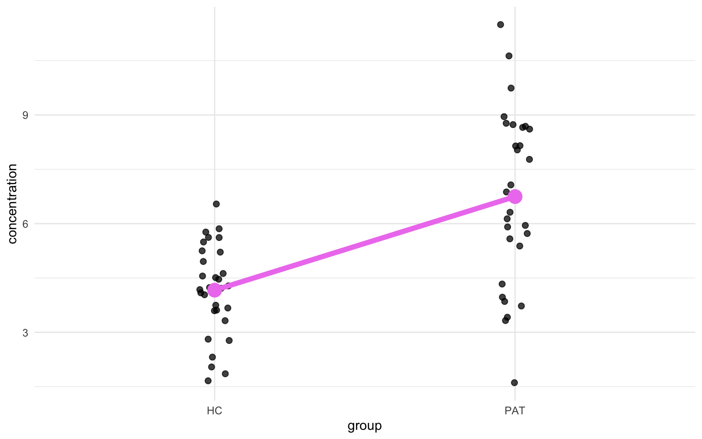
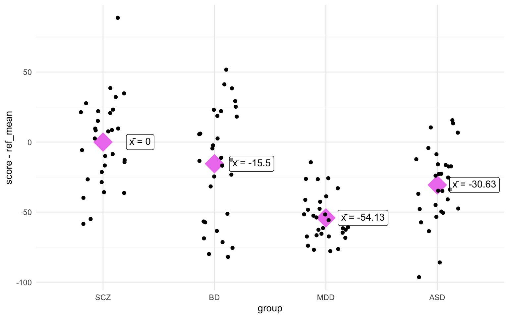

Let's imagine you're incredibly lazy and you want to learn R, but you
only want to learn one function to do statistics. What function do you
learn? I'd recommend to learn to use the `lm()` function. Why? Because
most common statistical tests are in fact nothing more than some
variation of a linear model, from the simplest One-Sample T-test to a
repeated-measures ANOVA. I think most people that have Googled for this
question have found Jonas Lindeløv's post on how [common statistical
tests are linear models](https://lindeloev.github.io/tests-as-linear/)
(as they should, it's an amazing post). Here I want to go a bit more in
depth into the mathematics behind this statement to show how common
statistical tests are in fact variations of a linear model.

Don't believe me? Fine, I'll show you.

Let's load the packages we'll use today and set a seed so it's
reproducible.

``` r
library(tidyverse)
library(patchwork)

set.seed(2022)
```

# One-Sample T-test

Let's start simple with the One-Sample T-test. This test can be used to
test how the mean value of your sample measure differs from a reference
number. Throughout this page, I'll throw around a bunch of formulas,
which, dependending on your background, can either be informative or
confusing. The formula for a One-Sample T-test is:

`$$t = \frac{\overline{x} - \mu}{\frac{\sigma}{\sqrt{n}}} = \frac{sample~mean - population~mean}{\frac{standard~deviation}{\sqrt{sample~size}}}$$`

What this says is that the effect size (*t*) is equal to the sample mean
minus the population mean (or reference number) and you divide it by the
standard deviation of the sample divided by the square root of the
sample size. This formula will output the *t*-value that you would
usually report when doing a T-test. The formula requires the standard
deviation (`$\sigma$`) of the sample values, which is:

`$$\sigma = \sqrt{\frac{\sum\limits_{i=1}^n{(x_{i} - \overline{x})^2}}{n - 1}}$$`

In this formula, you'd subtract the average across the sample values
from each individual value, square it, and sum all these resulting
values. This sum you would then divide by the size of the sample minus
one (or the degrees of freedom), and take the square root of the whole
thing. This will give the standard deviation (`$\sigma$`). Alright,
let's now consider a study where we collected blood samples from a
number of patients and measured for instance sodium levels in the blood.
We don't have a control group for this study, but we know from medical
textbooks that the reference value for sodium in healthy individuals for
the age and sex distribution in our sample is for instance 2.5 mmol/L.
Then we measure the sodium levels for 30 patients, we can simulate some
fake measurements by generating a random sequence of values with a mean
of 3 and a standard deviation of 1.2.

``` r
ref_concentration <- 2.5

n <- 30
concentration <- rnorm(n, mean = 3, sd = 1.25)
```

If we then implement these values in the formulas earlier, we get the
following result for the standard deviation:

`$$\sigma = \sqrt{\frac{\sum\limits_{i=1}^n{|x_{i} - \overline{x}|^2}}{n - 1}} = \sqrt{\frac{\sum\limits_{i=1}^{30}{|concentration_{i} - 2.855|^2}}{30 - 1}} = 1.157$$`

this formula would like like this when implemented in R:

``` r
sqrt( sum(abs(concentration - mean(concentration))^2) / (n - 1) )
```

    [1] 1.157324

But of course in any normal setting, you'd use the `sd()` function,
which will give the same result as the code above, but I just wanted to
show it for illustrative purposes. Anywhere else I'll use the `sd()`
function. Now let's calculate the *t*-value. In formula form this would
look like this:

`$$t = \frac{\overline{x} - \mu}{\frac{\sigma}{\sqrt{n}}} = \frac{2.855 - 2.5}{\frac{1.157}{\sqrt{30}}} = 1.681$$`

So just to over this formula again, you take the mean of your sample,
subtract the reference number, and you divide this number by the
standard deviation of your sample divided by the square root of the
sample size. Or in R-terms:

``` r
(mean(concentration) - ref_concentration) / (sd(concentration) / sqrt(n))
```

    [1] 1.680503

Now we can compare this to the `t.test()` function and then we'd find
the same *t*-value (barring some rounding and digit cutoffs). In this
function, since we're not comparing two samples, we set the population
mean (`mu`) we want to compare to as the reference concentration (the
default value for a One-Sample T-test is 0). What the `mu` option does
is nothing else than subtract the reference value from all values. By
doing this it centers all the values relative to 0, so if we'd run
`t.test(concentration - ref_concentration)`, we'd get the same result,
obviously with a different mean and the values of the confidence
interval have changed, although the range stays the same.

``` r
t.test(concentration, mu = ref_concentration)
```


        One Sample t-test

    data:  concentration
    t = 1.6805, df = 29, p-value = 0.1036
    alternative hypothesis: true mean is not equal to 2.5
    95 percent confidence interval:
     2.422934 3.287238
    sample estimates:
    mean of x 
     2.855086 

``` r
t.test(concentration - ref_concentration, mu = 0)
```


        One Sample t-test

    data:  concentration - ref_concentration
    t = 1.6805, df = 29, p-value = 0.1036
    alternative hypothesis: true mean is not equal to 0
    95 percent confidence interval:
     -0.07706581  0.78723830
    sample estimates:
    mean of x 
    0.3550862 

So now back to the premise of this exercise, how is a T-test the same as
a linear model? Like we showed before, subtracting the reference value
from the sample values and adding that to a T-test comparing the values
to 0 is equivalent to comparing the sample values to the reference
value. Now let's consider what a linear model does. You might recall
from high-school mathematics that the formula for a straight line is
always some form of `$y = ax + c$`, the linear model formula is somewhat
similar:

`$$Y_{i} = \beta_{0} + \beta_{1}x + \epsilon_{i}$$`

In this formula `$Y_{i}$` is the dependent variable, `$x$` is the
independent variable. `$\beta_{0}$` is equivalent to the intercept at
the y-axis, similar to `$c$` in the formula for a straight line.
`$\beta_{1}$` is the slope (equivalent to `$a$` in the formula earlier).
Finally, the `$\epsilon_{i}$` is the random error term.

Now let's build the linear model. Remember that the formula for the
linear model included this term: `$\beta_{1}x$`. In this case, since we
only have one sample, we don't have any value to multiply our value to,
so we multiply it by 1. If we wanted to correlate two variables, for
instance concentration with age, we would substitute the 1 with a
continuous variable, i.e. age, but in this case we correlate all sample
values with 1. Since we still want to compare our value to 0, we
subtract the reference value from our sample values like we did before
for the `t.test()`. Let's build the linear model.

``` r
ost_model <- lm((concentration - ref_concentration) ~ 1)
summary(ost_model)
```


    Call:
    lm(formula = (concentration - ref_concentration) ~ 1)

    Residuals:
        Min      1Q  Median      3Q     Max 
    -3.4809 -0.8653  0.0617  0.8742  1.6593 

    Coefficients:
                Estimate Std. Error t value Pr(>|t|)
    (Intercept)   0.3551     0.2113   1.681    0.104

    Residual standard error: 1.157 on 29 degrees of freedom

Again, we find the same *t*- and *p*-value as when we ran the
`t.test()`! How exciting is that! We now have three ways to obtain the
same values. Later I'll go into what the `Residuals`, `Estimate` and
`Std. Error` mean when running comparing group means with a linear
model.

# Two-Sample T-test

Now we'll apply the same logic we used for the One-Sample T-test to show
how an Two-Sample T-test is in essence a linear model. First we'll look
at the formula again, then the implementation using the `t.test()`
function, and then the linear model. Let's now consider another
experiment using the blood measurements we had before, but now we
actually do have a control sample. We have 30 participants in both
samples. Let's generate some random data:

``` r
n <- 30
data <- tibble(
  concentration = c(rnorm(n, mean = 4, sd = 1.5), rnorm(n, mean = 6, sd = 2)),
  group = rep(c("HC","PAT"), each = n)
)
```

The formula for an Two-Sample T-test is very similar to that of the
One-Sample T-test, with the added factor of the second set of sample
values. The formula for an Two-Sample T-test is as follows:

`$$t = \frac{(\overline{x_1} - \overline{x_2})}{\sqrt{\frac{\sigma_1^2}{n_1} + \frac{\sigma_2^2}{n_2}}} = \frac{(3.838073 - 5.455809)}{\sqrt{\frac{1.343565^2}{30} + \frac{1.69711^2}{30}}} = -4.093524$$`

It's a bit too complex to describe in a sentence, but the definitions
are perhaps familiar: `$\overline{x}$` for group means, `$\sigma$` for
group standard deviations, and `$n$` for group size. I find that the
simplest way to implement this in R is by first separating the groups
and then adding them in the formula.

``` r
g1 <- data %>% 
  filter(group == "HC") %>% 
  pull(concentration)
g2 <- data %>% 
  filter(group == "PAT") %>% 
  pull(concentration)

(mean(g1) - mean(g2)) / sqrt( (sd(g1)^2 / length(g1)) + (sd(g2)^2 / length(g2)) )
```

    [1] -5.268195

Then running the regular T-test is easy.

``` r
t.test(g1, g2)
```


        Welch Two Sample t-test

    data:  g1 and g2
    t = -5.2682, df = 44.011, p-value = 3.956e-06
    alternative hypothesis: true difference in means is not equal to 0
    95 percent confidence interval:
     -3.571748 -1.595147
    sample estimates:
    mean of x mean of y 
     4.162838  6.746285 

Look at that! We find the same *t*-value! Before we move on to the
linear model, I first want to do some plotting, it will help us
visualize how the linear model applies here later. Let's make a boxplot:

``` r
ggplot(data, aes(x = group, y = concentration, fill = group)) +
  geom_violin(width = 0.5, alpha = 0.2) +
  geom_boxplot(width = 0.2) +
  geom_jitter(width = 5e-2, size = 2, alpha = 0.75) +
  scico::scale_fill_scico_d(palette = "hawaii") +
  theme_minimal() + 
  theme(legend.position = "none")
```


Great! Now we have a visual representation of the data. Now, since the
T-test compares means, we can might also add a point indicating the mean
for both groups. Let's look just at the jittered points and add a line
connecting the two mean values.

``` r
mean_concentration <- data %>%
  group_by(group) %>%
  summarise(mean_conc = mean(concentration))

ggplot(data, aes(x = group)) +
  geom_jitter(aes(y = concentration), width = 5e-2, size = 2, alpha = 0.75) +
  geom_point(data = mean_concentration, aes(y = mean_conc), 
             color = "violet", size = 5) +
  geom_line(data = mean_concentration, aes(y = mean_conc), group = 1,
            size = 2, color = "violet") +
  theme_minimal()
```



You might see where we are going with this. The parameters from the
linear model will describe the angle of the diagonal line and I'll
illustrative this a further down. Let's get the values from the linear
model:

``` r
tst_model <- lm(concentration ~ group, data = data)
summary(tst_model)
```


    Call:
    lm(formula = concentration ~ group, data = data)

    Residuals:
        Min      1Q  Median      3Q     Max 
    -5.1374 -1.0563  0.0861  1.3999  4.7476 

    Coefficients:
                Estimate Std. Error t value Pr(>|t|)    
    (Intercept)   4.1628     0.3468  12.005  < 2e-16 ***
    groupPAT      2.5834     0.4904   5.268 2.11e-06 ***
    ---
    Signif. codes:  0 '***' 0.001 '**' 0.01 '*' 0.05 '.' 0.1 ' ' 1

    Residual standard error: 1.899 on 58 degrees of freedom
    Multiple R-squared:  0.3236,    Adjusted R-squared:  0.312 
    F-statistic: 27.75 on 1 and 58 DF,  p-value: 2.11e-06

First of all, let's look at the `groupPAT`, there we find the same
*t*-value as we did when we ran the T-tests earlier, although with the
sign flipped. I'll show later why that is.

Now, back to the plot. The x-axis has two conditions: `HC` and `PAT`,
but let's imagine those values are `0` and `1`. Let's now also throw
back to the time we recalled the formula for a straight line:
`$y = ax + c$`. In this context we only have two x-values, `HC` and
`PAT` or `0` and `1`. Then we can obtain `$y$` in the formula by solving
the equation when `$x$` is equal to `0`, in that case `$y$` becomes just
the mean concentration of the healthy controls, or the big magenta dot
in the previous plot, and that is a value we can calculate. Remember
that `0` in the formula below stands for `HC`. That looks something like
this:

`$$ \begin{eqnarray} \overline{x}_{0} &=& a \times 0 + c \\ c &=& \overline{x}_{0} \\  &=& 4.162838 \end{eqnarray} $$`

So that's the constant our formula. If we look back at the output from
the `lm()` function, we see that this value is represented as the
`Estimate` of the `(Intercept)` row! Let's also solve `$a$`. Remember
that `$a$` represents the slope of the line. How do we get the slope?
The slope is basically nothing more than the difference between the mean
values of `HC` and `PAT`, but let's solve it in a more elegant way, by
using the same formula we used to find `$c$`. We'll use the same coding
as before, `0` for `HC` and `1` for `PAT`. Remember that `$c$` is equal
to the mean value of `HC` (aka `$\overline{x}_{0}$`).

`$$ \begin{eqnarray} \overline{x}_{1} &=& a \times 1 + c \\  &=& a + \overline{x}_{0} \\ a &=& \overline{x}_{1} - \overline{x}_{0} \\  &=& 6.746285 - 4.162838 \\  &=& 2.583447 \end{eqnarray} $$`

And then we find that `$a$` is equal to the `Estimate` column for the
`groupPAT` row.

We can reverse engineer the *t*-value too using just the output from the
`lm()` function. One can imagine that if one would plot a situation
where the null hypothesis (H<sub>0</sub>) is true, the slope of that
line would be 0 since then there's no difference between the mean of the
two groups (inb4 the angry statisticians: it's more complicated than
that but let me use this for now). We'll take the difference between our
observed slope, or the slope of the alternative hypothesis
(H<sub>0</sub>), and the slope of the null hypothesis, which is 0, and
divide that by the standard error of the sampling distribution, which is
given by the `lm()` function as the `Std. Error` of the `groupPAT` row:

`$$t = \frac{slope\ of\ regression\ line\ at\ H_{a} - slope\ of\ regression\ line\ at\ H_{0}}{standard\ error\ of\ sampling\ distribution} = \frac{1.6177 - 0}{0.3952} = 4.093$$`

Which as you'll notice is one thousandths-decimal place off, which is
due to rounding errors. `lm()` reports up to 4 decimal points while it
uses more for the calculation. And now we've come full circle, because
the slope of the regression line is nothing more than the difference
between the mean of the second group minor the mean of the first group.
Now we can go back to the figure we made earlier and see how all these
values relate:


And that's how a Two-Sample T-test is basically a linear model!

# ANOVA

Based on what we did in the previous section, you may already predict
what we'll do in this section. Instead of one or two groups, we'll now
show how this works for more than two groups. The mathematics becomes a
bit more long-winded and the visualizations a bit less clear, so we'll
just stick with the R code. Let's for instance say we have four groups
of patients and each have a certain score on a questionnaire:

``` r
n <- 30
data <- tibble(score = round(c(rnorm(n, mean = 75, sd = 30), 
                               rnorm(n, mean = 60, sd = 35),
                               rnorm(n, mean = 30, sd = 17),
                               rnorm(n, mean = 45, sd = 32))),
               group = rep(c("SCZ", "BD", "MDD", "ASD"), each = n)) %>%
  mutate(group = as_factor(group))
```

Those of you that have used the `aov()` function before might have
noticed the similarity in syntax between `aov()` and `lm()`, this is not
a coincidence. The `aov()` function in R is actually just a wrapper for
the `lm()` function, the `anova()` function reports the ANOVA
calculations. That's why I just want to compare them both side-by-side
now. Let's run the ANOVA first:

``` r
aov_model <- aov(score ~ group, data = data)
summary(aov_model)
```

                 Df Sum Sq Mean Sq F value   Pr(>F)    
    group         3  47872   15957   17.79 1.45e-09 ***
    Residuals   116 104058     897                     
    ---
    Signif. codes:  0 '***' 0.001 '**' 0.01 '*' 0.05 '.' 0.1 ' ' 1

And then the linear model:

``` r
anova_lm_model <- lm(score ~ group, data = data)
summary(anova_lm_model)
```


    Call:
    lm(formula = score ~ group, data = data)

    Residuals:
        Min      1Q  Median      3Q     Max 
    -66.100 -16.692   1.717  20.525  88.400 

    Coefficients:
                Estimate Std. Error t value Pr(>|t|)    
    (Intercept)   73.600      5.468  13.460  < 2e-16 ***
    groupBD      -15.500      7.733  -2.004 0.047365 *  
    groupMDD     -54.133      7.733  -7.000 1.77e-10 ***
    groupASD     -30.633      7.733  -3.961 0.000129 ***
    ---
    Signif. codes:  0 '***' 0.001 '**' 0.01 '*' 0.05 '.' 0.1 ' ' 1

    Residual standard error: 29.95 on 116 degrees of freedom
    Multiple R-squared:  0.3151,    Adjusted R-squared:  0.2974 
    F-statistic: 17.79 on 3 and 116 DF,  p-value: 1.448e-09

The first thing you might notice is that the *F*-statistic and the
*p*-value are the same in both models.

``` r
ref_mean <- data %>% 
  filter(group == "SCZ") %>% 
  pull(score) %>% 
  mean()

anova_group_means <- data %>% 
  group_by(group) %>% 
  summarise(score = mean(score)) %>% 
  mutate(ref_mean = ref_mean,
         mean_adj = score - ref_mean)

ggplot(data, aes(x = group, y = score - ref_mean)) + 
  stat_summary(fun = mean, geom = "point", 
               size = 10, color = "violet", shape = 18) + 
  geom_jitter(width = 0.2) + 
  ggtext::geom_richtext(data = anova_group_means,
                        aes(label = str_glue("x&#772; = {round(mean_adj, 2)}")), 
                        fill = "#ffffff80", nudge_x = 1/3) + 
  theme_minimal()
```



Oh, would you look at that! The differences between the group means and
the reference mean (in this case SCZ) correspond with the `Estimate` of
the linear model! Let's also see if we can reproduce the sum of squares
from the ANOVA summary. We'll go a bit more in depth into the sum of
squares further down, but I just wanted to go over a few formulas and
calculations:

`$$ \begin{eqnarray} total~sum~of~squares &=& \sum\limits_{j=1}^{J} n_{j} \times (\overline{x}_{j} - \mu)^2 \\ residual~sum~of~squares &=& \sum\limits_{j=1}^{J} \sum\limits_{i=1}^{n_{j}} (y_{ij} - \overline{y}_{j})^2 \end{eqnarray} $$`

Just briefly, the first formula takes the mean value for the group in
question, subtracts the overall mean (or grand mean) and squares the
result. Then it multiplies this number by the sample size in this group.
In this case we'll only do it for the first group since that's the one
listed in the `summary(aov_model)` output. The second formula calculates
the residual sum of squares (or sum of squared error), we'll come back
to this later. In essence it substracts the group mean from each of the
individual values, squares it, and sums it first within the group, and
then sums it again across the groups.

We can do both calculations in one go with the following quick code:

``` r
data %>% 
  mutate(overall_mean = mean(score)) %>% 
  group_by(group) %>% 
  summarise(group_mean = mean(score),
            group_n = n(),
            overall_mean = first(overall_mean),
            sq_group = group_n * (group_mean - overall_mean)^2,
            sq_error = sum((score - group_mean)^2)) %>% 
  ungroup() %>% 
  summarise(ss_group = sum(sq_group),
            ss_error = sum(sq_error))
```

    # A tibble: 1 × 2
      ss_group ss_error
         <dbl>    <dbl>
    1   47872.  104058.

Now look back at the output from `summary(aov_model)` and we'll find the
same values! I'll leave it here for now, but we'll come back to sum of
squares (of different varieties later).

# A linear model is a linear model

Well that's a statement of unequaled wisdom, isn't it? No wonder they
give us doctorates to talk about this stuff.

I don't think I need a lot of effort to convince anyone that a linear
model is a linear model. Actually, I'm so convinced that you are aware
that a linear model is a linear model that I wanted to about something
else instead. Instead I wanted to dive into residuals and R<sup>2</sup>.
Before we start, let's first simulate some data, We'll create an age
column, a sex column, and a measure column. We'll make it so that the
measure column correlates with the age column.

``` r
n <- 20
data <- tibble(age = round(runif(n = n, min = 18, max = 60)),
               sex = factor(sample(c("Male", "Female"), size = n, replace = TRUE), 
                            levels = c("Male", "Female"))) %>%
  mutate(measure = 1e-2 * age + sqrt(1e-2) * rnorm(n))
```

We've used the formula for a straight line in previous sections
(`$y = ax + c$`), we can apply it here too, but instead of the
difference in the mean between two groups, the slope of the line
(denoted by `$a$`) is now derived from the slope at which the line has
the least distance to all points, referred to as the best fit. We will
plot this later, but first we should maybe just run the linear model:

``` r
lm_model <- lm(measure ~ age, data = data)
summary(lm_model)
```


    Call:
    lm(formula = measure ~ age, data = data)

    Residuals:
         Min       1Q   Median       3Q      Max 
    -0.11593 -0.08740  0.00416  0.02975  0.20023 

    Coefficients:
                Estimate Std. Error t value Pr(>|t|)    
    (Intercept) 0.093800   0.089076   1.053 0.306255    
    age         0.008074   0.002010   4.017 0.000808 ***
    ---
    Signif. codes:  0 '***' 0.001 '**' 0.01 '*' 0.05 '.' 0.1 ' ' 1

    Residual standard error: 0.09828 on 18 degrees of freedom
    Multiple R-squared:  0.4728,    Adjusted R-squared:  0.4435 
    F-statistic: 16.14 on 1 and 18 DF,  p-value: 0.0008079

We find that there is a significant association between age and our
measure, and the R<sup>2</sup> is about 47%. Recall that R<sup>2</sup>
denotes the amount of variance explained by the predictor, or age in our
case. We can plot the linear model in `ggplot` with the `geom_smooth()`
function, and then setting the `method` to `"lm"`:

``` r
ggplot(data, aes(x = age, y = measure)) +
  geom_point(size = 4, alpha = 0.8) +
  geom_smooth(method = "lm", color = "grey30") +
  scale_x_continuous(limits = c(18,60)) +
  theme_minimal()
```

    `geom_smooth()` using formula 'y ~ x'


The line in the figure above shows the line that best fits the points
with a ribbon indicating the standard error.

Back to our data. We know that a linear models fits a line that
"predicts" outcome based on some other variable. This is heavily
simplified, but it'll make clear what we'll do next. So what we did
before with the best fit line was create one line that best fits all the
data points, but now we want to relate that back to our data points.
What would our values be if they would be exactly on this line? To get
this, all we have to do is calculate the difference between the current
data point and the value of the best fit line at the corresponding
"predictor" value. We could do it by hand, but since this section is
quite long already, I'll skip straight to the R function, which is
appropriately called `predict.lm()`. It takes the linear model we
created with the `lm()` function earlier as input. It outputs a vector
with the predicted values based on the model.

``` r
data <- data %>% 
  mutate(measure_pred = predict.lm(lm_model))
```

With that we can quickly calculate the residual standard error
(oversimplified, it's a measure of how well a regression model fits a
dataset). The formula for the residual standard error is this:

`$$Residual~standard~error = \sqrt{\frac{\sum(observed - predicted)^2}{degrees~of~freedom}}$$`

or in R terms (the degrees of freedom is 18 here, too complicated to
explain for now):

``` r
sqrt(sum((data$measure - data$measure_pred)^2) / 18)
```

    [1] 0.09827566

So that checks out. What we can then also do is calculate the difference
between the observed and the predicted values values, this is called the
residual:

``` r
data <- data %>%
  mutate(residual = measure - measure_pred)
```

We can check that this is correct too by comparing the residuals we
calculated with the output from the `predict.lm()` function to the
output of the `residuals(lm_model)`:

``` r
tibble(residual_manual = data$residual,
       residual_lm = residuals(lm_model)) %>% 
  glimpse()
```

    Rows: 20
    Columns: 2
    $ residual_manual <dbl> -0.022378283, 0.092888415, -0.106844019, -0.047841680,…
    $ residual_lm     <dbl> -0.022378283, 0.092888415, -0.106844019, -0.047841680,…

Predictably, when we sum all the individual differences (or residuals)
we would get 0 (allowing for rounding errors) since the regression line
perfectly fits in between the datapoints.

``` r
sum(data$residual)
```

    [1] 9.992007e-16

We can visualize the residuals using the `geom_smooth()` function. First
I just want to show the difference visually in the scatter plot we had
before. I added points along the regression line to indicate where each
point will move to, and an arrow to indicate the size and the direction
of the difference between the observed and the predicted value:


You might have noticed now that the size of the arrow is defined as the
difference between the observed and predicted value, i.e. the residual!
Now, you might have come across the term "sum of squared error" in
different textbooks. With the values that we've calculated so far we can
illustrate where this comes from. Imagine that the arrow in the figure
above is one side of a square. How do you get the area of a suqare? You
multiply the length of one side of the square by itself, i.e. you square
it! That's where the "squared error" part of that comes from. Perhaps
the figure below helps illustrate it:


The "sum" part of "sum of squared error" refers to the sum of the areas
of those squares. Simply, you sum the square of the sides. You can also
look at it in mathematical form:

")

We'll use this formula again a bit later to calculate the R<sup>2</sup>.

In order to calculate the squared regression coefficient, we should also
calculate the mean value of the measure across all points. This is
necessary because the squared regression coefficient is defined as a
perfect correlation (i.e. a correlation coefficient of 1) minus the
explained variance divided by the total variance, or in formula form:

`$$R^2 = perfect~correlation - \frac{explained~variance}{total~variance} = 1 - \frac{\sum(difference~with~regression~line^2)}{\sum(difference~with~mean~value^2)}$$`

Explained variance is defined here as the sum of squared error. You
might notice the sum symbols and the squares, so you might guess that
this formula is also some kind of sum of squares, and it is! As we
already discovered, the numerator in this formula is the sum of squared
error, the denominator is referred to as the sum of squared total. And
the composite of those two is referred to as the sum of squared
regression. Making three different sum of squares.

Important here is to notice that the error term has switched from the
difference between the values with the group mean (as in ANOVA) to the
difference between the values and the regression line. Where in the
linear model the predicted value was the regression line, in the ANOVA
is represented as group mean instead.

We've already plotted the sum of squared error, now we'll also
illustrate sum of squared total. Remember the sum of squared total is
the sum of squared differences between the observed values and the mean
value. I'll also add the original regression line in the background to
show the difference with the sum of squared error.


We already calculated the difference with the regression line, then to
calculate the difference with the mean is simple:

``` r
data <- data %>% 
  mutate(measure_mean = mean(measure),
         difference_mean = measure - measure_mean)
```

Sidenote, if you wanted to calculate the total variance the formula for
that would look like this:

`$$S^2 = \frac{\sum(x_{i} - \overline{x})^2}{n - 1}$$`

Notice how the numerator is the same calculation as the sum of squared
total, then divided by the sample size minus 1 (like the degrees of
freedom).

To calculate the squared regression coefficient (R<sup>2</sup>) from the
formula above is then simple. We take 1 (perfect correlation) and
subtract the sum of the squared residuals (explained variance) divided
by the sum of the squared difference with the mean (total variance). In
R terms, that would look like this:

``` r
1 - sum(data$residual^2) / sum(data$difference_mean^2)
```

    [1] 0.4727552

And there we have it, the regression coefficient R<sup>2</sup>! You can
check that it's the same by scrolling up to where we ran
`summary(lm_model)` and you'll find the same number. We could also
calculate the F-statistic and the *t*- and *p*-values, but I think this
tutorial has drained enough cognitive energy. For this last section, I
hope it's become clear what we mean when we talk about "residuals", "sum
of squares", and "variance" in the context of linear models. I also hope
it's enlightened you a bit on what a linear model does and how it works.

# Conclusion

There's many more things we could go over, multiple linear regression,
non-parametric tests, etc., but I think we have done enough nerding for
today. I hope I managed to show you the overlap in different statistical
tests. Does that mean that you should only run linear models for now?
No, of course not. But I do think it may be good to have an overview of
where the values you get come from and what they might mean in different
contexts. Hope this was enlightening. Happy learning!

## Resources

-   [Common statistical tests are linear models (or: how to teach
    stats) - Jonas Kristoffer
    Lindeløv](https://lindeloev.github.io/tests-as-linear/)
-   [The Linear Regression Family in R - Athanasia
    Mowinckel](https://drmowinckels.netlify.app/blog/2020-06-24-the-linear-regression-family-in-r/)
-   [STAT 415: Introduction to Mathematical Statistics - Penn State
    Department of
    Statistics](https://online.stat.psu.edu/stat415/lesson/13/13.2)
-   [ANOVA for Regression - Rahul
    Pathak](https://towardsdatascience.com/anova-for-regression-fdb49cf5d684)
-   [Explaining the `lm` summary in R - Learn by
    Marketing](https://www.learnbymarketing.com/tutorials/explaining-the-lm-summary-in-r/)

<details>
<summary>
Session info for reproducibility purposes
</summary>

``` r
sessionInfo()
```

    R version 4.1.2 (2021-11-01)
    Platform: x86_64-apple-darwin17.0 (64-bit)
    Running under: macOS Big Sur 10.16

    Matrix products: default
    BLAS:   /Library/Frameworks/R.framework/Versions/4.1/Resources/lib/libRblas.0.dylib
    LAPACK: /Library/Frameworks/R.framework/Versions/4.1/Resources/lib/libRlapack.dylib

    locale:
    [1] en_GB.UTF-8/en_GB.UTF-8/en_GB.UTF-8/C/en_GB.UTF-8/en_GB.UTF-8

    attached base packages:
    [1] stats     graphics  grDevices utils     datasets  methods   base     

    other attached packages:
     [1] patchwork_1.1.1 forcats_0.5.1   stringr_1.4.0   dplyr_1.0.8    
     [5] purrr_0.3.4     readr_2.1.2     tidyr_1.2.0     tibble_3.1.6   
     [9] ggplot2_3.3.5   tidyverse_1.3.1

    loaded via a namespace (and not attached):
     [1] Rcpp_1.0.8.3     lattice_0.20-45  lubridate_1.8.0  assertthat_0.2.1
     [5] digest_0.6.29    utf8_1.2.2       R6_2.5.1         cellranger_1.1.0
     [9] backports_1.4.1  reprex_2.0.1     evaluate_0.15    httr_1.4.2      
    [13] pillar_1.7.0     rlang_1.0.2      readxl_1.3.1     rstudioapi_0.13 
    [17] Matrix_1.4-0     rmarkdown_2.12   splines_4.1.2    labeling_0.4.2  
    [21] munsell_0.5.0    gridtext_0.1.4   broom_0.7.12     compiler_4.1.2  
    [25] modelr_0.1.8     xfun_0.30        pkgconfig_2.0.3  mgcv_1.8-38     
    [29] scico_1.3.0.9000 htmltools_0.5.2  ggtext_0.1.1     tidyselect_1.1.2
    [33] fansi_1.0.3      crayon_1.5.1     tzdb_0.2.0       dbplyr_2.1.1    
    [37] withr_2.5.0      grid_4.1.2       nlme_3.1-155     jsonlite_1.8.0  
    [41] gtable_0.3.0     lifecycle_1.0.1  DBI_1.1.2        magrittr_2.0.3  
    [45] scales_1.1.1     cli_3.2.0        stringi_1.7.6    farver_2.1.0    
    [49] fs_1.5.2         xml2_1.3.3       ellipsis_0.3.2   generics_0.1.2  
    [53] vctrs_0.4.0      tools_4.1.2      glue_1.6.2       markdown_1.1    
    [57] hms_1.1.1        fastmap_1.1.0    yaml_2.3.5       colorspace_2.0-3
    [61] rvest_1.0.2      knitr_1.37       haven_2.4.3     

</details>
