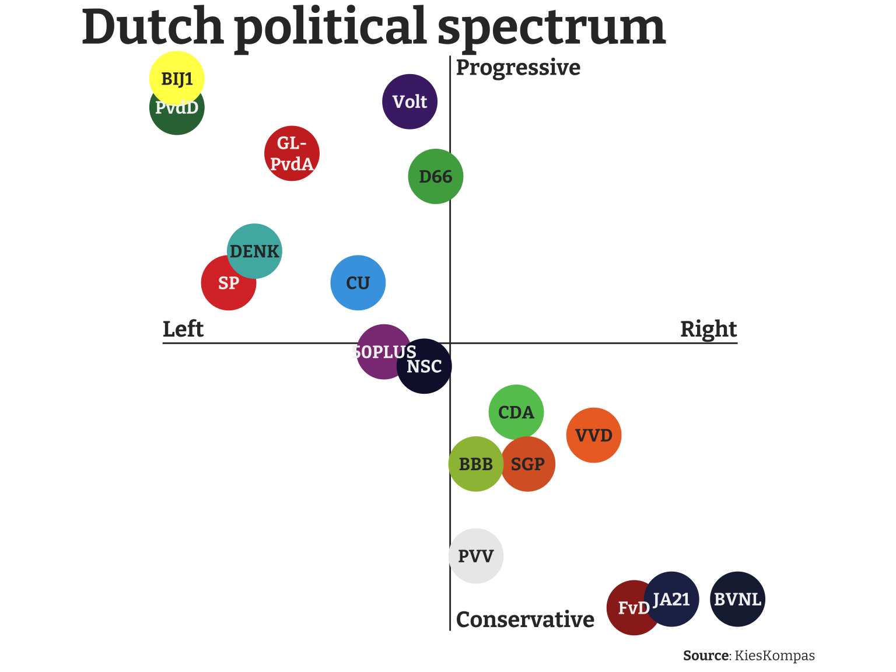
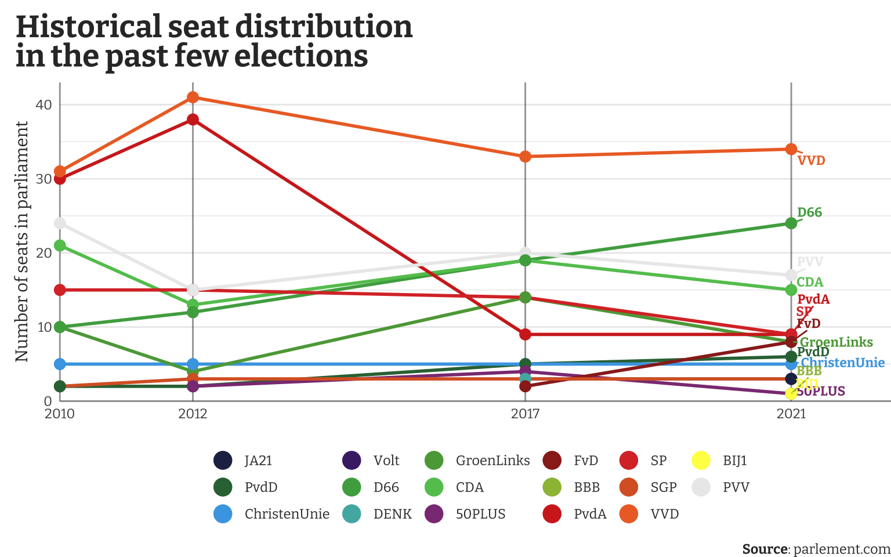
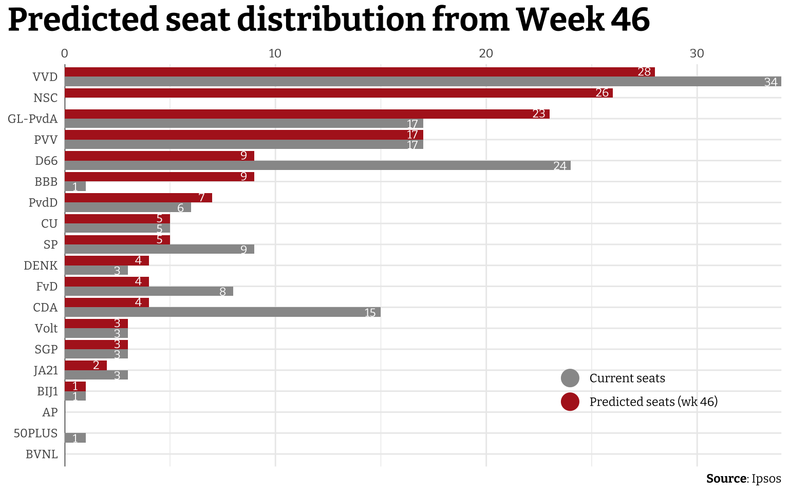
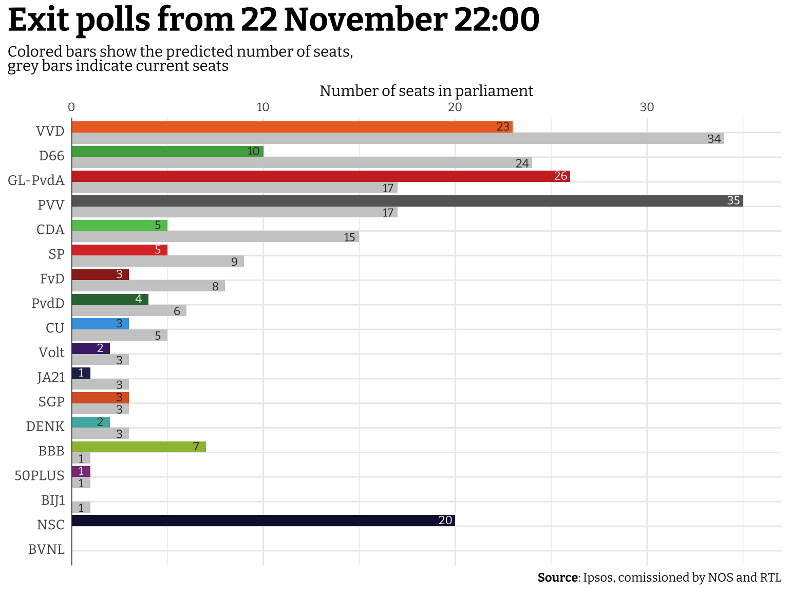
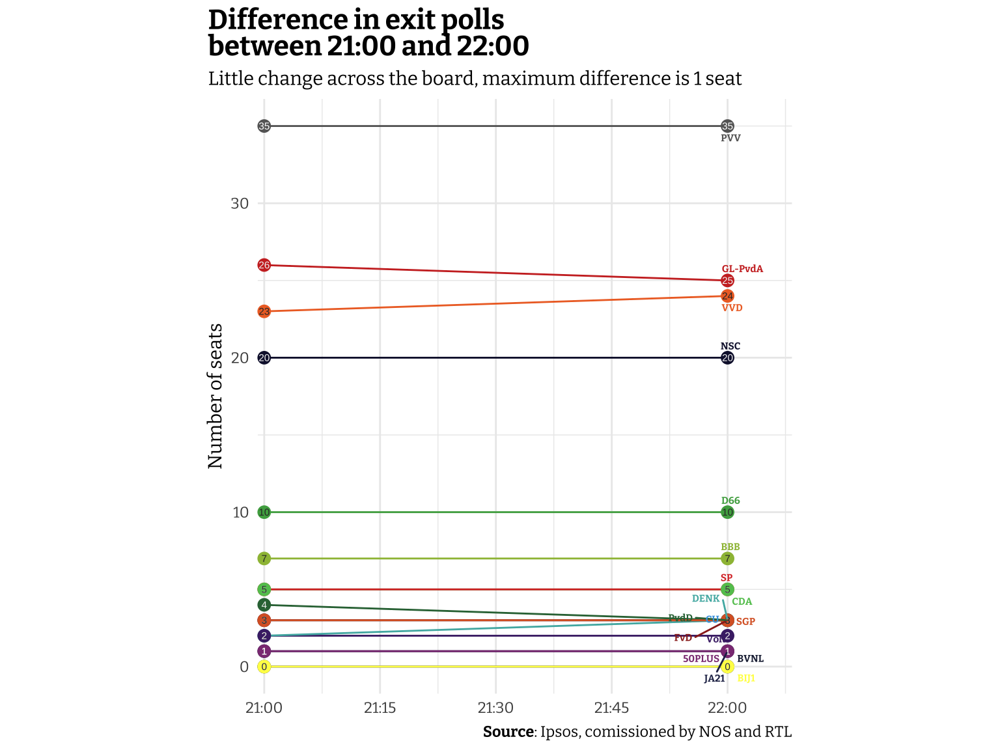

So it's time again for the Netherlands to have another election for the Dutch parliament ([*Tweede Kamer*](https://en.wikipedia.org/wiki/House_of_Representatives_(Netherlands))) The previous one was only in 2021, and we had elections in 2023 already for the Provinces and indirectly for the Dutch "Senate" ([*Eerste Kamer*](https://en.wikipedia.org/wiki/Senate_(Netherlands))), but the parliamentary elections are the most important ones, usually taking place every four years (until one of the coalition partners believes they cannot support the government anymore, or if one of parties in government believe it's in their best interest to have another election sooner rather than later).

Anyway, parliamentary elections are a prime example of how and why data vizualization is important. Data is used extensively throughout the political campaigns to get political points across (whether it's used justly or disingenuously). For data analysts and data journalists, vizualizing the polls, results, and trends as the data comes in is a key challenge throughout the night. Since this is a unique event that happens (hopefully) only once every four years, so I thought I'd jump on the opportunity to provide my (admittedly unrequested) take on the data visualizations that are important to share.

The plots I'll share here are a bit more complicated than the usual ones (especially in cases where I actively try to recreate a plot), so I'll hide the code to each plot by default, but you can see the code by clicking "Show code" or "Show code for the plot".

I'll also separate this post in when I added the new plots and data. I'll mark the (general) time I added a new section.



## 21 November

Some of the plots I could create beforehand, this data about the polls leading up to election dayy. I also made sure to create a few datasets that might help me speed up the work during election night. So I'll add color and accent colors and their political identity. First, I'll load the packages we'll use here. I'll also load a custom font I'll use for the plots.

<details>
<summary>Show code</summary>

``` r
library(tidyverse)
library(ggtext)
library(rvest)
library(showtext)

font_add_google("Bitter", family = "custom")
showtext_auto()
```

</details>


There are a ton of voting advice websites, but only a few (including *KiesKompas*) are generally recommended by a variety of political parties across the spectrum


Then we can create a data frame with the party names and their identifying colors. I'll also add their political identity, i.e. how far left or right the parties are and how progressive or conservative the parties are. This data comes from the webpage [*the political landscape*](https://tweedekamer2023.kieskompas.nl/nl/results/compass) from the Dutch voting advice website [*KiesKompas*](https://www.kieskompas.nl) which offers one of the most popular application that helps voters identify what parties their values most closely align with. It's a tool by the Vrije Universiteit Amsterdam (VU Amsterdam) and is generally well-respected. However, their political landscape is a bit controversial because it tends to "average" across a set of issues, while perhaps ignoring some of the key identifying issue a party is campaigning on (historically e.g. immigration and the PVV).

One more complication here is that two parties, *GroenLinks* (GL) and the *Partij van de Arbeid* (PvdA), campaigned under a single banner, referred to here as *GL-PvdA*. When comparing to previous elections, polls and election outcomes should probably be summed across those two parties to better reflect the trends.

<details>
<summary>Show code</summary>

``` r
data_parties <- tribble(
  ~party, ~leftright, ~progcon, ~color, ~text_color,
  "VVD", 50, -32, "#EE6F2D", "#333333",
  "D66", -5, 58, "#4DAA4F", "#333333",
  "GL-PvdA", -55, 66, "#CD3029", "grey95",
  "PVV", 9, -74, "grey92", "#333333",
  "CDA", 23, -24, "#62C45D", "#333333",
  "SP", -77, 21, "#DA3732", "grey95",
  "FvD", 64, -92, "#9B2820", "grey95",
  "PvdD", -95, 82, "#317142", "grey95",
  "CU", -32, 21, "#46A4E2", "#333333",
  "Volt", -14, 84, "#4A2975", "grey95",
  "JA21", 77, -89, "#242C54", "grey95",
  "SGP", 27, -42, "#DA632C", "#333333",
  "DENK", -68, 32, "#50B4B1", "#333333",
  "50PLUS", -23, -3, "#8C3D83", "grey95",
  "BBB", 9, -42, "#9DBD43", "#333333",
  "BIJ1", -95, 92, "#FFFD54", "#333333",
  "BVNL", 100, -89, "#1D2540", "grey95",
  "NSC", -9, -8, "#121439", "grey95"
)

data_historical_parties <- tribble(
  ~party, ~hist_leftright, ~hist_progcon, ~hist_color, ~hist_text_color,
  "PvdA", -65, 50, "#D22C21", "grey95",
  "GroenLinks", -70, 68, "#5BA546", "#333333",
  "ChristenUnie", -32, 21, "#47A6E5", "#333333",
)
```

</details>

Recreating the political compass is fairly simple once the data is loaded. It's in principle simply a scatterplot. Making it look informative by labeling the points directly and adding the colors and annotations in an informative matter is the only challenge here.

<details>
<summary>Show code</summary>

``` r
compass_text <- tribble(
  ~leftright, ~progcon, ~label,
  -100, 5, "Left",
  80, 5, "Right",
  2, 96, "Progressive",
  2, -96, "Conservative"
)

data_parties |>
  mutate(party = str_replace(party, "-", "-\n")) |>
  ggplot(aes(x = leftright, y = progcon, color = color)) +
  geom_hline(yintercept = 0, color = "#333333") +
  geom_vline(xintercept = 0, color = "#333333") +
  geom_text(
    data = compass_text, aes(label = label),
    size = 5, color = "#333333",
    hjust = 0, fontface = "bold", family = "custom"
  ) +
  geom_point(size = 16) +
  geom_text(
    aes(label = party, color = text_color),
    size = 4, lineheight = 1,
    fontface = "bold", family = "custom"
  ) +
  labs(
    title = "**Dutch political spectrum**",
    x = NULL,
    y = NULL,
    caption = "**Source**: KiesKompas"
  ) +
  scale_x_continuous(
    limits = c(-100, 100),
    labels = NULL,
    expand = expansion(add = 0)
  ) +
  scale_y_continuous(
    limits = c(-100, 100),
    labels = NULL,
    expand = expansion(add = 0)
  ) +
  scale_color_identity() +
  coord_equal(clip = "off") +
  theme_minimal(base_family = "custom") +
  theme(
    text = element_text(color = "#333333"),
    plot.title.position = "plot",
    plot.title = element_markdown(size = 32, margin = margin(l = -50)),
    plot.caption.position = "plot",
    plot.caption = element_markdown(margin = margin(t = 10, r = -50)),
    panel.grid = element_blank()
  )
```

</details>




Geert Wilders is also the party's sole member ([link](https://en.wikipedia.org/wiki/Party_for_Freedom#Organisation_and_support))


It's immediately visible that the political parties (as broken down by *KiesKompas*) are aligned across a diagonal from right and conservative to left and progressive. Parties that are both left-wing and conservative, or right-wing and progressive are not really present in the mainstream Dutch political system (or in most foreign ones as far as I'm aware). There are three parties in the lower-right corner (FvD, JA21, and BVNL). JA21 and BVNL are both factions that left the FvD after internal disagreement. The PVV is perhaps best known internationally for their leader [Geert Wilders](https://www.britannica.com/biography/Geert-Wilders). According to *KiesKompas* they are somewhere in the middle between left and right-wing, but in this case the party can probably be best described as *populist*, adapting both policies from the left and right. Internationally, they associate most with far-right parties and in the Netherlands they are also commonly called far-right.

The only squarely left-wing party of significance this election is the coalition GL-PvdA, led by former EU Commissioner [Frans Timmermans](https://www.theguardian.com/world/2023/jul/20/eu-climate-chief-frans-timmermans-quits-to-run-in-dutch-elections).

Before I move to the lastest polls, I can show how the seats have been distributed across the political parties over the past election cycles. For this I'll quickly scrape the [parlement.com](https://www.parlement.com) website for the seat distribution across the past few elections.

<details>
<summary>Show code</summary>

``` r
data_tk_history <- "https://www.parlement.com/id/vh8lnhronvx6/zetelverdeling_tweede_kamer" |>
  read_html() |>
  html_elements("table") |>
  html_table() |>
  first() |>
  janitor::clean_names() |>
  rename_with(~ str_glue("election_{str_sub(.x, 2, 5)}")) |>
  rename(party = election_arti) |>
  mutate(
    party = str_extract(party, "[^<!]+"),
    across(starts_with("election"), as.integer)
  )
```

</details>

Then we can merge this dataset with the metadata tibble I created earlier to get the colors so I can use them in plotting. This plot is a simple "time-series"-like plot using `geom_path()`. The biggest challenge here was to annotate all the parties properly. I chose for a combination of both labeling each line explicitly and adding a legend with the specification for each color. However, since many parties use very similar colors this legend alone was not enough.

<details>
<summary>Show code</summary>

``` r
data_tk_hist <- data_tk_history |>
  left_join(data_parties, by = "party") |>
  left_join(data_historical_parties, by = "party") |>
  mutate(
    color = coalesce(color, hist_color),
    text_color = coalesce(text_color, hist_text_color)
  )

legend_list <- data_tk_hist |>
  select(color, party) |>
  deframe()

data_tk_hist |>
  pivot_longer(starts_with("election"),
    names_to = "year", values_to = "seats"
  ) |>
  mutate(
    year = parse_number(year)
  ) |>
  ggplot(aes(x = year, y = seats, color = color)) +
  geom_hline(yintercept = 0, color = "#333333", alpha = 0.5) +
  geom_vline(
    xintercept = na.omit(names(data_tk_hist) |> parse_number()),
    color = "#333333", alpha = 0.5
  ) +
  geom_path(linewidth = 1, key_glyph = "point") +
  geom_point(size = 3) +
  ggrepel::geom_text_repel(
    data = . %>% slice_max(year),
    aes(label = party),
    xlim = c(2021, NA), min.segment.length = 0,
    hjust = 0, size = 3, fontface = "bold", family = "custom"
  ) +
  labs(
    title = "Historical seat distribution<br>in the past few elections",
    x = NULL,
    y = "Number of seats in parliament",
    color = NULL,
    caption = "**Source**: parlement.com"
  ) +
  scale_x_continuous(
    breaks = na.omit(names(data_tk_hist) |> parse_number()),
    expand = expansion(add = c(0, 1.5))
  ) +
  scale_y_continuous(
    expand = expansion(add = c(0, 2))
  ) +
  scale_color_identity(
    labels = legend_list,
    guide = guide_legend(override.aes = list(size = 5), nrow = 3)
  ) +
  coord_cartesian(clip = "off") +
  theme_minimal(base_family = "custom") +
  theme(
    text = element_text(color = "#333333"),
    plot.title = element_markdown(size = 20, face = "bold"),
    plot.title.position = "plot",
    plot.caption = element_markdown(),
    plot.caption.position = "plot",
    plot.margin = margin(l = 10, t = 10),
    legend.position = "bottom",
    panel.grid.major.x = element_blank(),
    panel.grid.minor.x = element_blank()
  )
```

</details>




In contrast to [Geert Wilders](https://www.britannica.com/biography/Geert-Wilders), [Mark Rutte](https://www.britannica.com/biography/Mark-Rutte) does not have an elaborate entry in the Encyclopedia Brittanica


This plot immediately shows the dominance of the VVD, the party of [Mark Rutte](https://en.wikipedia.org/wiki/Mark_Rutte) who is quite well-known internationally. The PvdA, which internationally associates with traditional labour parties, used to be the biggest opponent to the centre-right CDA and the right-wing VVD, but have since then failed to connect with the voters.


I scraped this data earlier in the week, so the current table online does not reflect the data used here


Let's now also look at some polls to see what election night might bring. For this I'll scrape the results from [Ipsos](https://www.ipsos.com). It contains the polls from week 44 and week 46.

<details>
<summary>Show code</summary>

``` r
data_polls_pre <- "https://www.ipsos.com/sites/default/files/nl/nl/politiekebarometer/Link_Tabel.html" |>
  read_html() |>
  html_elements("table") |>
  html_table(header = TRUE) |>
  first() |>
  janitor::clean_names() |>
  filter(nchar(x) > 0) |>
  rename(
    party = x,
    current_perc = tweede_kamer,
    current_seats = tweede_kamer_2,
    polls_perc_wk_44 = week_441_nov_23,
    polls_seats_wk_44 = week_441_nov_23_2,
    polls_perc_wk_46 = week_4615_nov_23,
    polls_seats_wk_46 = week_4615_nov_23_2
  ) |>
  mutate(across(-party, as.numeric))

data_polls_pre |> write_rds("./data/polls_wk_46.rds")
```

</details>

From this table I'll use only the polls from week 46 (latest available at the time). To better compare the polls to the current situation without drowning out the most important data I'll show the current seat distribution in grey, and the predicted seats in red.

<details>
<summary>Show code for the plot</summary>

``` r
data_polls_pre_new <- read_rds("./data/polls_wk_46.rds") |>
  bind_rows(
    read_rds("./data/polls_wk_46.rds") |>
      filter(party %in% c("GL", "PvdA")) |>
      summarise(
        party = "GL-PvdA", across(-party, sum)
      )
  ) |>
  group_by(party) |>
  summarise(across(everything(), sum)) |>
  filter(!party %in% c("GL", "PvdA")) |>
  mutate(party = case_when(
    str_detect(party, "50") ~ "50PLUS",
    str_detect(party, "VOLT") ~ "Volt",
    TRUE ~ party
  ))

data_polls_pre_new |>
  pivot_longer(cols = contains("seats"),
               names_to = "seats_var", values_to = "n_seats") |>
  filter(seats_var %in% c("current_seats", "polls_seats_wk_46")) |>
  ggplot(aes(x = n_seats, y = reorder(party, polls_perc_wk_46), fill = seats_var)) +
  geom_vline(xintercept = 0, color = "#333333") +
  geom_col(position = position_dodge(), key_glyph = "point") +
  geom_text(
    aes(x = n_seats - 0.5, label = n_seats),
    position = position_dodge(width = 1),
    color = "white", size = 3, family = "custom"
  ) +
  labs(
    title = "Predicted seat distribution from Week 46",
    x = NULL,
    y = NULL,
    fill = NULL,
    caption = "**Source**: Ipsos"
  ) +
  scale_x_continuous(
    position = "top",
    limits = c(0, NA),
    expand = expansion(add = c(0, NA))
  ) +
  scale_fill_manual(
    values = c("current_seats" = "grey60", "polls_seats_wk_46" = "firebrick"),
    labels = c("Current seats", "Predicted seats (wk 46)"),
    guide = guide_legend(override.aes = list(shape = 21, size = 6))
  ) +
  theme_minimal(base_family = "custom") +
  theme(
    plot.title.position = "plot",
    plot.title = element_markdown(size = 24, face = "bold"),
    plot.caption.position = "plot",
    plot.caption = element_markdown(),
    legend.position = c(0.8, 0.2)
  )
```

</details>

    Warning: Removed 6 rows containing missing values (`geom_text()`).



The biggest thing to notice here is the party NSC which was started by Pieter Omtzigt, formerly a member of the CDA. This party participates in the 2023 parliamentary elections for the first time, so it doesn't have anything to compare to. According to these polls, the NSC will go in one go to 26 seats. The VVD is still the biggest, but loses a few seats. Other than the VVD, the biggest losers in these polls are the D66, CDA, FvD, and SP.


Tom Louwerse also contributes to the Irish Polling Indicator using the same methods, which describes methods in English


This is just one plot from one pollster. There is however a polling aggregator, called the [*Peilingwijzer*](https://peilingwijzer.tomlouwerse.nl), which is maintained by political scientist [Tom Louwerse](https://www.tomlouwerse.nl) at Leiden University. It uses a Bayesian approach to weigh a collection of polls from various sources (description in [Dutch](https://peilingwijzer.tomlouwerse.nl/methode.html#statistisch-model) and [English](https://pollingindicator.com/method/)). This way he gets a better estimate of the uncertainty across several pollsters and polling dates. I know he does a lot of his analyses in R, so I'll try to recreate his plot on the [main website](https://peilingwijzer.tomlouwerse.nl) just as a challenge (and perhaps make one or two things a bit more aesthetically pleasing). It seems he uses the somewhat niche (at least in my field) `geom_crossbar()`.

<details>
<summary>Show code</summary>

``` r
polls_peilingwijzer <- tribble(
  ~party, ~range_min, ~range_max,
  "VVD", 26, 30,
  "PVV", 25, 29,
  "GL-PvdA", 23, 27,
  "NSC", 19, 23,
  "D66", 8, 11,
  "BBB", 4, 7,
  "SP", 4, 6,
  "PvdD", 4, 6,
  "CU", 3, 5,
  "CDA", 3, 5,
  "FvD", 3, 5,
  "DENK", 3, 5,
  "Volt", 2, 4,
  "SGP", 2, 4,
  "JA21", 0, 2,
  "BVNL", 0, 1,
  "BIJ1", 0, 1,
  "50PLUS", 0, 1,
)

polls_peilingwijzer |>
  inner_join(data_parties) |>
  inner_join(data_polls_pre_new |>
               select(party, current_seats)) |>
  mutate(
    color = ifelse(color == "grey92", "grey", color),
    range_max_label = ifelse(range_max <= 2,
                             str_glue("{range_min}-{range_max}"), range_max)
  ) |>
  ggplot(aes(
    x = current_seats, y = reorder(party, range_max),
    color = color, fill = color
  )) +
  geom_vline(xintercept = 0, color = "#333333", linewidth = 1) +
  geom_col(color = "transparent", width = 0.25, alpha = 0.5, just = 2.5) +
  geom_crossbar(
    aes(
      x = range_min + round((range_max - range_min) / 2),
      xmin = range_min, xmax = range_max,
      color = colorspace::lighten(color, amount = 0.5)
    ),
    width = 0.5, linewidth = 1, fatten = 2
  ) +
  geom_text(
    aes(x = range_min, label = range_min),
    color = "#333333", size = 4, family = "custom",
    nudge_x = -0.75
  ) +
  geom_text(
    aes(x = range_max, label = range_max_label),
    color = "#333333", size = 4, family = "custom",
    nudge_x = ifelse(polls_peilingwijzer$range_max <= 2, 1, 0.75)
  ) +
  geom_text(
    data = tibble(),
    aes(x = 27, y = 12, label = "Previous\nelections"),
    inherit.aes = FALSE,
    size = 4, family = "custom",
    hjust = 0, lineheight = 0.75
  ) +
  geom_curve(
    data = tibble(),
    aes(x = 26.75, y = 12, xend = 24.2, yend = 13.2),
    inherit.aes = FALSE, curvature = -0.1,
    arrow = arrow(length = unit(0.4, "lines"))
  ) +
  labs(
    title = "Latest _Peilingwijzer_",
    subtitle = "_Peilingwijzer_ combines the polls from I&O Research & Ipsos/EenVandaag",
    x = "Seats",
    y = NULL,
    caption = "_Peilingwijzer_, based on I&O Research & Ipsos&EenVandaag<br>
    Tom Louwerse, Universiteit Leiden,<br>
    Last change: 21-11-2023"
  ) +
  scale_x_continuous(
    limits = c(0, NA),
    expand = expansion(add = c(0, NA))
  ) +
  scale_y_discrete(
    expand = expansion(add = c(1, 0))
  ) +
  scale_color_identity() +
  scale_fill_identity() +
  theme_minimal(base_family = "custom") +
  theme(
    plot.title.position = "plot",
    plot.title = element_markdown(size = 32, face = "bold"),
    plot.subtitle = element_markdown(size = 14),
    plot.caption.position = "plot",
    plot.caption = element_markdown(lineheight = 0.75),
    axis.text.y = element_markdown(size = 10, margin = margin(t = 10, r = 5)),
    panel.grid.major.y = element_blank()
  )
```

</details>




## 22 November 21:00


There are three municipalities in the Carribean that can vote until 02:00 CET


The voting booths (at least in the mainland part of the Netherlands) close at 21:00. This also marks the release of the first exit polls. I'm just copying the numbers from the TV broadcast as they come in and saving them in a `tibble()` using the `tribble()` function.

<details>
<summary>Show code for the plot</summary>

``` r
data_current_seats <- data_polls_pre_new |>
  select(party, current_perc, current_seats)

exit_polls_2100 <- tribble(
  ~party, ~polls_2100,
  "VVD", 23,
  "PVV", 35,
  "GL-PvdA", 26,
  "NSC", 20,
  "D66", 10,
  "BBB", 7,
  "SP", 5,
  "PvdD", 4,
  "CU", 3,
  "CDA", 5,
  "FvD", 3,
  "DENK", 2,
  "Volt", 2,
  "SGP", 3,
  "JA21", 1,
  "BVNL", 0,
  "BIJ1", 0,
  "50PLUS", 1
)

exit_polls_2100 |>
  inner_join(data_parties, by = "party") |>
  inner_join(data_current_seats, by = "party") |>
  pivot_longer(
    cols = c(polls_2100, current_seats),
    names_to = "variable", values_to = "seats"
  ) |>
  mutate(
    color = ifelse(str_detect(variable, "current"), "grey80", color),
    color = ifelse(color == "grey92", "grey40", color),
    text_color = ifelse(str_detect(variable, "polls") & party == "PVV",
                        "white", text_color),
    text_color = ifelse(str_detect(variable, "current"), "#333333", text_color)
  ) |>
  ggplot(aes(
    x = seats, y = reorder(party, current_perc),
    group = variable, fill = color
  )) +
  geom_col(position = position_dodge(), key_glyph = "point") +
  geom_vline(xintercept = 0, color = "#333333") +
  geom_text(
    aes(x = seats - 0.5, label = seats, color = text_color),
    position = position_dodge(width = 1),
    size = 3, family = "custom"
  ) +
  labs(
    title = "Exit polls from 22 November 22:00",
    subtitle = "Colored bars show the predicted number of seats,<br>grey bars indicate current seats",
    x = "Number of seats in parliament",
    y = NULL,
    fill = NULL,
    caption = "**Source**: Ipsos, comissioned by NOS and RTL"
  ) +
  scale_x_continuous(
    position = "top",
    limits = c(0, NA),
    expand = expansion(add = c(0, 2))
  ) +
  scale_color_identity() +
  scale_fill_identity() +
  theme_minimal(base_family = "custom") +
  theme(
    plot.title.position = "plot",
    plot.title = element_markdown(size = 24, face = "bold"),
    plot.subtitle = element_markdown(lineheight = 0.67),
    plot.caption.position = "plot",
    plot.caption = element_markdown(),
    axis.text.y = element_markdown(size = 10),
    legend.position = c(0.8, 0.2)
  )
```

</details>



Out of the blue, contrary to basically any serious poll, the PVV party from Geert Wilders appears to become the largest party, followed by GL-PvdA. This is a major upset that would open the door for a very right and conservative government. This would unfortunately mean the latest blow to meaningful climate action, an increase anti-immigrant policy, decreased government support for Ukraine, increased support for Israel and the atrocities they commit in Gaza and the rest of Palestine, and possibly a host of challenges to the rule of law in the Netherlands.



## 22 November 22:00

An hour later, at 22:00, the next exit polls was released. After the shock of the first one I think everyone was quite nervous to see whether these next exit polls were consistent with the first or if there was some course correction, but the second exit polls were very consistent. No party changed more than 1 seat in either direction compared to the polls released at 21:00. I'll try to visualize the difference, showing how flat the differences are.

<details>
<summary>Show code for the plot</summary>

``` r
exit_polls_2200 <- tribble(
  ~party, ~polls_2200,
  "VVD", 24,
  "PVV", 35,
  "GL-PvdA", 25,
  "NSC", 20,
  "D66", 10,
  "BBB", 7,
  "SP", 5,
  "PvdD", 3,
  "CU", 3,
  "CDA", 5,
  "FvD", 3,
  "DENK", 3,
  "Volt", 2,
  "SGP", 3,
  "JA21", 1,
  "BVNL", 0,
  "BIJ1", 0,
  "50PLUS", 1
)

exit_polls_2200 |> 
  inner_join(exit_polls_2100) |> 
  inner_join(data_parties, by = "party") |> 
  pivot_longer(cols = starts_with("polls"),
               names_to = "time", values_to = "seats") |> 
  mutate(
    time = str_remove(time, "polls_"),
    time = lubridate::parse_date_time(time, "HM", tz=""),
    color = ifelse(party == "PVV", "grey40", color),
    text_color = ifelse(party == "PVV",
                        "white", text_color),
  ) |> 
  ggplot(aes(x = time, y = seats, color = color)) + 
  geom_path() +
  geom_point(size = 3) +
  geom_text(
    aes(label = seats, color = text_color),
    size = 2
  ) +
  ggrepel::geom_text_repel(
    data = . %>% group_by(party) %>% slice_max(time),
    mapping = aes(label = party),
    hjust = 0, size = 2, seed = 42,
    max.overlaps = 20,
    fontface = "bold", family = "custom"
  ) +
  labs(
    title = "Difference in exit polls<br>between 21:00 and 22:00",
    subtitle = "Little change across the board, maximum difference is 1 seat",
    x = NULL,
    y = "Number of seats",
    caption = "**Source**: Ipsos, comissioned by NOS and RTL"
  ) +
  scale_x_datetime(
    expand = expansion(add = c(50, 500))
  ) +
  scale_color_identity() +
  theme_minimal(base_family = "custom") +
  coord_fixed(ratio = 120, clip = "off") +
  theme(
    plot.title.position = "plot",
    plot.title = element_markdown(size = 16, face = "bold"),
    plot.subtitle = element_markdown(lineheight = 0.67),
    plot.caption.position = "plot",
    plot.caption = element_markdown(),
    legend.position = c(0.8, 0.2)
  )
```

</details>





It looks like the results per municipality will take some time longer, so I'll go to bed in the meantime and I'll update this post tomorrow with results per municipality and/or province.
