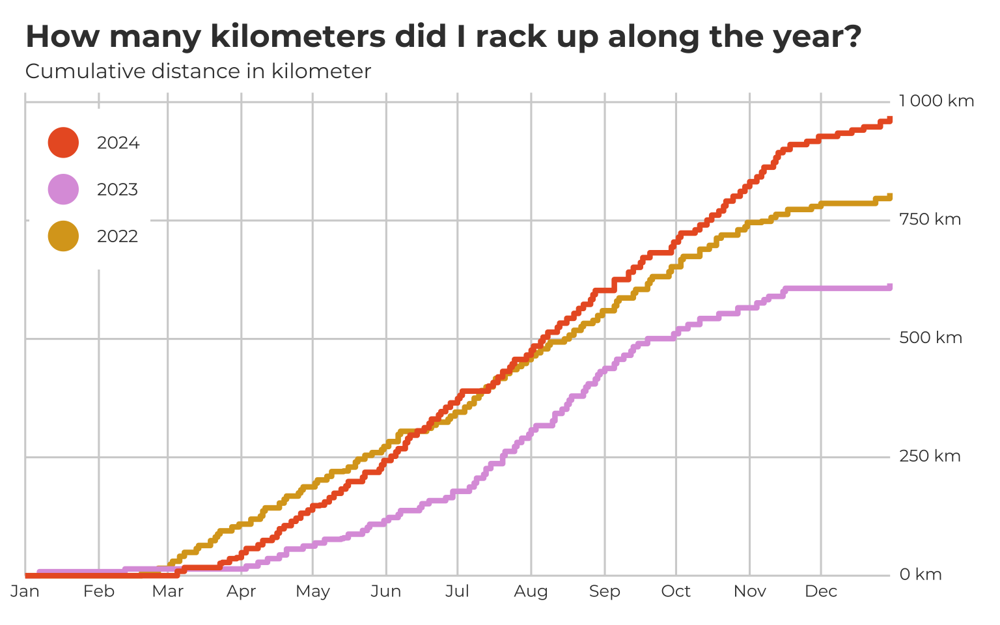
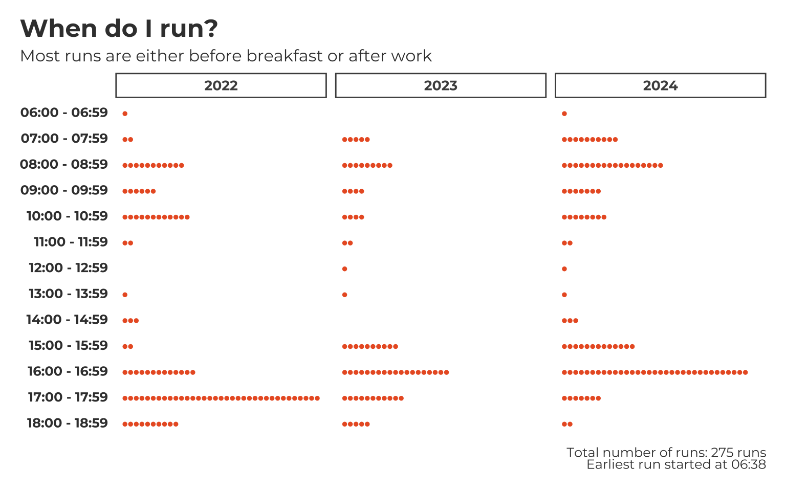
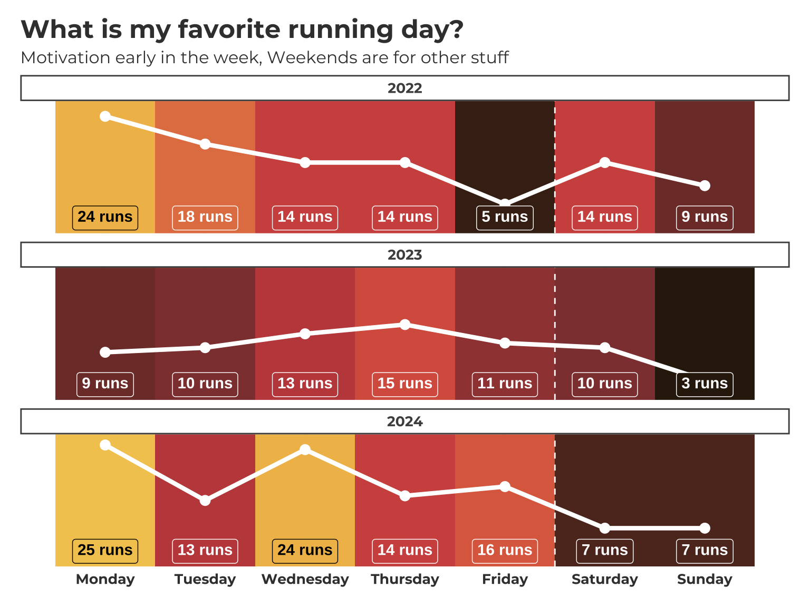
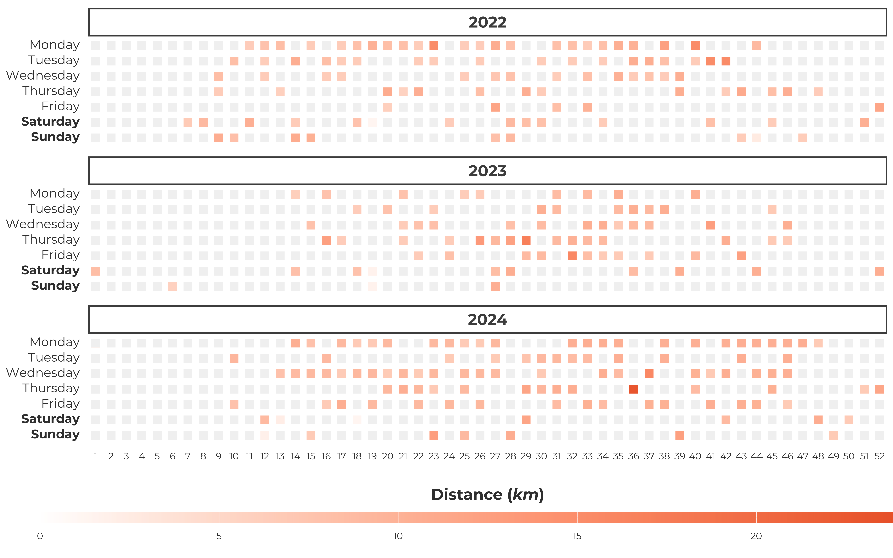
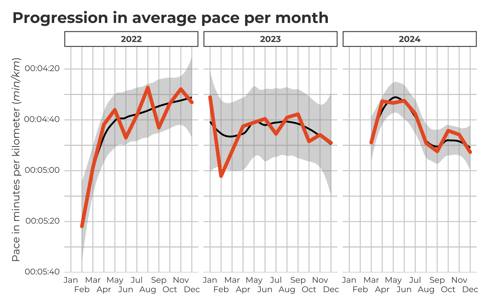
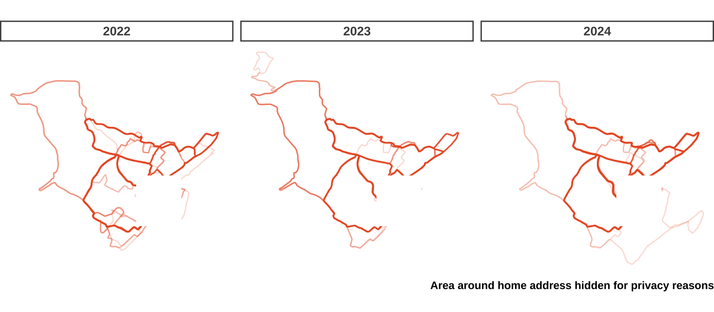
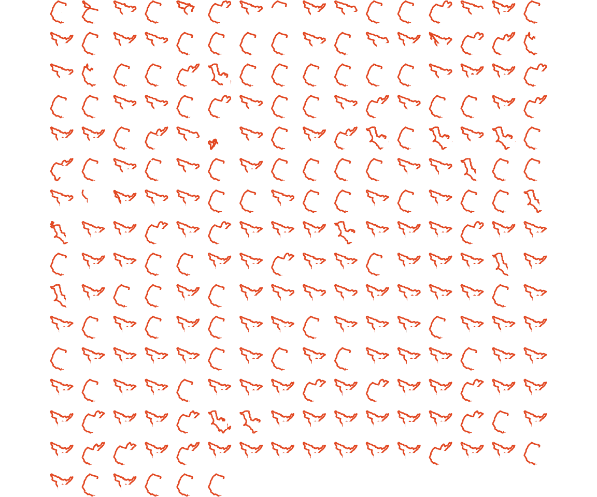

<p style="border-radius: 5px; background-color: #acc8d4; padding: 1em;">
I'm very about what I share on the internet. Strava stores a bunch of data I am not comfortable sharing openly on the internet. Now, I think my health (and the summarized data below does hopefully reflect that too) is excellent, but it's just a word of caution to everyone who might think about working/analyzing this type of data. If you share your segments publicly, it is fairly easy to trace it back to a home address. Be aware of what you upload to the internet!
</p>


Note the difference between *self-generated* and *self-collected* here


I'll never apologize for being a bit nerdy. So when I get the opportunity to play with some fun data, I'll happily take it. It's not very often you to play with some self-generated data! So now I figured we'll use the data Strava collects for each run and re-create some of the statistics Strava (either the free or the premium analyses and graphs) provides. We'll obtain the data through Strava's GDPR-motivated solution where it lets customers download a directory with their data.

You can download the data yourself by going to the [Strava website](https://www.strava.com) and log in. Then click on your profile picture in the top right and go to "Settings". Subsequently you click on "My Account" and then scroll all the way down and click on "Get Started" under the "Download or Delete Your Account" subheader. Ignore the scary warnings about deleting your account and skip straight to step 2: "Download Request". Click on "Request your Archive" and a little green tickmark will appear next to the button with the text: "Request received". Strava can take up to a few hours to send the e-mail with the download link.

## Getting the data

The download link Strava will send you contains a compressed folder, when unpacking this compressed folder you'll find a bunch of subfolders and CSV files. The folder we're mainly interested in here today is the `activities/` folder that contains a bunch of GPX files (or gzipped GPX files for older activities).

There are apps available for both Mac and Windows to open and see GPX files, but it's more fun to do it outselves. So we can write a Python script and make use of the `gpxpy` module to convert the GPX files to a [parquet](https://en.wikipedia.org/wiki/Apache_Parquet) file. The Python script is rather long, but is shown below in the collapsed chunk. This script takes a few input arguments, one mandatory one: a path to the directory where to find the GPX files, and a few optional ones. Strava stores data in compressed format since about 2021 I think, so I use the `fit2gpx` to convert the compressed files to uncompressed GPX files. Out of the box the script parses activities by year, so we can provide the year. By default, it'll take the previous full year.


The Python modules used to run these scripts are listed in the [`requirements.txt`](https://github.com/danielroelfs/danielroelfs.com/blob/main/content/blog/2024-strava-analysis/requirements.txt) file on [GitHub](https://github.com/danielroelfs/danielroelfs.com/blob/main/content/blog/2024-strava-analysis/requirements.txt)


<details class="code-fold">
<summary>See the Python script for parsing the GPX files</summary>

``` python
"""
Parse Strava files from .gpx to a long csv file. Also extracts metadata.

Usage: python3 parse_strava_activities.py <path to Strava export dir> -y <year of interest> [--no-convert]
"""

import os
import gpxpy
import pandas as pd
import datetime as dt
import pytz
import gzip
import re
import argparse
from fit2gpx import StravaConverter
import warnings


def get_cli_arguments():
    """
    Parse the command line arguments
    """

    parser = argparse.ArgumentParser()

    parser.add_argument(
        dest="directory",
        help="The path to the Strava activity files",
    )
    parser.add_argument(
        "-y",
        "--year",
        dest="year",
        type=int,
        default=dt.date.today().year - 1,
        help="The year for which to parse the activities",
    )
    parser.add_argument(
        "--no-convert",
        dest="convert_files",
        default=True,
        action="store_false",
        help="Don't convert the FIT files to GPX",
    )
    parser.add_argument(
        "-q",
        "--quiet",
        dest="quiet",
        default=False,
        action="store_true",
        help="Set output to quiet",
    )

    args = parser.parse_args()

    return args


def _prepare_fit_files(directory, quiet=False):
    """
    Prepare any .fit.gz files and convert to .gpx
    """

    print("Converting FIT files to GPX")

    with warnings.catch_warnings(action="ignore"):
        strava_conv = StravaConverter(dir_in=directory)
        strava_conv.unzip_activities()
        strava_conv.strava_fit_to_gpx()


def get_list_of_activities(directory, year):
    """
    Get a list of all the .gpx files for each activity
    """

    df_activities = pd.read_csv(os.path.join(directory, "activities.csv"))
    df_activities.columns = df_activities.columns.map(
        lambda x: x.lower().replace(" ", "_")
    )

    relevant_files = df_activities.loc[
        df_activities["activity_date"].str.contains(str(year)), "activity_id"
    ].to_list()

    gpx_files = os.listdir(os.path.join(directory, "activities"))
    gpx_files = [x for x in gpx_files if int(os.path.splitext(x)[0]) in relevant_files]
    gpx_files = [os.path.join("activities", x) for x in gpx_files if "fit" not in x]

    fit_files = os.listdir(os.path.join(directory, "activities_gpx"))
    fit_files = [x for x in fit_files if int(os.path.splitext(x)[0]) in relevant_files]
    fit_files = [os.path.join("activities_gpx", x) for x in fit_files]

    all_files = fit_files + gpx_files

    return all_files


def _parse_gpx(filepath, year, quiet=False):
    """
    Parse a single .gpx file, only if date is in prespecified year
    """

    if filepath.endswith(".gz"):
        with gzip.open(filepath, "r") as gpx_filepath:
            gpx = gpxpy.parse(gpx_filepath)
    else:
        with open(filepath, "r") as gpx_filepath:
            gpx = gpxpy.parse(gpx_filepath)

    try:
        if gpx.time:
            gpx_date = dt.datetime.date(gpx.time)
        else:
            gpx_date = dt.datetime.date(gpx.tracks[0].segments[0].points[0].time)
    except IndexError:
        print(f"Skipping {filepath} due to missing date")
        return

    activity_name = gpx.to_xml()
    activity_name = re.search("<name>(.*?)</name>", activity_name)
    if activity_name:
        activity_name = activity_name.group(1)
    else:
        activity_name = None

    activity_duration = gpx.get_duration()
    activity_duration = str(dt.timedelta(seconds=activity_duration))

    doi_begin = dt.datetime.date(dt.datetime.strptime(f"{year}-01-01", "%Y-%m-%d"))
    doi_end = dt.datetime.date(dt.datetime.strptime(f"{year+1}-01-01", "%Y-%m-%d"))

    if (gpx_date >= doi_begin) & (gpx_date < doi_end):
        if not quiet:
            print(f"Parsing data from {filepath}")

        moving_data = gpx.get_moving_data()

        df = pd.DataFrame()
        for track in gpx.tracks:
            for segment in track.segments:
                for point in segment.points:
                    point_df = pd.DataFrame(
                        {
                            "activity_id": os.path.basename(filepath).split(".")[0],
                            "name": activity_name,
                            "date": dt.datetime.date(point.time),
                            "time": dt.datetime.strftime(
                                point.time.astimezone(pytz.timezone("Europe/Oslo")),
                                "%H:%M%:%S",
                            ),
                            "latitude": point.latitude,
                            "longitude": point.longitude,
                            "elevation": point.elevation,
                            "moving_distance": moving_data.moving_distance,
                            "stopped_distance": moving_data.stopped_distance,
                            "total_duration": activity_duration,
                            "moving_time": moving_data.moving_time,
                            "stopped_time": moving_data.stopped_time,
                        },
                        index=[0],
                    )
                    df = pd.concat([df, point_df]).reset_index(drop=True)
                    point_df = pd.DataFrame()
    else:
        if not quiet:
            print("Date is outside of desired date range")
            df = pd.DataFrame()

    return df


def _combine_activities(df_main, df_activity):
    """
    Combine the parsed .gpx files into a single data frame
    """
    df_main = pd.concat([df_main, df_activity]).reset_index(drop=True)
    return df_main


def collect_activities(directory, year, convert_files=True, quiet=False):
    """
    Combine all the activities into a single data frame
    """

    if convert_files:
        _prepare_fit_files(directory)

    list_of_files = get_list_of_activities(directory, year)

    if not quiet:
        print(f"\nParsing activities from year: {year}\n")

    df_collected = pd.DataFrame()
    for i, f in enumerate(list_of_files):
        if not quiet:
            print(f"Parsing year {year}: {f} ({i/len(list_of_files):.2%})")
        df = _parse_gpx(filepath=os.path.join(directory, f), year=year, quiet=quiet)
        df_collected = _combine_activities(df_collected, df)

    return df_collected


def write_to_file(df, outpath, quiet=False):
    """
    Write the final data frame to a file
    """

    if not quiet:
        print(
            f'\nWriting {df["activity_id"].nunique()} activities to file: {outpath}\n'
        )

    df.to_parquet(outpath, index=False)


def main():
    args = get_cli_arguments()

    df = collect_activities(
        directory=args.directory,
        year=args.year,
        convert_files=args.convert_files,
        quiet=args.quiet,
    )
    write_to_file(df, f"./data/strava_data_{args.year}.parquet", quiet=args.quiet)


if __name__ == "__main__":
    main()
```

</details>

The export directory from Strava comes with a bunch of CSV files also. I'm assuming all of these comes from different tables that strava has in their database. When requesting the data Strava will filter out the relevant rows from their database and store the output for each table in the file they send to customers. The Python script below is a rough re-creation of what I assume this database and the tables would look like. Obviously this would not recreate any of the views and additional data that wasn't delivered, but it might be fun to work with this SQL database to simulate the real-world scenario. I'm assuming Strava doesn't use SQLite as their RDBMS (I sure hope it isn't), but for our purposes it'll work fine.

<details class="code-fold">
<summary>See the Python script for recreating the database</summary>

``` python
"""
Recreate your personal database from the Strava data

Usage: python3 recreate_strava_database.py <path to Strava export dir> <path to SQLite db>
"""

import os
import pandas as pd
import sqlite3
import argparse


def get_cli_arguments():
    """
    Parse the command line arguments
    """

    parser = argparse.ArgumentParser()

    parser.add_argument(
        dest="directory",
        help="The path to the Strava activity files",
    )
    parser.add_argument(
        dest="db_path",
        help="The path to the SQLite database to store the data in",
    )
    parser.add_argument(
        "-q",
        "--quiet",
        dest="quiet",
        default=False,
        action="store_true",
        help="Set output to quiet",
    )

    args = parser.parse_args()

    return args


def _connect_db(path):
    conn = sqlite3.connect(path)

    return conn


def _get_metadata_csv_files(directory):
    """
    Get a list of all the .gpx files for each activity
    """

    csv_files = [
        os.path.join(directory, x) for x in os.listdir(directory) if ".csv" in x
    ]

    return csv_files


def write_metadata_to_database(directory, db_path, quiet=False):
    csv_files = _get_metadata_csv_files(directory)
    conn = _connect_db(db_path)

    for f in csv_files:
        table_name = os.path.basename(f).split(".")[0]
        df_tmp = pd.read_csv(f)
        nrows = df_tmp.to_sql(
            name=table_name, con=conn, index=False, if_exists="replace"
        )
        if not quiet:
            print(f"{nrows} records added to table {table_name}")

    conn.close()


def _get_activity_data(directory, quiet=False):
    indir = "/".join(directory.split("/")[:-2])

    act_files = [os.path.join(indir, x) for x in os.listdir(indir) if ".parquet" in x]

    return act_files


def write_activity_data_to_database(directory, db_path, quiet=False):
    act_files = _get_activity_data(directory)
    conn = _connect_db(db_path)

    act_collect = []
    for f in act_files:
        df_tmp = pd.read_parquet(f)
        act_collect.append(df_tmp)

    df_activity = (
        pd.concat(act_collect).sort_values(["date", "time"]).reset_index(drop=True)
    )

    nrows = df_activity.to_sql(
        name="activity_data", con=conn, index=False, if_exists="replace"
    )
    if not quiet:
        print(f"{nrows} records added to activity_data")


def main():
    args = get_cli_arguments()

    write_metadata_to_database(args.directory, args.db_path)
    write_activity_data_to_database(args.directory, args.db_path)


if __name__ == "__main__":
    main()
```

</details>

Depending on the amount of activities in a year, this script can take a few minutes to run. After this script is done we can move to R to do some of the analyses. As usual, we'll load a few basic packages first: `{tidyverse}`, `{ggtext}`, and `{patchwork}` and `{showtext}` for now. We'll use some other libraries too (like `{dotenv}`, `{arrow}`, and `{lubridate}`) but we can call those using the `::` functionality.

``` r
library(tidyverse)
library(ggtext)
library(patchwork)
library(showtext)

font_add_google("Montserrat", family = "custom")
showtext_auto()

dotenv::load_dot_env()
```

We'll use the `read_parquet()` function from the `{arrow}` to read the Parquet file. We can also load a summary file with the name, comments, and category of each activity. We'll convert some of the variables and select the relevant columns. There are a few duplicate columns at this point, but for some the data generated by the Python script is more accurate (like `time`, which is time zone corrected as opposed to the `activity_time` variable) while for others the summary file is more accurate (like distance, where the `moving_distance` and `stopped_distance` don't quite add up to the distance of the `distance` column). For other variables, I couldn't quite figure out what the unit was (like `average_speed`). Lucky for us, both data frames contain the activity ID and the activity name, so we can use those as keys to join the two data frames later.


I record more than just my running activities in Strava. Today we're just interested in running.


``` r
conn <- DBI::dbConnect(RSQLite::SQLite(), "data/strava.db")

data_activity <- DBI::dbGetQuery(
  conn,
  "SELECT * FROM activity_data WHERE date >= 2022-01-01;"
) |>
  as_tibble() |>
  mutate(
    activity_id = as.numeric(activity_id),
    time = lubridate::as_datetime(time, format = "%H:%M:%S")
  )

data_runs <- DBI::dbGetQuery(
  conn,
  "SELECT * FROM activities WHERE `Activity Type` = 'Run';"
) |>
  as_tibble() |>
  janitor::clean_names() |>
  mutate(
    activity_id = as.numeric(activity_id),
    activity_date = lubridate::as_datetime(
      activity_date,
      format = "%d %b %Y, %H:%M:%S"
    )
  ) |>
  rename(activity_dttm = activity_date) |>
  filter(
    activity_dttm >= as_datetime("2022-01-01")
  ) |>
  select(
    starts_with("activity"),
    elapsed_time = elapsed_time_1,
    distance = distance_1,
    average_speed,
    starts_with("elevation")
  )
```

We'll also set the color (I like using the Strava color for the plots), and we'll create a common theme so that the plots we'll create have a similar layout (and we can set some text rendering devices by default to Markdown, functionality provided by `{ggtext}`). This `theme_strava()` we can then apply to all plots.

``` r
strava_color <- "#EA5E2A"

theme_strava <- function(...) {
  ggthemes::theme_fivethirtyeight(base_family = "custom", ...) +
    theme(
      plot.background = element_rect(
        fill = "transparent", color = "transparent"
      ),
      panel.background = element_rect(
        fill = "transparent", color = "transparent"
      ),
      plot.title = element_markdown(),
      plot.title.position = "plot",
      plot.subtitle = element_markdown(),
      plot.caption = element_markdown(),
      plot.caption.position = "plot",
      legend.title = element_markdown(),
      legend.background = element_rect(
        fill = "transparent", color = "transparent"
      ),
      legend.key = element_rect(
        fill = "transparent", color = "transparent"
      ),
      axis.text.x = element_markdown(),
      axis.text.y = element_markdown(),
      strip.background = element_rect(
        fill = "transparent", linetype = "solid",
        color = "grey30", linewidth = 1
      ),
      strip.text = element_text(
        face = "bold", size = 10, color = "grey30"
      )
    )
}
```

Here, we are just interested in running, so I'll filter just the running activities.

``` r
data_running <- data_runs |>
  inner_join(
    data_activity,
    by = c("activity_id", "activity_name" = "name")
  )
```

Let's have a look at the data:

``` r
data_running |>
  glimpse()
```

    Rows: 532,259
    Columns: 25
    $ activity_id           <dbl> 6705168821, 6705168821, 6705168821, 6705168821, …
    $ activity_dttm         <dttm> 2022-02-19 10:14:12, 2022-02-19 10:14:12, 2022-…
    $ activity_name         <chr> "Lunch Run", "Lunch Run", "Lunch Run", "Lunch Ru…
    $ activity_type         <chr> "Run", "Run", "Run", "Run", "Run", "Run", "Run",…
    $ activity_description  <chr> NA, NA, NA, NA, NA, NA, NA, NA, NA, NA, NA, NA, …
    $ activity_private_note <dbl> NA, NA, NA, NA, NA, NA, NA, NA, NA, NA, NA, NA, …
    $ activity_gear         <chr> "Mizuno wave ultima 8", "Mizuno wave ultima 8", …
    $ activity_count        <dbl> NA, NA, NA, NA, NA, NA, NA, NA, NA, NA, NA, NA, …
    $ elapsed_time          <dbl> 2144, 2144, 2144, 2144, 2144, 2144, 2144, 2144, …
    $ distance              <dbl> 6579.827, 6579.827, 6579.827, 6579.827, 6579.827…
    $ average_speed         <dbl> 3.432356, 3.432356, 3.432356, 3.432356, 3.432356…
    $ elevation_gain        <dbl> 79.66904, 79.66904, 79.66904, 79.66904, 79.66904…
    $ elevation_loss        <dbl> 79.66904, 79.66904, 79.66904, 79.66904, 79.66904…
    $ elevation_low         <dbl> 34.8, 34.8, 34.8, 34.8, 34.8, 34.8, 34.8, 34.8, …
    $ elevation_high        <dbl> 94.8, 94.8, 94.8, 94.8, 94.8, 94.8, 94.8, 94.8, …
    $ date                  <chr> "2022-02-19", "2022-02-19", "2022-02-19", "2022-…
    $ time                  <dttm> 0000-01-01 11:14:12, 0000-01-01 11:14:13, 0000-…
    $ latitude              <dbl> 59.93037, 59.93040, 59.93049, 59.93059, 59.93068…
    $ longitude             <dbl> 10.72474, 10.72472, 10.72466, 10.72455, 10.72445…
    $ elevation             <dbl> 59.3, 59.3, 59.2, 59.1, 59.1, 58.7, 58.5, 58.4, …
    $ moving_distance       <dbl> 6963.35, 6963.35, 6963.35, 6963.35, 6963.35, 696…
    $ stopped_distance      <dbl> 0, 0, 0, 0, 0, 0, 0, 0, 0, 0, 0, 0, 0, 0, 0, 0, …
    $ total_duration        <chr> "0:35:16", "0:35:16", "0:35:16", "0:35:16", "0:3…
    $ moving_time           <dbl> 2116, 2116, 2116, 2116, 2116, 2116, 2116, 2116, …
    $ stopped_time          <dbl> 0, 0, 0, 0, 0, 0, 0, 0, 0, 0, 0, 0, 0, 0, 0, 0, …

Since some of the columns came from a simple data frame where one row represents one activity and another from a long table where each row represents a measurement from the GPS/activity tracker we'll have to do some data wrangling to get the summary statistics per activity (including data that isn't in the summary file already). Due to some Apple Watch or Strava shenanigans (or perhaps just my clumsyness), some activities that were part of the same exercise activity were split. Since I'm not such an enthusiast to go on more than one run a day, we can just group by the date and then re-calculate the summary statistics again. We'll also do some quick conversions (such as calculating a *very* rough estimate of pace and extracting the week number) and then we have a data frame with the summary statistics on all the runs since I started recording on Strava.

``` r
data_run_summ_act <- data_running |>
  group_by(activity_id) |>
  summarise(
    across(
      c(activity_name:time, moving_distance:last_col()), first
    ),
    elevation_diff = max(elevation) - min(elevation)
  ) |>
  mutate(
    across(ends_with("_time"), ~ .x / 60)
  )

data_run_summ <- data_run_summ_act |>
  group_by(date) |>
  summarise(
    across(
      c(activity_id:elevation_high), ~ first(.x)
    ),
    across(
      c(ends_with("distance"), ends_with("_time")), ~ sum(.x)
    ),
    time = min(time),
    distance = sum(distance, na.rm = TRUE),
    avg_pace_raw = sum(
      moving_time + stopped_time
    ) / (sum(distance) / 1000)
  ) |>
  mutate(
    date = as_date(date),
    week_number = as.numeric(format(date, "%V")),
    month = lubridate::month(date),
    activity_duration = moving_time + stopped_time
  )
```


Winter in Oslo also allows for skiing which is my preferred activity in winter (+ extra Norwegian integration points).


This is where the last part of the fun starts, because now we can start looking at some plots! The first one is a cumulative plot of the distance run across the year. For this we can use a fairly underrated `geom` called `geom_step()`. The rest is mostly providing information in text form, formatting the axes, and general aesthetics of the plot. As you might see, I also added a row to make the plot start on January 1st. Running in January in Oslo is tough as the snow depth is commonly [between 10 and 20 cm](https://www.yr.no/en/statistics/graph/5-18700/Norway/Oslo/Oslo/Oslo%20(Blindern)) and although many Norwegians would happily say that you can just wear spikes, my integration into Norwegian society hasn't quite reached that level yet. I thought it'd be fair to reflect in the plot that I didn't run at all for the entirety of January and most of February, and thne again for most of December.

``` r
data_run_summ |>
  mutate(
    year = lubridate::year(date)
  ) |>
  group_by(year) |>
  mutate(
    cumulative_distance = cumsum(distance),
    date = as.Date(format(date, "2000-%m-%d"))
  ) |>
  ungroup() |>
  add_row(
    tibble(
      date = rep(as.Date("2000-01-01"), 3),
      cumulative_distance = c(0, 0, 0),
      year = c(2022, 2023, 2024)
    )
  ) |>
  ggplot(
    aes(
      x = date,
      y = cumulative_distance / 1e3,
      color = as_factor(year),
      group = year
    )
  ) +
  geom_step(linewidth = 1.5, key_glyph = "point") +
  labs(
    title = "How many kilometers did I rack up along the year?",
    subtitle = "Cumulative distance in kilometer",
    color = NULL
  ) +
  scale_x_date(
    breaks = "1 month",
    labels = scales::label_date(format = "%b"),
    expand = expansion(add = 0.1)
  ) +
  scale_y_continuous(
    labels = scales::label_number(suffix = " km"),
    position = "right", limits = c(0, 1020),
    expand = expansion(add = 0)
  ) +
  scale_color_manual(
    values = c(
      "2024" = strava_color,
      "2023" = "plum",
      "2022" = "goldenrod"
    ),
    guide = guide_legend(
      reverse = TRUE,
      override.aes = list(shape = 16, size = 8)
    ),
  ) +
  coord_cartesian(clip = "off") +
  theme_strava() +
  theme(
    legend.position = c(0.075, 0.8),
    legend.direction = "vertical",
    legend.background = element_rect(fill = "white"),
    legend.text = element_text(size = 10)
  )
```



Next, I was curious at what time during the day I do most of my runs. This information is stored in the `time` column in the summary dataset. I was thinking about creating a [dotplot](https://en.wikipedia.org/wiki/Dot_plot_(statistics)) but instead of relying on the `geom_dotplot()` function, we'll create the dotplot manually by simply plotting points on the x- and y-axis with the time on the y-axis and the dotplots extending across the x-axis. We'll plot the activities by hour. First, we'll create the x-axis by summarising by hour and then simply adding the row number as the x-axis value. I figured it'd be neatest to have the y-axis be discrete instead of wrangling with the `scale_y_continuous()` so we'll create the labels for the y-axis with some `str_glue()` magic. This also meant we need to have all other hours where I didn't have any activites in the data frame too, so we'll do a `full_join()` with all hours during the day to get a complete list. From then on it's just adding the `geom_point()` and prettifying the plot.

As I already knew, there are basically two moments I run: either in the morning, or after work. Most of the runs started between 17:00 and 18:00 or somewhere around that time frame. In the weekends or on days I work from home I usually go running in the morning and the data nicely reflects that.

``` r
data_run_summ |>
  mutate(
    year = lubridate::year(date),
    time_hour = lubridate::hour(time)
  ) |>
  group_by(year, time_hour) |>
  reframe(no = row_number()) |>
  full_join(tibble(time_hour = seq(0, 23))) |>
  mutate(
    hour_label = str_glue(
      "**{str_pad(time_hour,2, pad='0')}:00 - {str_pad(time_hour,2, pad='0')}:59**"
    )
  ) |>
  drop_na() |>
  ggplot(aes(x = no, y = hour_label)) +
  geom_point(color = strava_color, size = 1) +
  labs(
    title = "When do I run?",
    subtitle = "Most runs are either before breakfast or after work",
    caption = str_glue("Total number of runs: {nrow(data_run_summ)} runs<br>Earliest run started at {data_run_summ |> slice_min(time) |> pull(time) |> format(., format='%H:%M', tz='UTC', usetz=FALSE)}")
  ) +
  scale_x_continuous(breaks = NULL, limits = c(1, NA)) +
  scale_y_discrete(limits = rev) +
  facet_wrap(~year) +
  theme_strava() +
  theme(
    panel.grid.major = element_blank()
  )
```



Next, I was also interested in checking this data at a different granularity. When during the week do I run? We'll apply the same procedure. I couldn't find a default variable in R that contains the days of the week, so we have to create it ourselves. Afterwards we'll count the number of runs per week, create a label, and then create a line plot and provide some extra info with some background colors and labels. For the background colors we'll use a neat feature in `ggplot` where any value of infinity (or negative infinity) will extend only to the limits of the plot. I was hoping to create a bit of a "clean" plot by not having y-axis values, so we'll provide those values using `ggtext`'s `geom_richtext()` function to provide those instead. We can color the text based on the background image.

``` r
wk_days <- c(
  "Monday", "Tuesday", "Wednesday", "Thursday", "Friday",
  "Saturday", "Sunday"
)

data_run_summ |>
  mutate(
    year = lubridate::year(date),
    day_of_week = weekdays(date)
  ) |>
  group_by(year, day_of_week) |>
  summarise(
    n = n(),
    n_label = str_glue("**{n} runs**")
  ) |>
  mutate(day_of_week = factor(day_of_week, levels = wk_days)) |>
  arrange(day_of_week) |>
  mutate(day_of_week_no = row_number()) |>
  ggplot(aes(x = day_of_week_no, y = 0, fill = n)) +
  geom_rect(aes(
    xmin = day_of_week_no - 0.5,
    xmax = day_of_week_no + 0.5,
    ymin = -Inf,
    ymax = Inf
  )) +
  geom_point(
    aes(y = n),
    color = "white",
    size = 3
  ) +
  geom_line(
    aes(y = n, group = 1),
    color = "white", linewidth = 1.5, lineend = "round"
  ) +
  geom_vline(
    xintercept = 5.5, linewidth = 0.5,
    linetype = "dashed", color = "white"
  ) +
  geom_richtext(
    aes(
      label = n_label, y = 2,
      color = ifelse(n < 20, "white", "black")
    )
  ) +
  labs(
    title = "What is my favorite running day?",
    subtitle = "Motivation early in the week, Weekends are for other stuff"
  ) +
  scale_x_continuous(breaks = seq(7), labels = wk_days) +
  scale_y_continuous(breaks = NULL, limits = c(0, 26)) +
  scico::scale_fill_scico(
    palette = "lajolla",
    limits = c(0, 30),
    guide = "none"
  ) +
  scale_color_identity() +
  facet_wrap(~year, ncol = 1) +
  theme_strava() +
  theme(
    axis.text.x = element_markdown(size = 10, face = "bold")
  )
```




`geom_point()` allows to scale the individual points (or tiles), while `geom_tile()` has a fixed size


I recall a conversation with a friend about how motivating they thought the Apple Fitness app rings are to do physical activity and how GitHub's contribution graph is kinda doing the same for computer nerds. So I was wondering why Strava doesn't emulate this a bit more. Strava does the line thing, but it only goes back 3 months and isn't as satisfying. So we'll create a "GitHub contributions list for runners" plot here. We'll have to do some data wrangling and summarizing again. I'll again put the week days on the y-axis as in the GitHub contributions graph and the number of weeks on the x-axis. Instead of the amount of commits, the color of each tile will represent the distance ran during that day. I find `geom_point()` a bit easier to work with than the perhaps more obvious `geom_tile()` one might expect for this plot. Like each of the previous plots, it's essentially a simple "`ggplot()` and some simple `geom_*` functions", here a `geom_point()` but then a bunch of modifications to the axes, plot layouts, etc. to make it a bit more useful and easier to read. For instance I made the weekend days bold in this plot, which I again achieved with some `str_glue()` and HTML magic by wrapping the days containing with "S" (only Saturday and Sunday) in a `<b>` tag.

``` r
wk_days_md <- ifelse(
  str_detect(
    as.character(wk_days), "S"
  ),
  str_glue("<b>{wk_days}</b>"),
  as.character(wk_days)
)

data_run_summ |>
  full_join(
    tibble(
      date = seq(
        as.Date("2022-01-01"),
        as.Date("2024-12-31"),
        by = "days"
      )
    ),
    by = "date"
  ) |>
  mutate(
    year = lubridate::year(date),
    week_number = as.numeric(format(date, "%V")),
    week_day = weekdays(date),
    week_day = factor(week_day, levels = wk_days),
    week_day = fct_rev(week_day),
    week_day_label = ifelse(
      str_detect(as.character(week_day), "S"),
      str_glue("<b>{week_day}</b>"),
      as.character(week_day)
    )
  ) |>
  ggplot(aes(
    x = week_number, y = week_day_label,
    fill = distance / 1e3
  )) +
  geom_point(shape = 22, size = 3, stroke = 0) +
  labs(
    x = "**Week number**",
    fill = "**Distance (_km_)**"
  ) +
  scale_x_continuous(
    limits = c(1, 52),
    breaks = seq(52),
    expand = expansion(add = 0.5)
  ) +
  scale_y_discrete(limits = rev(wk_days_md), position = "left") +
  scale_fill_gradient(
    low = "white", high = strava_color,
    limits = c(0, 25),
    na.value = "grey95",
    guide = guide_colorbar(
      title.position = "top", title.hjust = 0.5,
      ticks = FALSE,
      barwidth = 20, barheight = 0.5
    )
  ) +
  coord_equal() +
  facet_wrap(~year, nrow = 3) +
  theme_strava() +
  theme(
    legend.title = element_markdown(size = 10),
    legend.text = element_markdown(size = 6),
    panel.grid.major = element_blank(),
    axis.text.x.bottom = element_text(size = 6),
    axis.text.y.left = element_markdown(size = 8),
    plot.margin = margin(5, 0, 5, 0)
  )
```




Like, the week of New Years Eve can be both week 52 and week 1


Note that there are some overlapping points around the beginning and end of the year since I didn't account for the fact that the first of January isn't always on a Monday, and I also didn't bother debugging week numbering around New Year's day, so there's some errors at the beginning and the end of the year, and if I would make just this plot I would fix this, but for this purpose it works with this caveat I think.

I was also curious about some statistics that Strava does not provide for the long term. With a Strava subscription you get some statistics about pace differences in the past weeks, but this is not available in the free version. Doing plots using a time scale is a headache anywhere, so I had to do some wrangling using the `{hms}` package and some hacky transformations be be able to use both `scale_y_time()` with the correct labeling and have the "faster" times at the top and the "slower" times at the bottom to make it more intuitive. At the same time the faceted plot is a bit crowded, so we can use the very neat `n.dodge` option in `guide_axis()` to alternatve the months on the x-axis.

``` r
data_run_summ |>
  mutate(year = lubridate::year(date)) |>
  group_by(year, month) |>
  summarise(avg_pace = sum(elapsed_time) / sum(distance) * 1000) |>
  right_join(tibble(month_abbr = month.abb, month = seq(12))) |>
  mutate(
    avg_pace_time = hms::hms(avg_pace * 60),
    month_abbr = factor(month_abbr, levels = month.abb),
  ) |>
  ggplot(aes(x = month_abbr, y = -avg_pace_time, group = 1)) +
  geom_smooth(color = "black") +
  geom_line(
    color = strava_color,
    linewidth = 2,
    lineend = "round"
  ) +
  labs(
    title = "Progression in average pace per month",
    y = "Pace in minutes per kilometer (_min/km_)"
  ) +
  scale_x_discrete(
    guide = guide_axis(n.dodge = 2)
  ) +
  scale_y_time(
    labels = function(x) -x,
  ) +
  facet_wrap(~year) +
  theme_strava() +
  theme(
    axis.title.y = element_markdown(),
    panel.grid.minor = element_line(color = "grey80")
  )
```



At this point I also want to mention that I fully agree with the slogan [*"Finish Lines, Not Finish Times"*](https://www.sport.nsw.gov.au/her-sport-her-way/innovation-hub/case-study-finish-lines-not-finish-times-triathlon-nsw). Getting outside to exercise at all is a lot more important than how fast you run. Biology and physiology varies widely across individuals so one cannot compare yourself to others, don't let others' performance demotivate you. I actually considered not showing the y-axis at all (just to avoid the comparison), but I thought it was too relevant to show the time labeling trick not to include it in this post. So remember: finish lines, not finish times. Don't compare yourself to others.


In the app there is an option in the settings under "Privacy Controls" and then "Map Visibility" where you can hide an area around specific locations


This blogpost is long enough now, so I figures we could finish up with some maps. The first one I want to do is to visualize where I run most often. For this we can create a density plot. The plan here is to create a lot of faint lines (using the `alpha` setting in `geom_path()`) for each of the routes I've run in the past year in Norway. This way the lines that are present in many routes are drawn on top of each other and the lines will become more intense. I'm not showing the routes in other countries because it made the hiding of sensitive information a bit more tricky. The solution for this is rather elementary: draw a large box on top of the area I want to hide. This area roughly corresponds to the area users can hide in their privacy settings. The raw data we get from Stava does include this area so it's possible to do analysis on this, but be careful with sharing this data publicly. We can hide the area using `geom_rect()` and adding the coordinates in the `.env` file we loaded earlier. Since we're typically not interested in seeing the specific latitude and longitude lines, we can also apply `theme_void()` for this figure. I think it usually looks best when plotting maps.

``` r
data_running |>
  mutate(year = lubridate::year(date)) |>
  filter(longitude > 10) |>
  ggplot(aes(x = longitude, y = latitude, group = activity_id)) +
  geom_path(color = strava_color, alpha = 0.2, size = 0.5) +
  geom_rect(
    aes(
      xmin = as.numeric(Sys.getenv("hide_xmin")),
      ymin = as.numeric(Sys.getenv("hide_ymin")),
      xmax = as.numeric(Sys.getenv("hide_xmax")),
      ymax = as.numeric(Sys.getenv("hide_ymax"))
    ),
    fill = "white"
  ) +
  labs(
    caption = "Area around home address hidden for privacy reasons"
  ) +
  facet_wrap(~year) +
  theme_void() +
  theme(
    aspect.ratio = 1,
    plot.caption = element_markdown(face = "bold"),
    strip.background = element_rect(
      fill = "transparent", linetype = "solid",
      color = "grey30", linewidth = 1
    ),
    strip.text = element_text(
      face = "bold", size = 10, color = "grey30",
      margin = margin(t = 4, b = 4, unit = "pt")
    )
  )
```



It's a common trope that "running allows you to explore new areas" and that runners then subsequently continue to run the same few routes every time. This applies also for me I'm afraid. The plot again comfirms what I already knew, which is that I run the same few routes multiple times and only change it on ocassion. Even after I moved house I stuck to rougly the same routes. This is even more visible when I'm recreating a plot I saw [Marcus Volz](https://marcusvolz.com/) create once for [a similar project](https://github.com/marcusvolz/strava). It's a facet plot where each tile represents a single running route. It's basically a gallery of all running routes in a year, and I thought it was a beautiful way to visualize the data. We basically use the same code as before, but instead of faceting by year, we now facet by date.

``` r
data_running |>
  filter(
    longitude > 10
  ) |>
  ggplot(aes(x = longitude, y = latitude, group = date)) +
  geom_path(
    size = 0.5, key_glyph = "point", color = strava_color
  ) +
  geom_rect(
    aes(
      xmin = as.numeric(Sys.getenv("hide_xmin")),
      ymin = as.numeric(Sys.getenv("hide_ymin")),
      xmax = as.numeric(Sys.getenv("hide_xmax")),
      ymax = as.numeric(Sys.getenv("hide_ymax"))
    ),
    color = "white",
    fill = "white"
  ) +
  labs(color = NULL) +
  facet_wrap(~date, scales = "free") +
  theme_void() +
  theme(
    aspect.ratio = 1,
    strip.text = element_blank()
  )
```



This figure even more clearly shows the similarity in the different routes across the running days. Even with the hidden area it is clearly visible which routes are common. Especially in 2024 I've mainly run two separate routes where I previously had a bit more variation still. Create of habit still I suppose, and I do really like the running routes I have.

Anyway, this is a quick and dirty analysis on data shared by Strava. Using the Python script, we now also have a SQL database with all the data Strava has on us so a **lot** more analysis are possible. We could look at whether different shoes let us run faster. Or how successful I am at running [negative splits](https://en.wikipedia.org/wiki/Negative_split), a strategy I quite like and that has been successfully [applied in the Dutch speed skating team](https://martijnwillemsen.nl/wat-kan-irene-schouten-op-de-5000m) (where I got the inspiration from). I also run occassionally in the Netherlands which is a lot flatter, so we could look at elevations and try to recreate the [Grade Adjusted Pace (GAP)](https://support.strava.com/hc/en-us/articles/216917067-Grade-Adjusted-Pace-GAP) that is available for people with a subscription. Strava also stores the kudos sent and the goals set, those can be analysed and visualized also. Plenty of data to play around with, and again, it's all self-generated! Hope you had fun reading this and perhaps trying these analyses for yourself! Maybe I'll revisit this again in the future to do some additional analysis, perhaps including some more statistical inference.

So if you ever feel like learning some new tricks or play around with some new dataset nobody else has used before, I'd recommend looking at the apps you use and download your data to play around with the data those apps have collected. Data quality is in part reliant on the data you provide, so please only submit messy data, both because it prevents the companies from effectively monetizing your data, and it provides teaching opportunities when you download the data later to play around with it in Python, R, SQL, or another tool of your choice! Happy debugging!

### Further reading

-   [Ryan Wingate - Processing GPS Data (2021)](https://ryanwingate.com/other-interests/backpacking/processing-gps-data/)
-   [GitHub - marcusvolz/strava (2021)](https://github.com/marcusvolz/strava)
