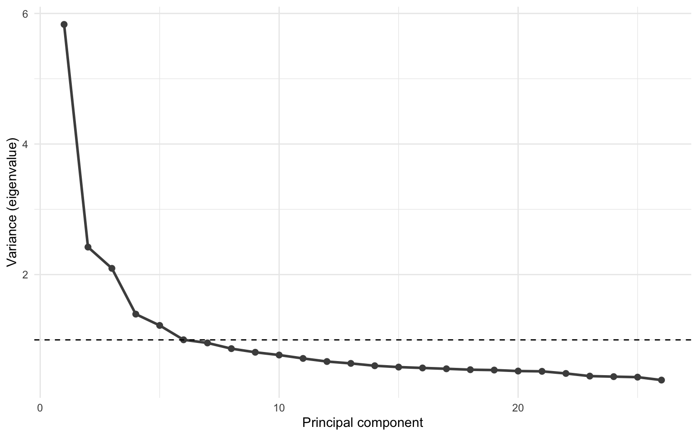
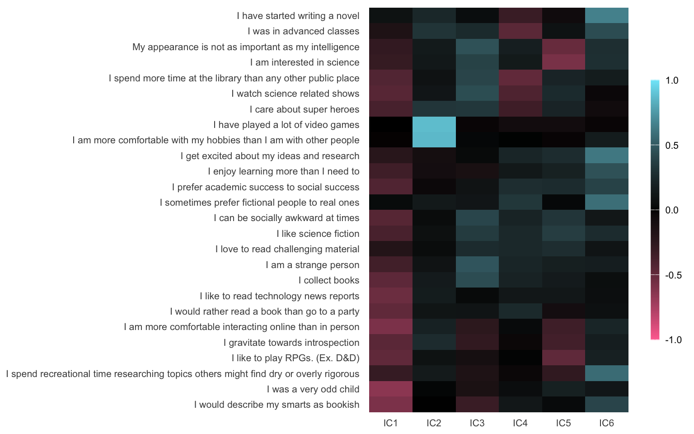

## Introduction

If there was a statistics magazine and it were to have ads, the ad for independent component analysis (commonly referred to as the ICA) might read something like this:

> Do you ever find yourself with a large number of highly related variables? Are you interested in studying constructs rather than specific measures? Would you rather work with a small number of variables each capturing a large amount of variance instead of a large number of variables each capturing a small amount of variance?
>
> Then ICA is for you!

Obviously, there is more to it than this, but I don't have the time to talk about the statistical properties of ICA. There's many people who can explain this a hell of a lot better than I could anyway. I'm going to assume you've done your homework and already know that ICA is the right strategy to answer your research question and you just want to know how to implement it in R. That's what this tutorial is for. We'll run both a PCA and an ICA and visualize the results.

## Getting the data


The dataset is available for download on [Kaggle](https://www.kaggle.com/lucasgreenwell/nerdy-personality-attributes-scale-responses/version/1?select=data.csv)


We'll use a dataset called the *Nerdy Personality Attributes Scale* from the [Open-Source Psychometrics Project](https://openpsychometrics.org/tests/OSRI/development/). In short, it's a questionnaire on "nerdiness". It aims to measure attributes of ones personality that reflect the popular understanding of "nerdiness". It is a series of questions to which participants are supposed to rank themselves on a Likert scale. The questionnaire has a high reliability, but the questionnaire isn't immune to valid criticisms. Here, we'll use this dataset to see if we can identify subtypes of the concept of "nerdiness" in our dataset.

The dataset in question consists of almost 20.000 individuals from 149 different countries. Is there any reliable way to ensure that the tests are filled in correctly? No, definitely not. Does that make it a unreliable dataset for scientific analysis? Probably. Both issues are perhaps slightly confounded by its sheer size, but the dataset serves our goal well, which is to run an ICA in R. We'll use the `{tidyverse}` package and the `{fastICA}` package.

``` r
library(tidyverse)
library(fastICA)
```

There are two files we need, one with the actual data (we'll call this `loaddata`), and one with the list of questions (we'll call this `loadcodes`).

``` r
loaddata <- read_delim("./data/data.csv", delim = "\t") |>
  rowid_to_column(var = "id")

loadcodes <- read_delim("./data/codebook_clean.txt",
  delim = "\t", col_names = FALSE
) |>
  rename(
    qnum = X1,
    question = X2
  )
```

After cleaning, we still have more than 250.000 individual records left. This is great! Now we're going to have to do some preprocessing before we run the ICA.

## Preprocessing of the data

Next, we want to prune the data. We want to exclude questions that have a low degree of variance and we might want to remove or impute questions with a large number of `NA`s. Our first step is to get the data in a format that's easier to work with, in this case, the long format. We'll select all questions, and put the question number in a column called `question` and the values in a column called `score`.

``` r
questdata <- loaddata |>
  select(starts_with("Q")) |>
  pivot_longer(
    cols = everything(),
    names_to = "question", values_to = "score"
  )
```

We'll first find if there's any unanswered questions. These are rows where `score` is `NA`.

``` r
questdata |>
  filter(is.na(score)) |>
  nrow()
```

    [1] 0

We find that there's no missing values (crazy, I know!). If there were any missing values we could possibly impute the scores in the original (wide) data (e.g. using k-nearest neighbor imputation) or we could remove these items (e.g. using `drop_na()`).

The next step is to find if there are questions with insufficient variation in answers. For this we'll calculate the percentage that each answer on the Likert scale represents in the total variance of the dataset. We'll take our long-format data, group by the question and the answers on the question (`score`). Count the number of times that answer has been given to that question (using `count()`). Then we'll calculate the percentage that this answer represented within each question (using `perc = n / sum(n)`). Then we'll sort the answers within the questions on the percentage (with the answer that's been answered the most on top, and the answer that's answered the least on the bottom (`arrange(question, -perc)`)). Then we'll take the second-most common answer (`slice(2)`) and select the questions where the second-most answer represented less than 15% of the answers (`perc < 0.15`). The threshold of 15% is fairly arbitrary. Usually I'd go for 10%, but due to the source of the data, I'm being a bit more stringent here. The output from these steps will give us the questions that we might want to exclude due to low variance.

``` r
less15var <- questdata |>
  group_by(question, score) |>
  count() |>
  group_by(question) |>
  mutate(perc = n / sum(n)) |>
  arrange(question, -perc) |>
  slice(2) |>
  filter(perc < 0.15)

print(less15var)
```

    # A tibble: 0 × 4
    # Groups:   question [0]
    # ℹ 4 variables: question <chr>, score <dbl>, n <int>, perc <dbl>

So no question has too little variance. If there were, I'd remove those questions from the analysis. Since no question has less than 15% variance, we won't drop any questions and use all of them in the analysis.

Next we want to normalize the data. Usually you'd do this to ensure that all answers on a questionnaire are in the same domain. Let's imagine a scenario where some questions are scored from 0 to 10, others are scored from 0 to 5, and a third is scored from 80 to 120. The ICA is then biased towards questions that have larger values, like the third question in the example above. That's why we want to normalize the data. The statistical term for this is z-score normalization. The defining property of z-scored transformed data is that the mean is 0 and the standard deviation is one. The z-score transformation is obtained by subtracting the mean from each individual value and then dividing by the standard deviation. This is implemented in R with the `scale()` function. We'll also check if it worked afterwards.


In this case, the second line with the `select()` function doesn't remove anything, see paragraph above


``` r
data <- loaddata |>
  select(-less15var$question) |>
  pivot_longer(starts_with("Q"),
    names_to = "qnum", values_to = "score"
  ) |>
  group_by(qnum) |>
  mutate(score_z = scale(score))

data |>
  ungroup() |>
  select(score_z) |>
  summarise(
    mean = mean(score_z),
    sd = sd(score_z),
    min = min(score_z),
    max = max(score_z)
  )
```

    # A tibble: 1 × 4
          mean    sd   min   max
         <dbl> <dbl> <dbl> <dbl>
    1 5.73e-17  1.00 -4.48  1.87

Great! Now we have a nice normalized dataset, without any missing values, and with questions that have a low degree of variance removed. All those preparations served to get us to a place where our clustering analyses are actually valid. Now it's time for the fun stuff!

## Run PCA

There's two clustering approaches we'll use. One will actually help us do the other. The ICA algorithm has is unsupervised, but does require us to tell it how many components we want to get out of the algorithm. It's complicated to calculate the ideal number of components up front, but we can use some standards. I usually use a combination of [icasso](https://research.ics.aalto.fi/ica/icasso/) and PCA. We'll first do a principal component analysis (PCA). We can calculate the eigenvalue of each component in the PCA. PCA components are organized in decreasing order of variance explained. The threshold I use is an eigenvalue of 1. The number of PCA components with an eigenvalue larger than 1 is possibly a good number of components to give the ICA.

The PCA is implemented in the `prcomp()` function. This function doesn't accept a data frame, but instead it requires a matrix. So we'll have to make that first. We'll transform the long-format data that we created earlier back into wide format (using `pivot_wider()`), then select only the columns that we want to include in the analysis (i.e. the questions (`select(starts_with("Q"))`)), and then we'll turn it into a matrix (using `as.matrix()`). Then we'll put the resulting matrix into the `prcomp()` function.

``` r
mat <- data |>
  pivot_wider(
    names_from = "qnum",
    values_from = "score_z", id_cols = "id"
  ) |>
  select(starts_with("Q")) |>
  as.matrix()

pca_data <- prcomp(mat)
```

Then we can calculate a few other parameters. We want to calculate the variance that each component captures. The variance is the standard deviation squared. We can calculate the variance explained by each component by dividing the variance by the sum of the variance.

``` r
pca_data$var <- pca_data$sdev^2
pca_data$varexpl <- pca_data$var / sum(pca_data$var)

pca_stats <- tibble(
  sdev = pca_data$sdev,
  var = pca_data$var,
  varexpl = pca_data$varexpl
)
```

We can visualize the variance captured in each component by creating a [scree plot](https://en.wikipedia.org/wiki/Scree_plot). This plot shows the components on the x-axis and the variance on the y-axis. Scree plots also typically include a horizontal line to indicate the eigenvalue of 1. Scree plots are typically interpreted based on the "elbow" in the plot, where the variance decreases. This can be a bit subjective. That's where the horizontal line comes in.

``` r
ggplot(pca_stats, aes(x = seq(var), y = var)) +
  geom_line(color = "grey30", linewidth = 1) +
  geom_point(color = "grey30", size = 2) +
  geom_hline(yintercept = 1, linetype = "dashed") +
  labs(
    x = "Principal component",
    y = "Variance (eigenvalue)"
  ) +
  theme_minimal()
```



It can be a bit hard to see from the plot how many components have an eigenvalue larger than 1. But we can calulate it. The number of components with an eigenvalue larger than 1 will be the number of independent components we'll request from the ICA.

``` r
n_ics <- pca_stats |>
  filter(var > 1) |>
  nrow()
print(n_ics)
```

    [1] 6

## Run ICA

Now we're ready to run the ICA! We'll use the `fastICA()` function. The function has a bunch of inputs. We'll pick the parallel algorithm (as opposed to the "deflation" algorithm). In the parallel algorithm the components are extracted simultaneously, with the deflation algorithm they're calculated one at a time. The "fun" option defines the form of the entropy function. I'm not 100% sure what it does. Just set it to `"exp"` and move on. For the `"method"` option there are two options: `"R"` or `"C"`. In the first option, all analyses are run in R, in the second option, all code is run in C, which is slightly faster. I typically use the `"C"` option. The `maxit` option defines the maximum number of iterations to perform. The default is 200, but in complex datasets, it may take a larger number of iterations to converge. That's why I set it to 5000. This process may take a while. If you want to follow along with what the algorithm is doing, you can set the `verbose` option to `TRUE`.

``` r
set.seed(2020)

ica_model <- fastICA(mat,
  n.comp = n_ics, alg.typ = "parallel",
  fun = "exp", method = "C", maxit = 5000
)
```

## Create Weight Matrix

So now we have run the ICA decomposition. The function provides a few outputs:

``` r
glimpse(ica_model)
```

    List of 5
     $ X: num [1:14955, 1:26] -0.8724 0.0298 0.932 0.932 0.0298 ...
     $ K: num [1:26, 1:6] -0.0843 -0.0791 -0.0755 -0.0875 -0.0968 ...
     $ W: num [1:6, 1:6] 0.5122 0.2571 0.2286 -0.744 0.0655 ...
     $ A: num [1:6, 1:26] -0.283 0.131 -0.387 0.127 -0.583 ...
     $ S: num [1:14955, 1:6] -0.3649 1.0887 -1.2281 -0.1592 -0.0618 ...

These names aren't very informative. In this function, `X` represens the pre-processed data matrix, `K` is the pre-whitening matrix, `W` is the estimated un-mixing matrix, `A` is the estimating mixing matrix (the loadings of the items on the independent components), and `S` is the source matrix (the individual IC loadings for all participants).

One feature of independent component analysis, is that there's a high degree of correlation within the independent components, but by definition a very poor correlation between independent components. We can measure this by correlating the individual loadings with each other. The individual loadings are stored in `ica_data$S`. We can simply correlate that matrix by using the `cor()` function.

``` r
cor(ica_model$S)
```

                  [,1]          [,2]          [,3]          [,4]          [,5]
    [1,]  1.000000e+00  1.008510e-14 -1.701048e-14  3.537856e-14 -8.652989e-15
    [2,]  1.008510e-14  1.000000e+00  9.286019e-15 -9.827378e-15 -1.197023e-15
    [3,] -1.701048e-14  9.286019e-15  1.000000e+00  2.328882e-14  2.402569e-14
    [4,]  3.537856e-14 -9.827378e-15  2.328882e-14  1.000000e+00 -3.206080e-15
    [5,] -8.652989e-15 -1.197023e-15  2.402569e-14 -3.206080e-15  1.000000e+00
    [6,]  1.354061e-15 -6.944827e-15 -1.626536e-15 -2.241246e-14 -3.859294e-15
                  [,6]
    [1,]  1.354061e-15
    [2,] -6.944827e-15
    [3,] -1.626536e-15
    [4,] -2.241246e-14
    [5,] -3.859294e-15
    [6,]  1.000000e+00

The data we're interested in for now is the estimated mixing matrix (stored in `ica_model$A`). This is the loadings of the individual questions (i.e. the columns of the matrix) that we put in the ICA algorithm on the independent components. For any further analyses with individual data, you'd take the estimated source matrix, which is the loading of each independent component on each individual (i.e. the rows of the matrix).

We take the data in `ica_model$A`, rotate it (rows become columns, and columns become rows) using the `t()` function for "transpose", and save it in a data frame.

Then we can also have a quick look at hierarchical clustering. This is a process where data is separated based on the closeness (or dissimilarity) of the datapoints. In this example we transform the weight matrix into a distance matrix (a matrix representing the degree of similarity between datapoints) using the `dist()` function. Then we simply provide the hierarchical clustering function `hclust()` with the distance matrix and we have our hierarchical clustering. We can then plot a simple dendrogram using R's basic `plot()` function.

``` r
weight_matrix <- data.frame(t(ica_model$A))
names(weight_matrix) <- str_glue("IC{seq(weight_matrix)}")

dist_matrix <- dist(as.matrix(weight_matrix))
clust <- hclust(dist_matrix)
plot(clust)
```


What we can see from the dendrogram is that for instance question 16 (*"I gravitate towards introspection"*) and question 17 (*"I am more comfortable interacting online than in person"*) on the left are very similar. Question 3 (*"I like to play RPGs. (Ex. D&D)"*) is somewhat similar, but not as much as question 16 and 17. The same goes for question 1 and 4, question 11 and 19, and so on.


We'll also do some cleaning of the questions that will help us make the plot look nicer later


``` r
codes <- loadcodes |>
  filter(str_detect(qnum, "Q")) |>
  mutate(
    question = str_remove_all(question, "\t"),
    question = str_remove(question, "\\.$")
  )
```

Next we'll plot the weight matrix. For that we first create a column with the question number, we'll then merge the matrix with the list of questions so we can plot the actual question asked instead of the question number. Next, we'll put the data frame in a long format. Finally, we'll also reorder the questions to match the order determined by the hierarchical clustering.


The `%>%` pipe is necessary here because the placeholder functions a bit differently from the R's native `|>` pipe


``` r
weight_matrix_long <- weight_matrix |>
  mutate(qnum = str_glue("Q{row_number()}")) |>
  inner_join(codes, by = "qnum") |>
  pivot_longer(
    cols = starts_with("IC"),
    names_to = "IC", values_to = "loading"
  ) %>%
  mutate(
    question = fct_relevel(
      question,
      unique(.$question)[clust$order]
    ),
  )
```

So let's see what the ICA spit out. We'll make a plot where the questions are shown along the y-axis and where the x-axis shows their loading onto the different independent components. The orientation of the loading between the components does not have meaning, but within the components it can indicate that some questions have opposing effects. We'll reorder the x- and y-axis to order it based on the loading strength.

``` r
weight_matrix_long |>
  ggplot(aes(x = IC, y = question, fill = loading)) +
  geom_tile() +
  labs(
    x = NULL,
    y = NULL,
    fill = NULL
  ) +
  scale_fill_gradient2(
    low = "#FF729F", mid = "black", high = "#7EE8FA",
    limits = c(-1, 1),
    guide = guide_colorbar(
      barwidth = 0.5,
      barheight = 15, ticks = FALSE
    )
  ) +
  theme_minimal(base_size = 10) +
  theme(
    legend.position = "right",
    panel.grid = element_blank()
  )
```



So what do we have? It looks quite interesting, but what does this figure mean? We've established using the PCA that the 26 questions from the original dataset can be clustered into 6 independent components. With this plot we can see what these components are made of, how these questions are reflected in the independent components. What this can do is identify subgroups within the data. Individuals (hopefully) answer questions in a non-random way. So people that score high on one question might tend to score high on similar questions also, and low on others. That's what this ICA identifies. What questions tend to be answered in a similar fashion by a certain group of individuals. In this case, there's 6 groups, or clusters, of questions that tend to tend to get answered in a similar way.

While the questions measure a more specific construct, the independent components instead capture a more general concept. So if we look at for instance IC2, we find that it captures mainly 2 questions about video games and hobbies. IC1 instead doesn't capture questions on video games, but instead captures more variance related to "book smart-ness". Other ICs capture more topics related to academic proficiency or extra-/introversion. The interpretation of the independent components is a very subjective task that is prone to interpretation bias. So look at the data, and make your own interpretation, but also give the data to others and see what they read in this figure.

## Conclusions

Independent component analysis is a powerful technique when applied in the right context. If you apply the method we discussed here to variables that share no common source, then you might end up just up with messier data and less interpretable variables. The gain in power we get from clustering questions has the drawback that we lose specificity. But in a good dataset, ICA might be very informative and help further analyses down the line. It deals with the issue of intercorrelation between variables, it captures larger variance than individual questions, and it will capture larger constructs than the individual questions. These advantages make it very useful in many different contexts. Again, if we want to proceed with analyses on an individual level, then take the individual loadings of the independent components (stored in `ica_model$S`). Perhaps in the future we'll go over how we could proceed with further analyses using the independent component loadings, possibly in a machine learning context.
