-   GeoJSON
-   Shapefiles
-   GeoPackage
-   Geodatabase

In a [previous post](../../../posts/the-easier-way-to-create-a-map-of-norway-using-csmaps/) I mentioned that I ocassionally create maps using the [GeoJSON](http://geojson.org) format, but that for simple maps that need to be done quickly I'd use the [`{csmaps}`](https://www.csids.no/csmaps/) package which contains some neatly packaged maps in an easy to use format. However, I rarely use that method myself anymore. Instead, I've moved to using a more robust method. It is also slightly more advanced than the pre-wrangled dataframes from `{csmaps}`. Since the [other post](../../../posts/the-easier-way-to-create-a-map-of-norway-using-csmaps/) has gotten a fair bit of traffic, I'd take that as a sign that this is an issue people are solving often, so today I'd like to over an alternative way to plot maps of Norway (or any other country or region) using a slightly more advanced way using a format that is commonly available. In this post we'll go through how to create maps in `(ggplot2)` using the [GeoJSON](#geojson), [shapefile](#shapefiles), [GeoPackage](#geopackage)The GeoJSON and GeoPackage formats have their own websites: [geojson.org](https://geojson.org) and [geopackage.org](https://www.geopackage.org), and [geodatabase](#geodatabase) format.

We'll use the regular `{tidyverse}` to do some wrangling and the plotting. And we'll use the `{sf}` package to enable functionality to deal with the geo files. As in the [previous post](https://danielroelfs.com/posts/new-america-data-viz/) (and several before then) we'll add a custom typeface to the plots to give them a bit more "flair", even though aesthetics is not the main goal today. We'll use the `{patchwork}` package to make some composite figures combining several plots.

``` r
library(tidyverse)
library(sf)
library(patchwork)

sysfonts::font_add_google(name = "Fira Sans", family = "custom")
showtext::showtext_auto()
```

I'll focus most of the examples in this post on Norway, but I'll use some others from other parts of Europe as well. Let's run through three common file formats: GeoJSON, shapefiles, GeoPackage, and geodatabaseSee [here](https://feed.terramonitor.com/shapefile-vs-geopackage-vs-geojson/) for a technical comparison between three of them.

## GeoJSON

[GeoJSON](https://geojson.org) is by far my favourite format for geographic data. See the [ISO definition here](https://datatracker.ietf.org/doc/html/rfc7946). It's main advantage is that it's an open source format, and it's essentially just a JSON file which is easily editable manually in any IDE. It is also the easiest to create from scratch using websites like [geojson.io](https://geojson.io) where one can draw spatial features on a map and the GeoJSON is populated simultaneously. Users can also add aditional features as part of each spatial element (e.g. names, dates, literally anything that can be stored in plain text format) which makes it a very simple, lightweight, and flexible method of storing spatial data and related features.

GeoJSON files use the suffix `.geojson` to differentiate them from regular JSON files. These can be loaded into R using `{sf}`'s `st_read()` functionThis function will come back *a lot* in this post. Let's just dive straight in and create the simplest map we can. The data I used for this first part comes from [Analyse ABØ's GitHub repo](https://github.com/AnalyseABO/Kart-fylker-og-kommuner-json)*Analyse ABØ* is the [analysis unit for Akershus, Buskerud, and Østfold](https://afk.no/tjenester/planlegging/analyse-og-statistikk-for-akershus-buskerud-og-ostfold/). It contains a number of GeoJSON files for the whole of Norway. If you're looking for an even more official database, you should check out [kartverket.no](https://www.kartverket.no/api-og-data/grensedata) but pay attention that a number of maps hosted there include maritime borders, so they might not reflect what you'd want them to reflect. Since it's essentially just a JSON file we can just open the file and see what it looks like:

``` bash
head -n 25 ./data/Fylker-L.geojson
```

    {
        "type": "FeatureCollection",
        "features": [
            {
                "type": "Feature",
                "properties": {
                    "id": "33",
                    "name": "Buskerud",
                    "fylkesnummer": "33",
                    "fylkesnavn": "Buskerud"
                },
                "geometry": {
                    "type": "MultiPolygon",
                    "coordinates": [
                        [
                            [
                                [
                                    7.488255641989379,
                                    60.09892437096184
                                ],
                                [
                                    7.645997988865938,
                                    60.12685743951537
                                ],
                                [

You'll see the JSON starts with a `type`, which is (as far as I've seen) always a `"FeatureCollection"`. The "features" within this collection contain the list of the different spatial areas. For each area there is a `properties` element that contains the metadata. In this case the fylkename and number. As mentioned, whatever you can save in a regular JSON file cna be stored in the `properties` element The `geometry` element contains the spatial feature's type (e.g. `MultiPolygon`, `Point`, `LineString`, etc.) with the coordinates in whatever coordinate reference system (e.g. from -90° to +90°, meters from a given reference point, etc.).

Let's load the data into R using the `read_sf()` function and have a look at what it looks like as a data frame.

``` r
df_fylker <- read_sf("./data/Fylker-L.geojson") |>
  janitor::clean_names()

df_fylker |> glimpse()
```

    Rows: 15
    Columns: 5
    $ id           <chr> "33", "42", "32", "03", "56", "55", "31", "46", "15", "40…
    $ name         <chr> "Buskerud", "Agder", "Akershus", "Oslo", "Finnmark", "Tro…
    $ fylkesnummer <chr> "33", "42", "32", "03", "56", "55", "31", "46", "15", "40…
    $ fylkesnavn   <chr> "Buskerud", "Agder", "Akershus", "Oslo", "Finnmark - Finn…
    $ geometry     <MULTIPOLYGON [°]> MULTIPOLYGON (((7.488256 60..., MULTIPOLYGON…

To create a plot, one needs to use a `geom` created for spatial data: [`geom_sf()`](https://ggplot2.tidyverse.org/reference/ggsf.html)I can really recommend reading [the documentation](https://ggplot2.tidyverse.org/reference/ggsf.html) for `sf` objects, there's a lot of useful stuff there. We don't even need to supply the aesthetics, since `geom_sf()` assumes the spatial data is stored in the "geometry" column by default, which it does here too.

``` r
df_fylker |>
  ggplot() +
  geom_sf() +
  theme_void()
```

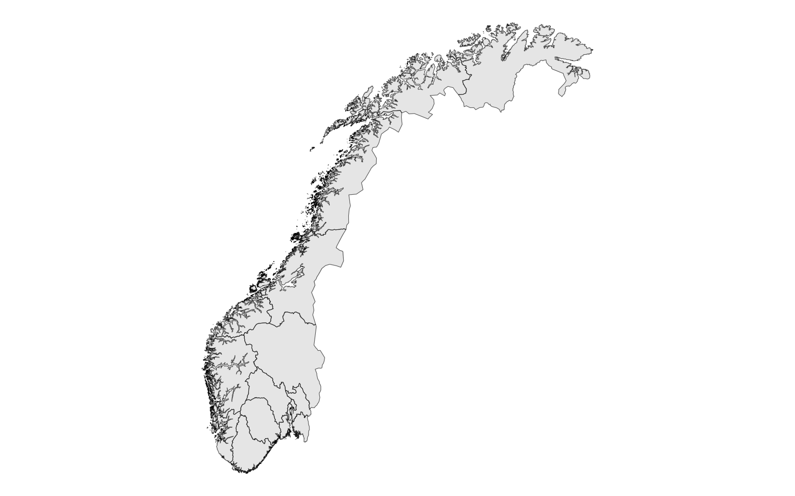

If we wanted to label the fylker in the plot. We could simply use the ggplot-native `geom_sf_text()` function. And supply the `name` column.

``` r
df_fylker |>
  ggplot() +
  geom_sf() +
  geom_sf_label(
    aes(label = name),
    size = 3,
    fill = "white",
    family = "custom"
  ) +
  theme_void(base_family = "custom")
```

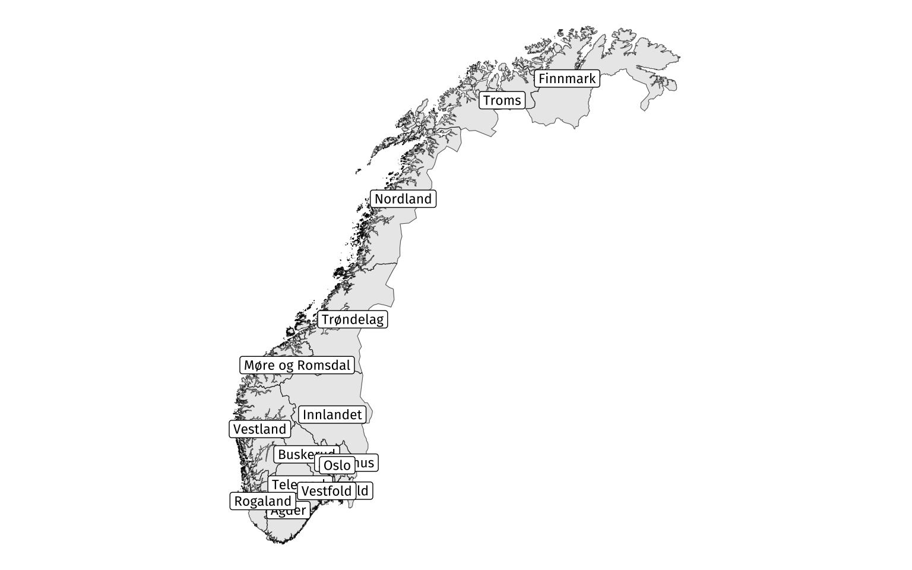

As you can see, this puts the labels directly in the middle of each spatial area (in this case fylke). Under the hood it calculates the [centroid](https://en.wikipedia.org/wiki/Centroid) for each area and puts the label there. However, because Norway is quite oddly shaped and southern Norway has multiple smaller fylker, the labels overlap and obscure each other. The `geom_sf_label()` or `geom_sf_text()` functions work better if you have more uniformly distributed features. As an alternative, we can calculate the centroids manually and use the `geom_label_repel()` function from `{ggrepel}` to plot them instead. Calculating the centroids manually is easily done with `{sf}`'s `st_centroid()`, but in the dataset we used I got an error that some of the polygons overlap and [one trick](https://gis.stackexchange.com/a/413134) to address this is to transform the dataset from two different [coordinate reference systems (CRS)](https://en.wikipedia.org/wiki/Spatial_reference_system) using the `st_transform()` functionWe'll come back to CRS transformations further below. Then we can extract the longitude (east-west position, [Greenwich is 0° longitude](https://en.wikipedia.org/wiki/IERS_Reference_Meridian)) and latitude (north-south position) that will serve as the x- and y-position for `geom_label_repel()` in the plot. We can add some additional settings to the function to control the look of the labels.

``` r
df_fylker_centroids <- df_fylker |>
  st_transform(crs = 3857) |>
  st_centroid() |>
  st_transform(crs = 4326) %>%
  mutate(
    lon = st_coordinates(.)[, 1],
    lat = st_coordinates(.)[, 2]
  )

df_fylker |>
  ggplot() +
  geom_sf() +
  ggrepel::geom_label_repel(
    data = df_fylker_centroids,
    mapping = aes(x = lon, y = lat, label = name),
    size = 3,
    family = "custom",
    min.segment.length = 0,
    max.overlaps = 15,
    seed = 42
  ) +
  theme_void(base_family = "custom")
```

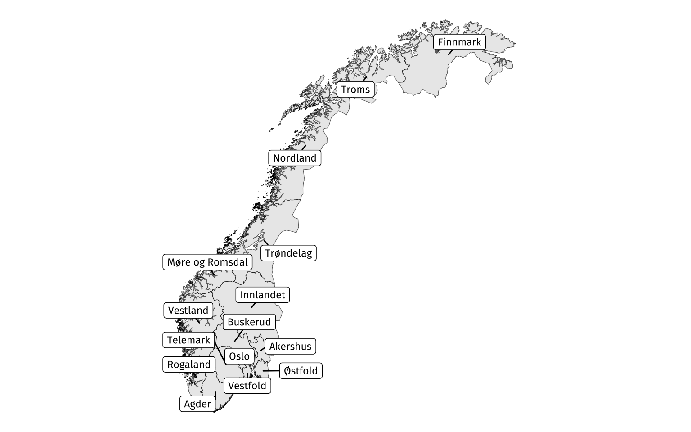

Now the labels are all readable. Oslo is a tiny fylke, so the label almost entirely covers the area on the map, but if we wanted we could finetune the label positioning some more. But aesthetics is not the main goal for today.



``` r
read_sf("./data/kartverket_map_kommuner.geojson") |>
  ggplot() +
  geom_sf() +
  theme_void()
```

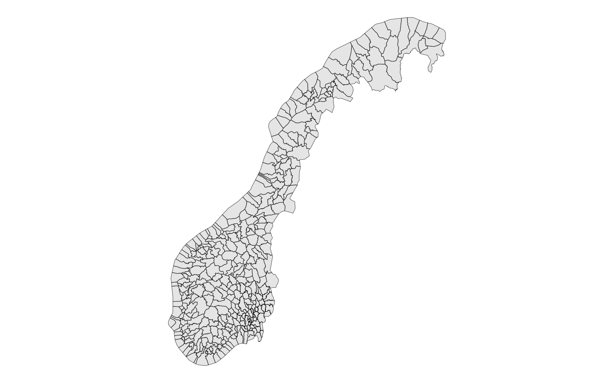



Let's do another one. Let's load some GeoJSON files and create a plot. I found a [GitHub repository](https://github.com/aourednik/historical-basemaps) from a writer, cartographer, and data scientist ([André Ourednik](https://ourednik.info)) that created a bunch of maps from different time periods [stored in GeoJSON files](https://github.com/aourednik/historical-basemaps). We can read two of these files in and compare what the borders looked like at different times. Since the original maps are world maps, we want to restrict what we show in the plot so we want to restrict the boundaries of what is shown. For this we can use the `coord_sf()` function and specify the longitude and latitude of the boundaries.

``` r
df_world_1600 <- read_sf("./data/world_1600.geojson") |>
  janitor::clean_names() |>
  mutate(year = 1600)

df_world_1880 <- read_sf("./data/world_1880.geojson") |>
  janitor::clean_names() |>
  mutate(year = 1880)

bind_rows(
  df_world_1600,
  df_world_1880
) |>
  ggplot(aes(fill = name)) +
  geom_sf(color = "white") +
  geom_sf_label(
    aes(label = abbrevn),
    size = 3,
    fill = "white",
    alpha = 0.7,
    family = "custom"
  ) +
  scico::scale_fill_scico_d(guide = "none") +
  facet_wrap(~year) +
  coord_sf(xlim = c(-10, 22.5), ylim = c(37.5, 62.5)) +
  theme_void(base_family = "custom") +
  theme(
    strip.text = element_text(size = 20, face = "bold")
  )
```

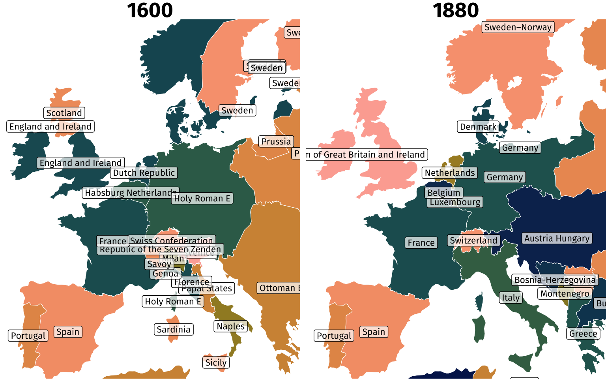

You'll see that some area borders are cut off, but also that some labels are cut off. This is a downside here and should be fixed in a production-ready plot. You'll also notice that some labels are duplicated (e.g. Sweden multiple times in the "1600" subplot, and "Germany" in the 1880 subplot). I suspect this is because the islands outside of for example mainland Sweden are their own polygon and get their own label. The same happens to "England and Ireland" in the 1600 plot. This can be fixed manually by cleaning up the GeoJSON and turning everything in a spatial area into a single feature, but that is outside the scope of this post I think.

Since we now constrained a plot using the `coord_sf()` function, we can also immediately look at another way to only plot the area of interest, and that is using a [bounding box](https://en.wikipedia.org/wiki/Minimum_bounding_rectangle). In R these can be defined using `{sf}`'s `st_bbox()` function where you specify the corners of the rectangle you want to contrain the map to, and the coordinate reference system (CRS) in the `crs` argument so the function knows how to interpret the coordinates provided. So let's use this function to (controversially, I'll admit) get a more focused map

``` r
boundaries_of_interest <- st_bbox(
  c(xmin = 5, xmax = 15, ymin = 57.5, ymax = 65),
  crs = st_crs(df_fylker)
)

boundaries_of_interest
```

    xmin ymin xmax ymax 
     5.0 57.5 15.0 65.0 

You can see it's simply a collection of coordinates. Then we can add the bounding box to each of the features in our data frame. This will allow us then to filter the features where any of the coordinates in the geometry are outside the boundaries specified. We thereafter don't need the bounding box anymore so we can drop it from the data frame.

``` r
df_fylker_small <- df_fylker |>
  mutate(bbox = map(geometry, st_bbox)) |>
  filter(
    map_lgl(
      bbox,
      ~ .x["xmin"] >= boundaries_of_interest["xmin"] &
        .x["xmax"] <= boundaries_of_interest["xmax"] &
        .x["ymin"] >= boundaries_of_interest["ymin"] &
        .x["ymax"] <= boundaries_of_interest["ymax"]
    )
  ) |>
  select(-bbox)

str_glue("Number of rows before filtering: {nrow(df_fylker)}")
str_glue("Number of rows after filtering: {nrow(df_fylker_small)}")
```

    Number of rows before filtering: 15
    Number of rows after filtering: 9

So this operation dropped 6 fylker from the map. If we had used `coord_sf()` to limit the extent of the map, it would still show the fylker but parts of the map would just be hidden behind the borders of the plot.

``` r
df_fylker_centroids <- df_fylker_small |>
  st_transform(29101) |>
  st_centroid() |>
  st_transform("+proj=longlat +ellps=GRS80 +no_defs") %>%
  mutate(
    lon = st_coordinates(.)[, 1],
    lat = st_coordinates(.)[, 2]
  )

plot_filtered <- df_fylker_small |>
  ggplot(aes(fill = name)) +
  geom_sf(color = "white", alpha = 0.8) +
  ggrepel::geom_label_repel(
    data = df_fylker_centroids,
    aes(x = lon, y = lat, label = name),
    fill = "white",
    alpha = 0.75,
    size = 3,
    family = "custom",
    min.segment.length = 0,
    segment.color = "white",
    label.size = NA,
    seed = 42
  ) +
  scico::scale_fill_scico_d(palette = "batlowK", guide = "none") +
  theme_void(base_family = "custom")

plot_limited <- df_fylker |>
  ggplot(aes(fill = name)) +
  geom_sf(color = "white", alpha = 0.8) +
  ggrepel::geom_label_repel(
    data = df_fylker_centroids,
    aes(x = lon, y = lat, label = name),
    fill = "white",
    alpha = 0.75,
    size = 3,
    family = "custom",
    min.segment.length = 0,
    segment.color = "white",
    label.size = NA,
    seed = 42
  ) +
  scico::scale_fill_scico_d(palette = "batlowK", guide = "none") +
  coord_sf(xlim = c(5, 15), ylim = c(57.5, 65)) +
  theme_void(base_family = "custom")

plot_filtered +
  plot_limited +
  plot_annotation(
    title = "Comparison between filtering using a bounding box (left)\nand cropping using coordinates (right)"
  ) &
  theme(
    plot.title = element_text(family = "custom", size = 18),
  )
```

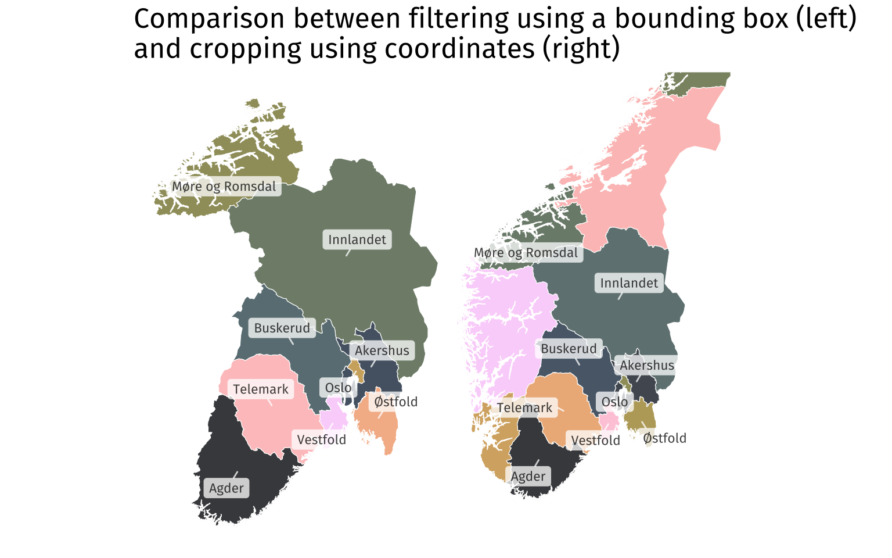

You'll notice the difference between the two immediately. Which one is more useful to you is entirely dependent on your use case. For example, the left one can make sense if you want to reduce sensory overload and/or if including additional spatial context will be distracting. The right one would be nice if you want to include some reference points for your data. This is the version I personally use most. Note also that even though the fylker not included in the left plot are shown on the right, they are not labeled since we also filtered the centroids. This was deliberate of course because perhaps we don't want to label irrelevant data. In this example it might look odd, but it's been useful in a number of situations.

## Shapefiles

A [shapefile](https://en.wikipedia.org/wiki/Shapefile) are a binary file format. To have a complete dataset it comes with a `.shp` file (which contains the actual data), a `.shx` file which contains the shape indices, a `.dbf` format which contains the metadata for each spatial feature (actually dBASE files), and a `.sbn` file which contains the spatial indices. A `.prj` file is sometimes included (but not required for a complete dataset) to provide some additional information on the projection of the coordinates in the dataset. Shapefiles are a very old format, so much so that individual file sizes are limited to 2GB, however they are still widely used so I'll quickly cover them here. It's my least favourite format since they are quite annoying to work with. You essentially have to keep track of them in folders and even though you only point to a single file, the other files need to be present to avoid ending up with a corrupt dataset.

When loading shapefiles, we can just point `read_sf()` to any of the four required filesI typically just point to the `.shp` file. This works the same as with GeoJSON (or any other format here). For the first example here we'll load a map of countries created by [Eurostat](https://ec.europa.eu/eurostat/web/gisco/geodata/administrative-units/countries) (the statistics agency for the EU) and use that as a reference point (as discussed above). Specifically we'll download the data with the highest granularity (3m) from 2024 with the [EPSG:4326](https://epsg.io/4326) (or "WGS 84") CRS. To plot some actually interesting data we can download data on [oil fields and their license holders](https://www.sodir.no/fakta/data-og-analyser/apne-data/) from the Norwegian *Sokkeldirektoratet* [SODIR](https://www.sodir.no). We'll clean up the dataset a bit since there are a lot of license holders among various companies with (roughly) the same name that can have various similar names to represent the same entity. To clean it up we'll look only at a small number of interesting companies (Equinor, Aker, Vår Energi, and Shell) and put the rest in a category called "Other" (which we'll label as \`"*Other*" so we can make it italic in the legend later).

``` r
europe_shp <- read_sf(
  "./data/CNTR_RG_03M_2024_4326/CNTR_RG_03M_2024_4326.shp"
) |>
  janitor::clean_names()

oil_license_areas <- read_sf("./data/prlAreaCurrent/prlAreaCurrent.shp") |>
  janitor::clean_names() |>
  mutate(
    operator_cat = case_when(
      str_detect(op_long_name, "Equinor") ~ "Equinor",
      str_detect(op_long_name, "Aker") ~ "Aker BP",
      str_detect(op_long_name, "Vår") ~ "Vår Energi",
      str_detect(op_long_name, "Shell") ~ "Shell",
      TRUE ~ "_Other_"
    ),
  )
```

Let's look at the license holders that operate the largest total area with oil fields. We can calculate the area by using the `st_area()` function in a regular `mutate()` call. Sometimes (like in this data here) you'll get an error that says something like "`Loop 0 is not valid: Edge 9 has duplicate vertex with edge 123`" or whatever. What might often help as a workaround is to transform the data to a different CRS using the `st_transform()` function. This works in this case too by transforming the geometry to CRS [3857](https://epsg.io/3857). Then we can for each operatorWe'll ignore the issue with different company names here calculate the total size of the oil fields licensed and the number of licenses they hold. I'll also add the `as_tibble()` after calculating the size, because if one doesn't the `geometry` column will follow along (even if you actively drop it with `select(-geometry)`) because it isn't a regular data frame. Sometimes it's just easier to transform it to a tibble for some purposes.

``` r
oil_license_areas |>
  st_transform(crs = 3857) |>
  mutate(field_size = st_area(geometry)) |>
  as_tibble() |>
  filter(active == "Y") |>
  group_by(op_long_name) |>
  summarise(
    field_size = sum(field_size),
    n_licenses = n()
  ) |>
  arrange(-field_size) |>
  slice_head(n = 10)
```

    # A tibble: 10 × 3
       op_long_name                field_size n_licenses
       <chr>                            [m^2]      <int>
     1 Equinor Energy AS        174787304216.        211
     2 Vår Energi ASA           137223619788.         62
     3 Aker BP ASA               91540799049.        131
     4 ORLEN Upstream Norway AS  17814969002.          5
     5 Harbour Energy Norge AS   16658268890.         25
     6 A/S Norske Shell          14708422229.          3
     7 OMV (Norge) AS            14636925517.         12
     8 INPEX Idemitsu Norge AS   14509413818.          3
     9 DNO Norge AS               7147071288.         18
    10 Petrolia NOCO AS           6150270503.          4

Unsurprisingly, the Norwegian majority state-owned oil company Equinor (formally *Statoil*) ranks on top for both total area and the number of licenses. Private companies Vår Energi and Aker follow suit. You'll notice the `field_size` column isn't a regular numerical column. If you check the type of the column you'll see it shows as a "`Units: [m^2] num`" which is a column type that derives from `{sf}`.

While `st_area()` is fun and useful, let's now create a map of the oil fields and their license holders. We'll use some of the regular tricks to make the colors look nice and give the legend some decent aestetics. Since the map of the oil fields is just a number of roughly square features in the middle of the oceann, we'll plot a map of the countries in the area first to serve as a reference point. Then we can add the oil fields on top and give them a color linking them to the license holder.

``` r
oil_license_areas |>
  filter(active == "Y") |>
  ggplot(aes(geometry = geometry)) +
  geom_sf(
    data = europe_shp,
    fill = "#D0ECD6",
    color = "black",
    show.legend = FALSE
  ) +
  geom_sf(
    aes(fill = operator_cat),
    color = "transparent",
    key_glyph = "point"
  ) +
  labs(fill = "License held by") +
  scale_fill_manual(
    limits = c("Equinor", "Aker BP", "Vår Energi", "Shell", "_Other_"),
    values = c(
      "Equinor" = "#EB003A",
      "Aker BP" = "#CC731F",
      "Vår Energi" = "#05377F",
      "Shell" = "#F9C60D",
      "_Other_" = "grey50"
    ),
    guide = guide_legend(override.aes = list(shape = 21, size = 8)),
  ) +
  coord_sf(xlim = c(-5, 20), ylim = c(56, 67.5)) +
  theme_void(base_family = "custom") +
  theme(
    panel.background = element_rect(fill = "#E4F1F8", color = "transparent"),
    legend.position = "inside",
    legend.position.inside = c(0.8, 0.25),
    legend.background = element_rect(fill = "white", color = "transparent"),
    legend.margin = margin(10, 15, 5, 10, unit = "pt"),
    legend.title = element_text(face = "bold"),
    legend.text = ggtext::element_markdown(),
    legend.key = element_rect(fill = "transparent"),
  )
```

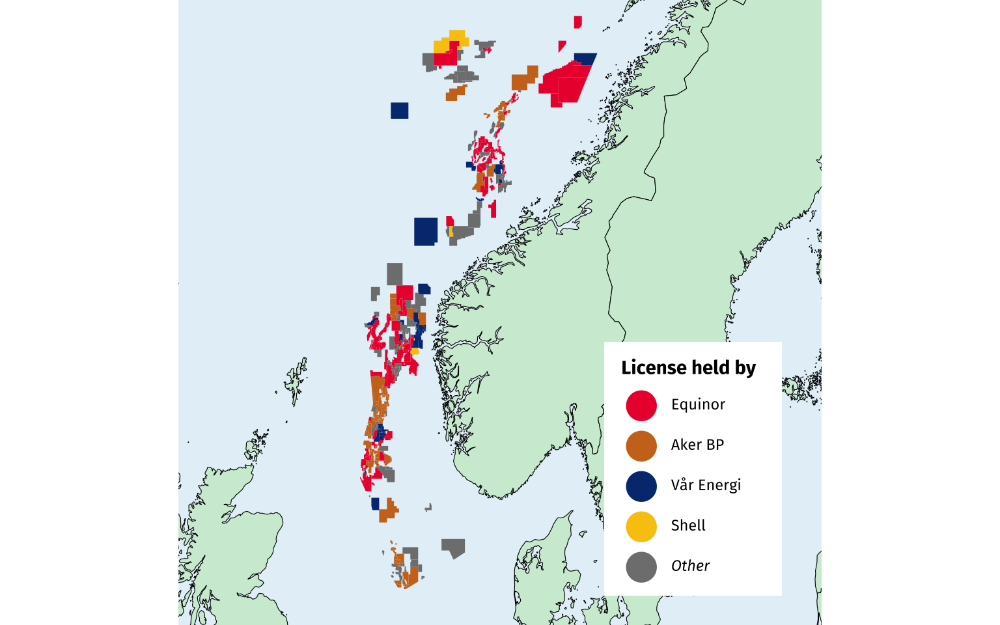

I've chosen to focus only on the area below the [Arctic Circle](https://en.wikipedia.org/wiki/Arctic_Circle). However, there are active oil fields in the Barentz Sea and several Norwegian political parties have opened up the possibility for [drilling in the Lofoten area](https://no.wikipedia.org/wiki/Oljeutvinning_i_Lofoten,_Vesterålen_og_Senja) which would do great harm to the nature there (as it does everywhere else).

Let's create another plot. This time I accessed the [Fjord catalog](https://kartkatalog.miljodirektoratet.no/dataset/Details/501)You can explore the map interactively [here](https://norgeskart.no/geoportal/#!?zoom=6.690000000000001&lon=249791.34&lat=6637462.59&wms=https:%2F%2Fkart.miljodirektoratet.no%2Fgeoserver%2Ffjordkatalogen%2Fwms&project=geonorge&layers=1002&markerLat=6637462.589542976&markerLon=249791.33883956855&panel=searchOptionsPanel&addLayers=fjordkatalogen_omrade#6%252F-58549%252F6698183%252Fl%252Fwms%252F%255Bhttps:%252F%252Fkart.miljodirektoratet.no%252Fgeoserver%252Ffjordkatalogen%252Fwms%255D%252F+fjordkatalogen_grenser%252F+fjordkatalogen_omrade), a collection of all coastal areas and particular fjords with very high resolution. When loading this dataset I noticed that it failed to parse some of the Norwegian characters (æøå) so we need to specify the encoding to make it work through `options = "ENCODING=LATIN1"`.

We need to filter on ID sometimes if the name is not exclusive (turns out there are a lot of fjords that contain the string "Indre" or "Eid" unsurprisingly enough).

For example, if you wanted to plot the upper part of the Oslo fjord you could filter instead for `"hurum|oslo|bonnefjorden|breidangen|breiangen|drammen|sandebukten"`

``` r
df_fjord_catalogue <- st_read(
  "./data/fjordkatalogen_omrade/fjordkatalogen_omrade.shp",
  options = "ENCODING=LATIN1",
  quiet = TRUE
) |>
  janitor::clean_names() |>
  filter(
    fjordid %in%
      c(
        "02.80.02.01.00",
        "02.80.02.06.01",
        "02.80.02.13.02",
        "02.80.02.21.02",
        "02.80.02.21.01",
        "02.80.02.22.00"
      ) |
      str_detect(
        navn,
        "Årdalsfjorden|Lustra|Gaupne|Lærdal|Aurland|Nærøyfjorden|Sogndal|Barsnes"
      ) | # Broken up for readability
      str_detect(
        navn,
        "Fjærland|Vetle|Svære|Arna|Finna|Låne|Høyang|Fuglset|Vadheim|Ikje|Risne"
      )
  )

df_fjords_centroids <- df_fjord_catalogue |>
  st_centroid() |>
  mutate(
    lon = st_coordinates(geometry)[, 1],
    lat = st_coordinates(geometry)[, 2]
  )

df_fjord_catalogue |>
  ggplot() +
  geom_sf(fill = "#E4F1F8") +
  ggrepel::geom_text_repel(
    data = df_fjords_centroids,
    aes(x = lon, y = lat, label = navn),
    min.segment.length = 0,
    family = "custom",
    size = 2.5,
    seed = 42
  ) +
  labs(x = "Longitude", y = "Latitude") +
  theme_minimal(base_family = "custom")
```

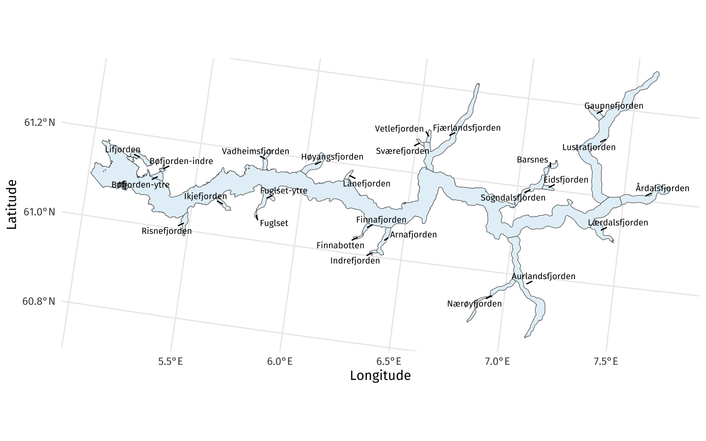

## Geopackage

Geopackage is a more modern alternative, initially released in [2014](https://www.geopackage.org/spec/). It is built as a SQLite database which allows it to store both geospatial data and tabular data. It is fairly easy to use it in [both Python and R](https://mapscaping.com/understanding-geopackage/) in addition to more traditional GIS software. Its main advantage I think is that it uses a "tile pyramid" solution where data is stored hierarchically, such that is is more efficient to respond to different zoom levelsSee the [FAQ](https://www.geopackage.org/#faq) for more details. As it is (relatively) new, not all data repositories include it, but there are [tools to convert GeoJSON to GeoPackage](https://quickmaptools.com/geojson-to-gpkg) if you were so inclined.

When you search "GeoPackage Norway" you'll quickly end up on [gadm.org](https://gadm.org/download_country.html). You should avoid this website as the municipalities aren't up to date as of time of writing (February 2026). What I did instead for this section of the article is to use the aforementioned conversion tool to get a GeoPackage from [these GeoJSONs](https://github.com/AnalyseABO/Kart-fylker-og-kommuner-json/blob/main/geojson/Kommuner-L.geojson). The [EU Eurostat website](https://ec.europa.eu/eurostat/web/gisco/geodata/administrative-units/countries) mentioned earlier also allows for downloads in the GeoPackage format. We'll download the [data with country borders]((https://ec.europa.eu/eurostat/web/gisco/geodata/administrative-units/countries)) from that one. Here's what these look like:

``` r
st_layers("./data/Kommuner-L.gpkg")
```

    Driver: GPKG 
    Available layers:
      layer_name geometry_type features fields crs_name
    1 Kommuner-L                    357      4   WGS 84

``` r
st_layers("./data/CNTR_RG_03M_2024_4326.gpkg")
```

    Driver: GPKG 
    Available layers:
                      layer_name geometry_type features fields crs_name
    1 CNTR_RG_03M_2024_4326.gpkg Multi Polygon      263     11   WGS 84

Then we can specify the layer we want in the `layer` argument in `st_read()` (but we don't really need it as both of them only have a single layer). As always, we'll use the `clean_names()` function from `{janitor}` package to clean the column names.

``` r
norway_kommuner_gpkg <- st_read(
  "./data/Kommuner-L.gpkg",
  layer = "Kommuner-L"
) |>
  janitor::clean_names()

world_gpkg <- st_read("./data/CNTR_RG_03M_2024_4326.gpkg") |>
  janitor::clean_names()

norway_gpkg <- world_gpkg |>
  filter(cntr_id == "NO")
```

Let's then also have a look at the data frame for the municipalities.

``` r
norway_kommuner_gpkg |>
  glimpse()
```

    Rows: 357
    Columns: 5
    $ id            <chr> "4216", "5053", "3440", "4014", "4226", "5514", "4020", …
    $ kommunenummer <chr> "4216", "5053", "3440", "4014", "4226", "5514", "4020", …
    $ name          <chr> "Birkenes", "Inderøy", "Øyer", "Kragerø", "Hægebostad", …
    $ kommunenavn   <chr> "Birkenes", "Inderøy", "Øyer", "Kragerø", "Hægebostad", …
    $ geom          <MULTIPOLYGON [°]> MULTIPOLYGON (((8.048822 58..., MULTIPOLYGO…

This data frame contains a number of columns we've seen before. The `geom` column contains the data we need for our plots. The other columns contain various subdivisions of the geographical features and various codes.

Let's use this to create the simplest possible figure: the outlines of the municipalities.

``` r
norway_kommuner_gpkg |>
  ggplot(aes(geometry = geom)) +
  geom_sf() +
  theme_void()
```

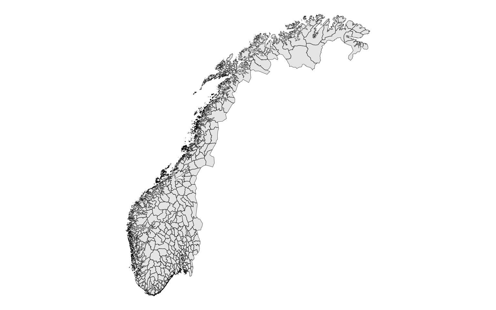

This is boring, let's try to add some actual data. For this I download some data from [Statistics Norway (SSB)](https://www.ssb.no) about [land use](https://www.ssb.no/statbank/table/09594) per municipality. It tracks how much land in the municipality is occupied with residential, leasure, and industry buildings, agriculture, forests, glaciers, ice, and snow, religious and social use, and so on. We can calculate the percentage of each municipality occupied by forests for example and plot that. We can preprocess the data as follows:

``` r
df_land_use <- read_delim(
  "./data/arealbruk.csv",
  delim = ";",
  skip = 1,
  locale = locale(encoding = "latin1")
) |>
  janitor::clean_names() |>
  separate(region, into = c("code", "kommune"), sep = " ", extra = "merge") |>
  rowwise() %>%
  mutate(total = sum(c_across(starts_with("areal_")), na.rm = TRUE)) |>
  ungroup() |>
  mutate(
    kommunenummer = str_remove(code, "K-"),
    forest_percentage = areal_2025_17_skog / total,
  )

norway_kommuner_gpkg_wdata <- norway_kommuner_gpkg |>
  left_join(
    df_land_use,
    by = "kommunenummer",
  )
```

And then create a plot as we did before. But in this case I also want to highlight the impact picking different coordinate systems can have. We'll show WGS84 (or ["4326"](https://epsg.io/4326)) on the left and ETRS89-extended on the left (or ["3035"](https://epsg.io/3035)). It is important to note that WGS84 and "4326" are not *the same* reference system, they are for all our purposes today close enough, but they are different systems. [This article](https://mapscaping.com/difference-between-wgs84-and-epsg4326/) lists the differences. The former uses coordinates as they are shown in the ggplot's (i.e in degrees from 0˚ to 180˚) while the second one is in meters which means the values are really large but also very precise once you know the reference point. The former (WGS84/4326) is easier to use typically but the ETRS89-extended/3035 has some advantages, one being the projection in ggplot that accounts for the curvature of the earth, thereby addressing to some degree the [issue with the Mercator projection](https://thetruesize.com/) as it is the basis for the WGS84/4326 projection[This blogpost here](https://ikashnitsky.phd/2023/map-proj/) goes into more depth on projections in R.

``` r
plot_forests_wgs84 <- norway_kommuner_gpkg_wdata |>
  ggplot(aes(geometry = geom, fill = forest_percentage)) +
  geom_sf(data = world_gpkg, fill = "grey90") +
  geom_sf() +
  labs(
    title = "WGS84 (4326)",
    fill = "Forest coverage"
  ) +
  scico::scale_fill_scico(
    limits = c(0, 1),
    labels = scales::label_percent(),
    palette = "turku",
    direction = -1,
    na.value = "white",
    guide = guide_colorbar(barwidth = 1, barheight = 10)
  ) +
  coord_sf(xlim = c(5, 32.5), ylim = c(58, 71))

plot_forests_etrs89 <- norway_kommuner_gpkg_wdata |>
  st_transform(crs = 3035) |>
  ggplot(aes(geometry = geom, fill = forest_percentage)) +
  geom_sf(data = world_gpkg |> st_transform(3035), fill = "grey90") +
  geom_sf() +
  labs(
    title = "ETRS89-extended (3035)",
    fill = "Forest coverage"
  ) +
  scico::scale_fill_scico(
    limits = c(0, 1),
    labels = scales::label_percent(),
    palette = "turku",
    direction = -1,
    na.value = "white",
    guide = guide_colorbar(barwidth = 1, barheight = 10)
  ) +
  coord_sf(xlim = c(4e6, 5.2e6), ylim = c(3.9e6, 5.35e6))

plot_forests_wgs84 +
  plot_forests_etrs89 +
  plot_layout(guides = "collect") &
  theme_minimal(base_family = "custom") +
    theme(
      plot.title = element_text(hjust = 0.5),
      legend.title = element_text(margin = margin(b = 10, unit = "pt")),
      legend.ticks = element_blank(),
    )
```

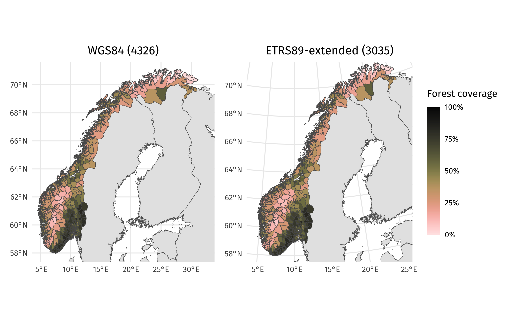

In the example above I very much prefer the ETRS89-extended/3035 version for plotting Norway, as it gives the lower part of the country a bit more "breathing room". The WGS84/4326 projection makes norway look even more "squished" along the longitudinal plane.



``` r
df_population <- read_delim(
  "./data/ssb_befolkning_kommuner.csv",
  delim = ";",
  skip = 1,
  locale = locale(encoding = "latin1")
) |>
  rename_with(~ str_remove(.x, "2025K3 ")) |>
  janitor::clean_names() |>
  separate("region", into = c("code", "name"), sep = " ", extra = "merge") |>
  mutate(
    kommunenummer = str_remove(code, "K-"),
  )

norway_kommuner_gpkg |>
  left_join(df_population, by = "kommunenummer") |>
  st_transform(3035) |> # Transform into ETRS89-extended temporarily
  mutate(
    total_area = st_area(geom),
    pop_density = as.numeric(
      befolkning_ved_utgangen_av_kvartalet / (total_area / 1e6)
    ),
  ) |>
  st_transform(4326) |> # Turn it back to WGS84 after calculations
  ggplot(aes(geometry = geom, fill = pop_density)) +
  geom_sf(color = "transparent") +
  labs(
    fill = "Population density<br>(per km<sup>2</sup>)"
  ) +
  scico::scale_fill_scico(
    trans = "log2",
    breaks = c(1, 10, 25, 100, 500, 1500),
    direction = -1
  ) +
  coord_sf(crs = 3035) +
  theme_void(base_family = "custom") +
  theme(
    legend.position = "inside",
    legend.position.inside = c(0.75, 0.25),
    legend.title = ggtext::element_markdown(
      margin = margin(b = 10, unit = "pt")
    ),
    legend.ticks = element_blank(),
    legend.background = element_rect(color = "transparent", fill = "white")
  )
```

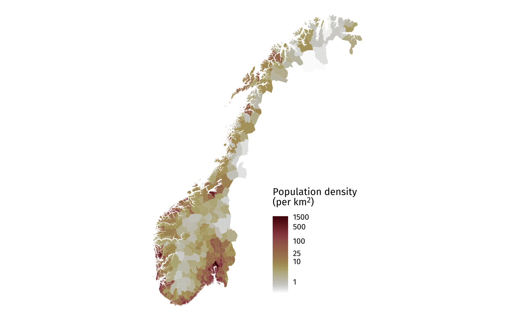



Another main advantage is the ability to store multiple layers in a single data file. For example, look at this data below from the Norwegian [*Miljødirektoratet*](https://kartkatalog.miljodirektoratet.no/Dataset) about [visual inspections of the sea bed](https://kartkatalog.miljodirektoratet.no/Dataset/Details/2052).

``` r
st_layers("./data/visuell_kartlegging_eksport.gpkg")
```

    Driver: GPKG 
    Available layers:
             layer_name     geometry_type features fields              crs_name
    1 VISUAL_INSPECTION 3D Measured Point  2832953     66 ETRS89 / UTM zone 33N
    2       SURVEY_INFO 3D Measured Point      271     28 ETRS89 / UTM zone 33N
    3   PHOTO_LOCATIONS 3D Measured Point    89443     17 ETRS89 / UTM zone 33N

The `VISUAL_INSPECTION` layer has a ton of features (rows) while the metadata (`SURVEY_INFO`) contains a lot fewer. Also the number of variables recorded for each row is different. The data stored in this GeoPackage is essentially a set of data frames, each with their geospatial information. Let's for example look at the metadata.

``` r
df_havbunn_survey <- st_read(
  "./data/visuell_kartlegging_eksport.gpkg",
  layer = "SURVEY_INFO"
) |>
  janitor::clean_names()
```

And let's also create a plot. This is where you'll notice that `geom_sf()` also can deal with points instead of polygons. When the geospatial data is a collection of coordinate points they'll show up as if drawn by `geom_point()` with a regular latitude and longitude as the x- and y-coordinatesYou could also convert the geospatial column to x- and y-coordinates if you were so inclined. We'll plot the survey observations and the sea depth at those coordinates. Since some measurements were taken above sea level (or at least recorded as such), it allows us to use a color palette specifically for these kinds of situations with a hard "cut-off" at 0. We want to differentiate clearly between the negative and positive values (positive values are meters *below* sealevel). So we'll use the `"oleron"` palette from the [`scico` package](https://github.com/thomasp85/scico).

``` r
df_havbunn_survey |>
  st_transform(crs = 3035) |>
  ggplot(aes(color = water_depth)) +
  geom_sf(
    data = world_gpkg,
    aes(geometry = geom),
    inherit.aes = FALSE
  ) +
  geom_sf() +
  labs(
    color = "Meters below sea level",
    caption = "Negative values indicate below sea level\nPositive numbers indicate above sealevel"
  ) +
  scico::scale_color_scico(
    palette = "oleron",
    direction = -1,
    midpoint = 0,
    limits = c(NA, 1500),
    guide = guide_colorbar(reverse = TRUE)
  ) +
  coord_sf(xlim = c(3.5e6, 5.5e6), ylim = c(3.75e6, 6e6)) +
  theme_minimal(base_family = "custom") +
  theme(
    legend.title = element_text(margin = margin(b = 10, unit = "pt")),
    legend.ticks = element_blank(),
  )
```

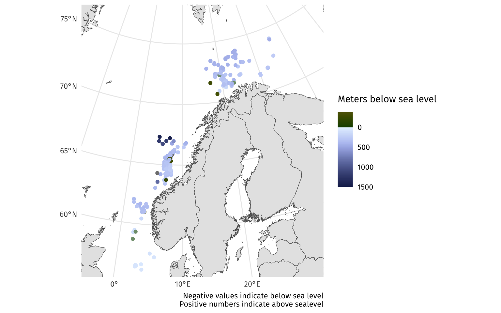

This post has become long enough, so on to the last format.

## Geodatabase

A [geodatabase](https://en.wikipedia.org/wiki/Geodatabase_(Esri)) is exactly as the name suggests, a relational database for geospatial data. Geodatabases are typically suffixed by the `.gdb` extension, but on for example Mac you can easily click on such a "file" and it opens a directory with `.gdbtable`, `.gdbindexes`, `.gdbtablx`, and `.spx` files. However, when we read the dataset we can just point it to the `.gdb` file.

Let's dive straight in, we know the trick by now. I downloaded some data from the [Norges vassdrags- og energidirektorat (NVE)](https://nve.no), or the Norwegian Water Resources and Energy Directorate in English. From their [open data page](https://nedlasting.nve.no/gis/) we can download a dataset on rivers (*elv*) and lakes (*innsjø*). These contain the geospatial references for all rivers and lakes in Norway. These datasets are very detailed and are very large as you can imagine. We can look at the layers in the Geodatabase by using `st_layers()` and it will tell us how many entries both datasets contain:

``` r
st_layers(
  "./data/NVEData_rivers.gdb/"
)
```

    Driver: OpenFileGDB 
    Available layers:
            layer_name     geometry_type features fields              crs_name
    1         Hovedelv Multi Line String     6262      9 ETRS89 / UTM zone 33N
    2         Elvenett Multi Line String  1718354     18 ETRS89 / UTM zone 33N
    3 TverrprofilLinje Multi Line String     3716     11 ETRS89 / UTM zone 33N
    4 TverrprofilPunkt             Point   175026     15 ETRS89 / UTM zone 33N
    5     ElvDybdedata     Multi Polygon       91     20 ETRS89 / UTM zone 33N
    6    ElvDybdekurve Multi Line String     1171      6 ETRS89 / UTM zone 33N

``` r
st_layers(
  "./data/NVEData_lakes.gdb/"
)
```

    Driver: OpenFileGDB 
    Available layers:
            layer_name     geometry_type features fields              crs_name
    1           Innsjo     Multi Polygon   267192     21 ETRS89 / UTM zone 33N
    2  InnsjoDybdedata     Multi Polygon      686     34 ETRS89 / UTM zone 33N
    3 InnsjoDybdekurve Multi Line String    27886      7 ETRS89 / UTM zone 33N
    4  InnsjoDybdemalt     Multi Polygon      530      7 ETRS89 / UTM zone 33N
    5 InnsjoDybdepunkt             Point    28512      6 ETRS89 / UTM zone 33N

These first dataset contains about 6000 "main" rivers, and about 1.7 million entries for minor creeks and brooks and so on. The second one contains about 260.000 lakes of various sizes. It also contains data on lake depth, and the depth curves. This is obviously a massive dataset, so we'll need to restrict ourselves to a certain area of interest when we get to the plotting stage. Since we're just interested in the main rivers and the regular lake data we can just load those.

``` r
df_rivers <- st_read(
  "./data/NVEData_rivers.gdb/",
  layer = "Hovedelv"
) |>
  janitor::clean_names()

df_lakes <- st_read(
  "./data/NVEData_lakes.gdb/",
  layer = "Innsjo"
) |>
  janitor::clean_names()
```

Then we can proceed to the plotting stage. Here the order of the `geom`s is very important. We'll first plot the GeoPackage dataset we used earlier to get some boundaries. Then we'll plot the rivers on top. We'll transform it to the WGS 84 format from earlier (`4326`). Then we'll plot the lakes on top. We'll restrict ourselves to the greater Oslo area to allow plotting to finish before my computer runs out of memoryAnd the plot is actually readable.

``` r
df_rivers |>
  st_transform(4326) |>
  ggplot() +
  geom_sf(data = norway_kommuner_gpkg, fill = "white") +
  geom_sf(color = "navyblue") +
  geom_sf(data = df_lakes, fill = "#E4F1F8") +
  coord_sf(xlim = c(10.4, 10.9), ylim = c(59.75, 60.1)) +
  theme_minimal() +
  theme(
    panel.background = element_rect(fill = "#E4F1F8", color = "transparent")
  )
```

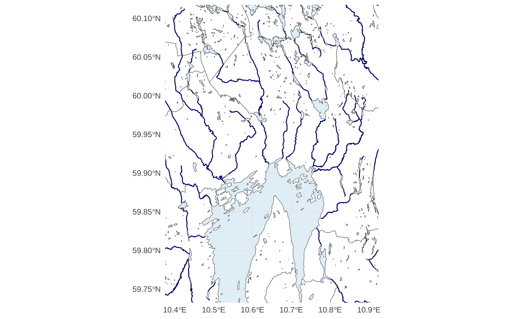

We can do the same tricks as before and for example calculate which lakes are the largest (I'm aware the dataset contains a precomputed `shape_area` column, but we're trying to be educational here and calculate it ourselves). Let's look at the 10 largest lakes. The `as_tibble()` is necessary to drop the column with the geospatial data that follows naturally when loading a dataset with `st_read()`.

``` r
df_lakes |>
  mutate(calc_area = st_area(SHAPE)) |>
  as_tibble() |>
  slice_max(calc_area, n = 10) |>
  select(
    navn,
    hoyde_moh,
    calc_area
  )
```

    # A tibble: 10 × 3
       navn                          hoyde_moh  calc_area
       <chr>                             <int>      [m^2]
     1 Mjøsa                               123 369280270.
     2 Røsvatnet                           383 218048869.
     3 Femunden                            662 203836472.
     4 Randsfjorden                        135 140402764.
     5 Tyrifjorden                          63 136560538.
     6 Store Le                            103 133661933.
     7 Snåsavatnet                          22 122173587.
     8 Tunnsjøen                           358 100530017.
     9 Limingen                            418  93271146.
    10 Umbukta (Øver-Uman i Sverige)       525  85016595.

Then we can try plotting the 9 largest lakesBecause it'll make a nice 3x3 grid. In a normal ggplot you'd just something like this:

``` r
df_lakes |>
  mutate(calc_area = st_area(SHAPE)) |>
  slice_max(calc_area, n = 9) |>
  ggplot() +
  geom_sf() +
  facet_wrap(~navn)
```

This doesn't look good, we would usually add `scales = "free"` to avoid each subplot having the same coordinate boundaries, but if you try that you'll get the following error:

``` r
Error in `draw_panels()`:
! `facet_wrap()` can't use free scales with `coord_sf()`.
```

Instead we'd have to do something a bit more hacky. We can for example loop through the lakes of interest and create a separate plot for each and store them in a list. And then we'll use [`{patchwork}`](https://patchwork.data-imaginist.com/index.html) to plot each of the 9 subplots on a separate canvas. To get the lake of interest we can sort the dataframe in descending order and slide the relevant iteration from the dataframe. There are probably more efficient ways to do it, but this is a pedagogical choice. Whether it's a good one I don't know.

``` r
lake_plots <- c()
for (lk in seq(9)) {
  df_lake_tmp <- df_lakes |>
    mutate(calc_area = st_area(SHAPE)) |>
    arrange(desc(calc_area)) |>
    mutate(label = str_glue("{row_number()} - {navn}")) |>
    slice(lk)
  lake_plots[[lk]] <- df_lake_tmp |>
    ggplot() +
    geom_sf(fill = "#E4F1F8") +
    labs(title = df_lake_tmp |> pull(label))
}

lake_plots[[1]] +
  lake_plots[[2]] +
  lake_plots[[3]] +
  lake_plots[[4]] +
  lake_plots[[5]] +
  lake_plots[[6]] +
  lake_plots[[7]] +
  lake_plots[[8]] +
  lake_plots[[9]] &
  theme_void(base_family = "custom") +
    theme(
      plot.title = element_text(size = 10, hjust = 0.5)
    )
```

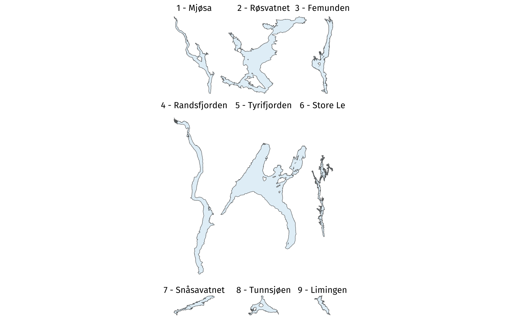

We could for example do the same for the top 9 lakes by elevation and restrict ourselves to lakes important enough to warrant a name. Note that when we don't use `as_tibble()`, we don't need to explicitly `select` the `SHAPE` column:

``` r
df_lakes |>
  mutate(calc_area = st_area(SHAPE)) |>
  drop_na(navn) |>
  slice_max(hoyde_moh, n = 9) |>
  select(
    navn,
    hoyde_moh,
  )
```

    Simple feature collection with 9 features and 2 fields
    Geometry type: MULTIPOLYGON
    Dimension:     XY
    Bounding box:  xmin: 134039.4 ymin: 6846975 xmax: 201926.2 ymax: 6935728
    Projected CRS: ETRS89 / UTM zone 33N
                  navn hoyde_moh                          SHAPE
    1        Juvvatnet      1836 MULTIPOLYGON (((148790.2 68...
    2 Trollsteintjønne      1754 MULTIPOLYGON (((161625.2 68...
    3    Skjervetjønne      1725 MULTIPOLYGON (((167893.5 68...
    4      Hindtjønnin      1724 MULTIPOLYGON (((171115.9 68...
    5 Trollsteintjønne      1708 MULTIPOLYGON (((160208.3 68...
    6      Hindtjørnin      1691 MULTIPOLYGON (((172006.3 68...
    7       Leirvatnet      1682 MULTIPOLYGON (((134231.1 68...
    8       Repptjønna      1678 MULTIPOLYGON (((195389.5 69...
    9      Larstjørnin      1672 MULTIPOLYGON (((201673.5 69...

Here's another example using the Geodatabase format. Here we can use [data on the legal landing sites for organized tourism](https://kartkatalog.miljodirektoratet.no/Dataset/Details/3078) in Svalbard, downloaded from the [*Miljødirektoratet*](https://www.miljodirektoratet.no) (the Norwegian Environmental Agency). We'll keep it simple. We'll add a red mark to indicate where Longyearbyen is located to give some reference point for the island.

``` r
df_svalbard <- st_read(
  "./data/Ilandstigningslokaliteter_21_svalbard_25833_FILEGDB.gdb",
  quiet = TRUE
)

df_svalbard |>
  ggplot(aes(geometry = SHAPE)) +
  geom_sf(
    data = europe_shp,
    mapping = aes(geometry = geometry),
    fill = "white",
    color = "black",
    show.legend = FALSE
  ) +
  geom_sf(color = "darkblue", shape = 18, size = 2.5) +
  geom_point(
    mapping = aes(x = 514438, y = 8682628),
    color = "red",
    size = 3,
    shape = "square"
  ) +
  labs(x = NULL, y = NULL) +
  coord_sf(xlim = c(3e5, 9e5), ylim = c(8.5e6, 9e6)) +
  theme_minimal(base_family = "custom") +
  theme(
    panel.background = element_rect(fill = "#E4F1F8", color = "transparent")
  )
```

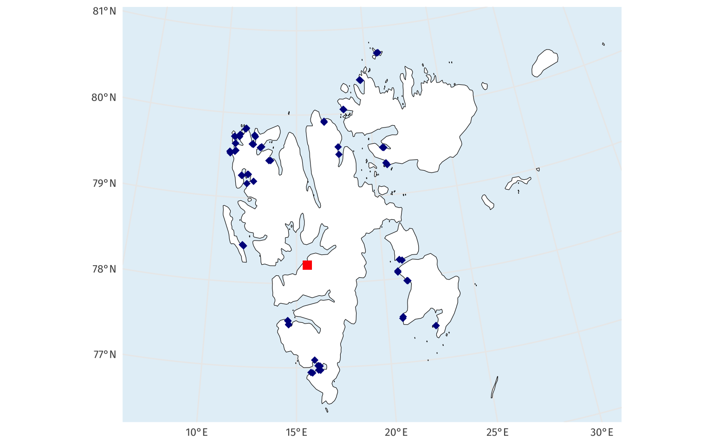

This has become a *long* post already, so let's just quickly wrap it up. We'll do one final project. While I was looking for datasets for this post I tried to find a geospatial dataset of national parks in Norway. However, I couldn't find a high quality one, so I downloaded a poor quality one (I think it's poor quality at least) and thought we could go through some cleaning togetherThere is a higher quality one [here](https://files.kr24.no/geojson/) if you are interested. There is a map on the [norgesnasjonalparker.no](https://www.norgesnasjonalparker.no) website, but it's not a GeoJSON like [the one from a previous post](https://danielroelfs.com/posts/remote-sensing-viticulture#get-the-satellite-data), instead it's a bunch of SVG files and I couldn't find an easy (and free) way to get the SVGs in the correct format locally and convert them. So let's do some data cleaning of geospatial data. The data I did find was from the [Artsdatabanken](https://data.artsdatabanken.no/Naturvernområde/Nasjonalpark). It looks like a page regular users aren't supposed to arrive at, but we'll take it. This page lists all national parks. However, I downloaded the `polygon.32633.geojson` file and saved it as `nasjonalparker.geojson` locally. I also downloaded the `metadata.json` file to use later. The GeoJSON file contains all national parks in a single dataset, the metadata file contains a bunch of other information about the parks. When inspecting the layers we can see there are 32 features in the GeoJSON dataset. However, Norway has [48 national parks](https://snl.no/nasjonalparker_i_Norge) so there is either some features that contain the outlines for multiple national parks, or some of them are missing. However, first we need to clean the dataset. We'll load the data, transform it to EPSG:4326 format and save it using `st_write()`.

``` r
st_layers("./data/nasjonalparker.geojson")
```

    Driver: GeoJSON 
    Available layers:
      layer_name geometry_type features fields              crs_name
    1   polygons                     32      1 WGS 84 / UTM zone 33N

``` r
df_nasjonalpark_geojson <- st_read(
  "./data/nasjonalparker.geojson",
  quiet = TRUE
) |>
  st_transform(4326) |>
  mutate(kode = str_glue("VV-{kode}"))

st_write(
  df_nasjonalpark_geojson,
  dsn = "./data/nasjonalparker_4326.geojson",
  delete_dsn = TRUE
)
```

    Deleting source `./data/nasjonalparker_4326.geojson' using driver `GeoJSON'
    Writing layer `nasjonalparker_4326' to data source 
      `./data/nasjonalparker_4326.geojson' using driver `GeoJSON'
    Writing 32 features with 1 fields and geometry type Multi Polygon.

Just to illustrate, this is what the data looks like when plotted. Pay attention to all the little dots scattered around the map. Also note how the entirety of Svalbard is missing, [much of which is covered by national parks](https://en.wikipedia.org/wiki/List_of_protected_areas_of_Svalbard). However, for now we'll focus on cleaning the little dots.

``` r
df_nasjonalpark_geojson |>
  ggplot() +
  geom_sf(data = norway_gpkg, fill = "grey90", color = "transparent") +
  geom_sf(fill = "#60e052", color = "darkgreen") +
  theme_void()
```

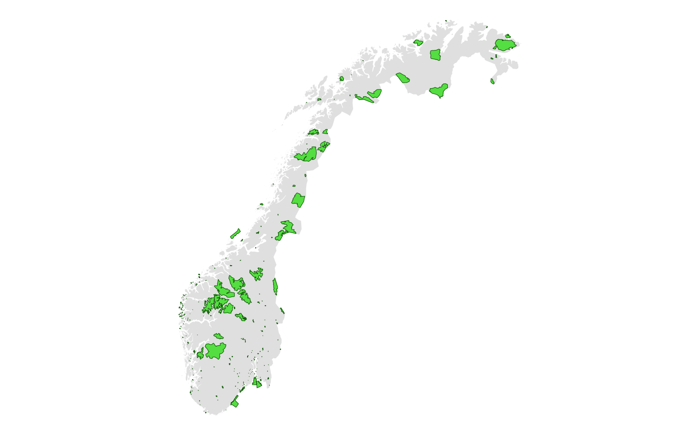

This is where we turn to the tool I've used in the [previous post](https://danielroelfs.com/posts/remote-sensing-viticulture): [geojson.io](https://geojson.io). This free tool lets us easily edit the GeoJSON so we can find and delete the features we don't want. Simply open the (valid) GeoJSON in the editor window and select the dots and click "delete feature". This will remove a lot more data than we want and we'll go from 32 features. (as opposed to the 48 expected) to even fewer, but it's about the process in this post. It'll be about the result when you apply these tools in your work. We can save the "cleaned" dataset as `nasjonalparker_4326_manually_cleaned.geojson` and then load it again. We'll also load the metadatafile and combine them by ID.

``` r
df_nasjonalpark_cleaned <- st_read(
  "./data/nasjonalparker_4326_manually_cleaned.geojson",
  quiet = TRUE
)

df_nasjonalpark_metadata <- jsonlite::read_json(
  "./data/nasjonalpark_metadata.json"
) |>
  pluck("barn") |>
  transpose() |>
  as_tibble() |>
  mutate(
    across(where(is.list), ~ map_chr(.x, 1)),
    name_clean = str_replace_all(
      str_remove(url, "/Naturvernområde/Nasjonalpark/"),
      "_",
      " "
    )
  )

df_nasjonalpark <- df_nasjonalpark_cleaned |>
  full_join(df_nasjonalpark_metadata, by = "kode") |>
  mutate(
    area = st_area(geometry),
  )
```

Then we can plot the result. We'll add an option to calculate the centroids so we can label the parks that are left.

``` r
df_nasjonalpark_centroids <- df_nasjonalpark |>
  st_centroid() |>
  mutate(
    lon = st_coordinates(geometry)[, 1],
    lat = st_coordinates(geometry)[, 2]
  )

df_nasjonalpark |>
  ggplot() +
  geom_sf(data = norway_gpkg, fill = "grey90", color = "transparent") +
  geom_sf(fill = "#60e052", color = "darkgreen") +
  ggrepel::geom_text_repel(
    data = df_nasjonalpark_centroids,
    aes(x = lon, y = lat, label = name_clean),
    size = 2,
    family = "custom",
    min.segment.length = 0,
  ) +
  labs(
    x = "Longitude",
    y = "Latitude",
    caption = "NOTE: not all national parks are shown"
  ) +
  theme_void(base_family = "custom")
```

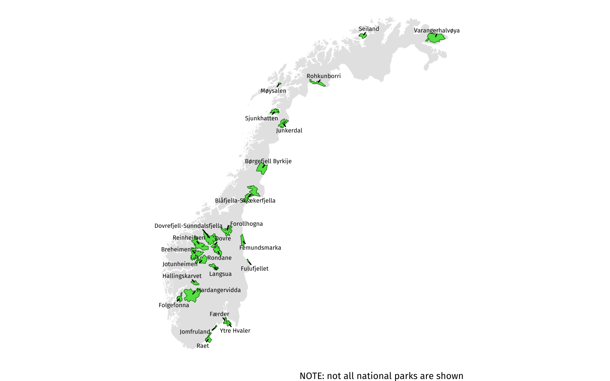

As you can see, many of the smaller dots are gone, but also the number of green areas which are supposed to depict national parks is too low. But at least now we learned how to clean this type of data.

If you're curious, here what it would look like when we use the better quality dataset mentioned earlier:

``` r
st_layers("./data/nasjonalparker_good_quality.geojson")
```

    Driver: GeoJSON 
    Available layers:
                       layer_name geometry_type features fields crs_name
    1 nasjonalparker_good_quality                     55    107   WGS 84

``` r
df_nasjonalpark_good <- st_read(
  "./data/nasjonalparker_good_quality.geojson",
  quiet = TRUE
) |>
  janitor::clean_names() |>
  mutate(bbox = map(geometry, st_bbox)) |>
  filter(
    map_lgl(
      bbox,
      ~ .x["ymax"] <= 75
    )
  )

df_nasjonalpark_good_centroids <- df_nasjonalpark_good |>
  st_centroid() |>
  mutate(
    lon = st_coordinates(geometry)[, 1],
    lat = st_coordinates(geometry)[, 2]
  )

df_nasjonalpark_good |>
  ggplot() +
  geom_sf(data = norway_gpkg, fill = "grey90", color = "transparent") +
  geom_sf(fill = "#60e052", color = "darkgreen") +
  ggrepel::geom_text_repel(
    data = df_nasjonalpark_good_centroids,
    aes(x = lon, y = lat, label = naturbase_navn),
    size = 1.5,
    family = "custom",
    min.segment.length = 0,
    max.overlaps = Inf,
    seed = 42
  ) +
  labs(
    x = "Longitude",
    y = "Latitude",
  ) +
  theme_void(base_family = "custom")
```

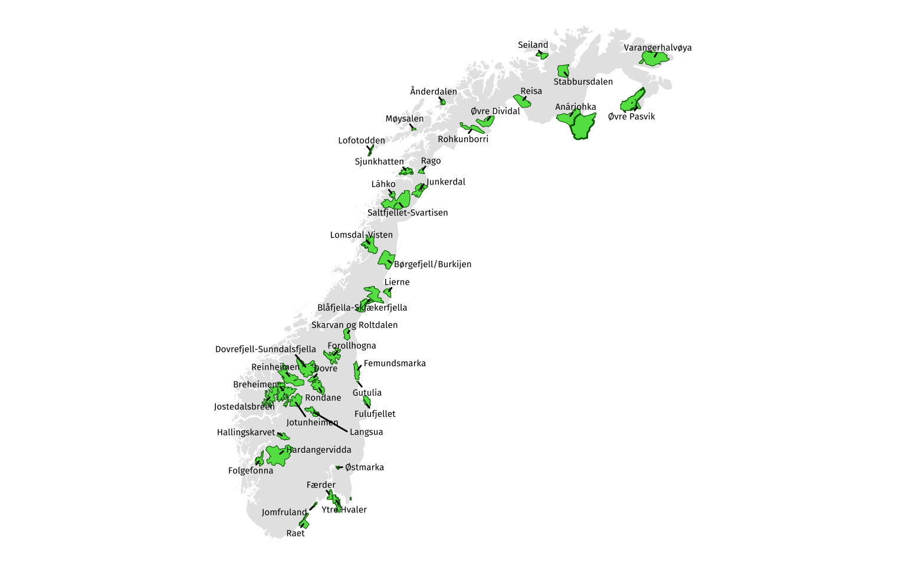

I hope I showed that working with geospatial data is not as intimidating as it may have seemed from before. Essentially all you need to remember from this post is `st_layers()` for inspecting the dataset, `st_read()` to load it (in whatever format it is), and `geom_sf()` to plot itHm, didn't need to write such a long post after all it seems. There are a lot of [cool things](https://www.visualcinnamon.com/2023/04/personal-map-norway-with-javascript/) one can do with geospatial data in R. I had quite a lot of fun with this one, and while writing it I actually learned a bit myself too. I'm glad I finally got to deliver what I'd say I'd do in the [previous post](../../../posts/the-easier-way-to-create-a-map-of-norway-using-csmaps/), but more importantly I hope I inspired you to give plotting geospatial data in R a go. Happy coding!
