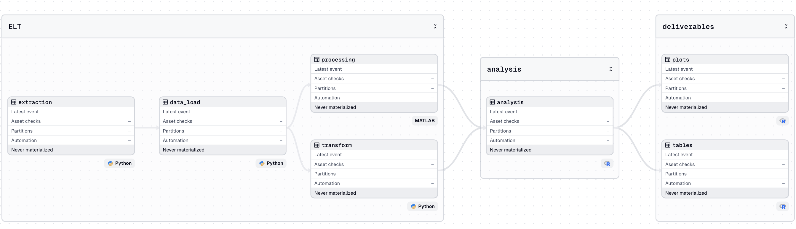
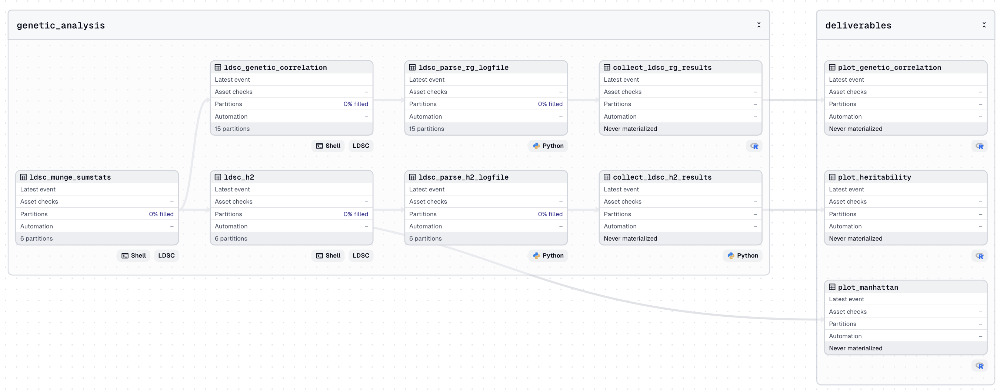
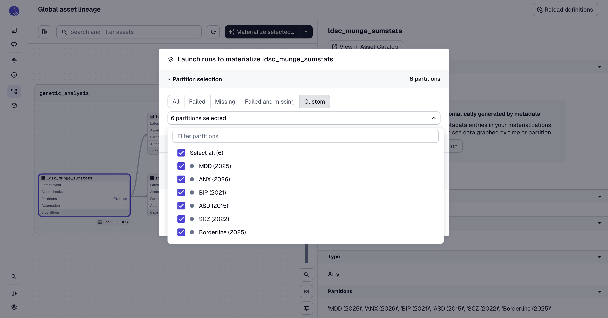
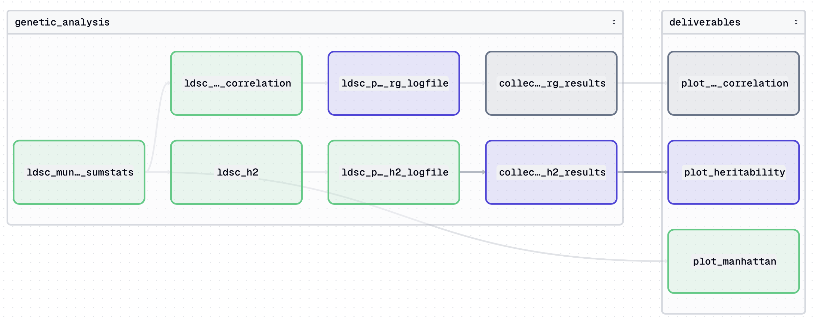
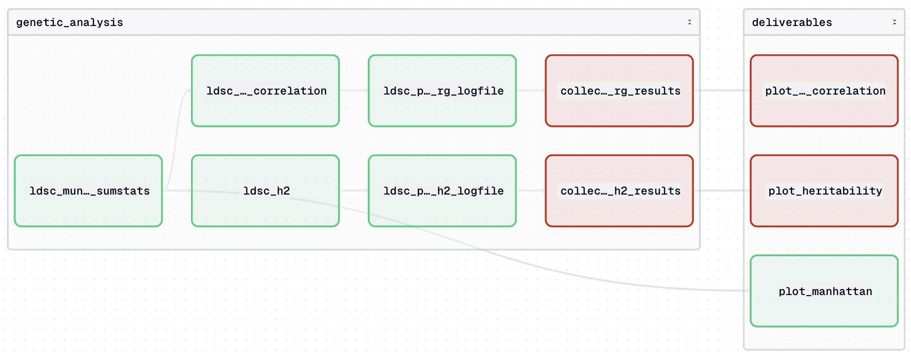
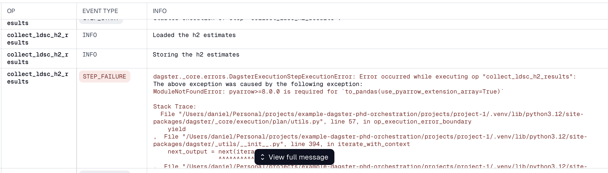
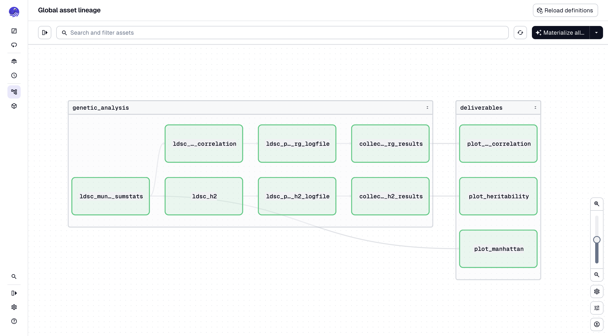

Since I finished my PhD and started working in industry I have been introduced to _a lot_ of new tools and ways of working that weren't at all common in academia{}at least not in any research group I was aware of{}. Learning certainly did not stop when I got a job in industry, and as I became more familiar with these new tools and methods I found myself wishing I had known these tools during my PhD. Not just because it would have made my transition to industry a bit easier, but mostly because the functionality these tools provide are incredibly valuable. So in this post I'll go over one of these tools/practices and how I would perhaps have used it during my PhD.

The main tool I would have introduced in my PhD if I were to do it again is relational databases and its querying language SQL, but I might write a post about how I'd use SQL databases some other time.

For now I want to focus a bit more on a second type of tools I would like to have had access to: orchestration tools. Orchestration tools help with the data engineering part of any data science/analysis/research project to help write, schedule, run, and maintain predefined workflows. Let's say you have a bunch of scripts that run data extraction, data loading, and transformation (basically (pre)processing, also called [ELT](https://www.getdbt.com/blog/extract-load-transform)) and analysis and testing. These scripts are a combination of Python, bash, R, Julia, MATLAB, or whatever language the tool you're using is implemented in. An (extremely) simplified version of your workflow might look something like this:

```{css}
/*| label: mermaid-edge-color */
/*| echo: false */
:root { --mermaid-edge-color: #868686; }
```

```{mermaid}
%%{
  init: {
    'theme': 'base',
    'themeVariables': {
      'primaryColor': '#dfdfdf',
      'primaryTextColor': '#dfdfdf',
      'primaryBorderColor': '#868686',
      'lineColor': '#868686',
      'secondaryColor': '#dfdfdf'
    }
  }
}%%

flowchart LR
  A[<code>extraction.py</code>] --> B[<code>data_load.py</code>] 
  B --> C[<code>processing.m</code>]
  B --> D[<code>transform.py</code>]
  D --> E
  C --> E{<code>analysis.R</code>}
  E --> F[<code>plots.R</code>]
  E --> G[<code>tables.R</code>]
```

Now, I know we all wished the workflow was this easy. Then the steps to rerun the analysis would be fairly simple and efficient. However, (and I speak from experience here), there are typically many scripts in each ELT and analysis step and they are interconnected. Some people are better than others at maintaining some level of organization{}I've seen people just dump all scripts (including work in progress or long redundant scripts) into a single project's directory and have a Markdown or Word document with some instructions on which scripts are connected to what next steps{}. Neither me nor any of the other PhDs I knew were organized enough to be able to rerun the entire pipeline without manual intervention.

This organization and automation is what orchestration tools help out with. With orchestration tools you can declare which scripts are dependent on which other scripts, you can organize the essential scripts into workflows, and rerun all steps in your pipeline in sequence where the later scripts only begin after the previous scripts (the dependencies) are finished successfully. It makes rerunning analysis a lot less taxing, more efficient, and it allows you to test analysis quicker and easier by changing parameters for a particular step and rerunning the steps in your workflow affected by that change.

I know the HPC{}_High Performance Computing_, we were using the [Sigma2](https://www.sigma2.no/service/sensitive-data-services) infrastructure through the [_Tjenester for Sensitive Data_ (TSD)](https://www.uio.no/english/services/it/research/sensitive-data/index.html){} setup we would support building infrastructure for an orchestration tool (if they haven't already). I've been able to run it on my Raspian RaspberryPi and an old Intel Mac Mini, I know it will run on virtual machines on the HPC as well, offering a world of possibility for more efficient workflows.

## Now which orchestration tools are available?

There are three main open-source orchestration tools in common use, those are (in no particular order):

1. [Apache Airflow](https://airflow.apache.org) ([documentation](https://airflow.apache.org/docs/apache-airflow/stable/index.html), [GitHub repo](https://github.com/apache/airflow))
1. [Dagster](https://dagster.io) ([documentation](https://docs.dagster.io), [GitHub repo](https://github.com/dagster-io/dagster))
1. [Prefect](https://www.prefect.io) ([documentation](https://docs.prefect.io/v3/get-started), [GitHub repo](https://github.com/PrefectHQ/prefect))

Each of thse tools have their own nuances and their own advantages and disadvantages but each of them roughly does the same thing. [Apache Airflow](https://airflow.apache.org) is probably the most widely used in companies{}Also reflected by the number of stars on GitHub, about 18k for Airflow at the time of writing, against roughly 2.5k for both Dagster and Prefect{}, which means it also has the largest community to consult when questions and issues arise. In my opinion, Dagster and Prefect{}Prefect recently [acquired](https://dagster.io/prefect) Dagster Labs, though they vowed both tools would continue to exist and be maintained{} are slightly more intuitive. I especially like Dagster's concept of "one script (reffered to as an [_asset_](https://docs.dagster.io/guides/build/assets)) = 1 unit of data (a table, figure, file etc.)". I think Dagster also has the best onboarding guide, the [Dagster Essentials](https://courses.dagster.io/courses/dagster-essentials) course provided for free by Dagster itself is all you need to get a grasp on how it works. So because I think the threshold for getting started is lowest with Dagster I'll focus on that one for now, though I have worked with Airflow before and I can see some advantages there too.

## How orchestration works

The three main tools are all Python-based. This means that you need to write some Python to interact with them. All three tools also have their own interpretation of something called a [_Directed Acyclic Graph_ (DAG)](https://en.wikipedia.org/wiki/Directed_acyclic_graph), which represents the nodes in the illustration from earlier. A DAG isn't really concerned with _what_ is executed within each node, but rather _how_ the nodes link together. In Python, this just means that you need to define the dependencies for each Python/R/MATLAB script you define in your pipeline and the tool will work out how they link together. In Dagster for example, this might look something like this:

{fig-alt="Screenshot of the Dagster UI, showing a visual representation of the dependency graph"}

In the example above{}Don't worry, I use dark mode, but for the screenshots for this post I briefly switched to light mode for aesthetic reasons{} you'll see the example I showed earlier visualized in Dagster ["asset"](https://docs.dagster.io/guides/build/assets) terms. You'll notice I added a tag for what kind of asset it is (R, Python, MATLAB, for example, there's a [long list](https://docs.dagster.io/guides/build/assets/metadata-and-tags/kind-tags)) and that I added some grouping (ELT, analysis, and deliverables) just to make the overview a bit clearer{}The naming, grouping, file formats, etc. are entirely up to the user to define. There's a lot of freedom here{}. Both the asset kind and group is just for visualization. This is a simple example, once your project becomes more complex, specifying asset metadata and grouping can help prevent some headache.

So how did I define the assete, the groupings, and dependencies? Dagster uses Python decorators to provide metadata to an asset. For example, an asset like the "transform" step in the illustration above looks like:

```{python}
#| label: transform_example
#| eval: false
# transform.py
import dagster as dg

@dg.asset(
    group_name="ELT", # group name, just for visualization
    kinds=["Python"], # again just for visualization
    deps=["data_load"], # previous assets this step is dependent on
)
def transform(
    context: dg.AssetExecutionContext
):
    ...

```

In addition to _assets_, there's also a number of additional functionality, like [partitions](https://docs.dagster.io/guides/build/partitions-and-backfills/partitioning-assets), [jobs](https://docs.dagster.io/guides/build/jobs), [schedules](https://docs.dagster.io/guides/automate/schedules), [sensors](https://docs.dagster.io/guides/automate/sensors), and a few more. These are _really_ well explained in the [Dagster Essentials](https://courses.dagster.io/courses/dagster-essentials) course, but I'll explain them briefly here in a _very_ oversimplified way.

Partitions are essentially ways to provide parameters to a script. Let's say you want to run the same procedure on different data, then partitions let you do that. For example, you want to process GWAS summary statistics for depression, anxiety, _and_ schizophrenia. The GWAS procedure is the same, but with some slight tweaks each time. Instead of writing separate scripts or a loop, you just provide the partition to the Dagster asset and it'll account the difference in parameters. If you want to run the same asset (or multiple) with a given set of parameters each month, then jobs and schedules let you do that. As you might expect, the schedule lets you define a time interval or trigger, and the job is are the steps and partitions that should be run on that schedule. Sensors are useful to trigger jobs, they might look for changes in some directory, and when new data lands there automatically trigger a rerun of the jobs dependent on that data. Bear with me, I'll show an example later!

Another feature of Dagster are ["code locations"](https://dagster.io/blog/code-location-best-practices){}headache inbound in 3..2..1..{}. They keep different projects separated. For example each article in a PhD might be a separate code location, so think of code location as "projects". Each project (i.e. code location) within a Dagster repo can have their own Python and R virtual environments and can be entirely separate such that dependencies are minimal. To avoid clutter, one can also work in one particular project at at a time in VSCode and thus keep a single Dagster monorepo but have many projects here simultaneously that don't necessarily need to affect each other.

Hopefully you'll see some possibilities here already. If you don't I fully understand, maybe it'll help with some real-world use case to see how it works.

## An example

{}
To look at the actual code for this Dagster monorepo, I uploaded it to GitHub here: [danielroelfs/example-dagster-phd-orchestration](https://www.github.com/danielroelfs/example-dagster-phd-orchestration)
{}

I rewrote some of the analysis for my [first PhD article](https://doi.org/10.1038/s41398-021-01313-x){}Original code [here](https://github.com/norment/open-science/tree/main/2021_Roelfs_TranslPsych_MentalHealth_ICA_GWAS), in a mostly unorganized folder{} into a Dagster pipeline. I cannot reproduce _all_ analysis since I don't have access to the original UK Biobank gene arrays anymore, but we can run the analysis using the publicly available GWAS summary statistics. These analyses rely on a number of tools and scripts written in Python and R. The external tools (like the one for [LD Score Regression (LDSC)](https://github.com/CBIIT/ldsc)) are typically called from the command line. This is fairly simply implemented in a Dagster asset by just calling the command we'd otherwise run from the command line from within Python instead.

Here's the overview of the assets I've defined:

{fig-alt="Screenshot of the Dagster UI, showing all example assets based on the first article of my PhD"}

I'll walk more carefully through the first step. We receive GWAS summary statistics in various formats. Different consortia share their summary statistics according to different formats, so the first step is to align the formats and columns. This step is called `ldsc_munge_sumstats`. Since we need to run this for all GWAS summary statistics we have we can make a partition for each of the summary statistics (see the screenshot below).

{fig-alt="Screenshot of the Dagster UI, showing the partitions for the asset each representing a GWAS summary statistic file"}

So when we run the asset, we can select the partitions we want to run. When we select all partitions simultaneously, Dagster will run the script once for each partition (in parallel if possible), so we only need to "materialize" this asset once and then we'll get the formatted summary statistics for each of the six partitions we selected.

The next steps rely on the formatted summary statstics, I provided the `ldsc_munge_sumstats` step as a dependency for the step that calculates the [SNP heritability](https://www.nature.com/articles/ng.3941) (`ldsc_h2`) and the genetic correlation (`ldsc_genetic_correlation`). Again, the Dagster and documentation will help with the syntax and nuances, going into it here would make this post too long.

You'll notice that some assets here also use different kinds of scripts. We call the LDSC scripts using a command line call from within Python, that might look something like this:

```{python}
#| label: subprocess-example
#| eval: false

import subprocess

cmd = "ls -a"

subprocess.run(cmd)
```

Which would just run `ls -a` as if called from the command line. This is particuarly useful for tools that are called from the command line typically. Some assets are just Python code, and the plotting assets use R. In those assets we do roughly the same, we call the `Rscript script.R` from within the Python code in the asset. Typically I'd have a `plot_genetic_correlation.py` that contains the Dagster wrapping, and a `plot_genetic_correlation.R`. In order to pass through the assets etc. we can use the `PipesSubprocessClient()` function from Dagster (which is just a Dagster implementation of `subprocess.run()` in standard Python), and in order to receive and return information to the Dagster UI from within the R script we can use the [`{dagsterpipes}`](https://joekirincic.github.io/dagsterpipes/) package. It's really quite elegant, for an example see [this example](https://github.com/danielroelfs/example-dagster-phd-orchestration/blob/main/projects/project-1/src/project_1/defs/assets/plot_genetic_correlation.py) and the corresponding [R script](https://github.com/danielroelfs/example-dagster-phd-orchestration/blob/main/projects/project-1/src/project_1/defs/assets/plot_genetic_correlation.R).

Now, how about some the other functionality? Especially sensors are useful. Since you can run anything from Dagster, you can also use it to submit jobs to the HPC using the same functionality we used to call command line programs{}For example, on TSD one can submit [SLURM](https://slurm.schedmd.com/overview.html) jobs from Dagster and monitor the output using a sensor to submit the downstream assets{}. And then you can build something called a ["sensor"](https://docs.dagster.io/guides/automate/sensors) to check whether the HPC run has finishes and/or the resulting files appear on the storage location. If a job takes a number of hours, but you don't want to sit around to wait to submit the next large job that it is a dependency on, you can outside the waiting and submitting to a Dagster sensor. So Dagster will submit the next step _only_ when it knows the dependency is finished and the output from the previous step is successfully stored. It would have saved me a lot of pain{}I had implemented a similar check using a CRON job that runs occassionally to check, but it was a bit cumbersome to maintain{}. When the Dagster runs are in progress, it might look like the screenshot below. Notice how the two parallel dependency chains aren't entirely in sync, because the one runs a bit faster than the second and the different assets nicely wait for each other to finish.

{fig-alt="Screenshot of the Dagster UI, showing the assets overview when the runs are in progress waiting for the previous assets to finish"}


Dagster also helps you debug. It will stop processing when an asset fails, and to save resources and cleanup it'll also stop the processing of all assets dependent on the failed asset.

{fig-alt="Screenshot of the Dagster UI, showing the assets overview with some assets failed"}

And when you go to the run specified, it'll help you debug:

{fig-alt="Screenshot of the Dagster UI, showing the output for a failed asset with the Python error message"}

And from here you can debug as usual, and re-execute the job when you're done. Then then if you have the sensors and/or dependencies set up to run eagerly then the [downstream](https://docs.dagster.io/guides/build/assets/defining-assets-with-asset-dependencies) assets will start running when the now fixed script finishes without error. The other assets that aren't affected will continue as specified.

And then when all issues are resolved, one can rerun the entire pipeline from beginning to end, with the (pre)processing and analysis scripts running the order specified and it's really satisfying when you see the assets in the pipeline slowly turning green one after another.

{fig-alt="Screenshot of the Dagster UI, showing all assets in the lineage view with green outlines to indicate successful runs"}

And just like that you have reran your entire analysis pipeline using the latest data, reran the (pre)processing and analysis and generated new plots without having to manually trigger anything other than the initial run. It's really quite satisfying and makes the process of rerunning analysis (for example after a new exclusion list{}Participants in a research project can at any time revoke their consent, at which point they can no longer be included in the analysis, which should trigger a rerun of all relevant analyses{} is released).

## Concluding remarks

Orchestration tools such as Dagster have made my life so much easier, and I really wish I had these tools available during my PhD. It's happened a few times when a number of participants had to be excluded from the analyses and I had to track which scripts would be affected and rerun them manually. Then one of the jobs would finish at 2 o'clock at night, and I wouldn't start the next step (which itself would take like 4 hours) until I started work at 7 the same morning. With the right orchestration setup I wouldn't have to rely on fragile CRON jobs and I could have been saved me some dead time. In addition, because it makes the dependency tree very explicit, I think it helps organize complex analysis pipelines and maintain some level of structure.

I fully understand that _a lot_ of the analysis scripts written in research are experiments and development stuff, and those can still exist alongside the Dagster code. Not everything needs to be added to the dependency tree, all these can exist in the same directory without affecting the pipeline. And then those scripts in development can be added to the main pipeline when they're ready. In my opinion ochestration tools let you work the way you did before, while strengthening the robustness of the scripts essential for the main pipeline. It's great! I know academics are continuously required to learn new tools and that that can be taxing, but I'd argue that orchestration tools are one of those things that make their life easier in the long run (same as every other tool I'm sure). Please have a look at the [example monorepo](https://www.github.com/danielroelfs/example-dagster-phd-orchestration) if you want to have a look at the code that produced the screenshots in this post. I hope you'll give Dagster or another orchestration tool a go!

{}

I created a Dagster [monorepo](https://dagster.io/blog/how-to-structure-your-dagster-project) using the preferred syntax using the [`uv`](https://docs.astral.sh/uv/) Python package manager from a the bash command:

```{bash}
#| label: dagster-setup
#| eval: false

uvx create-dagster@latest workspace example-dagster-phd-orchestration

cd example-dagster-phd-orchestration

echo DAGSTER_HOME=${PWD}" > .env
```

Once inside the monorepo I can add "code locations" using the same CLI commands:

```{bash}
#| label: dagster-code-location-setup
#| eval: false

uvx create-dagster@latest project projects/project-1
uvx create-dagster@latest project projects/project-2
uvx create-dagster@latest project projects/project-3
```

But since you probably only want to work on a single project at a time, I think it's easiest just to open the project in a separate VSCode window (e.g. using `code projects/project-1`) and work from there. Don't forget to update the `.env` file, you'll need to set the `DAGSTER_HOME` variable, which can just be set to the current working directory like so:

```{bash}
#| label: set-project-envvars
#| eval: false

echo 'DAGSTER_HOME=${PWD}' > .env
```

At this point we can already start the Dagster UI using `uv run dg dev`. The Dagster Lineage view will be empty since at this point we haven't defined anything yet but we can use this project to go through the steps in the [Dagster Essentials](https://courses.dagster.io/courses/dagster-essentials) course for example.

To create a [virtual environment for R](https://rstudio.github.io/renv/articles/renv.html) in the project, we can use this:

```{r}
#| label: add-renv
#| eval: false

renv::init()
renv::install("tidyverse")
renv::install("pak")
pak::pak("joekirincic/dagsterpipes")
```

To install the necessary additional tools one can add for example the [LDSC](https://github.com/CBIIT/ldsc) tool (used for a number of genetic analysis) like this:

```{bash}
#| label: clone-ldsc
#| eval: false

git submodule add -b ldsc313 git@github.com:CBIIT/ldsc.git tools/ldsc
cd tools/ldsc
uv venv --python 3.13
uv pip install -r requirements.txt
```

Then the Dagster assets can refer to this tool using the relative path.

{}
