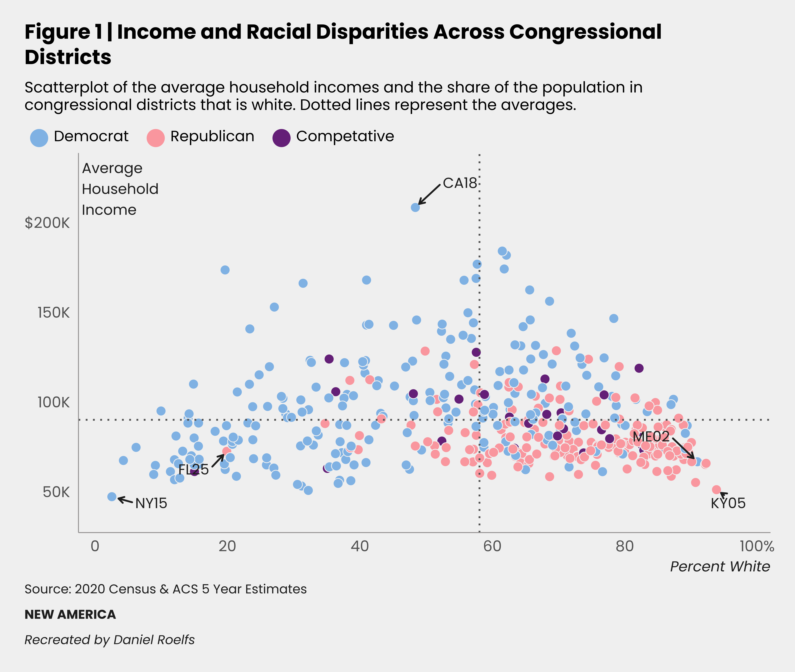
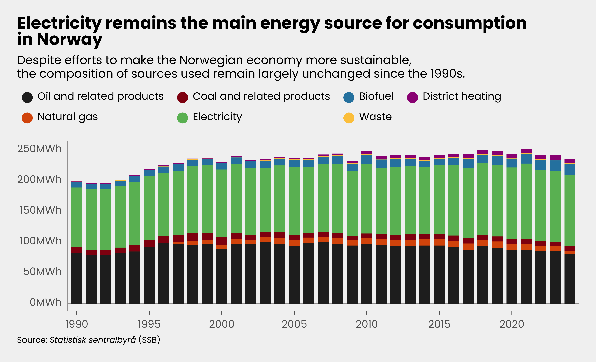
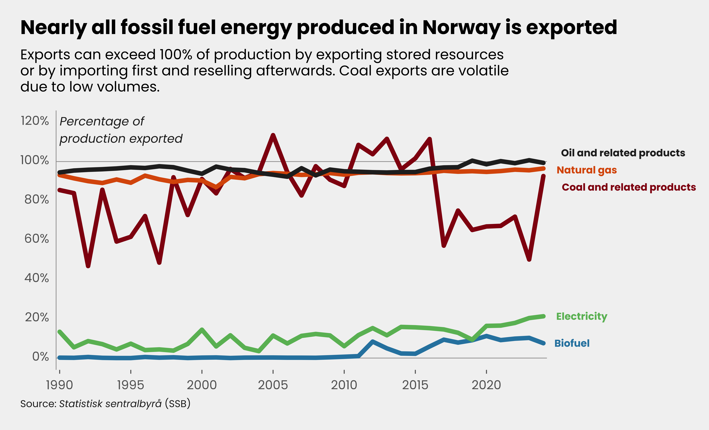
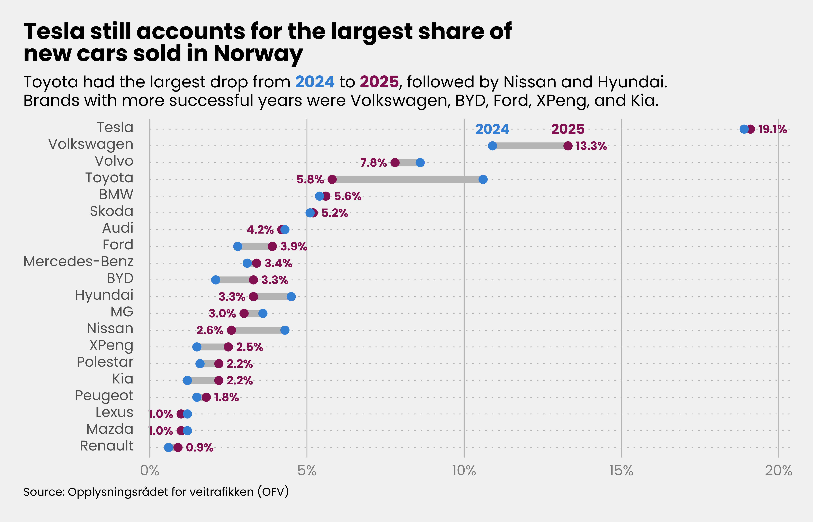
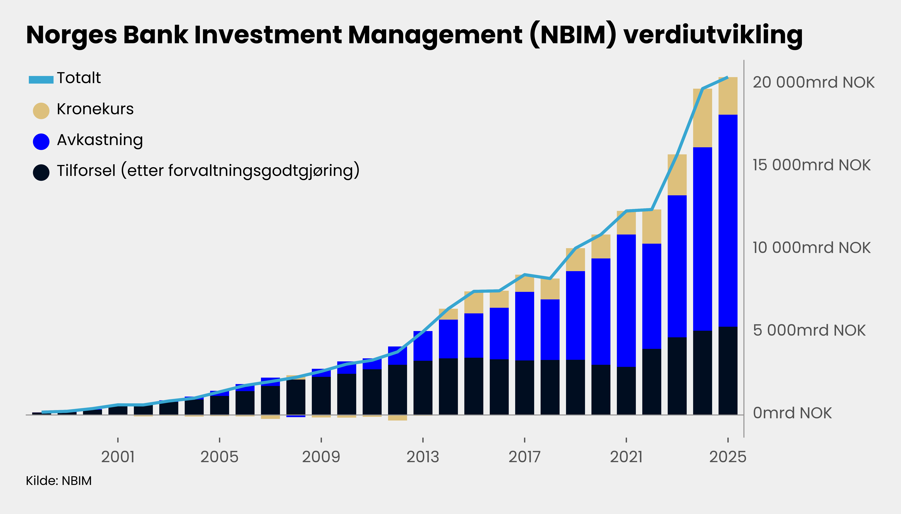

<style type="text/css">
p code {
  white-space: nowrap;
}

.sidenote code {
  font-size: 80%;
}
</style>

A little while ago I scrolled past a post on [BlueSky](https://bsky.app/profile/oscarp.bsky.social/post/3ma76f2slzs2j) commenting on a [discussion](https://bsky.app/profile/brendannyhan.bsky.social/post/3ma724o5zis2t) where political scientist [Oscar Pocasangre](https://bsky.app/profile/oscarp.bsky.social) pulled up some figures he created on the topic of discussion a while ago. The figures he pulled up were for a [2023 report](https://www.newamerica.org/political-reform/reports/understanding-the-partisan-divide/) he co-wrote for think tank [New America](https://www.newamerica.org). While the topic in itself is interestingIt's about partisan divide in the 2022 election if you don't want to click the [link](https://www.newamerica.org/political-reform/reports/understanding-the-partisan-divide/), the thing that struck me were the quality of the figures. The layout was very elegant, professional, and consistent across the report. So as I did in a [previous post on figured from the FT](https://danielroelfs.com/posts/financial-times-data-viz/) I want to break down these figures and try to recreate them with `{ggplot2}`.

## The reference figure

The figures from the New America report (as published at least) were not created using `{ggplot2}` but in [Datawrapper](https://www.datawrapper.de), a web-based data visualization tool that lets users create a host of different figure and table types. The free version has a Datawrapper attribution in the resulting .png files, but companies can pay from \$600 per month to unlock the ability add brand identity to the results. It appears this is also the plan that New America is on. The figures they used in the report look striking and are very elegantly laid out, meaning they take little energy to read and quickly get the point across.

Consider for example the reference figure below. We're going to recreate this figure as close as we can in `{ggplot2}` because I believe the general layout is definitely possibleThe original figure has interactivity that is a lot harder to recreate in ggplot, so we'll drop that for now. Datawrapper is a great tool for easy and quality data visualizations (although I suppose one could also make terrible plots if you wanted to), so I hope that with this tutorial we can once again learn something about data visualization and the power of `{ggplot2}`.



What jumps out at once is the y-axis label that is located on the inside of the axis instead of the "usual" outside. The extensive use of text (elaborate title and subtitle and highlighting of particular datapoints). As the subtitle says, the dotted lines indicate the mean values across both the x- and y-axes. The legend is located on top of the figure and aligned with the title and subtitle. The axis ticks include marks to highlight the data type (dollar and percent) and the y-axis ticks are shortened by summarizing thousands as "K". The caption is also aligned with the title, subtitle, and legend and includes some blue text. In the [original figure](https://www.newamerica.org/political-reform/reports/understanding-the-partisan-divide/) these indicates hyperlinks that let one download the data or the figureThe figure above is a screenshot, I downloaded the figure to include it here but the exported figure had the spacing of the x-axis title messed up.

## Recreating the figure

All these items discussed above (with the exception of the hyperlinks) are easily editable in using ggplot functionality, so let's see what we can get. As usual we'll use the `{tidyverse}` and `{ggtext}` packages to read, wrangle, and plot the data and to extend control over the text in the figure respectively.

``` r
library(tidyverse)
library(ggtext)
```

The original Datawrapper figure let's users very easily download the data directly, which is a nice feature that we'll happily make use of to get the data loaded in to R. There is some cleaning of the column names involved, and some wrangling to get the color labels as they are shown in the figure, but this is fairly straightforward.

``` r
df <- read_csv(
  "data/data-PKDkD.csv",
) |>
  janitor::clean_names() |>
  rename_with(~ str_remove(.x, "span_style_display_none_")) |>
  rename_with(~ str_remove(.x, "_span$")) |>
  mutate(
    likely_politics = case_when(
      str_detect(type, "Democrat") ~ "Democrat",
      str_detect(type, "Republican") ~ "Republican",
      TRUE ~ "Competative"
    )
  )
```

Next, the original figure uses a (proprietary) typeface called [Circular](https://lineto.com/typefaces/circular/#family) which is a geometric sans-serif created by [Laurenz Brunner](https://www.sourcetype.com/information/contributors/1458/laurenz-brunner) and released through [Lineto](https://lineto.com). A good typeface can change the entire "vibe" of your figure, and also align it with the brand identity, so I usually make the effort to find something suitable to fit the style. I don't have a license for this font, so instead we'll turn to Google Fonts again to find a suitable font, preferably a geometric sans-serif again. Here I chose Poppins. We can load it using the `{sysfonts}` and `{showtext}` packages as we've [done earlier](https://danielroelfs.com/posts/financial-times-data-viz/).

``` r
sysfonts::font_add_google(name = "Poppins", family = "poppins")
showtext::showtext_auto()
```

Now, as the data is already wrangled, we can go straight to the plotting. We'll build it from the bottom up. Firstly, I decided to add the y-axis title on the inside of the figure as is done in the reference figure. For this I use a `geom_text()` function and plot just the single y-axis title in the top left. It takes some trial-and-error to get the size and placement right, but it usually helps to set the `hjust` to 0 if you want to left align (and to 1 if you want to right align).

Then we'll add the main data points as a scatter of dots. The dots in the original are circles with a light border and a fill color without any opacity. So we'll recreate that by using [shape type 21](https://ggplot2.tidyverse.org/articles/ggplot2-specs.html#point) and specifying that we want a white border. After we'll add the dotted (`linetype = "dotted"`) lines in the original color to the figure using `geom_vline()` and `geom_hline()`. And finally we'll add the highlighted items by filtering the dataset and using using the amazing `geom_text_repel()` function from `{ggrepel}`. These also require some tuning often, and particularly the `arrow` argument and the placements can be a bit finicky, but this is the best I could do for nowIf we really wanted we could specify the location of each label and the arrow, but I'm too lazy.

``` r
new_america_plot <- df |>
  ggplot(aes(x = white, y = mean_income, fill = likely_politics)) +
  geom_text(
    data = tibble(
      x = -0.02,
      y = 220e3,
      label = "Average\nHousehold\nIncome"
    ),
    mapping = aes(x = x, y = y, label = label),
    inherit.aes = FALSE,
    size = 3,
    color = "#262626",
    family = "poppins",
    hjust = 0,
  ) +
  geom_point(
    color = "#F2F2F2",
    size = 2.5,
    stroke = 0.33,
    shape = 21
  ) +
  geom_hline(
    yintercept = mean(df$mean_income),
    color = "#646464",
    linetype = "dotted"
  ) +
  geom_vline(
    xintercept = mean(df$white),
    color = "#646464",
    linetype = "dotted"
  ) +
  ggrepel::geom_text_repel(
    data = . %>% filter(cd %in% c("CA18", "NY15", "FL25", "ME02", "KY05")),
    mapping = aes(label = cd),
    size = 3,
    color = "#262626",
    family = "poppins",
    min.segment.length = 0,
    point.padding = 0.4,
    box.padding = 1,
    arrow = arrow(length = unit(0.25, "lines")),
    seed = 42
  )
```

Next we'll add the labels. We'll use HTML breaks (instead of Markdown's \n recognized by `geom_text()`) because we'll specify later in the `theme()` specification that we want to use `element_markdown()`, which parses HTML tags. Since we already added the y-axis title, we can leave that blank here. And although the original figure has an interactive caption, we'll make it as close as possible. And to ensure nobody confuses our recreation with the original, I'll add a disclaimed that this discount version of the figure is my recreation and should not be confused with the (better) version from the original article.

``` r
new_america_plot <- new_america_plot +
  labs(
    title = "Figure 1 &vert; Income and Racial Disparities Across Congressional<br>Districts",
    subtitle = "Scatterplot of the average household incomes and the share of the population in<br>congressional districts that is white. Dotted lines represent the averages.", # nolint line_length_linter
    x = "Percent White",
    y = NULL,
    fill = NULL,
    caption = "Source: 2020 Census & ACS 5 Year Estimates<br>**NEW AMERICA**<br>_Recreated by Daniel Roelfs_"
  )
```

Then, the scales. We need to apply some hacky solution to get the y-axis title to appear correctly by setting the x-axis limits to be slightly below 0. Also, I couldn't find a nice way to get the % and \$ signs to appear only at the last item on the axes, so I specified the breaks and labels manually. Usually (and you'll see that further below), I'd just add the signs to all itemsI think this also a slightly better data viz choice using `scales::label_percent()` and `scales::label_currency(scale = 1e-3, suffix = "K")` in this case. For both axes we'll also add some spacing to let the data and labels "breathe" a little. For the color scale we'll use the same colors as in the orignal figure, put them in the order we want, and we'll make the legend keys a bit larger by using the `override.aes` argument.

``` r
new_america_plot <- new_america_plot +
  scale_x_continuous(
    limits = c(-0.025, 1),
    breaks = seq(0, 1, 0.2),
    labels = c(0, 20, 40, 60, 80, "100%"),
    expand = expansion(add = c(0, 0.02))
  ) +
  scale_y_continuous(
    breaks = c(50e3, 100e3, 150e3, 200e3),
    labels = c("50K", "100K", "150K", "$200K"),
    expand = expansion(add = 20e3)
  ) +
  scale_fill_manual(
    values = c(
      "Democrat" = "#90BFE9",
      "Republican" = "#FCA9AE",
      "Competative" = "#79338A"
    ),
    limits = c("Democrat", "Republican", "Competative"),
    guide = guide_legend(override.aes = list(size = 5))
  )
```

For the final details we'll add a long list of specifications to the `theme()` function to put the text in the correct place and size, use typeface we selected earlier, specify the axis lines, set the background color, and specify what the legend should look like. We'll make use of the `element_markdown()` function as alluded to earlier to add some extra modifications. I think the default margins on ggplot are a bit too tight, so I expanded them a bit. Make note that the color of the axis text is different from the axis titles, after some experimenting I think it's fine as the lighter color is too pale, but either way our goal here is to make it as close as possible to the original. The typeface on the original subtitle is a bit bolder than the one we use, but I haven't yet found a way to use in between font weights (e.g. 400 or 500). It took some time to get the text sizing close enough, especially once you note that the legend text size and the subtitle are the same size. There are a few other details that needed to be adjusted, but I won't go over all of them.

``` r
new_america_plot <- new_america_plot +
  theme_minimal(base_family = "poppins") +
  theme(
    plot.title = element_markdown(face = "bold", size = 12),
    plot.title.position = "plot",
    plot.subtitle = element_markdown(size = 9, lineheight = 1.15),
    plot.caption = element_markdown(
      size = 7.5,
      color = "#262626",
      hjust = 0,
      lineheight = 2
    ),
    plot.caption.position = "plot",
    plot.background = element_rect(fill = "#F2F2F2", color = "transparent"),
    axis.title.x = element_markdown(
      size = 8.5,
      color = "#262626",
      face = "italic",
      hjust = 1,
      margin = margin(t = 0.25, unit = "lines")
    ),
    axis.text = element_markdown(color = "#646464"),
    axis.line = element_line(color = "#A2A0A0", linewidth = 0.25),
    panel.grid = element_blank(),
    plot.margin = margin(rep(1, 4), unit = "lines"),
    legend.position = "top",
    legend.location = "plot",
    legend.justification = "left",
    legend.key.spacing = unit(0, "lines"),
    legend.text = element_markdown(
      margin = margin(r = 0.5, unit = "lines")
    ),
    legend.margin = margin(b = -0.75, unit = "lines")
  )
```

## The final result

Good, let's see what we ended up with!



I'm actually quite happy with how close we managed to get. By accident the legend keys (the circles) are slightly dropped compared to the text, but that is also true for the original figure, so that turned out well. The y-axis title is also in a "roman" (or upright) variation, while the x-axis title is italic. Personally I'd have made both italic, but this is also how it is in the original. Apart from the typography and weights, the highlighted district labels are not in the ideal position. Particularly the ME02 label in the bottom right is overlaps with a lot of the dots in the same area, which hampers readability. Otherwise, I'm quite happy with how well we managed to recreate the original figure.

## Applying these methods to other figures

Now let's see if we can apply the techniques we've learned on a few other plots. Let's first try a similar scatter plot again. We'll plot some data on the oil reserves in different countries and the relative size of their sovereign wealth funds. Why this data? Because it is fairly easily accessible, and because I was curious how much of an outlier [NBIM](https://www.nbim.no) (also known as the *Oljefondet*) is compared to countries with larger oil reserves. It has the added advantage that we can also use three colors to separate the subgroups. You'll find the code for the data extraction and wrangling in the folded cell below. The data comes from [Wikipedia](https://en.wikipedia.org/wiki/List_of_countries_by_proven_oil_reserves#cite_note-eia2021-6) (which used data from the U.S. Energy Information Administration) and [Global SWF](https://globalswf.com/ranking).

<details class="code-fold">
<summary>Code for the data wrangling</summary>

``` r
df_oil_reserves <- rvest::read_html(
  "https://en.wikipedia.org/wiki/List_of_countries_by_proven_oil_reserves#cite_note-eia2021-6"
) |>
  rvest::html_nodes(".wikitable") |>
  rvest::html_table(fill = TRUE) |>
  pluck(2) |>
  janitor::clean_names() |>
  rename(
    eia = eia_6,
    opec = opec_7,
    bp = bp_8,
    oil_production_feb_2025_bbl_day = oil_production_feb_2025_bbl_day_9
  ) |>
  filter(country != "World") |>
  mutate(
    across(eia:oil_production_feb_2025_bbl_day, parse_number)
  ) |>
  separate(country, into = c("country", "opec_member"), sep = "\\(") |>
  mutate(
    country = str_trim(str_remove_all(country, "\\*")),
    country = case_when(
      str_detect(country, "United States") ~ "USA",
      str_detect(country, "United Kingdom") ~ "UK",
      TRUE ~ country
    ),
    opec_member = str_remove(opec_member, "\\)")
  )

df_swf <- readxl::read_excel(
  "data/swf_data.xlsx"
) |>
  janitor::clean_names() |>
  rename(
    aum = au_m_b
  ) |>
  mutate(
    country = str_trim(str_extract(country, "[^-]+"))
  )

df_oil_swf <- df_oil_reserves |>
  inner_join(df_swf, by = "country") |>
  filter(type == "SWF") |>
  mutate(
    country_code = countrycode::countrycode(country, "country.name", "iso3c"),
    swf_label = str_glue("{investor} ({country_code})"),
    opec_member_label = case_when(
      str_detect(opec_member, "\\+") ~ "OPEC+ member",
      str_detect(opec_member, "OPEC") ~ "OPEC member",
      TRUE ~ "Non-member"
    )
  )
```

</details>

Just for comparison, I'll first plot the figure with minimal styling. My pet peeve is seeing people share a figure online without even making the effort to change the default ggplot theme (`theme_grey()`) to something elseMy go-to is `theme_minimal()`. I just want to highlight the accumulative difference that making many minor changes can have on the look of a graph. So the figure below has the minimal amount of changes and the more elaborate figure follows below.

For these two figures I've chosen to scale the x-axis with a log10 scaler. One needs to be a bit careful when using log scaling as it can seriously hamper the interpretability since log scaling isn't intuitive for most people. I could do the same for the y-axis but that would make the outliers there even less visible. People are infamously terrible at conceptualizing the difference between a million dollars and a billion dollars. One could make the same argument for the amount of barrels of oil on the x-axis, but not scaling that one would make the vast majority of points squish in the bottom left corner, which in itself also hampers interpretability, so I made a trade-off. I also added the dotted lines in again, but instead of the means, they now indicate the medians for the data points in the dataset. Anyway, let's look at the "unstyled" figure.

<details class="code-fold">
<summary>Code for the plot</summary>

``` r
df_oil_swf |>
  filter(eia > 1e3) |>
  mutate(
    eia = eia * 1e6
  ) |>
  ggplot(aes(x = eia, y = aum, color = opec_member_label)) +
  geom_point() +
  geom_hline(
    yintercept = median(df_oil_swf$aum),
    linetype = "dotted"
  ) +
  geom_vline(
    xintercept = median(df_oil_swf$eia) * 1e6,
    linetype = "dotted"
  ) +
  labs(
    title = "Association between sovereign wealth fund size and oil reserves",
    subtitle = "Scatterplot of the size of sovereign wealth funds and oil reserves.\nDotted lines represent the medians.", # nolint line_length_linter
    x = "Estimated oil reserves (billion barrels)",
    y = "AUM ($B)",
    color = NULL,
    caption = "Source: U.S. Energy Information Administration (EIA), Global SWF"
  ) +
  scale_x_log10() +
  scale_color_manual(
    values = c(
      "OPEC member" = "#108CDC",
      "OPEC+ member" = "#1D4191",
      "Non-member" = "#FCA9AE"
    )
  ) +
  theme_minimal()
```

</details>


And now the "styled" figure for comparison. The data is the same, the difference in the look is just down to the sum of all the minor changes made, more or less copied from the reference figure from earlier. I also added the units on all axes text (dollar signs on every tick on the y-axis for example). And I understand why either Oscar or Datawrapper only added the additional units to the last one, as it is less cluttered. It feels a bit odd as a single person to disagree with Oscar and/or all Datawrapper experts, but perhaps I can just put it down to personal taste here where I'll admit that my preference may be flawed.

<details class="code-fold">
<summary>Code for the plot</summary>

``` r
df_oil_swf |>
  filter(eia > 1e3) |>
  ggplot(aes(x = eia, y = aum)) +
  geom_richtext(
    data = tibble(x = 0, y = 2.3e3, label = "Assets<br>Under<br>Management"),
    mapping = aes(x = x, y = y, label = label),
    inherit.aes = FALSE,
    size = 3,
    color = "#262626",
    family = "poppins",
    fontface = "italic",
    fill = "transparent",
    hjust = 0,
    vjust = 1,
    label.size = 0
  ) +
  geom_hline(
    yintercept = median(df_oil_swf$aum),
    color = "#646464",
    linetype = "dotted"
  ) +
  geom_vline(
    xintercept = median(df_oil_swf$eia),
    color = "#646464",
    linetype = "dotted"
  ) +
  geom_point(
    aes(fill = opec_member_label),
    color = "#F2F2F2",
    size = 3,
    stroke = 0.5,
    shape = 21
  ) +
  ggrepel::geom_text_repel(
    data = df_oil_swf |>
      filter(
        investor %in%
          c(
            "NBIM",
            "FTF",
            "CIC",
            "SAFE IC",
            "PIF",
            "NDFI",
            "SK CIC",
            "KIA",
            "NWF UK",
            "Alaska PFC",
            "NWF RU",
            "QIA",
            "NDF"
          )
      ),
    mapping = aes(label = swf_label),
    size = 2,
    color = "#262626",
    family = "poppins",
    min.segment.length = 0,
    point.padding = 0.67,
    box.padding = 1,
    arrow = arrow(length = unit(0.25, "lines")),
    seed = 42
  ) +
  labs(
    title = "Association between sovereign wealth fund size<br>and oil reserves",
    subtitle = "Scatterplot of the size of sovereign wealth funds and<br>oil reserves. Dotted lines represent the medians.", # nolint line_length_linter
    x = "Estimated oil reserves",
    y = NULL,
    fill = NULL,
    caption = "Source: U.S. Energy Information Administration (EIA), Global SWF"
  ) +
  scale_x_log10(
    labels = scales::label_number(scale = 1e-3, suffix = "B bbl")
  ) +
  scale_y_continuous(
    limits = c(NA, 2300),
    labels = scales::label_currency(prefix = "$", suffix = "B", accuracy = 1),
    expand = expansion(add = c(100, 0))
  ) +
  scale_fill_manual(
    values = c(
      "OPEC member" = "#108CDC",
      "OPEC+ member" = "#1D4191",
      "Non-member" = "#FCA9AE"
    ),
    limits = c("OPEC member", "OPEC+ member", "Non-member"),
    guide = guide_legend(override.aes = list(size = 3.5))
  ) +
  theme_minimal(base_family = "poppins") +
  theme(
    plot.title = element_markdown(face = "bold", size = 14),
    plot.title.position = "plot",
    plot.subtitle = element_markdown(size = 10, lineheight = 1.15),
    plot.caption = element_markdown(
      size = 7,
      color = "#262626",
      hjust = 0,
      lineheight = 2
    ),
    plot.caption.position = "plot",
    plot.background = element_rect(fill = "#F2F2F2", color = "transparent"),
    axis.title = element_markdown(
      face = "italic",
      color = "#262626",
      hjust = 1,
      size = 8.5,
      margin = margin(t = 0.75, unit = "lines")
    ),
    axis.text = element_markdown(color = "#646464"),
    axis.line = element_line(color = "#A2A0A0", linewidth = 0.25),
    panel.grid = element_blank(),
    plot.margin = margin(rep(1, 4), unit = "lines"),
    legend.position = "top",
    legend.location = "plot",
    legend.justification = "left",
    legend.key.spacing = unit(0, "lines"),
    legend.text = element_markdown(
      margin = margin(r = 0.5, unit = "lines")
    ),
    legend.margin = margin(b = -0.75, unit = "lines")
  )
```

</details>


I hope this illustrates first and foremost how powerful ggplot is and how much a fairly common plot layout and styling can be improved by paying attention to the details and pulling the most out of the ggplot functionality. I'm not saying the plot is perfect as it is, but it at least makes some conscious decisions on how the plot should look like. Controlling accurately where the labels from `geom_text_repel()` are placed is a headache, but the magic behind this code works usually quite well. Although there are some awkward decisions occassionally, where the arrows are a lot longer than they need to be, or the direction seems less-than-optimal.

Let's do the same again for a different plot type, the stacked bar graph. These aren't in the original report from New America, so here I refer to some of the [examples](https://www.datawrapper.de/charts) listed on the [Datawrapper website](https://www.datawrapper.de/charts) for some of the other details, but we'll keep the design elements from the original article.

For this plot we'll take some [random data](https://www.ssb.no/statbank2/en/table/11561) from [Statistics Norway (*Statistisk sentralbyrå (SSB)*)](https://www.ssb.no) on [energy production, consumption, and import/export](https://www.ssb.no/statbank2/en/table/11561) and their sources. The folded code chunk below shows the data loading and wrangling after downloading the CSV file from the SSB database.

<details class="code-fold">
<summary>Code for the data wrangling</summary>

``` r
df_energy <- read_delim(
  "data/ssb_energy_balance.csv",
  delim = ";",
  skip = 1,
  na = c(".", "-")
) |>
  janitor::clean_names() |>
  rename_with(
    ~ str_remove(
      .x,
      "energy_balance_g_wh_"
    )
  ) |>
  rename_with(
    ~ str_remove_all(
      .x,
      "\\d+_"
    )
  ) |>
  rename_with(
    ~ str_remove(
      .x,
      "final_"
    )
  ) |>
  rename_with(
    ~ str_remove(
      .x,
      "primary_energy_"
    )
  ) |>
  select(where(~ !all(is.na(.x))))
```

</details>

The choice between a stacked bar graph and a grouped bar graph stems from what information is the most important to show. If the overall sum is the most important, then choose the stacked bar graph. If the size of the individual components is more important than the total sum, then choose a stacked bar graph.

We'll create the plot then using `geom_col()` instead of `geom_point()`. We'll also use one of my favorite options in many `geoms`: the `key_glyph` setting. This allows us to change the legend key from a square to a circle, which looks a bit nicer in most situations. I also use it a lot with `geom_line()` and different types of line geometries. The rest of the plot is more or less self-explanatory I hope. I'll make sure the factors are sorted the way I want them, and I'll add ticks on the x-axis as shown in the [examples](https://www.datawrapper.de/charts#column-charts) on the Datawrapper website. The colors are taken from [this excellent guide](https://www.datawrapper.de/blog/colors-for-data-vis-style-guides) on colors, also from Datawrapper.

<details class="code-fold">
<summary>Code for the plot</summary>

``` r
df_energy |>
  select(year, starts_with("consumption")) |>
  pivot_longer(
    cols = -year,
    names_to = "energy_source",
    values_to = "consumption_gwh",
  ) |>
  mutate(
    energy_source_label = recode(
      energy_source,
      "consumption_coal_and_coal_products" = "Coal and related products",
      "consumption_natural_gas" = "Natural gas",
      "consumption_oil_and_oil_products_excl_bio" = "Oil and related products",
      "consumption_biofuels" = "Biofuel",
      "consumption_electricity" = "Electricity",
      "consumption_waste" = "Waste",
      "consumption_district_heating" = "District heating",
    ),
    energy_source_label = fct_relevel(
      energy_source_label,
      c(
        "District heating",
        "Waste",
        "Biofuel",
        "Electricity",
        "Coal and related products",
        "Natural gas",
        "Oil and related products"
      )
    )
  ) |>
  replace_na(list(consumption_gwh = 0)) |>
  ggplot(aes(x = year, y = consumption_gwh, fill = energy_source_label)) +
  geom_hline(yintercept = c(0, 1), linewidth = 0.25, color = "#A2A0A0") +
  geom_col(width = 0.75, key_glyph = "point") +
  labs(
    title = "Electricity remains the main energy source for consumption<br>in Norway",
    subtitle = "Despite efforts to make the Norwegian economy more sustainable,<br>the composition of sources used remain largely unchanged since the 1990s.", # nolint line_length_linter
    x = NULL,
    y = NULL,
    fill = NULL,
    caption = "Source: _Statistisk sentralbyrå_ (SSB)"
  ) +
  scale_x_continuous(
    breaks = seq(1990, 2025, 5),
    expand = expansion(add = 0.25)
  ) +
  scale_y_continuous(
    labels = scales::label_number(scale = 1e-3, suffix = "MWh")
  ) +
  scale_fill_manual(
    limits = c(
      "Oil and related products",
      "Natural gas",
      "Coal and related products",
      "Electricity",
      "Biofuel",
      "Waste",
      "District heating"
    ),
    values = c(
      "Coal and related products" = "#910011",
      "Natural gas" = "#DB5908",
      "Oil and related products" = "#262626",
      "Biofuel" = "#2C84AE",
      "Electricity" = "#69BA64",
      "Waste" = "#FDC84A",
      "District heating" = "#9C0084"
    ),
    guide = guide_legend(
      override.aes = list(shape = 21, size = 4)
    )
  ) +
  theme_minimal(base_family = "poppins") +
  theme(
    plot.title = element_markdown(face = "bold", size = 14),
    plot.title.position = "plot",
    plot.subtitle = element_markdown(size = 10, lineheight = 1.15),
    plot.caption = element_markdown(
      size = 7,
      hjust = 0,
      lineheight = 2
    ),
    plot.caption.position = "plot",
    plot.background = element_rect(fill = "#F2F2F2", color = "transparent"),
    axis.ticks.x = element_line(color = "#646464", linewidth = 0.33),
    axis.text = element_markdown(color = "#646464"),
    axis.text.x = element_text(margin = margin(t = 5, unit = "pt")),
    axis.line.y = element_line(color = "#A2A0A0", linewidth = 0.25),
    panel.grid = element_blank(),
    plot.margin = margin(rep(1, 4), unit = "lines"),
    legend.position = "top",
    legend.location = "plot",
    legend.justification = "left",
    legend.key.spacing = unit(0, "lines"),
    legend.text = element_markdown(
      margin = margin(r = 0.5, unit = "lines")
    ),
    legend.margin = margin(b = 0)
  )
```

</details>



I'm quite happy with that result. Note that the y-axis isn't labeled. This is typically a big no-no, but the [examples](https://www.datawrapper.de/charts#column-charts) at Datawrapper generally either include an axis title inside the plot, or don't include one at all. I think this is permissable if the data can be clearly understood without a label. For example on the x-axis, it isn't necessary to add the label "Year", since it's immediately obvious what it denotes. One trick here is also to add a descriptor of the y-axis in the title or subtitle.

Let's try another one, a line plot this time using mostly the same tricks as before. We'll use the same dataset. A small detail that I (when it is suitable) like to use is the `lineend` option, which allows us to make the line ends round. We'll also put the y-axis title inside the plot again, since it fits here without making it look cluttered. We'll also not include a legend, instead opting to directly label the lines, since there are only a few of them. We'll add them using `geom_text_repel()` again and do some tricks with the x-axis spacing to allow them the breathing room they need.

<details class="code-fold">
<summary>Code for the plot</summary>

``` r
df_energy |>
  mutate(
    perc_exported_coal = exports_coal_and_coal_products /
      production_coal_and_coal_products,
    perc_exported_natural_gas = exports_natural_gas /
      production_natural_gas,
    perc_exported_oil = exports_oil_and_oil_products_excl_bio /
      production_oil_and_oil_products_excl_bio,
    perc_exported_biofuels = exports_biofuels /
      production_biofuels,
    perc_exported_electricity = exports_electricity /
      production_electricity,
  ) |>
  select(year, starts_with("perc_exported")) |>
  pivot_longer(
    cols = -year,
    names_to = "energy_source",
    values_to = "perc_exported",
  ) |>
  mutate(
    energy_source_label = recode(
      energy_source,
      "perc_exported_coal" = "Coal and related products",
      "perc_exported_natural_gas" = "Natural gas",
      "perc_exported_oil" = "Oil and related products",
      "perc_exported_biofuels" = "Biofuel",
      "perc_exported_electricity" = "Electricity"
    )
  ) |>
  ggplot(aes(
    x = year,
    y = perc_exported,
    color = energy_source_label
  )) +
  geom_hline(yintercept = c(0, 1), linewidth = 0.25, color = "#A2A0A0") +
  geom_text(
    data = tibble(
      x = 1990,
      y = 1.2,
      label = "Percentage of\nproduction exported"
    ),
    mapping = aes(x = x, y = y, label = label),
    inherit.aes = FALSE,
    size = 3,
    color = "#262626",
    family = "poppins",
    fontface = "italic",
    hjust = 0,
    vjust = 0.8,
  ) +
  geom_path(linewidth = 1.5, lineend = "round", key_glyph = "point") +
  ggrepel::geom_text_repel(
    data = . %>% filter(year == max(year)),
    mapping = aes(label = energy_source_label),
    size = 2.5,
    family = "poppins",
    fontface = "bold",
    hjust = 0,
    xlim = c(2025, NA),
    segment.color = "transparent",
    seed = 42
  ) +
  labs(
    title = "Nearly all fossil fuel energy produced in Norway is exported",
    subtitle = "Exports can exceed 100% of production by exporting stored resources<br>or by importing first and reselling afterwards. Coal exports are volatile<br>due to low volumes.", # nolint line_length_linter
    x = NULL,
    y = NULL,
    color = NULL,
    caption = "Source: _Statistisk sentralbyrå_ (SSB)"
  ) +
  scale_x_continuous(
    breaks = seq(1990, 2025, 5),
    expand = expansion(add = 0.25)
  ) +
  scale_y_continuous(
    breaks = seq(0, 1.2, 0.2),
    labels = scales::label_percent()
  ) +
  scale_color_manual(
    values = c(
      "Coal and related products" = "#910011",
      "Natural gas" = "#DB5908",
      "Oil and related products" = "#262626",
      "Biofuel" = "#2C84AE",
      "Electricity" = "#69BA64"
    )
  ) +
  coord_cartesian(clip = "off") +
  theme_minimal(base_family = "poppins") +
  theme(
    plot.title = element_markdown(face = "bold", size = 14),
    plot.title.position = "plot",
    plot.subtitle = element_markdown(
      size = 10,
      lineheight = 1.15,
      margin = margin(b = 0.75, unit = "lines")
    ),
    plot.caption = element_markdown(
      size = 7,
      color = "#262626",
      hjust = 0,
      lineheight = 2
    ),
    plot.caption.position = "plot",
    plot.background = element_rect(fill = "#F2F2F2", color = "transparent"),
    axis.title = element_markdown(
      size = 8.5,
      face = "italic",
      hjust = 1,
      margin = margin(t = 0.75, unit = "lines")
    ),
    axis.ticks.x = element_line(color = "#646464", linewidth = 0.33),
    axis.text = element_markdown(color = "#646464"),
    axis.text.x = element_text(margin = margin(t = 5, unit = "pt")),
    axis.line.y = element_line(color = "#A2A0A0", linewidth = 0.25),
    panel.grid = element_blank(),
    plot.margin = margin(1, 8, 1, 1, unit = "lines"),
    legend.position = "none",
  )
```

</details>



So in all fairness, I could have picked a better example dataset, but this one was readily available and I was too lazy to look up something else (he says after writing a long post on nitpicky details in data visualizations). But I'd also want to highlight the power of direct labeling when the data allows for it. It makes the figure really easy to read since the clues necessary to parse the information in the plot aren't split across the plot area and the legend.

Let's do another example, this time one of those popular range plots that includes to points with a line between them indicating a difference or change between two datapoints (e.g. men vs women, current period vs previous period). Here I'll plot new car sales in 2025 compared to 2024. The [data]((https://ofv.no/registreringsstatistikk)) comes from the [Opplysningsrådet for veitrafikken (OFV)](https://ofv.no/) which registers data about car sales in Norway. We'll create a range/dot plot comparing the sales of new cars in 2024 and 2025 from the most common brands in Norway. Code for the data loading and wrangling are again shown in the folded code chunk below.

<details class="code-fold">
<summary>Code for the data wrangling</summary>

``` r
df_car_sales <- read_csv("./data/car_sales_norway.csv") |>
  janitor::clean_names() |>
  mutate(
    across(contains("share"), ~ .x / 100),
    across(contains("pct"), ~ .x / 100),
    diff_perc = ytd_share_2025 - ytd_share_2024,
    share_2025_label = scales::percent(ytd_share_2025, accuracy = 0.1)
  ) |>
  pivot_longer(
    cols = starts_with("ytd_share"),
    names_to = "year",
    values_to = "share"
  ) |>
  mutate(year = as_factor(parse_number(year)))
```

</details>

I'll once again drop the axis titles, since the axes speak for themselves I believe, and if it is not clear what the x-axis represents, the title of the plot also tells the reader what it denotes. I'll also deploy the direct labeling again from before to aid readability. Since the colors also denote information (year in this case) and I don't want to use a legend, I'll add direct labeling for those too. In addition, I'll also add hints to the subtitle (again using the functionality that `element_markdown()` allows). Otherwise, I'll also add a similar grid style as shown in the [examples](https://www.datawrapper.de/charts#dot-plots) on the Datawrapper website. For all other plots in this post I've removed the grid (against typical best practice guidelines) because the [original article]((https://www.newamerica.org/political-reform/reports/understanding-the-partisan-divide/)) we're getting our inspiration from includes a number of plot types and never uses a grid, which means it's likely a deliberate choice by Oscar to remove them, and I think it looks really niceIf you're publishing scientific articles, you should probably always include a subtle grid for the continuous variables. In some cases I think it could even be defendable to remove the grid if the absolute values aren't the most important information to be parsed, but the relative size or change is more important.

<details class="code-fold">
<summary>Code for the plot</summary>

``` r
df_car_sales |>
  ggplot(aes(
    x = share,
    y = reorder(brand, ytd_units_2025),
  )) +
  geom_line(linewidth = 2, color = "#C1C1C1", ) +
  geom_point(aes(color = year), size = 2) +
  geom_text(
    data = . %>% filter(year == 2025),
    aes(x = share, label = share_2025_label),
    color = "#962364",
    size = 2.5,
    family = "poppins",
    fontface = "bold",
    hjust = ifelse(
      df_car_sales |> filter(year == 2025) |> select(diff_perc) < 0,
      1,
      0
    ),
    nudge_x = ifelse(
      df_car_sales %>% filter(year == 2025) |> select(diff_perc) < 0,
      -0.0025,
      0.0025
    ),
  ) +
  geom_text(
    data = . %>% filter(brand == "Volkswagen", year == 2024),
    aes(x = share, y = 20, label = "2024"),
    color = "#4094DC",
    size = 3,
    family = "poppins",
    fontface = "bold",
  ) +
  geom_text(
    data = . %>% filter(brand == "Volkswagen", year == 2025),
    aes(x = share, y = 20, label = "2025"),
    color = "#962364",
    size = 3,
    family = "poppins",
    fontface = "bold",
  ) +
  labs(
    title = "Tesla still accounts for the largest share of<br>new cars sold in Norway",
    subtitle = "Toyota had the largest drop from <b style='color:#4094DC'>2024</b> to <b style='color: #962364'>2025</b>, followed by Nissan and Hyundai.<br>Brands with more successful years were Volkswagen, BYD, Ford, XPeng, and Kia.", # nolint line_length_linter
    x = NULL,
    y = NULL,
    color = NULL,
    caption = "Source: Opplysningsrådet for veitrafikken (OFV)"
  ) +
  scale_x_continuous(
    limits = c(0, NA),
    labels = scales::label_percent(),
    expand = expansion(add = c(0, 0.01)),
  ) +
  scale_color_manual(
    values = c("2024" = "#4094DC", "2025" = "#962364"),
    guide = "none"
  ) +
  coord_cartesian(clip = "off") +
  theme_minimal(base_family = "poppins") +
  theme(
    plot.title = element_markdown(face = "bold", size = 14),
    plot.title.position = "plot",
    plot.subtitle = element_markdown(size = 10, lineheight = 1.15),
    plot.caption = element_markdown(
      size = 7,
      hjust = 0,
      lineheight = 2
    ),
    plot.caption.position = "plot",
    plot.background = element_rect(fill = "#F2F2F2", color = "transparent"),
    axis.title = element_markdown(
      size = 8.5,
      color = "#262626",
      face = "italic",
      hjust = 1,
      margin = margin(t = 0.75, unit = "lines")
    ),
    axis.text.x = element_markdown(color = "#919191"),
    axis.text.y = element_markdown(
      color = "#646464",
      margin = margin(r = 0.5, unit = "lines")
    ),
    axis.line.y = element_line(color = "#C1C1C1", linewidth = 0.25),
    panel.grid = element_line(color = "#C1C1C1", linewidth = 0.25),
    panel.grid.minor.x = element_blank(),
    panel.grid.major.y = element_line(linetype = "dotted"),
    plot.margin = margin(rep(1, 4), unit = "lines"),
  )
```

</details>



Let's do one more just for fun. Let's recreate the plot on the [NBIM website](https://www.nbim.no/no/investeringene/fondets-verdi/) that tracks the value of the *Oljefondet* since it's founding in the style from the reference images. The data in the plot tracks the summed value of the fund across the different categories. They again use a stacked bar chart because the total sum of the categories is more important than the relative value of the categories. Because some of the investments were in the red during some years, they also added a separate line tracking the total value of the fund. For the past 10 years it's been identical to the sum of the subgroups, but before that it adds some additional clarity to the plot.

<details class="code-fold">
<summary>Code for the plot</summary>

``` r
readxl::read_excel(
  "./data/nbim_value.xls"
) |>
  janitor::clean_names() |>
  rename(year = x1) |>
  pivot_longer(
    cols = kronekurs:tilforsel_etter_forvaltningsgodtgjoring,
    names_to = "category",
    values_to = "value"
  ) |>
  mutate(
    category = fct_relevel(
      category,
      "kronekurs",
      "avkastning",
      "tilforsel_etter_forvaltningsgodtgjoring"
    )
  ) |>
  ggplot(aes(x = year, y = value, fill = category)) +
  geom_col(width = 0.75, key_glyph = "point") +
  geom_line(
    aes(y = totalt, color = "Totalt"),
    linewidth = 0.8,
  ) +
  geom_hline(yintercept = 0, linewidth = 0.25, color = "#A2A0A0") +
  labs(
    title = "Norges Bank Investment Management (NBIM) verdiutvikling",
    x = NULL,
    y = NULL,
    color = NULL,
    fill = NULL,
    caption = "Kilde: NBIM"
  ) +
  scale_x_continuous(
    breaks = seq(2001, 2025, 4),
    expand = expansion(add = 0.25)
  ) +
  scale_y_continuous(
    labels = scales::label_currency(
      prefix = "",
      big.mark = " ",
      suffix = "mrd NOK"
    ),
    position = "right"
  ) +
  scale_color_manual(
    values = c("#42B5DA"),
    guide = guide_legend(
      override.aes = list(linewidth = 2)
    )
  ) +
  scale_fill_manual(
    labels = c(
      "avkastning" = "Avkastning",
      "kronekurs" = "Kronekurs",
      "tilforsel_etter_forvaltningsgodtgjoring" = "Tilforsel (etter forvaltningsgodtgjøring)"
    ),
    values = c(
      "kronekurs" = "#E4CA8E",
      "avkastning" = "#0000FF",
      "tilforsel_etter_forvaltningsgodtgjoring" = "#00102B"
    ),
    guide = guide_legend(
      override.aes = list(shape = 21, size = 4)
    )
  ) +
  theme_minimal(base_family = "poppins") +
  theme(
    plot.title = element_markdown(face = "bold", size = 14),
    plot.title.position = "plot",
    plot.subtitle = element_markdown(size = 10, lineheight = 1.15),
    plot.caption = element_markdown(
      size = 7,
      hjust = 0,
      lineheight = 2
    ),
    plot.caption.position = "plot",
    plot.background = element_rect(fill = "#F2F2F2", color = "transparent"),
    axis.title = element_markdown(
      size = 8.5,
      color = "#262626",
      face = "italic",
      hjust = 1,
      margin = margin(t = 0.75, unit = "lines")
    ),
    axis.ticks.x = element_line(color = "#646464", linewidth = 0.33),
    axis.text = element_markdown(color = "#646464"),
    axis.text.x = element_text(margin = margin(t = 5, unit = "pt")),
    axis.line.y = element_line(color = "#A2A0A0", linewidth = 0.25),
    panel.grid = element_blank(),
    plot.margin = margin(rep(1, 4), unit = "lines"),
    legend.position = "inside",
    legend.position.inside = c(0, 0.85),
    legend.justification = "left",
    legend.key.spacing = unit(0, "lines"),
    legend.text = element_markdown(
      margin = margin(r = 0.5, unit = "lines")
    ),
    legend.margin = margin(b = -0.75, unit = "lines")
  )
```

</details>



This turned into a very long post. I always enjoy breaking down good and beautiful data visualizations, and I found out how close you can get to basically all Datawrapper visualizationsMinus the interactivity of course, though some of it can be emulated through [`{plotly}`](https://plotly.com/ggplot2/) through basic `{ggplot2}` and `{ggtext}` functionality. I think [once again](https://danielroelfs.com/posts/financial-times-data-viz/), one of the key tricks is to just know what functions are available in `{ggplot2}` and related packages, and knowing what to edit and how, so there I hope the code here is some help to you when making your own plots. And I hope this post serves as some inspiration to be more ambitious and bold when making professional plots for sharing in whatever type of presentation or publication. Good luck and have fun!
